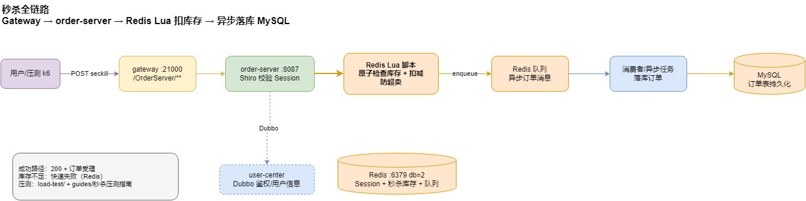
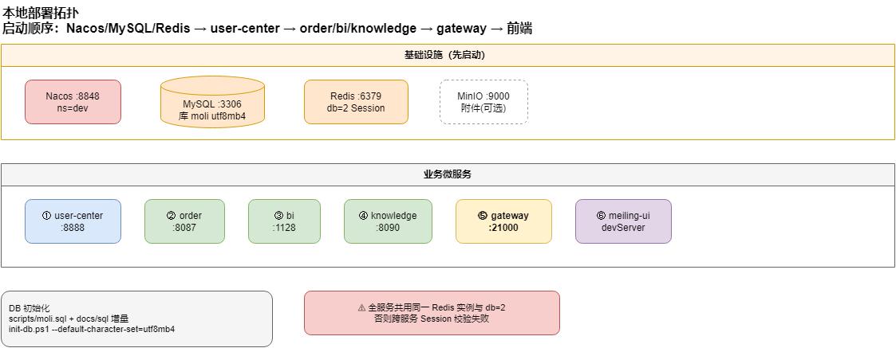
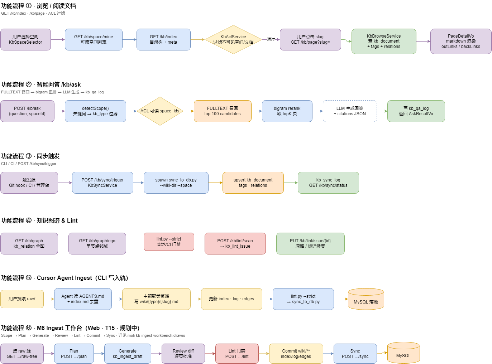
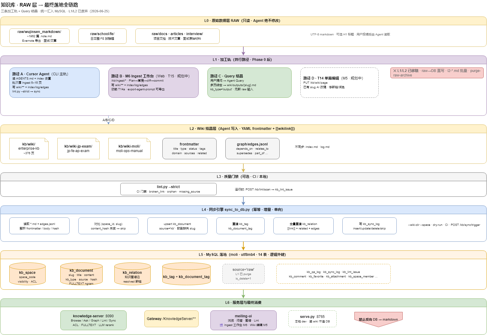
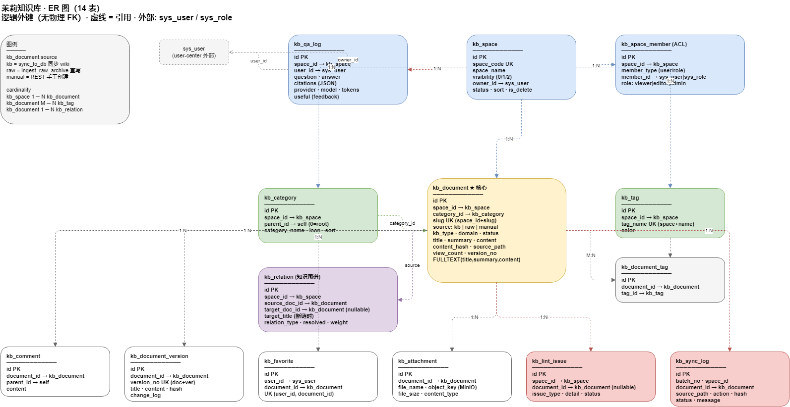

# 茉莉项目微服务（moli-project-distribute）

**Languages / 语言 / 言語**：**[中文](README.md)**（默认）· [English](README.en.md) · [日本語](README.ja.md)

[](https://www.oracle.com/java/)
[](https://spring.io/projects/spring-boot)
[](https://spring.io/projects/spring-cloud)
[](LICENSE)

> **一句话定位**：基于 **Spring Cloud + Spring Cloud Alibaba** 的分布式微服务工程 —— 统一网关、用户中心、订单/BI 等业务服务，并集成 **企业级 LLM 知识库** 作为平台能力之一。

## 项目介绍

**茉莉项目微服务**（moli-project-distribute）是一套企业级微服务示例工程，涵盖服务注册与配置、RPC/HTTP 调用、权限认证、数据持久化等常见能力。以 **用户中心** 为核心基础服务，向外提供订单、BI、知识库等模块，适用于学习 Spring Cloud 架构、二次开发或作为业务脚手架。

### 主要特性

- **统一网关入口**：基于 Spring Cloud Gateway，按路径转发至各业务服务
- **注册与配置中心**：Nacos 实现服务发现与集中配置管理
- **服务调用分层**：外部流量走 Gateway + HTTP/REST；服务间统一 Spring Cloud Dubbo RPC
- **流量保护**：Sentinel 熔断降级与限流
- **权限与安全**：Apache Shiro + Redis 分布式 Session + JWT
- **数据层**：MySQL + MyBatis-Plus + Druid 连接池
- **企业知识库**：RAG 检索问答、LLM-Wiki 治理、检索评测（见下文 [企业知识库](#企业知识库moli-knowledge)）
- **可扩展能力**：预留 Seata 分布式事务、RocketMQ 消息、XXL-JOB 任务调度及 ELK / SkyWalking / Prometheus 可观测性方案

---

## 系统架构概览


> 可编辑源文件：[moli-container-architecture.drawio](docs/diagrams/moli-container-architecture.drawio) · 链路、鉴权与部署细节见 [架构 / 调用 / 鉴权设计](docs/zh-CN/ARCHITECTURE.md)

| 图 | 说明 |
|----|------|
|  | [moli-gateway-routes.drawio](docs/diagrams/moli-gateway-routes.drawio) · Gateway 路由 |
|  | [moli-rbac-model.drawio](docs/diagrams/moli-rbac-model.drawio) · 权限模型 |
|  | [moli-seckill-flow.drawio](docs/diagrams/moli-seckill-flow.drawio) · 订单秒杀 |
|  | [moli-deploy-topology.drawio](docs/diagrams/moli-deploy-topology.drawio) · 部署拓扑 |
|  | [moli-kb-architecture.drawio](docs/diagrams/moli-kb-architecture.drawio) · kb/ 写入轨 + knowledge-server 读取轨 |
|  | [moli-kb-functional-flows.drawio](docs/diagrams/moli-kb-functional-flows.drawio) · Browse / Ask / Sync / Ingest |

更多 draw.io 源文件与导出说明见 [docs/diagrams/README.md](docs/diagrams/README.md)。知识库模块详情见下文 [企业知识库](#企业知识库moli-knowledge)。

**📄 项目速读 ：见 [PORTFOLIO.md](PORTFOLIO.md)

---

## 项目结构

```
moli-project-distribute/
├── moli-distribute-parent/       # 父 POM，统一依赖与版本管理
├── moli-distribute-common/       # 公共模块（统一响应、工具类等）
├── moli-gateway/                 # API 网关
├── moli-user-center/             # 用户中心
│   ├── moli-user-center-common/  # 实体、VO 等公共定义
│   ├── moli-user-center-shiro-starter/  # Shiro Starter，供 order/bi 依赖
│   └── moli-user-center-server/  # 用户中心主服务（Shiro、Dubbo Provider）
├── moli-order/                   # 订单服务
│   └── moli-order-server/
├── moli-ai/                      # BI 服务（Nacos 名 bi-server）
│   └── moli-ai-server/
├── moli-knowledge/               # 企业知识库
│   └── moli-knowledge-server/
└── docs/                         # 文档总览 docs/README.md
    ├── product/ design/ api/ test/ ops/ sql/
    └── zh-CN/ en/ ja/
```

### 服务模块说明

| 模块 | 服务名 | 默认端口 | 说明 |
|------|--------|----------|------|
| moli-gateway | `moli-gateway` | 21000 | 统一 API 网关 |
| moli-user-center-server | `user-center-server` | **8888** | 用户、角色、菜单、字典等基础能力 |
| moli-order-server | `order-server` | 8087 | 订单业务（含秒杀），通过 Dubbo 调用用户中心 |
| moli-ai-server | `bi-server` | 1128 | BI 骨架服务（v1 占位） |
| moli-knowledge-server | `knowledge-server` | 见模块 README | 企业知识库 / Ingest / 问答 |

### 网关路由

| 路由前缀 | 目标服务 |
|----------|----------|
| `/UserCenter/**` | `lb://user-center-server` |
| `/OrderServer/**` | `lb://order-server` |
| `/BiServer/**` | `lb://bi-server` |
| `/KnowledgeServer/**` | `lb://knowledge-server` |

> 详见 [docs/api/gateway-routes.md](docs/api/gateway-routes.md)。

---

## 技术栈

基于 Spring Cloud 体系的微服务技术选型如下：

| 能力 | 技术 |
|------|------|
| 服务发现 | Spring Cloud Alibaba Nacos Discovery |
| 配置中心 | Spring Cloud Alibaba Nacos Config |
| 服务网关 | Spring Cloud Gateway |
| 负载均衡 | Spring Cloud Ribbon |
| 熔断降级 | Spring Cloud Alibaba Sentinel |
| 服务调用 | 外部 HTTP/REST（Gateway）+ 服务间 Spring Cloud Dubbo |
| 数据库 | MySQL |
| 缓存 | Redis |
| 对象存储 | MinIO |
| 安全框架 | Apache Shiro |
| 任务调度 | XXL-JOB（规划） |
| 连接池 | Alibaba Druid |
| 持久层 | MyBatis + MyBatis-Plus |
| 日志分析 | ELK |
| 链路追踪 | SkyWalking |
| 服务监控 | Prometheus + Grafana |

### 核心版本

| 组件 | 版本 |
|------|------|
| JDK | 1.8 |
| Spring Boot | 2.3.12.RELEASE |
| Spring Cloud | Hoxton.SR12 |
| Spring Cloud Alibaba | 2.2.7.RELEASE |
| Nacos | 2.0.3 |
| Sentinel | 1.8.1 |
| MySQL | 8.0.3 |
| Redis | 5.0.13 |

> 完整版本矩阵、模块依赖与兼容性说明见 [docs/zh-CN/TECH_STACK.md](docs/zh-CN/TECH_STACK.md)。

---

## 环境要求

| 依赖 | 版本建议 |
|------|----------|
| JDK | 1.8+ |
| Maven | 3.6+ |
| Nacos Server | 2.0.3 |
| MySQL | 8.0.3 |
| Redis | 5.0.13 |

---

## 快速开始

### 1. 克隆项目

```bash
git clone git@github.com:wujinsen/moli-project-distribute.git
cd moli-project-distribute
```

### 2. 启动基础设施

1. 启动 **Nacos**（默认 `http://127.0.0.1:8848`）
2. 启动 **MySQL**，创建数据库（如 `moli`）并导入初始化脚本（如有）
3. 启动 **Redis**

### 3. 修改配置

各服务通过 `bootstrap.yml` 连接 Nacos，本地开发配置见各模块 `application-dev.yml`，请根据实际环境修改：

- Nacos 地址与命名空间（`bootstrap.yml`）
- 数据库连接（`application-dev.yml`）
- Redis 连接（`application-dev.yml`）

### 4. 编译项目

在项目根目录执行（需先安装父 POM 与各模块）：

```bash
# 安装父 POM
cd moli-distribute-parent
mvn clean install -DskipTests

# 安装公共模块
cd ../moli-distribute-common
mvn clean install -DskipTests

# 按需编译各业务模块
cd ../moli-user-center
mvn clean package -DskipTests
```

### 5. 启动服务

建议按以下顺序启动：

1. `moli-user-center-server` — 用户中心
2. `moli-order-server` — 订单服务
3. `moli-ai-server` — BI 服务（可选，v1 骨架）
4. `moli-knowledge-server` — 知识库（可选）
5. `moli-gateway` — API 网关

启动后可通过网关访问，例如：

```
http://localhost:21000/UserCenter/...
http://localhost:21000/OrderServer/...
http://localhost:21000/BiServer/...
http://localhost:21000/KnowledgeServer/...
```

---

## 配置说明

- **环境切换**：各服务 `application.yml` 中 `spring.profiles.active` 控制环境（`dev` / `test` / `pre` 等）
- **Nacos 命名空间**：不同环境使用不同 namespace，见各模块 `bootstrap.yml`
- **Dubbo 端口**：用户中心 `20881`，订单服务 `20882`

---

## RBAC 权限设计

用户中心采用 **RBAC（基于角色的访问控制）** 模型，由 Apache Shiro 实现认证与授权，Redis 存储分布式 Session。

### 权限模型

```
用户 (SysUser) ──N:N──▶ 角色 (SysRole) ──N:N──▶ 菜单 (SysMenu)
                                                      │
                                              perms（按钮权限标识）
```

| 概念 | 说明 |
|------|------|
| 用户 | 系统登录账号，通过 `sys_user_role` 绑定角色 |
| 角色 | 权限集合的载体，通过 `sys_role_menu` 绑定菜单 |
| 菜单 | 分目录（M）、页面（C）、按钮（F）三级，`perms` 字段定义接口权限 |
| 部门 | 组织架构（`SysDept`），与用户关联，独立于角色授权 |

### 认证与授权

- **登录**：`POST /login` → Shiro 校验密码 → 返回 `token`（Session ID）+ 用户信息 + 菜单树
- **菜单授权**：按用户角色聚合菜单，用户名为 `admin` 时拥有全部菜单
- **接口权限**：权限标识格式 `sys:模块:操作`（如 `sys:user:create`），Shiro 注解校验逻辑已预留
- **跨服务**：`moli-user-center-shiro-starter` 供订单、BI 等服务复用，校验 user-center 签发的 Session + Dubbo 拉权限

### 管理接口概览

| 模块 | 路径前缀 | 主要能力 |
|------|----------|----------|
| 用户 | `/user` | 用户 CRUD、角色分配 |
| 角色 | `/role` | 角色 CRUD、菜单授权 |
| 菜单 | `/menu` | 菜单 CRUD、动态路由 |
| 部门 | `/dept` | 部门 CRUD |

> 完整设计说明、流程图、表结构与扩展建议见 [docs/zh-CN/RBAC.md](docs/zh-CN/RBAC.md)。

---

## 企业知识库（moli-knowledge）

知识库是平台中的一个微服务模块（`moli-knowledge-server`），与网关、用户中心、订单等并列；负责 Wiki 维护、Sync 入库、智能问答与检索评测。

[](moli-knowledge/README.md)
[](moli-knowledge/moli-knowledge-server/src/main/java/com/moli/knowledge/server/service/KbLlmClient.java)
[](moli-knowledge/kb/tools)

### 知识库架构（draw.io）


> 主图源文件：[moli-kb-architecture.drawio](docs/diagrams/moli-kb-architecture.drawio) · 模块说明：[moli-knowledge/README.md](moli-knowledge/README.md) · 全清单：[docs/diagrams/README.md](docs/diagrams/README.md)

| 图 | 说明 |
|----|------|
|  | [moli-kb-raw-pipeline.drawio](docs/diagrams/moli-kb-raw-pipeline.drawio) · raw → wiki → sync |
|  | [moli-kb-functional-flows.drawio](docs/diagrams/moli-kb-functional-flows.drawio) · Browse / Ask / Sync / Ingest |
|  | [moli-knowledge-sync.drawio](docs/diagrams/moli-knowledge-sync.drawio) · kb/ 与 DB 同步 |
|  | [moli-kb-er.drawio](docs/diagrams/moli-kb-er.drawio) · kb_* 表关系 |

### 能力与指标

| 能力 | 落地情况 |
|------|----------|
| 🔎 **RAG 检索问答** | Chunk 切段 → 检索（`/kb/ask`）→ **LLM 生成式带引用回答**；OpenAI 兼容客户端（DB 配置优先 + yaml 兜底 + 调用日志） |
| 📊 **检索评测** | `golden.jsonl` → **hit@k / MRR / coverage**，支持检索式 vs 生成式对比评测 |
| 🧠 **LLM-Wiki 知识治理** | Ingest / Lint / Enrich，知识「编译一次、持续保鲜」，单向增量幂等入库 |

**📈 检索指标**（由 `kb/tools/fill_eval_metrics.py` 自动回填）：
<!-- KB_METRICS:START -->
hit@1 `66.7%` ｜ hit@3 `100.0%` ｜ hit@5 `100.0%` ｜ hit@8 `100.0%` ｜ MRR `0.833` ｜ coverage `100.0%` ｜ 平均响应 `0.47s` ｜ 样本 `12` 题
<!-- KB_METRICS:END -->

- 在线 Demo：`<https://moli-ui.wu-jinsen.com/>`
- Agentic Coding 规则与 Skills：见 [AGENTS.md](AGENTS.md)

---

## 相关文档

- **文档语言**：仓库首页 [`README.md`](README.md) 默认中文；[`README.en.md`](README.en.md) / [`README.ja.md`](README.ja.md) 为英/日版。
- [文档总览（PRD / 方案 / API / 测试 / 运维）](docs/README.md)
- **[v1.0 发布范围](docs/product/moli-v1-release-scope.md)**
- [架构 / 调用 / 鉴权设计](docs/zh-CN/ARCHITECTURE.md)
- [技术栈详细文档](docs/zh-CN/TECH_STACK.md)
- [RBAC 权限设计文档](docs/zh-CN/RBAC.md)
- [API 接口文档](docs/api/README.md) · [API 迭代地图](docs/api/api-iteration-map.md)
- [网关模块](moli-gateway/README.md)
- [用户中心模块](moli-user-center/README.md)
- [订单模块](moli-order/README.md)
- [BI 模块（moli-ai）](moli-ai/README.md)
- [知识库模块](moli-knowledge/README.md)
- [公共模块](moli-distribute-common/README.md)
- [运维索引](docs/ops/README.md) · [压测](load-test/README.md)

---

## 参与贡献

1. Fork 本仓库
2. 创建特性分支（`git checkout -b feature/xxx`）
3. 提交变更（`git commit -m 'Add xxx'`）
4. 推送分支（`git push origin feature/xxx`）
5. 提交 Pull Request

---

## License

本项目采用 [Apache License 2.0](LICENSE) 开源协议。

```
Copyright 2026 wujinsen

Licensed under the Apache License, Version 2.0 (the "License");
you may not use this file except in compliance with the License.
You may obtain a copy of the License at

    http://www.apache.org/licenses/LICENSE-2.0

Unless required by applicable law or agreed to in writing, software
distributed under the License is distributed on an "AS IS" BASIS,
WITHOUT WARRANTIES OR CONDITIONS OF ANY KIND, either express or implied.
See the License for the specific language governing permissions and
limitations under the License.
```

---

## 作者

- **wujinsen** — [GitHub](https://github.com/wujinsen)

如有问题或建议，欢迎通过 Issue 反馈。
