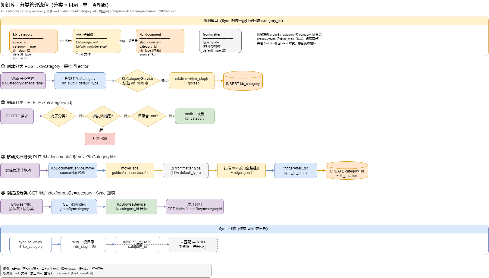

# 企业知识库 · 前端对接 API 文档

> 更新：2026-06-25 · 后端：`moli-knowledge-server`（:8090）
> 供 `meiling-ui` 前端对接知识库模块（浏览 / Query / 图谱 / 体检 / 文档管理）。
> 表结构见 [`../sql/KNOWLEDGE_SCHEMA.md`](../sql/KNOWLEDGE_SCHEMA.md)；后端实现见 [`../../moli-knowledge/moli-knowledge-server/README.md`](../../moli-knowledge/moli-knowledge-server/README.md)。

---

## 1. 通用约定

### 1.1 访问地址 / 网关前缀

| 方式 | Base URL | 说明 |
|------|----------|------|
| 经网关（推荐，前端用这个） | `http://127.0.0.1:21000/KnowledgeServer` | 网关 `StripPrefix=1` 去掉 `/KnowledgeServer` 后转发到服务 |
| 直连服务（联调用） | `http://127.0.0.1:8090` | 绕过网关，直接打服务 |
| Swagger | `http://127.0.0.1:8090/swagger-ui.html` | 在线接口文档 |

> 前端 `meiling-ui` 通过 `VITE_API_BASE_URL` 配置 Base URL；本模块所有路径在下表均以**服务内路径**（不含 `/KnowledgeServer`）书写，经网关时自动加前缀。
> 例：浏览目录 meta = `GET {VITE_API_BASE_URL}/KnowledgeServer/kb/index`；展开分组 = `/kb/index/items`。

### 1.2 鉴权

- 除登录/SSO 白名单外，接口需登录态：请求头带 **`Authorization: <token>`**（token 即 Shiro SessionId，登录后由用户中心签发）。
- `meiling-ui` 的 `src/api/http.ts` 已自动注入 `Authorization` 头，无需单独处理。

### 1.3 统一返回体 `MoliResult<T>`

```json
{ "code": 200, "msg": "成功", "data": { } }
```

| 字段 | 说明 |
|------|------|
| `code` | `200` 成功；`401/403` 鉴权失败（前端 http.ts 已统一处理）；其它为业务错误 |
| `msg`  | 提示信息 |
| `data` | 业务数据（泛型） |

分页统一用 MyBatis-Plus `Page<T>`：`data.records[]`、`data.total`、`data.current`、`data.size`。

> 默认演示空间 `spaceId = 900000000000000001`（`space_code=enterprise-kb`，公开）。
> **茉莉系统手册**独立空间 `spaceId = 900000000000000003`（`space_code=moli-ops-manual`，内部可见），wiki 源 `kb/wiki-moli/`，种子见 [`sql/07_kb_space_ops_manual.sql`](../sql/07_kb_space_ops_manual.sql)。
> 多数浏览/检索接口 `spaceId` 省略表示**当前用户可读的全部空间**（非字面「全库」）。

### 1.4 空间级权限（ACL）

所有浏览/检索/问答/编辑接口都做了空间级过滤，前端无需额外判断，越权会收到业务错误（`无权访问/编辑/管理该知识空间`）。规则：

| 维度 | 说明 |
|------|------|
| 空间可见性 `visibility` | 仅作元数据展示（`2` 公开 / `1` 内部 / `0` 私有），**不**自动授予读权限 |
| 内容侧访问 | 只有被分配到该空间的成员、空间 `owner_id`、平台超管可见；未分配空间的用户看不到该空间及其数据，只能看自己被分配的空间 |
| 成员角色 `role` | `viewer` 只读 / `editor` 可读可改内容（仅这两种）；空间 `owner_id` 默认可读可改 |
| 管理能力（建/改/删空间、成员授权） | 不由成员角色授予，而由系统动作权限 `kb:space:add/edit/remove/member` + 平台超管控制 |
| 平台超管 | `superadmin` / `admin` 账号（或 Shiro `*:*:*`）对所有空间可读可写可管理 |

- **省略 `spaceId` / `spaceIds`** 的列表/检索/问答接口：后端自动收敛到「当前用户可读的空间集合」，无可读空间时返回空结果。
- **指定 `spaceId`** 时：不可读会直接报错（`无权访问该知识空间`）。
- **指定 `spaceIds[]`**（问答、文档搜索）：对每个 ID 校验读权限，仅在所列空间内检索；与 `spaceId` 同时传时 **`spaceIds` 优先**。
- 写操作（文档保存/发布/归档/删除、分类/标签/评论/附件、空间更新/删除、成员管理）按上表校验编辑/管理权限。
- ⚠️ 当前仅 **用户型成员**（`memberType=0`）在运行时生效；角色型成员（`memberType=1`）可录入但暂不参与运行时鉴权。

### 1.5 左侧菜单（getRouters）

知识库**不在前端写死路由**，由用户中心维护 `sys_menu`，登录后前端调用 **`GET /UserCenter/menu/getRouters`** 拉取整棵菜单树。

> **SSO-MENU-1（Q5-A）**：900 段归属 **moli-admin**（`system_id=1`）；enter admin 后侧栏可有「企业知识库」。门户 enter **moli-knowledge(39)** 走 EXTERNAL `redirectUrl`，为第二入口。详见 [sso-menu-frontend-handoff.md](sso-menu-frontend-handoff.md) §F-SSO-6。

种子数据：

| 脚本 | 说明 |
|------|------|
| [`docs/sql/04_knowledge_menu.sql`](../sql/04_knowledge_menu.sql) | 侧栏菜单 + 角色菜单绑定（`init-db.ps1` 在 `03_knowledge_schema.sql` 后自动执行） |
| [`docs/sql/05_knowledge_action_patch.sql`](../sql/05_knowledge_action_patch.sql) | **动作权限** `sys_action`（空间 CRUD/批量授权、体检扫描、Wiki 同步）；**已有库需手动补一次** |
| [`docs/sql/11_kb_wiki_govern_menu.sql`](../sql/11_kb_wiki_govern_menu.sql) | **Wiki 治理**菜单 910 + 角色绑定（T16；已有库需手动补） |

| menu_id | 类型 | 名称 | path | component（对齐 meiling-ui viewRegistry） |
|---------|------|------|------|-------------------------------------------|
| 900 | M 目录 | 知识库 | `/knowledge` | `Layout` |
| 901 | C 菜单 | 文档浏览 | `browse` | `knowledge/browse/index` |
| 902 | C 菜单 | 智能问答 | `ask` | `knowledge/ask/index` |
| 903 | C 菜单 | 关系图谱 | `graph` | `knowledge/graph/index` |
| 904 | C 菜单 | 健康体检 | `lint` | `knowledge/lint/index` |
| 906 | C 菜单 | Ingest 工作台 | `ingest` | `knowledge/ingest/index` |
| 910 | C 菜单 | Wiki 治理 | `wiki-govern` | `knowledge/wiki-govern/index` |
| 909 | C 菜单 | 空间管理 | `spaces` | `knowledge/spaces/index` |

按钮权限（`sys_action`，在「分配权限」右侧按页面分组；F 菜单 perms 不进 Shiro）：

| 页面 menu_id | 动作 perm_code |
|--------------|----------------|
| 909 空间管理 | `kb:space:add`、`kb:space:edit`、`kb:space:remove`、`kb:space:member` |
| 904 健康体检 | `kb:lint:scan`、`kb:sync:trigger` |
| 906 Ingest 工作台 | `kb:ingest:job`（规划/生成）、`kb:ingest:commit`（落盘） |

侧栏 C 菜单 perms：`kb:browse:list`、`kb:ask:list`、`kb:graph:list`、`kb:lint:list`、`kb:ingest:list`、`kb:wiki:govern:list`、`kb:space:admin`。

`getRouters` 返回片段示例：

```json
{
  "code": 200,
  "data": [
    {
      "path": "/knowledge",
      "name": "Knowledge",
      "component": "Layout",
      "alwaysShow": true,
      "meta": { "title": "企业知识库", "icon": "knowledge" },
      "children": [
        {
          "path": "browse",
          "name": "KnowledgeBrowse",
          "component": "knowledge/browse/index",
          "meta": { "title": "文档浏览", "icon": "documentation" }
        },
        {
          "path": "ask",
          "name": "KnowledgeAsk",
          "component": "knowledge/ask/index",
          "meta": { "title": "智能问答", "icon": "query" }
        }
      ]
    }
  ]
}
```

已有库单独补菜单：

```bash
mysql -u root -p moli < docs/sql/04_knowledge_menu.sql
mysql -u root -p moli < docs/sql/05_knowledge_action_patch.sql   # 动作权限（空间管理/体检按钮）
mysql -u root -p moli < docs/sql/07_kb_space_ops_manual.sql    # 可选：茉莉系统手册空间
```

执行后**重新登录**，前端会重新拉取 `getRouters`。

---

## 2. 浏览（T3）—— 前端知识库主页面用

### 2.1 目录 meta `GET /kb/index`

按**分类（= wiki 一级目录）**分组的**计数**（**已发布**且 **`source='kb'`**；**不含 items**，轻量首屏）。

| 参数 | 位置 | 必填 | 说明 |
|------|------|------|------|
| `spaceId` | query | 否 | 省略=可读的全部空间 |
| `spaceIds` | query | 否 | 多空间（重复参数）；与 `spaceId` 同时传时以 `spaceIds` 为准 |
| `kbType` | query | 否 | **v2 联动**：叠加体裁过滤后再统计各分类计数；非法值 **400** |
| `kbTypes` | query | 否 | **v3 多选**：体裁 OR 过滤后再统计；重复参数；非空时优先于 `kbType` |
| `groupBy` | query | 否 | **仅支持 `category`**；传 `type` 等其它值 **400 拒绝**（体裁分组已废弃） |

响应 `data.groups[]` 含 `type/label/count`；`items` 为空。展开分组调 **2.2**。

> `group.type` 为 **categoryId** 字符串（或 `uncategorized`），`group.label` 为分类名。`kb_category.dir_slug` 绑定 wiki 子目录，Sync 按 slug 一级目录回填 `category_id`。**enterprise-kb 当前 3 类**：`concepts` / `articles` / `interview`。

```json
{
  "total": 156,
  "groups": [
    { "type": "900000000000000114", "label": "技术文章", "count": 80, "items": [] },
    { "type": "uncategorized", "label": "未分类", "count": 0, "items": [] }
  ]
}
```

### 2.1.1 体裁 facet `GET /kb/index/types`

当前作用域下各 **体裁(kb_type)** 的**已发布 + `source='kb'`** 计数，供浏览/管理页 **「体裁」筛选行** 的 chip（带数字）。

| 参数 | 位置 | 必填 | 说明 |
|------|------|------|------|
| `spaceId` | query | 否 | 省略=可读的全部空间 |
| `spaceIds` | query | 否 | 多空间（重复参数） |
| `categoryId` | query | 否 | **v2 联动**：叠加分类过滤后再统计体裁；进页未选分类时不传 |
| `categoryIds` | query | 否 | **v3 多选**：分类 OR 过滤后再统计；重复参数；非空时优先于 `categoryId`；可与 `uncategorizedOnly` 组合 |
| `uncategorizedOnly` | query | 否 | `true` 时统计未分类页；与 `categoryId` 互斥；与 `categoryIds` 组合时为 OR 含未分类 |

响应 `data`：`items[]`（按体裁白名单顺序，仅 `count>0`）+ `total`。

```json
{
  "items": [
    { "kbType": "concept", "label": "概念", "count": 41 },
    { "kbType": "article", "label": "文章", "count": 92 },
    { "kbType": "interview", "label": "面试题", "count": 22 }
  ],
  "total": 155
}
```

> 迁移 Meilisearch 后，本计数可由 `facetDistribution` 直出（见 wiki `知识库-meilisearch接入规划`），接口契约不变。

### 2.1.2 体裁白名单 `GET /kb/meta/kb-types`

体裁下拉/筛选数据源（**单一来源** `KbTypeConstants`，与 `sync_to_db.py` 的 `KB_TYPES` 一致）。无需 ACL。

```json
[
  { "value": "guide", "label": "操作指南" },
  { "value": "service", "label": "服务实体" },
  { "value": "concept", "label": "概念" },
  { "value": "article", "label": "文章" },
  { "value": "interview", "label": "面试题" },
  { "value": "output", "label": "汇总" }
]
```

> 体裁的**维护**仍是改 wiki frontmatter `type:` → Sync（DB 只读镜像）；新增第 7 种须同时改 `KbTypeConstants` 与 `sync_to_db.py`。

### 2.1.3 浏览/管理页筛选 UI 规范（体裁 × 分类 · 平行双 facet）

#### 两个维度（勿混淆）

| 维度 | 含义 | 数据从哪来 | 查询参数（单选 v2） | 查询参数（多选 v3） |
|------|------|------------|---------------------|---------------------|
| **体裁** | frontmatter `type:` → `kb_document.kb_type` | `GET /kb/index/types` | `kbType` | `kbTypes`（重复参数，OR） |
| **分类** | wiki 一级目录 → `kb_document.category_id` | `GET /kb/index` → `groups[]` | `categoryId` / `uncategorizedOnly` | `categoryIds`（OR）+ 可选 `uncategorizedOnly` |

**查询关系**：两个维度 **平级、独立可选**，列表取 **AND**（同时选中则两个条件都满足）。  
**禁止**再做成「必须先选分类，体裁 chip 才出现」的嵌套交互（旧版易与 enterprise-kb 分类名撞车，用户看不懂「全部体裁 + 概念」）。

#### 目标线框（文档浏览 · 文档管理共用）

```text
┌─ 企业知识库 ▼ ─────────────────────────────────────────────┐
│ [ 搜索标题或摘要________________________ ]                    │
│ 共 155 篇                                                     │
├──────────────────────────────────────────────────────────────┤
│ 体裁  (全部)  操作指南  概念(41)  文章(92)  面试题(22)  汇总   │  ← 行1：/kb/index/types
│ 分类  (全部)  概念(41)  技术文章(92)  面试题(22)  未分类(0)   │  ← 行2：/kb/index groups
├──────────────────────────────────────────────────────────────┤
│ □ B+Tree 与 InnoDB 索引结构                        [概念]    │
│ □ Dubbo 与 Nacos                                   [概念]    │
│ ...                                                           │
└──────────────────────────────────────────────────────────────┘
```

- **(全部)**：该行不传对应 query 参数（`kbType` / `categoryId` 均省略）。
- 行内 `(41)`：facet 计数，来自对应 meta 接口。
- 列表右侧 `[概念]`：该行文档的 `kbType` 中文标签（search 返回字段 + `/kb/meta/kb-types` 映射）。

#### 前端对接表

| 场景 | 调用 | 说明 |
|------|------|------|
| 进页 · 体裁行 | `GET /kb/index/types?spaceId=` | **不带** `categoryId`；渲染体裁 chip + 计数 |
| 进页 · 分类行 | `GET /kb/index?spaceId=` | 渲染分类 chip + 计数；`groups[].type` 即 `categoryId`（`uncategorized` 特殊） |
| 列表（核心） | `GET /kb/document/search?source=kb&…` | 两维 **AND**；单选用 `kbType`/`categoryId`，多选用 `kbTypes`/`categoryIds` |
| 未分类 | `search?…&uncategorizedOnly=true` | 与单值 `categoryId` 互斥；可与 `categoryIds` 组合（OR 含未分类） |
| 编辑页体裁下拉 | `GET /kb/meta/kb-types` | `value/label` 下拉 |
| 编辑页改体裁 | wiki 保存写 frontmatter `type:` → Sync | **不直写 DB** |

#### 调用时序（平行双 facet · v1）

```text
1. 进页（并行）
   GET /kb/index/types?spaceId=1
   GET /kb/index?spaceId=1
   GET /kb/document/search?source=kb&spaceId=1&pageNum=1&pageSize=20
   → 两行 chip 默认均为「全部」，列表=空间内全部已发布 wiki 文档

2. 只选体裁「概念」
   search 加 kbType=concept（categoryId 仍不传）
   → 全空间内 type=concept 的文档（不限目录）

3. 只选分类「技术文章」
   search 加 categoryId={groups[].type}（kbType 仍不传）
   → 该目录下全部体裁

4. 体裁 + 分类同时选
   search 同时带 kbType=concept & categoryId=…
   → AND：该分类下且该体裁的文档

5. 取消某行筛选
   该行点「全部」→ 去掉对应 query 参数，重新 search
```

> **返回行含体裁**：search 每条 `KbDocument` 带 `kbType`，可直接渲染右侧标签。  
> **传参约束**：任一 `kbType`/`kbTypes` 元素非法 → **400**；单值 `categoryId` 与 `uncategorizedOnly` 不可同传 → **400**（`categoryIds` 可与 `uncategorizedOnly` 组合）。

#### v2 facet 计数联动（已实现）

选中**分类**后，体裁行计数改为 `GET /kb/index/types?…&categoryId=`（或 `uncategorizedOnly=true`）。  
选中**体裁**后，分类行计数改为 `GET /kb/index?…&kbType=`（或多选 `kbTypes`）。  
列表仍为 `search` 的 **AND**；chip 数字与当前另一维筛选一致，避免「上面 183、下面 6」的误解。

#### v3 多选筛选（已实现 · 后端）

**筛选模型**

| 规则 | 语义 |
|------|------|
| 维度内 | `kbTypes` 或 `categoryIds` 为非空列表 → 该维 **OR**（`IN (...)`） |
| 维度间 | 体裁维与分类维同时有筛选 → **AND** |
| 空 | 某维未传列表且未传单值 → 该维不过滤 |
| 优先级 | `kbTypes` 非空忽略 `kbType`；`categoryIds` 非空忽略 `categoryId` |
| 未分类 | 仅 `uncategorizedOnly=true` → 仅 `category_id IS NULL`；与 `categoryIds` 同传 → `(category_id IN (...) OR category_id IS NULL)` |

**列表示例**（单空间、文章+面试题、两个分类含未分类）：

```http
GET /KnowledgeServer/kb/document/search?source=kb&status=1&spaceId=900000000000000001
    &kbTypes=article&kbTypes=interview
    &categoryIds=900000000000000114&categoryIds=900000000000000115
    &uncategorizedOnly=true
    &pageNum=1&pageSize=20
```

**facet 联动示例**（体裁已多选 → 拉分类计数）：

```http
GET /KnowledgeServer/kb/index?groupBy=category&spaceId=900000000000000001
    &kbTypes=article&kbTypes=interview
```

**facet 联动示例**（分类已多选 → 拉体裁计数）：

```http
GET /KnowledgeServer/kb/index/types?spaceId=900000000000000001
    &categoryIds=900000000000000114&categoryIds=900000000000000115
    &uncategorizedOnly=true
```

**实现要点**（`KbDocumentFilterSupport`）：`searchFullText` 与 LIKE fallback 共用 `IN`/OR 逻辑；Spring 重复 query 绑定 `List`（同 `spaceIds`）。facet 仍只返回 `count>0` 的分组。

**向后兼容**：旧单值 `kbType` / `categoryId` 无需改动；多选前端改传 `kbTypes` / `categoryIds` 即可。列表 `total` 以 search 为准，勿对 facet 计数求和。

#### enterprise-kb 空间说明（避免误以为 bug）

该空间历史目录按体裁划分（`concepts/` / `articles/` / `interview/`），**分类中文名与体裁中文名高度重合**：

| 分类（目录） | 常见 kb_type |
|--------------|--------------|
| 概念 | concept |
| 技术文章 | article |
| 面试题 | interview |

因此用户可能同时选中「体裁=概念」+「分类=概念」，结果与只选其一接近——**是数据布局现状，不是接口错误**。  
在 **wiki-moli**（`develop/` 下混有 service/concept/article/output）两维差异更明显。

#### 旧交互（已废弃，前端勿再实现）

- ❌ 左侧分类树选中后，下方才出现「全部体裁 + 当前分类名」chip  
- ❌ 提示「请先选分类，再按体裁筛选」  
- ✅ 改为上方 **两行平行 chip**：体裁一行、分类一行，默认均可「全部」

### 2.2 分组条目 `GET /kb/index/items`

| 参数 | 位置 | 必填 | 说明 |
|------|------|------|------|
| `spaceId` | query | 否 | 同 index |
| `groupBy` | query | 否 | 仅 `category`；其它值拒绝 |
| `key` | query | 是* | **categoryId** 或 `uncategorized` |
| `type` | query | 是* | 旧参数，等价 `key`（向后兼容） |
| `pageNum` | query | 否 | 默认 1 |
| `pageSize` | query | 否 | 默认 50，最大 200 |

### 2.3 目录搜索 `GET /kb/index/search`

| 参数 | 位置 | 必填 | 说明 |
|------|------|------|------|
| `spaceId` | query | 否 | 同 index |
| `q` | query | 是 | 关键词（title/slug/summary LIKE） |
| `limit` | query | 否 | 默认 200，最大 500 |
| `groupBy` | query | 否 | 仅 `category`；其它值拒绝 |

### 2.4 slug 定位 `GET /kb/index/locate`

深链展开：根据 slug 找到所属**分类**分组，供侧栏自动展开并高亮条目。

| 参数 | 位置 | 必填 | 说明 |
|------|------|------|------|
| `slug` | query | 是 | 如 `interview/spring-事务` |
| `spaceId` | query | 否 | 多空间或 slug 冲突时建议必传 |

响应 `data`（`IndexLocateVo`）：

```json
{
  "type": "interview",
  "label": "面试题",
  "item": {
    "id": 90020,
    "slug": "interview/spring-事务",
    "title": "Spring 事务（面试题系列）",
    "summary": null,
    "spaceId": 900000000000000001
  }
}
```

> 找不到 slug 时返回业务错误；`item.summary` 在 locate 场景通常为空（轻量）。

### 2.5 单页详情 `GET /kb/page`

按 slug 取单页（slug 形如 `services/用户中心`，**含斜杠故用查询参数**，不要拼进路径）。

| 参数 | 位置 | 必填 | 说明 |
|------|------|------|------|
| `slug` | query | 是 | 如 `services/用户中心` |
| `spaceId` | query | 否 | 多空间合并浏览或 slug 冲突时**建议必传** |

响应 `data` 含 `spaceId`（所属空间），引用跳转时需一并带上。

```json
{
  "docId": 90010,
  "spaceId": 900000000000000001,
  "slug": "services/用户中心",
  "title": "用户中心",
  "summary": "...",
  "content": "# 用户中心\n...(markdown)...",
  "kbType": "service",
  "domain": "AP",
  "status": 1,
  "updateTime": "2026-06-22 14:00:00",
  "tags": ["微服务", "权限"],
  "outLinks": [ { "docId": 90011, "slug": "concepts/rbac-权限模型", "title": "RBAC 权限模型", "relationType": "related" } ],
  "backLinks": [ { "docId": 90012, "slug": "guides/本地启动指南", "title": "本地启动指南", "relationType": "links_to" } ]
}
```

> `content` 是 markdown，前端需 markdown 渲染；`[[slug]]` 形式的站内链接可点跳转到对应页。
> `outLinks/backLinks` 来自 `kb_relation`，需先跑同步脚本 `kb/tools/sync_to_db.py`，否则为空数组。

---

## 3. Query 问答（T2）—— 问答框页面用

> **LLM 开关**：后端 `kb.llm.*` 配 provider/api-key 后 **`available=true`**；每次提问是否调 LLM 由请求体 **`useLlm`** 控制（默认 `false` → 检索式）。Nacos 托管模板见 [`../nacos/`](../nacos/)（暂未启用）。

### `GET /kb/ask/llm-config`

探测后端是否已配置 LLM（**不含 api-key**），供前端决定是否可勾选 `useLlm`。

```json
{
  "available": true,
  "configEnabled": true,
  "apiKeyConfigured": true,
  "provider": "glm",
  "model": "glm-4-flash"
}
```

| 字段 | 说明 |
|------|------|
| `available` | `kb.llm.enabled && api-key` 均已配置 |

> **T19**：平台管理员在 **系统管理 → 知识库 LLM** 维护配置（`GET/PUT/POST test` §3.5）；Ask 探测仍用 §3.1。

### 3.5 平台 LLM 配置（T19 · 已实现）

> **前端对接**（T19d）：[`kb-llm-platform-frontend.md`](kb-llm-platform-frontend.md)  
> **权限**：平台超管或 `kb:platform:llm`。API Key **加密存库**，响应永不回明文。  
> **前置**：执行 [`../sql/11_kb_platform_llm_config.sql`](../sql/11_kb_platform_llm_config.sql)、[`../sql/12_kb_platform_llm_menu.sql`](../sql/12_kb_platform_llm_menu.sql)；保存 api-key 到 DB 须配置 `kb.llm.config-secret` 或环境变量 **`KB_LLM_CONFIG_SECRET`**（见设计文档 §5.4）。GET 返回 **`encryptionReady`** 供前端预检。

**网关路径**（meiling-ui）：`/KnowledgeServer/kb/platform/llm-config`

#### `GET /kb/platform/llm-config`

读取当前生效配置（含脱敏 key、配置来源 `database` / `yaml_fallback`）。

```json
{
  "enabled": true,
  "provider": "glm",
  "baseUrl": "https://open.bigmodel.cn/api/paas/v4",
  "apiKeyConfigured": true,
  "apiKeyMask": "****tdLzM0",
  "model": "glm-4-flash",
  "temperature": 0.3,
  "timeoutSeconds": 90,
  "extraModels": ["glm-4-flash", "glm-4-air"],
  "available": true,
  "source": "database",
  "persistedInDatabase": true,
  "encryptionReady": true,
  "updateTime": "2026-06-28 15:00:00"
}
```

| 字段 | 说明 |
|------|------|
| `available` | `enabled && apiKeyConfigured`（运行时是否可调用） |
| `encryptionReady` | 加密主密钥已配置（yaml 或 `KB_LLM_CONFIG_SECRET`）；保存新 api-key 前置条件 |
| `source` | `database` / `yaml_fallback` |
| `persistedInDatabase` | DB 是否已有加密 api-key（与 yaml 兜底区分） |
| `apiKeyMask` | 脱敏展示；**不是**可编辑用的明文 |

#### `PUT /kb/platform/llm-config`

| 字段 | 必填 | 说明 |
|------|------|------|
| `enabled` | 是 | 总开关 |
| `provider` | 是 | `deepseek` / `qwen` / `glm` / `custom` |
| `baseUrl` | 是 | OpenAI 兼容根 URL；禁止 localhost/127.0.0.1/169.254.x/metadata |
| `apiKey` | 否 | **空字符串或不传 = 不修改**；非空 = 替换并加密入库 |
| `clearApiKey` | 否 | `true` 时清除 DB 密文，运行时回退 yaml 中的 api-key |
| `model` | 是 | 默认模型 |
| `temperature` | 否 | 0～2，默认 0.3 |
| `timeoutSeconds` | 否 | 5～300，默认 90 |
| `extraModels` | 否 | 治理/Ingest 模型下拉 |

保存后立即刷新服务端 `KbLlmRuntime`，**无需重启**。

常见错误 `msg`：`无权管理平台 LLM 配置`；`未配置 kb.llm.config-secret（KB_LLM_CONFIG_SECRET），无法将 api-key 加密存入数据库`；`base-url 不允许指向内网/元数据地址`。

#### `POST /kb/platform/llm-config/test`

请求体可选；字段缺省时使用**当前已保存/生效**配置。`apiKey` 非空则仅用于本次测试、**不写库**。

| 字段 | 说明 |
|------|------|
| `message` | 默认 `ping` |
| 其余 | 同 PUT，均可选，用于保存前测试 |

响应 `data`（HTTP 始终 200，看 `success`）：

```json
{
  "success": true,
  "latencyMs": 842,
  "model": "glm-4-flash",
  "replyPreview": "pong",
  "error": null
}
```

#### 与 §3.1 关系

| API | 说明 |
|-----|------|
| `GET /kb/ask/llm-config` | **保留**；Ask/Ingest 页探测 `available`，读 DB 优先 |
| `GET /kb/platform/llm-config` | **管理**；含 baseUrl/model/脱敏 key，仅平台管理员 |

### `POST /kb/ask`

请求体（JSON）：

```json
{ "question": "Spring 事务在什么情况下会失效？", "spaceId": 900000000000000001, "topK": 8, "useLlm": false }
```

多空间（须对每个 space 有读权限）：

```json
{
  "question": "对比 enterprise-kb 与用户中心概要设计中的 RBAC 要点",
  "spaceIds": [900000000000000001, 900000000000000003],
  "topK": 8
}
```

| 字段 | 必填 | 说明 |
|------|------|------|
| `question` | 是 | 问题 |
| `spaceId` | 否 | 单空间；省略=全部可读空间 |
| `spaceIds` | 否 | 多空间数组；非空时优先于 `spaceId` |
| `topK` | 否 | citations 候选页上限；省略用 `kb.ask.citation-top-k`（默认 8） |
| `llmContextTopK` | 否 | LLM prompt 候选页上限；省略用 `kb.ask.llm-context-top-k`（默认 **3**） |
| `useLlm` | 否 | 是否启用 LLM 生成式，默认 **false**；须后端 `available=true` 才生效 |
| `retrievalStrategy` | 否 | 召回策略覆盖：`ngram` \| `hybrid` \| `hybrid-rerank`；省略用 `kb.search.retrieval-strategy`（默认 **ngram**） |

响应 `data`：

```json
{
  "answer": "结论...\n要点... [[interview/spring-事务]]",
  "mode": "generative",
  "scope": "[interview]",
  "scopeReason": "命中『面试题』意图 → 限 interview",
  "provider": "deepseek",
  "model": "deepseek-chat",
  "citations": [
    { "docId": 90020, "spaceId": 900000000000000001, "slug": "interview/spring-事务", "title": "Spring 事务（面试题系列）", "kbType": "interview", "snippet": "..." }
  ],
  "qaLogId": 901234567890123456
}
```

**Guardrails（AI-9 · additive，`kb.guardrails.enabled=true` 时可能出现）**：

```json
"guard": {
  "blocked": false,
  "flagged": false,
  "blockReason": null,
  "piiRedacted": true,
  "piiTypes": ["email"],
  "groundingApplied": true,
  "groundingLow": false,
  "coverage": 0.92,
  "unsupportedStatements": []
}
```

| 字段 | 说明 |
|------|------|
| `guard.blocked` | 注入 BLOCK；此时 `mode=retrieval` 且未调用 LLM |
| `guard.flagged` | 可疑注入 FLAG，仍允许生成 |
| `guard.piiRedacted` / `piiTypes` | PII 已脱敏；类型枚举 `email`/`phone`/`id_card`，**不含原文** |
| `guard.groundingApplied` | 单轮 generative 或 Agentic S3 已做 grounding 标注 |
| `guard.coverage` | 陈述被 citations 支撑比例（AI-7 同口径）；未跑为 `null` |
| `guard.groundingLow` | `coverage < kb.guardrails.grounding.low-threshold`（默认 0.8） |
| `guard.unsupportedStatements` | 无 citation 支撑的陈述列表；**答案正文不删句** |

| 字段 | 说明 |
|------|------|
| `mode` | `generative`（`useLlm=true` 且后端 LLM 可用）/ `retrieval`（默认或未启用 LLM） |
| `scope` / `scopeReason` | 自动识别的作用域及理由（如"面试题"→ interview） |
| `citations` | 引用来源；前端可渲染为可点链接，跳到 `/kb/page?slug=`。`answer` 里的 `[[slug]]` 也对应这些页 |
| `qaLogId` | 本次问答日志 ID，用于提交反馈 |

### `GET /kb/ask/history`

| 参数 | 位置 | 必填 | 说明 |
|------|------|------|------|
| `spaceId` | query | 否 | 省略=可读空间内全部 |
| `pageNum` / `pageSize` | query | 否 | 分页 |

响应 `data`：`Page<QaHistoryVo>`。

| 字段 | 说明 |
|------|------|
| `id` | 问答日志 ID（提交反馈时用） |
| `spaceId` | 所属空间（省略 spaceId 查历史时可能有多个空间的结果） |
| `question` / `answer` | 问题与答案 |
| `mode` | `generative` / `retrieval` |
| `scope` | 作用域标签 |
| `provider` / `model` | LLM 提供方与模型（检索式时可能为空） |
| `citations` | 引用列表，结构同 `POST /kb/ask` 的 `citations` |
| `useful` | `1` 有用 / `0` 无用 / `null` 未评 |
| `createTime` | 提问时间 |

```json
{
  "records": [
    {
      "id": 901234567890123456,
      "spaceId": 900000000000000001,
      "question": "Spring 事务在什么情况下会失效？",
      "answer": "结论... [[interview/spring-事务]]",
      "mode": "retrieval",
      "scope": "[interview]",
      "provider": null,
      "model": null,
      "citations": [
        { "docId": 90020, "spaceId": 900000000000000001, "slug": "interview/spring-事务", "title": "Spring 事务", "kbType": "interview", "snippet": "..." }
      ],
      "useful": 1,
      "createTime": "2026-06-22 16:00:00"
    }
  ],
  "total": 1,
  "current": 1,
  "size": 10
}
```

### `PUT /kb/ask/feedback/{id}?useful=`

| 参数 | 说明 |
|------|------|
| `id` | 问答日志 ID（`qaLogId`） |
| `useful` | `1` 有用 / `0` 无用 |

> 后端是否走生成式取决于 `application-dev.yml` 的 `kb.llm.enabled + api-key`。前端无需关心，按 `mode` 展示即可（generative 显示富文本答案；retrieval 提示"检索式"并列出引用）。

### DeepResearch（AI-10 · additive）

> 契约：[`docs/design/contracts/AI-10-contract.md`](../design/contracts/AI-10-contract.md) · 流程图：[`moli-kb-deep-research.drawio`](../diagrams/moli-kb-deep-research.drawio)  
> 总开关 `kb.research.enabled`（默认 **false**）；Sidecar `moli-knowledge/deep-research/`（`:8095`）。

| 方法 | 路径 | 说明 |
|------|------|------|
| `POST` | `/kb/research` | 启动调研，返回 `runId`（异步） |
| `POST` | `/kb/research/start` | 同 `/kb/research` |
| `GET` | `/kb/research/{runId}` | 状态 + 结果（outline / reportMd / citations / coverage） |
| `GET` | `/kb/research/{runId}/stream` | SSE：`progress` / `complete` / `error` |

**请求体** `ResearchRequest`（JSON）：

| 字段 | 必填 | 说明 |
|------|------|------|
| `topic` | 是 | 调研主题（≤500 字） |
| `spaceId` / `spaceIds` | 否 | ACL 范围，语义同 `POST /kb/ask` |
| `writeback` | 否 | 默认 `false`；`true` 时经 Ingest commit 落盘 `wiki-moli/develop/outputs/{slug}.md`（D-INV-1） |
| `slug` | 否 | 回写文件 stem；空则用 Planner `slugHint` |
| `agentic` | 否 | 难节是否允许 `/kb/ask/agentic` |
| `graphExpand` | 否 | 透传 GraphRAG（AI-5） |
| `retrievalStrategy` | 否 | 默认 `hybrid`（AI-2） |
| `maxSections` | 否 | Planner 节数上限（硬顶 10） |
| `maxRetrieveRounds` | 否 | Reviewer 回补轮（硬顶 3） |
| `latencyBudgetMs` | 否 | 整次预算；超则 `degraded=true` 大纲+引用摘要 |
| `topK` | 否 | 每 query 检索 topK |

**响应** `ResearchVo`（`GET` 或 SSE `complete`）：

```json
{
  "runId": "uuid",
  "status": "SUCCEEDED",
  "topic": "茉莉微服务架构",
  "title": "茉莉微服务架构调研",
  "slug": "茉莉微服务架构",
  "outline": { "sections": [] },
  "reportMd": "---\ntitle: ...\ntype: output\nquery: ...\nsource_pages: [...]\n---\n# ...",
  "citations": [{ "slug": "develop/用户中心", "title": "用户中心", "sectionIds": ["s1"] }],
  "coverage": 0.82,
  "unsupportedStatements": [],
  "degraded": false,
  "degradeReason": null,
  "ingestJobId": null,
  "outputPath": null,
  "guard": null,
  "latencyMs": 12000
}
```

| 字段 | 说明 |
|------|------|
| `reportMd` | 多节 Markdown + YAML frontmatter（`type=output`、`query`、`source_pages`） |
| `coverage` | Reviewer 陈述支撑比例（AI-7 同口径）；`unsupportedStatements` **不删句** |
| `ingestJobId` / `outputPath` | `writeback=true` 且 commit 成功时有值 |
| `guard` | `kb.research.guardrails=true` 且 AI-9 启用时，启动前 InputGuard 结果 |

**SSE `progress`**：`phase` = `planner|retriever|writer|reviewer|writeback`。

**权限**：读权限同 Ask；`writeback=true` 另需 Ingest `kb:ingest:job` + `kb:ingest:commit`。

**配置**（`kb.research.*`）：`enabled` · `sidecar-base-url` · `max-sections` · `max-retrieve-rounds` · `latency-budget-ms` · `coverage-threshold` · `writeback-auto-sync` · `writeback-space-id` · `writeback-raw-path` · `guardrails`。

**冒烟**：`python moli-knowledge/deep-research/smoke.py --topic "茉莉微服务架构"`（同主题二次运行对比 citations/`source_pages` slug 集合）。

---

## 4. 图谱与体检（T5）—— 可视化/治理页面用

### 4.1 关系图谱 `GET /kb/graph`

> **大库优化（2026-06-24）**：边只读 `kb_relation`（**不再扫正文**），节点只查 `id/title/kb_type/status`（**不含 content/summary**）。默认按**度数降序**裁剪到 `maxNodes`，并返回 `meta` 统计。前端**不要**默认渲染全库，应先画核心子图，点击节点再用 §4.1.1 `ego` 展开。

| 参数 | 位置 | 必填 | 默认 | 说明 |
|------|------|------|------|------|
| `spaceId` | query | 否 | 全部可读空间 | |
| `mode` | query | 否 | `full` | `full`=裁剪后子图；`summary`=只回 Top 枢纽 + 它们之间的边 |
| `maxNodes` | query | 否 | `full`=300 / `summary`=50 | 最多返回节点数（按度数降序保留），上限 2000 |
| `minDeg` | query | 否 | 0 | 仅保留度数 ≥ minDeg 的节点（过滤弱连接，减边） |

响应 `data`：

```json
{
  "nodes": [ { "id": "90010", "title": "用户中心", "type": "service", "deg": 6 } ],
  "links": [ { "source": "90010", "target": "90011", "type": "related" } ],
  "meta": {
    "totalNodes": 3308,
    "totalLinks": 12044,
    "returnedNodes": 300,
    "returnedLinks": 1820,
    "truncated": true,
    "source": "relation",
    "mode": "full"
  }
}
```

> - `id` 为文档 ID 字符串；节点 `type` = **`kb_type`**（guide/service/concept/article/interview/output，与浏览分组一致；缺省回退分类名/状态）；连线 `type` = `links_to`/`same_tag`/`related`/`depends_on` 等。
> - `deg` 可映射节点大小；`meta.truncated=true` 表示还有更多节点未返回（可提示用户用搜索或 ego 展开）。
> - `meta.source`：`relation`=读已落库边；`runtime`=relation 表为空时回退运行时解析（仅小库/未同步时出现）。
> - 节点数 > 几百时，前端建议默认 `mode=summary` 或带 `minDeg=2`，再配合 ego 探索。

#### 4.1.1 邻域子图 `GET /kb/graph/ego`

以某文档为中心做 BFS（探索式，点击节点再拉），逐层查 `kb_relation`，**不加载全图**。

| 参数 | 位置 | 必填 | 默认 | 说明 |
|------|------|------|------|------|
| `spaceId` | query | 否 | 全部可读空间 | |
| `docId` | query | **是** | — | 中心文档 ID |
| `depth` | query | 否 | 1 | 跳数，1~3 |
| `maxNodes` | query | 否 | 200 | 子图节点上限（上限 2000） |

响应结构同 `/kb/graph`（含 `nodes/links/meta`，`meta.mode=ego`）。

#### 4.1.2 Wiki 文件直读图谱 `GET /kb/wiki/graph`

> **前端「Wiki 文件」数据源**（`KnowledgeGraphView` · `dataSource=wikiFile`）：从磁盘 wiki 目录构建图谱，对齐 `kb/tools/serve.py` `/api/graph`。  
> 与 §4.1 `GET /kb/graph`（读 `kb_relation` 落库边）互补：未 Sync 或需看 `[[wikilink]]` / `graph/edges.jsonl` 时用本接口。

| 参数 | 位置 | 必填 | 默认 | 说明 |
|------|------|------|------|------|
| `spaceId` | query | **是** | — | 单空间（按 `kb.wiki.space-dirs` 解析磁盘目录） |
| `mode` | query | 否 | `full` | `full` / `summary`（Top 枢纽） |
| `maxNodes` | query | 否 | `full`=300 / `summary`=50 | 按度数降序裁剪，上限 2000 |
| `minDeg` | query | 否 | 0 | 仅保留度数 ≥ minDeg 的节点 |

响应 `data` 结构同 §4.1，差异：

- 节点 `id` = **wiki slug**（如 `guides/本地启动指南`），非文档数字 ID
- 边来源：正文 `[[wikilink]]`（`links_to`）+ frontmatter `related`（`relates_to`）+ `graph/edges.jsonl` 显式边
- `meta.source` = `wiki_file`
- Wiki 文件模式**不支持** §4.1.1 `ego`（点击节点用 slug 打开预览，不增量拉邻域）

权限：需空间 **viewer**（`KbAclService.assertCanRead`）。

### 4.2 体检（只算不落库）`GET /kb/lint`

> **数据源（KBOPS-10）**：扫描 **MySQL `kb_document`** 快照（`dataSource=db_snapshot`），**不读**磁盘 `kb/wiki*`。  
> **文件真值**（Sync 前门禁）：`python kb/tools/lint.py --strict` 或 `POST /kb/wiki-moli/lint-space`（§4.7）。  
> 若 wiki 已改但未 Sync，本接口仍是**旧库内容**。分工详见 `wiki-moli/guides/查询与体检指南` §3.3。

| 参数 | 位置 | 必填 |
|------|------|------|
| `spaceId` | query | 否 |

响应 `data`：`LintVo`（节选）

```json
{
  "dataSource": "db_snapshot",
  "fileLintPath": "/kb/wiki-moli/lint-space",
  "broken": [ { "page": "90010", "title": "用户中心", "target": "不存在的页" } ],
  "orphans": [ { "slug": "90030", "title": "孤儿页" } ],
  "noSummary": [ { "slug": "90031", "title": "缺摘要页" } ],
  "duplicates": [ { "stem": "foo", "page": "90032", "title": "...", "slugs": ["guides/foo", "articles/foo"] } ],
  "stale": [ { "slug": "90033", "title": "...", "reason": "被 [[new]] supersedes 但仍为已发布" } ],
  "conflicts": [ { "page": "90034", "title": "...", "slugs": ["a", "b"], "detail": "contentHash 相同" } ],
  "missingSources": [ { "page": "90035", "title": "...", "detail": "sources 为空" } ],
  "badTypes": [],
  "missingTitles": [],
  "slugMismatches": [],
  "missingDates": [],
  "missingConcepts": [],
  "counts": {
    "pages": 17, "broken": 0, "orphans": 2, "noSummary": 1,
    "duplicates": 0, "stale": 0, "conflicts": 0,
    "missingSources": 0, "badTypes": 0, "missingTitles": 0,
    "slugMismatches": 0, "missingDates": 0, "missingConcepts": 0
  }
}
```

### 4.3 体检并落库 `POST /kb/lint/scan`

权限：`kb:lint:scan` 或空间 editor（单空间）/ 超管（全库）。  
参数同上（`spaceId` query 可选）。执行扫描并把问题写入 `kb_lint_issue`（**清掉旧的 status=0 待处理**后重建），返回结构同 `/kb/lint`。

**定时任务（KBOPS-8）**：`kb.lint.schedule-enabled=true` 时按 `kb.lint.schedule-cron`（默认每周一 03:00）对配置空间自动 `scan` 落库。

### 4.3.1 Scan 状态（只读）`GET /kb/lint/scan/status`

权限：与 `GET /kb/lint/issues` 相同（空间可读；全库需 admin）。

| 参数 | 位置 | 必填 | 说明 |
|------|------|------|------|
| `spaceId` | query | 否 | 不传=全库（admin） |

响应 `data`：`LintScanStatusVo`

| 字段 | 说明 |
|------|------|
| `scheduleEnabled` | `kb.lint.schedule-enabled`（**只读**，Web 不可改） |
| `scheduleCron` | `kb.lint.schedule-cron`（只读，enabled 时可展示） |
| `lastScanTime` | 最近 scan 落库时间（手动或定时；Redis 记录，回退 `kb_lint_issue.scan_time` MAX） |
| `openIssueCount` | 当前待处理工单数（status=0） |
| `spaceId` / `spaceCode` | 与 query 一致 |

### 4.4 体检问题列表 `GET /kb/lint/issues`

| 参数 | 位置 | 必填 | 说明 |
|------|------|------|------|
| `spaceId` | query | 否 | |
| `status` | query | 否 | `0`待处理 `1`已忽略 `2`已修复 |
| `resolved` | query | 否 | 与 `status` 同义（meiling-ui 兼容别名） |
| `issueType` | query | 否 | 见 §4.8 |
| `assigneeId` | query | 否 | 处理人用户 ID |
| `priority` | query | 否 | `0`普通 `1`高 `2`紧急 |
| `unassignedOnly` | query | 否 | `true` 时仅未指派 |
| `pageNum` | query | 否 | 默认 `1` |
| `pageSize` | query | 否 | 默认 `20`，最大 `200` |

响应 `data`：MyBatis `Page<KbLintIssue>`（`records`/`total`/`current`/`size`），元素含 `id/spaceId/documentId/issueType/detail/status/assigneeId/priority/scanTime`。

### 4.5 更新问题 `PUT /kb/lint/issue/{id}`

| 参数 | 位置 | 必填 | 说明 |
|------|------|------|------|
| `id` | path | 是 | 问题 ID |
| `status` | query | 否 | `0`/`1`/`2` |
| `assigneeId` | query | 否 | 处理人；**空字符串**表示清空 |
| `priority` | query | 否 | `0`/`1`/`2` |

至少提供 `status`、`assigneeId`（含清空）或 `priority` 之一。需空间 **editor** 或超管。

### 4.5.1 统一批量更新 `PUT /kb/lint/issues/batch`（O7/O8）

请求体 `LintIssueBatchRequest`：

```json
{ "ids": [9001, 9002], "status": 2, "assigneeId": 42, "priority": 1, "clearAssignee": false }
```

`status`、`assigneeId`、`clearAssignee`、`priority` 至少填一项。响应 `data`：更新条数 `int`。

### 4.5.2 批量更新状态 `PUT /kb/lint/issues/batch-status`（KBOPS-8 · 兼容）

请求体 `LintIssueBatchStatusRequest`：

```json
{ "ids": [9001, 9002], "status": 2 }
```

响应 `data`：更新条数 `int`。

### 4.5.2 指派 / 优先级 `PUT /kb/lint/issue/{id}/assign`

| 参数 | 位置 | 必填 | 说明 |
|------|------|------|------|
| `assigneeId` | query | 否 | 处理人 |
| `priority` | query | 否 | `0`/`1`/`2` |

### 4.5.3 批量指派 `PUT /kb/lint/issues/batch-assign`（KBOPS-8）

请求体 `LintIssueBatchAssignRequest`：

```json
{ "ids": [9001, 9002], "assigneeId": 42, "priority": 1 }
```

`assigneeId` 与 `priority` 至少填一项。

### 4.8 问题类型对照 `GET /kb/lint/issue-types`（KBOPS-8/10）

返回 `LintIssueTypeVo[]`：`code`（Web issue_type）、`label`、`lintPyKind`（lint.py KIND）、`webOnly`、`lintPyOnly`。

| Web `code` | lint.py | 说明 |
|------------|---------|------|
| `broken_link` | `broken_link` | 断链 |
| `orphan` | `orphan` | 孤儿页 |
| `no_summary` | — | **Web 特有**（DB summary 空） |
| `duplicate` | `dup_slug` | slug 裸名歧义 |
| `stale` | `outdated` | 过时 / supersedes |
| `conflict` | `dup_content` | contentHash 重复 |
| `missing_source` | `missing_source` | sources 空 |
| `bad_type` | `bad_type` | type 非法 |
| `missing_title` | `missing_title` | 无 title 且无 H1 |
| `slug_mismatch` | `slug_mismatch` | frontmatter slug ≠ 路径 |
| `missing_dates` | `missing_dates` | 缺 created/updated |
| `missing_concept` | `missing_concept` | 断链目标被多页引用 |
| — | `near_dup` / `space_branding` / `asym_related` | **仅 lint.py**（文件真值） |

已有库若缺 `assignee_id`/`priority` 列，执行 `docs/sql/17_kb_lint_ops_enhance.sql`。

### 4.6 文件级空间 Lint（T16a · 文件真值）✅

> **与 §4.2–4.5 的区别**：本节扫**部署机磁盘** `kb/wiki*` markdown（调 `lint.py`），**不读** MySQL。改完 wiki 未 Sync 也能检出断链/孤儿/缺 sources 等，是 **Wiki 治理工作台** 与 Sync 前门禁的权威数据源。  
> DB 快照体检仍用 `GET /kb/lint`（§4.2）；单页保存前轻量预检用 `POST /kb/wiki-moli/page/lint-preview`（§8.3）。

| 方法 | 路径 | 说明 |
|------|------|------|
| POST | `/kb/wiki-moli/lint-space` | 对指定空间 wiki 目录跑 `lint.py --wiki-dir {spaceDir} --json`；需空间 **editor** |

**请求体** `WikiSpaceLintRequest`：

```json
{
  "spaceId": "900000000000000001",
  "spaceCode": "enterprise-kb",
  "strict": false
}
```

| 字段 | 默认 | 说明 |
|------|------|------|
| `spaceId` | — | 与 `spaceCode` 二选一；省略时用默认 `enterprise-kb` |
| `spaceCode` | `enterprise-kb` | 映射 `kb.wiki.space-dirs` → `--wiki-dir` |
| `strict` | `false` | `true` 时 WARN 也令脚本 `exitCode≠0`（仍返回完整 `issues`） |

**响应** `WikiSpaceLintVo`：

```json
{
  "spaceCode": "enterprise-kb",
  "wikiDir": "wiki",
  "stats": {
    "pages": 375,
    "issues": 42,
    "errors": 9,
    "warnings": 28,
    "infos": 5,
    "by_kind": { "broken_link": 9, "orphan": 12, "missing_source": 16 }
  },
  "issues": [
    {
      "level": "error",
      "kind": "broken_link",
      "page": "guides/本地启动指南",
      "detail": "→ [[不存在的页]]",
      "suggest": "建该页或改链"
    }
  ],
  "exitCode": 1,
  "outputTail": "[FAIL] 体检未通过（errors=9）"
}
```

**字段说明**：

| 字段 | 说明 |
|------|------|
| `issues[].page` | **slug**（相对 wiki 根、无 `.md`），作为治理修复 API 的 `issues[].page` |
| `issues[].kind` | `broken_link` / `orphan` / `missing_source` / `dup_slug` / `slug_mismatch` / `missing_dates` / `outdated` / …（与 `lint.py` 一致） |
| `issues[].level` | `error` / `warn` / `info` |
| `exitCode` | 脚本退出码：`0`=无阻断；`≠0`=有 error 或 strict 下含 warn。**非 HTTP 失败**；接口仍 `code=200` 并返回清单 |
| `outputTail` | 脚本 stdout 尾部（排障） |

**空间 → wiki 目录**（`kb.wiki.space-dirs`，与 Sync 同源）：

| `spaceCode` | `--wiki-dir` |
|-------------|--------------|
| `enterprise-kb` | `wiki` |
| `moli-ops-manual` | `wiki-moli` |

**配置**（`application-dev.yml` → `kb.wiki.*`）：

| 键 | 默认 | 说明 |
|----|------|------|
| `kb.wiki.lint-script-path` | `moli-knowledge/kb/tools/lint.py` | 体检脚本 |
| `kb.wiki.lint-timeout-seconds` | `120` | 超时 |
| `kb.sync.python` | `python` | Python 解释器（与 Sync 共用） |

**CLI 等价**：

```bash
python moli-knowledge/kb/tools/lint.py --wiki-dir wiki --json /tmp/lint.json
python moli-knowledge/kb/tools/lint.py --wiki-dir wiki-moli --strict
```

产品方案与链路图：[`kb/wiki-moli/develop/Wiki治理工作台产品方案.md`](../../moli-knowledge/kb/wiki-moli/develop/Wiki治理工作台产品方案.md) · [`wiki-govern-frontend.md`](wiki-govern-frontend.md) · [`docs/diagrams/moli-kb-wiki-govern.drawio`](../diagrams/moli-kb-wiki-govern.drawio)

---

## 5. 文档 / 分类 / 标签 / 评论 / 收藏

### 5.1 文档 `/kb/document`

> **写库铁律（2026-06-24）**：Web **不再**通过 `POST /kb/document` 新建/改正文、也不通过 publish/archive/delete 改状态。  
> 唯一写路径：**`PUT /kb/wiki-moli/page`** → **Wiki 同步**（`sync_to_db` / `POST /kb/sync/trigger`）。  
> 本组接口保留 **只读/检索** 与 **版本历史查询**；写接口调用将返回业务错误。

| 方法 | 路径 | 说明 |
|------|------|------|
| GET | `/kb/document/search` | 管理侧文档搜索，返回 `Page<KbDocument>` |
| GET | `/kb/document/{id}` | 详情 `DocumentDetailVo`（会自增浏览数；旧 edit 路由重定向用） |
| GET | `/kb/document/{id}/versions?pageNum=&pageSize=` | 版本历史 `Page<KbDocumentVersion>`（Sync 前手工时代的遗留版本） |
| ~~POST~~ | `/kb/document` | **已停用** — 请用 Wiki 编辑 + Sync |
| ~~PUT~~ | `/kb/document/{id}/publish` | **已停用** — `frontmatter.status` + Sync |
| ~~PUT~~ | `/kb/document/{id}/archive` | **已停用** — 同上 |
| ~~DELETE~~ | `/kb/document/{id}` | **已停用** — 删 wiki 文件后 Sync 软删 |

> ⚠️ 文档接口已接入空间 ACL：搜索自动过滤不可读空间；详情/版本需读权限。  
> **写操作已停用**（见上表）；编辑权限见 **`kb:wiki:edit`** + **`kb:sync:trigger`**。

#### `GET /kb/document/search` 参数（`DocumentSearchRequest`）

| 参数 | 位置 | 必填 | 默认 | 说明 |
|------|------|------|------|------|
| `spaceId` | query | 否 | — | 单空间；与 `spaceIds` 同时传时 **`spaceIds` 优先** |
| `spaceIds` | query | 否 | — | 多空间数组，如 `spaceIds=1&spaceIds=2` |
| `categoryId` | query | 否 | — | 单分类（与 `uncategorizedOnly` 互斥；`categoryIds` 非空时被忽略） |
| `categoryIds` | query | 否 | — | 多分类 OR；重复参数；可与 `uncategorizedOnly` 组合（OR 含未分类） |
| `uncategorizedOnly` | query | 否 | — | `true` 时含未分类（`category_id IS NULL`）；与单值 `categoryId` 互斥 |
| `kbType` | query | 否 | — | 单体裁；非法值 **400**；`kbTypes` 非空时被忽略 |
| `kbTypes` | query | 否 | — | 多体裁 OR；重复参数；与分类维 **AND**（见 §2.1.3） |
| `keyword` | query | 否 | — | 关键词 |
| `status` | query | 否 | — | `0` 草稿 / `1` 已发布 / `2` 已归档 |
| `tagId` | query | 否 | — | 按标签过滤 |
| `source` | query | 否 | — | `kb`（wiki 同步）/ `manual`；**文档管理固定传 `kb`** |
| `pageNum` | query | 否 | `1` | 页码 |
| `pageSize` | query | 否 | `10` | 每页条数 |

**检索模式**（`application-dev.yml` → `kb.search.mode`）：

| 值 | 行为 |
|----|------|
| `fulltext`（默认） | MySQL ngram 全文索引 `MATCH AGAINST`；索引异常时**自动降级**三字段 `LIKE` |
| `like` | 始终用 `title`/`summary`/`content` 的 `LIKE` |

**Hybrid 向量召回**（AI-2 · `kb.search`，仅 `/kb/ask` chunk 召回；默认 `retrieval-strategy: ngram` 与现状一致）：

| 键 | 默认 | 说明 |
|----|------|------|
| `retrieval-strategy` | `ngram` | `ngram` \| `hybrid` \| `hybrid-rerank` |
| `vector.base-url` | — | kb-retrieval sidecar（如 `http://127.0.0.1:8099`）；空或不可达 → 降级 ngram |
| `vector.top-n` | `20` | sidecar `/search` 召回条数 |
| `vector.timeout-ms` | `1500` | `/search` / `/rerank` 超时（毫秒） |
| `fusion.rrf-k` | `60` | RRF 平滑常数（ngram 与向量两路等权） |
| `rerank.top-m` | `8` | `hybrid-rerank` 精排保留条数 |
| `rerank.pool` | `30` | RRF 融合后进 `/rerank` 的候选池大小 |
| `rerank.timeout-ms` | `30000` | `/rerank` 超时（毫秒）；失败回退融合序 |

> `/kb/ask` **响应结构不变**；`retrievalStrategy` 仅影响 citations 候选来源。评测三档：`python kb/tools/eval_ask.py --strategy hybrid`。

> 前端「知识库浏览 / 文档管理」筛选见 **§2.1.3**（体裁 × 分类平行双 facet）；侧栏树形展开仍可用 `/kb/index` + `/kb/index/items`；列表统一 **`/kb/document/search?source=kb`**。

#### `GET /kb/document/{id}` 响应示例（`DocumentDetailVo`）

```json
{
  "id": 90010,
  "spaceId": 900000000000000001,
  "categoryId": 900000000000000103,
  "slug": "services/用户中心",
  "kbType": "service",
  "domain": "AP",
  "source": "kb",
  "title": "用户中心",
  "summary": "用户中心服务说明",
  "content": "# 用户中心\n...(markdown)...",
  "docType": "markdown",
  "status": 1,
  "viewCount": 42,
  "likeCount": 0,
  "versionNo": 3,
  "publishTime": "2026-06-10 12:00:00",
  "createId": 1,
  "createTime": "2026-06-09 10:00:00",
  "tagIds": [900001, 900002],
  "favorited": false
}
```

| 字段 | 说明 |
|------|------|
| `slug` | 空间内唯一路径，wiki 同步页有值 |
| `kbType` | 知识类型：guide/service/concept/article/interview/output |
| `domain` | 领域标签（如 AP/FE） |
| `source` | `kb`（wiki 同步，**唯一 Web 可见来源**）/ `manual`（历史遗留，Web 已不可编辑） |
| `favorited` | 当前登录用户是否已收藏 |

#### ~~`POST /kb/document`~~（已停用）

> 返回：`已停用 Web 直连写库：请通过 PUT /kb/wiki-moli/page 保存 wiki 源文件，再触发 Wiki 同步（sync_to_db）`

<details>
<summary>历史请求体（仅供迁移参考）</summary>

```json
{
  "id": null,
  "spaceId": 900000000000000001,
  "title": "新文档",
  "content": "# Hello",
  "status": 0
}
```

</details>

### 5.2 分类 `/kb/category`（分类=目录，单一真相源）

> **模型（2026-06-27）**：每个分类绑定 wiki 子目录 `dir_slug`；浏览与管理计数均与 `/kb/index` 一致（**已发布 + source=kb**）。  
> **enterprise-kb** 当前保留 **3 类**：`concepts` / `articles` / `interview`（ingest 需新类时先建分类再落盘）。  
> Sync 若 slug 一级目录无法映射 `dir_slug` 将 **告警并 exit 4**（`--allow-uncategorized` 仅应急）。



源文件：[moli-kb-category-flow.drawio](../diagrams/moli-kb-category-flow.drawio) · 图清单见 [diagrams/README.md](../diagrams/README.md)

| 方法 | 路径 | 说明 |
|------|------|------|
| GET | `/kb/category/tree?spaceId=&withCount=` | 分类树；`withCount=true` 时 `docCount` 与浏览一致（已发布 source=kb）；末尾可附虚拟节点「未分类」`virtualNode=true` |
| POST | `/kb/category` | 创建（body `KbCategory`）：**同时 `mkdir` 对应 `dir_slug` 目录**（+`.gitkeep`） |
| PUT | `/kb/category` | 更新：**仅改** `categoryName/icon/sort`；`dirSlug` 不可变 |
| DELETE | `/kb/category/{id}` | 删除：要求**目录为空**（无 `.md`）且**无文档归属**，否则拒绝；通过则删目录 + 软删 |

**`KbCategory` 关键字段**

| 字段 | 必填 | 说明 |
|------|------|------|
| `spaceId` | 创建必填 | 所属空间 |
| `categoryName` | 是 | 显示名（可改） |
| `dirSlug` | 创建必填 | 绑定 wiki 子目录，单段 `[A-Za-z0-9_-]`，空间内唯一，**创建后不可改** |
| `icon` / `sort` | 否 | 图标 / 排序 |

> ⚠️ 已接入空间 ACL：`tree` 需空间读权限；增删改需空间编辑权限。`spaceId` 不可读时直接报错。

### 5.2.1 移动文档分类 `PUT /kb/document/{id}/move`

把一篇 **wiki 来源**文档移到另一分类(=目录)：移动 `.md` 文件 → 自动改其它页/`edges.jsonl` 中的**全路径引用**（裸名引用因 stem 不变无需改）→ **不改** frontmatter `type` → **触发 Sync** 刷新 `category_id`/关系。

| 参数 | 位置 | 必填 | 说明 |
|------|------|------|------|
| `id` | path | 是 | 文档 ID（`source=kb`，否则拒绝） |
| `toCategoryId` | query | 是 | 目标分类（同空间，须绑定 `dir_slug`） |

响应 `DocumentMoveResultVo`：`fromSlug/toSlug/categoryId/syncSuccess/syncOutputTail`。需空间编辑权限。

> 约束：目标目录下不能已存在同 stem 文件；slug 会从 `旧目录/名` 变为 `新目录/名`，旧 `?slug=` 外链将失效。

### 5.3 标签 `/kb/tag`

| 方法 | 路径 | 说明 |
|------|------|------|
| GET | `/kb/tag/list?spaceId=` | 空间标签列表 `KbTag[]` |
| POST / PUT | `/kb/tag` | 创建 / 更新（body `KbTag`：`spaceId/tagName/color`） |
| DELETE | `/kb/tag/{id}` | 删除 |

> ⚠️ 已接入空间 ACL：列表需读权限；增删改需编辑权限。

### 5.4 评论 `/kb/comment`

| 方法 | 路径 | 说明 |
|------|------|------|
| GET | `/kb/comment/page?documentId=&pageNum=&pageSize=` | 评论分页 |
| POST | `/kb/comment` | 发表（body `KbComment`：`documentId/parentId?/content`） |
| DELETE | `/kb/comment/{id}` | 删除 |

> ⚠️ 已接入空间 ACL：按文档所属空间校验——分页/发表需读权限；删除需**编辑**权限。

### 5.5 收藏 `/kb/favorite`

| 方法 | 路径 | 说明 |
|------|------|------|
| POST | `/kb/favorite/{documentId}` | 收藏 |
| DELETE | `/kb/favorite/{documentId}` | 取消 |
| GET | `/kb/favorite/my?pageNum=&pageSize=` | 我的收藏 `Page<KbDocument>` |

> ⚠️ 已接入空间 ACL：收藏/取消需文档读权限；「我的收藏」仅返回当前用户可读空间内的文档。

### 5.6 附件 `/kb/attachment`（T4）

| 方法 | 路径 | 说明 |
|------|------|------|
| GET | `/kb/attachment/list?documentId=` | 文档附件列表 `KbAttachment[]` |
| POST | `/kb/attachment/upload` | 上传（`multipart/form-data`：`documentId` + `file`） |
| GET | `/kb/attachment/{id}` | 下载（直接写 response 流，非 JSON） |
| DELETE | `/kb/attachment/{id}` | 删除（软删 `kb_attachment`，MinIO 对象保留） |

上传成功响应 `data` 为 `KbAttachment`：

```json
{
  "id": 1001,
  "documentId": 900,
  "fileName": "demo.pdf",
  "objectKey": "kb/attachment/900/1001/demo.pdf",
  "fileSize": 12345,
  "contentType": "application/pdf"
}
```

> 前端上传示例：`FormData` 追加 `documentId` 与 `file` 字段；下载用 `window.open` 或带 `Authorization` 的 blob 请求。
> ⚠️ 附件接口已接入空间 ACL（读/写随文档空间权限）。

**存储模型（无 URL 字段）**

| 存储 | 内容 |
|------|------|
| **MinIO** | 文件二进制；键 = `object_key` |
| **MySQL `kb_attachment`** | 元数据：`document_id`、`file_name`、**`object_key`**、`file_size`、`content_type` |
| **MySQL `kb_document`** | **不含**附件 URL；正文 `content` 为 markdown，附件与之**独立** |

上传后 `object_key` 形如：`kb/attachment/{documentId}/{attachmentId}/{fileName}`（见 `KbAttachmentServiceImpl`）。

**下载 URL（运行时拼装，不入库）**

```text
GET {网关}/KnowledgeServer/kb/attachment/{attachmentId}
```

前端用列表接口返回的 `id` 拼 URL；服务端按 `id` 查 `object_key` 再从 MinIO 读流。**不要**把 MinIO 直链或 `object_key` 暴露给浏览器。

若要在正文引用附件，需 editor **手改 markdown**（或后续 T21 插入链接）；Sync **不会**自动把附件写进 `content`。

**前端入口（2026-07-05 定案）**

| 页面 | 附件能力 |
|------|----------|
| **文档浏览** `knowledge/browse` | **只读**：列表 + 下载；无 upload/delete |
| **Wiki 编辑** `knowledge/wiki/edit` | **可写**：upload + delete + 列表；需 `canEdit` 且已有 `documentId`（Sync 后） |
| editor 在浏览页 | 可选 CTA「在编辑页管理附件 →」跳转 edit 并带 `documentId` / `slug` |

详见 [knowledge-workbench-frontend.md §1.2](knowledge-workbench-frontend.md#12-页附件-minio--ui-入口定案) · [knowledge-import-entry-prd.md §4.4](../product/knowledge-import-entry-prd.md#44-wiki-页附件t4-已有--t21-增强--不在本-tab)。

### 5.7 空间 `/kb/space`

| 方法 | 路径 | 说明 |
|------|------|------|
| GET | `/kb/space/mine` | **推荐** 当前用户可读空间列表 `KbAccessibleSpaceVo[]`（`canEdit`=内容编辑能力，供浏览/问答空间选择器） |
| GET | `/kb/space/manage` | 空间管理页列表（菜单 `kb:space:admin` 或任一 `kb:space:*` 动作=**全部空间**；`canEdit`/`canAdmin` 反映动作权限，供按钮显隐） |
| GET | `/kb/space/page?pageNum=&pageSize=` | 分页（仅可读空间；query 可带 `KbSpace` 字段过滤） |
| GET | `/kb/space/{id}` | 详情 |
| POST | `/kb/space` | 创建（动作 `kb:space:add`） |
| PUT | `/kb/space` | 更新（动作 `kb:space:edit`） |
| DELETE | `/kb/space/{id}` | 删除（动作 `kb:space:remove`） |

> **权限分层**：菜单 `kb:space:admin` 决定能否进入管理页并看到空间数据；动作 `kb:space:add/edit/remove/member` 控制具体按钮与对应写接口；空间成员角色（仅 viewer/editor）只作用于**内容侧**（浏览/问答/文档编辑），不参与管理页操作鉴权。平台超管（`superadmin`/`admin`/`*:*:*`）全通过。

`KbAccessibleSpaceVo` 示例：

```json
{
  "id": 900000000000000003,
  "spaceCode": "moli-ops-manual",
  "spaceName": "茉莉系统手册",
  "description": "项目文档 · 运维 Runbook · 服务实体",
  "visibility": 1,
  "canEdit": true,
  "canAdmin": true
}
```

### 5.8 空间成员 `/kb/space/member`（T9 · ACL）

> 均需 **`kb:space:member` 动作权限**（或平台超管）；与空间成员角色无关——成员管理是管理页能力，由动作权限控制。
> 雪花 ID 在 JSON 中建议用**字符串**传递（与全局 Long 序列化策略一致）。

| 方法 | 路径 | 说明 |
|------|------|------|
| GET | `/kb/space/member/list?spaceId=` | 成员列表 `KbSpaceMember[]` |
| POST | `/kb/space/member` | 添加**单个**成员，返回成员行 `id` |
| POST | `/kb/space/member/batch` | **批量添加**成员，返回 `KbSpaceMemberBatchResult` |
| PUT | `/kb/space/member` | 更新成员角色（body 带 `id` + `role`） |
| DELETE | `/kb/space/member/{id}` | 移除**单个**成员 |
| POST | `/kb/space/member/batch/remove` | **批量移除**成员，返回 `KbSpaceMemberBatchResult` |

添加成员（单条）请求体：

```json
{ "spaceId": "900000000000000001", "memberType": 0, "memberId": "719712653013942272", "role": "editor" }
```

| 字段 | 必填 | 说明 |
|------|------|------|
| `spaceId` | 是 | 空间ID |
| `memberType` | 否 | `0` 用户（默认，运行时生效）/ `1` 角色（暂仅存储） |
| `memberId` | 是 | 用户ID或角色ID |
| `role` | 否 | `viewer`(默认) / `editor`（仅这两种；管理能力走系统权限，不在此授予） |

批量添加请求体：

```json
{
  "spaceId": "900000000000000001",
  "memberType": 0,
  "memberIds": ["719712653013942272", "720351341083361280"],
  "role": "viewer"
}
```

| 字段 | 必填 | 说明 |
|------|------|------|
| `spaceId` | 是 | 空间ID |
| `memberIds` | 是 | 用户ID或角色ID列表（非空） |
| `memberType` | 否 | 同单条添加，默认 `0` |
| `role` | 否 | 同单条添加，默认 `viewer` |

批量移除请求体：

```json
{ "ids": ["900000000000000501", "900000000000000502"] }
```

| 字段 | 必填 | 说明 |
|------|------|------|
| `ids` | 是 | `kb_space_member` 表主键 ID 列表（非空） |

批量操作响应 `KbSpaceMemberBatchResult`：

```json
{
  "successCount": 2,
  "skipCount": 0,
  "failCount": 0,
  "memberRowIds": ["900000000000000501", "900000000000000502"]
}
```

| 字段 | 说明 |
|------|------|
| `successCount` | 成功数（添加：新增或恢复软删成员；移除：成功软删） |
| `skipCount` | 跳过数（添加：已是有效成员；移除：不存在或已删） |
| `failCount` | 失败数 |
| `memberRowIds` | 本次成功涉及的成员行 ID |

> 软删成员再次添加时，单条/批量接口均会**恢复**原记录并更新 `role`，避免唯一键冲突。

---

## 6. kb→DB 同步管理（T10）

> 需**空间管理权限**（owner / 空间 admin）或平台超管。用于把 `kb/wiki-moli/`（或独立目录）markdown 同步进 MySQL。

CLI 多空间同步：

```bash
python moli-knowledge/kb/tools/sync_to_db.py --dry-run
python moli-knowledge/kb/tools/sync_to_db.py --wiki-dir wiki-moli --space moli-ops-manual
```

**清理遗留直连 DB 行**（Web 已停用 `POST /kb/document`，2026-06-24）：

```bash
# 预览将软删的行（全空间）
bash moli-knowledge/kb/tools/ci/run_sync.sh purge-manual-web-dry-run

# 执行软删：source=manual，或 source IS NULL 且无 slug 的行
bash moli-knowledge/kb/tools/ci/run_sync.sh purge-manual-web-all

# 单空间
bash moli-knowledge/kb/tools/ci/run_sync.sh purge-manual-web

# Windows
powershell -File moli-knowledge/kb/tools/purge_manual_web.ps1
powershell -File moli-knowledge/kb/tools/purge_manual_web.ps1 -Execute
```

| 方法 | 路径 | 说明 |
|------|------|------|
| GET | `/kb/sync/logs?spaceId=&batchNo=&pageNum=&pageSize=` | 同步日志分页 `Page<KbSyncLog>` |
| GET | `/kb/sync/status?spaceId=` | 最近一批统计 `SyncStatusVo` |
| POST | `/kb/sync/trigger?spaceId=&spaceCode=&async=` | 触发 `sync_to_db.py`；`async=true` 时后台执行并返回 `asyncSubmitted=true` |

> **多空间 Sync**：脚本同时传 `--space {spaceCode}` 与 `--wiki-dir {kb.wiki.space-dirs[spaceCode]}`（如 `moli-ops-manual` → `wiki-moli`）。**勿**对所有空间默认扫 `wiki/`，否则茉莉系统手册空间会误入 enterprise-kb 的 300+ 篇文档。

`SyncStatusVo` 示例（KBOPS O1）：

```json
{
  "running": false,
  "spaceId": 900000000000000001,
  "spaceCode": "enterprise-kb",
  "batchNo": "20260622153000",
  "lastBatchNo": "20260622153000",
  "lastStatus": "success",
  "lastMessage": "insert=2 update=10 skip=42 fail=0",
  "lastSyncTime": "2026-06-22 15:30:00",
  "lastFinishTime": "2026-06-22 15:30:00",
  "total": 54,
  "actionCounts": { "insert": 2, "update": 10, "skip": 42 },
  "failCount": 0,
  "successCount": 54
}
```

`SyncTriggerVo`：`success`、`exitCode`、`spaceCode`、`batchNo`、`status`、`message`、`outputTail`（脚本输出末尾）、`asyncSubmitted`（true 时请轮询 `GET /kb/sync/status`）。

### 6.1 同步配置 `kb.sync.*`

| 配置项 | 默认（dev） | 说明 |
|--------|-------------|------|
| `kb.sync.enabled` | `true` | 总开关；`false` 时 API trigger 与定时任务均不执行 |
| `kb.sync.python` | `python` | Python 解释器 |
| `kb.sync.script-path` | `moli-knowledge/kb/tools/sync_to_db.py` | 同步脚本路径（相对进程 cwd） |
| `kb.sync.space-code` | `enterprise-kb` | 默认同步目标空间编码 |
| `kb.sync.timeout-seconds` | `300` | 脚本超时 |
| `kb.sync.schedule-enabled` | **`false`** | 是否启用定时同步 |
| `kb.sync.schedule-cron` | `0 0 2 * * ?` | 定时 cron（默认每天 02:00） |

### 6.2 定时同步 `KbSyncScheduler`（T11）

Spring `@Scheduled` 任务，**默认关闭**。与 Git hook、手动 `POST /kb/sync/trigger` 互不排斥，可并存：

| 方式 | 触发时机 | 权限 |
|------|----------|------|
| **定时任务** | `schedule-enabled=true` 且 `kb.sync.enabled=true` 时按 cron 跑 | 无需登录（服务端后台） |
| **Git hook** | commit 变更 `kb/wiki-moli/` 后 post-commit | 本地开发机 |
| **API trigger** | 前端/运维手动调 | 空间 admin 或平台超管 |
| **GitHub Actions** | CI push main / 手动 workflow | 见 §6.3 |

定时任务调用与 API 相同的 `sync_to_db.py`，使用 `kb.sync.space-code` 指定空间；日志写入 `kb_sync_log`，可通过 `/kb/sync/logs` 查询。

### 6.3 Git hook（commit 后自动 sync）

```bash
# Linux / Git Bash
bash moli-knowledge/kb/tools/install_git_hook.sh

# Windows PowerShell
powershell -ExecutionPolicy Bypass -File moli-knowledge/kb/tools/install_git_hook.ps1
```

仅当 commit 变更 `moli-knowledge/kb/wiki-moli/` 下文件时触发 `sync_to_db.py`。

### 6.4 AI 自我进化（wiki MD 审校 → Lint → Sync）

Web **不提供**「AI 改 MD」能力；推荐在 **Cursor Agent** 中改 `kb/wiki-moli/*.md`，用 **`lint.py` 门禁**通过后再 Sync。

**完整手册**（含 Ingest/Lint/Sync 分工、Crystallize、Web 体检与 Sync 区别、`kb_lint_issue` 后续操作）：

`moli-knowledge/kb/wiki-moli/develop/AI自我进化与MD审校流程.md`

**范式**：LLM-Wiki — 知识在 wiki **编译一次、持续保鲜**；自我进化 = Ingest + Query/crystallize + Lint + Sync 闭环（非无人值守乱改库）。

**推荐顺序**（不要颠倒）：

1. AI/人工修改 `kb/wiki-moli/**/*.md`（Ingest / crystallize / 单篇审校；只改 wiki，不改 raw）
2. `python moli-knowledge/kb/tools/lint.py --strict`（wiki 文件级门禁，先于 Sync）
3. `git diff` 人工确认
4. `sync_to_db.py --dry-run` → 正式 sync，或 Web **健康体检 → Wiki 同步 → 触发同步**
5. （可选）Web **扫描并落库**（写 `kb_lint_issue`）+ **智能问答** 验证；问答缺口 → crystallize 回到步骤 1

**易混淆**（完整对照见 `wiki-moli/guides/查询与体检指南` §3）：

| Web 按钮 | 实际作用 |
|----------|----------|
| **重新体检**（质量体检 Tab） | 只算 `GET /kb/lint`，**扫 DB**，不落库 |
| **扫描并落库**（质量体检 Tab） | DB 体检问题 → `kb_lint_issue`；**不是** Sync |
| **触发同步**（Wiki 同步 Tab） | `kb/wiki-moli/` → `kb_document` |
| 同步一直提示成功 | 正常；hash 未变时全 `skip`，看 insert/update 数量 |
| wiki 已改但体检无变化 | 尚未 Sync；DB 仍是旧快照 |

契约层说明见 `moli-knowledge/kb/AGENTS.md` §8。

### 6.5 GitHub Actions CI（T12）

工作流：[`.github/workflows/kb-sync.yml`](../../.github/workflows/kb-sync.yml)

| 场景 | 行为 |
|------|------|
| PR / push（wiki 或 sync 脚本变更） | `dry-run`：解析 wiki，不连库 |
| merge 到 `main`/`master` | MySQL 容器内真实 sync + 校验文档数 |
| Actions → Run workflow → `remote` | 写远程库（需配置 Secrets） |

必填 Secrets：`KB_SYNC_DB_HOST`、`KB_SYNC_DB_USER`、`KB_SYNC_DB_PASSWORD`。

本地与 CI 同款脚本：

```bash
bash moli-knowledge/kb/tools/ci/run_sync.sh dry-run
```

---

## 7. 前端页面（meiling-ui）

> **前端开发入口** → **[knowledge-workbench-frontend.md](knowledge-workbench-frontend.md)**（总览 + 子文档索引）

| 页面 | 路由 component | 主要接口 | 前端对接 |
|------|----------------|----------|----------|
| 文档浏览 | `knowledge/browse/index` | `/kb/space/mine` + `/kb/index*` + `/kb/page` | KNOWLEDGE_API §2–3 |
| 文档管理 | `knowledge/documents/index` | `/kb/document/search` + `/kb/wiki-moli/page` | §8.1 |
| 智能问答 | `knowledge/ask/index` | `/kb/ask` | §5 |
| 主题调研 | `knowledge/research/index` | `/kb/research*` | §3 DeepResearch |
| 关系图谱 | `knowledge/graph/index` | `/kb/graph` | §6 |
| 健康体检 | `knowledge/lint/index` | `/kb/lint*` + `/kb/sync/*` | §4 |
| **Wiki 编辑** | `knowledge/wiki/edit` ✅ T14 | `/kb/wiki-moli/page` + `ai-revise` + `enrich` | §8 |
| **Ingest 工作台** | `knowledge/ingest/index` ✅ T15 | `/kb/ingest/*`（§9 · 24 接口）+ **T20** §9.10 | **[ingest-workbench-frontend.md](ingest-workbench-frontend.md)** · **[kb-import-entry-frontend.md](kb-import-entry-frontend.md)** |
| **Wiki 治理** | `knowledge/wiki-govern/index` 🔵 T16f | `/kb/wiki-moli/lint-space` + `/kb/wiki-moli/govern/*` | **[wiki-govern-frontend.md](wiki-govern-frontend.md)** |
| 空间管理 | `knowledge/spaces/index` | `/kb/space/*` | §3 |

前端实现：`meiling-ui/src/composables/useKbSpace.ts`（共享空间上下文）、`src/components/knowledge/KbSpaceSelector.vue`。

> 参考实现：本地零依赖 viewer `kb/tools/serve.py`（`python kb/tools/serve.py` → `http://127.0.0.1:8765`）。

---

## 8. Wiki 在线编辑 + AI 协助改稿（T14）

> 产品方案：[`kb/wiki-moli/develop/Wiki在线编辑与AI协助改稿.md`](../../moli-knowledge/kb/wiki-moli/develop/Wiki在线编辑与AI协助改稿.md)。  
> **保存铁律**：写回服务器 `kb/wiki*/*.md`，再 Sync；不默认只写 `kb_document`。

### 8.0 Inline 图片 Asset（T22 R0）✅

> 方案：[`docs/product/wujinsen-wiki-image-remediation-prd.md`](../product/wujinsen-wiki-image-remediation-prd.md) §4.1。  
> 后端：`KbAssetController` + `KbAssetService`（二进制直出，**非** `MoliResult` 包装）。

| 方法 | 路径 | 说明 |
|------|------|------|
| GET | `/kb/raw/asset?path=&spaceId=` | 读 `kb.ingest.raw-root` 下图片；需空间 **viewer**；`spaceId` 省略默认 `enterprise-kb` |
| GET | `/kb/wiki/asset?slug=&rel=&spaceId=` | 读 `{slug}{assetSubdirSuffix}/` 下图片（默认 `{slug}.assets/`）；需空间 **viewer** |
| GET | `/kb/wiki-moli/asset?slug=&rel=&spaceId=` | 与上一行同 handler（文档别名） |
| POST | `/kb/wiki/asset` | **F2**：上传 inline 插图至 `{slug}.assets/`；multipart `spaceId`+`slug`+`file`；需 **editor**；wiki `.md` 须已存在 |
| POST | `/kb/wiki-moli/asset` | 与上一行同 handler |

**Query**

| 参数 | 必填 | 说明 |
|------|------|------|
| `path` | raw 接口 | 相对 raw 根，如 `wujinsen_markdown/.../imageFile1.png`；可带可选前缀 `raw/` |
| `slug` | wiki 接口 | wiki 全路径 slug，如 `bigdata/flink-流批一体入门` |
| `rel` | wiki 接口 | 相对 asset 目录，如 `imageFile1.png` 或 `assets/imageFile1.png` |
| `spaceId` | 否 | 空间 ID；ACL 与浏览读权限一致 |

**响应**

- `200`：`Content-Type: image/png|jpeg|gif|webp`；`Content-Disposition: inline`；`Cache-Control: private, max-age=3600`（可配 `kb.wiki.asset-cache-max-age-seconds`）
- 越权路径（`..`、越根）→ 业务错误
- 非图片扩展名 / 默认禁用的 `svg` → 业务错误
- 文件不存在 → 业务错误

**Markdown 引用示例（D 档 raw 直链）**

```markdown

```

**Markdown 引用示例（A/B 档 wiki 复制后）**

```markdown

```

**F2 上传响应（`MoliResult<KbWikiAssetUploadVo>`）**

| 字段 | 说明 |
|------|------|
| `rel` | `assets/img-{ts}-{hex}.png` |
| `fileName` | 磁盘文件名 |
| `fileSize` | 字节 |
| `contentType` | MIME |
| `markdown` | 建议插入片段，如 `` |

配置：`kb.wiki.asset-max-bytes`（默认 5MB）。

前端按当前页 `slug` 解析为：`GET /KnowledgeServer/kb/wiki/asset?spaceId=...&slug=...&rel=assets/gc.png`

**前端（meiling-ui · T22 F1）**：

- markdown **禁止**裸 ``（无 token → 401）。
- 实现 **`KbMarkdownImage`**：axios/fetch 带 `Authorization` → `blob:` URL → ``。
- 相对路径 `assets/xxx.png` 解析为 `/kb/wiki/asset?slug={当前页}&rel=assets/xxx.png`。
- 对接说明：**[kb-markdown-image-frontend.md](kb-markdown-image-frontend.md)**（含 Vue 骨架、验收清单）。

**配置**（`kb.wiki.*`）

| 键 | 默认 | 说明 |
|----|------|------|
| `asset-subdir-suffix` | `.assets` | slug `java/foo` → 目录 `java/foo.assets/` |
| `allow-svg` | `false` | 是否允许 `.svg` |
| `asset-cache-max-age-seconds` | `3600` | `Cache-Control` max-age |

### 8.1 读/写 wiki 文件 ✅（T14a 已实现）

| 方法 | 路径 | 说明 |
|------|------|------|
| GET | `/kb/wiki-moli/page?slug=&spaceId=` | 返回 wiki 文件全文（frontmatter + body）；需空间 **editor**；文件不存在返回 `exists=false` 空壳，便于新建 |
| PUT | `/kb/wiki-moli/page` | 写 wiki 文件（必要时建父目录）；body 见下；需空间 **editor** |
| POST | `/kb/wiki-moli/lint-space` | **空间级文件 Lint**（文件真值，调 `lint.py`）；详见 **§4.6** |

后端：`KbWikiController` + `KbWikiFileService`（`moli-knowledge-server`）。

**GET 响应**

```json
{
  "slug": "guides/本地启动指南",
  "spaceId": "900000000000000001",
  "spaceCode": "enterprise-kb",
  "relativePath": "wiki/guides/本地启动指南.md",
  "content": "---\ntitle: ...\n---\n\n# ...",
  "contentHash": "<sha256>",
  "exists": true,
  "updatedAt": "2026-06-25 14:00:00"
}
```

**PUT 请求体**

```json
{
  "slug": "guides/本地启动指南",
  "spaceId": "900000000000000001",
  "content": "---\ntitle: ...\n---\n\n# ...",
  "changeLog": "修复断链（仅审计日志，不写入文件）",
  "baselineHash": "可选；打开时 contentHash，乐观锁，不一致则拒绝"
}
```

**PUT 响应**：`{ "slug", "spaceId", "relativePath", "created", "contentHash", "savedAt" }`

**配置（`kb.wiki.*`）**：`root` 指向部署机 `kb/` 目录（与 `sync_to_db.py` 同源）；`space-dirs` 为 space_code → wiki 子目录映射，与两空间一致：

| space_code | wiki 子目录 |
|------------|-------------|
| `enterprise-kb` | `wiki` |
| `moli-ops-manual` | `wiki-moli` |

slug 做合法性校验（禁止 `..` / 绝对路径 / 盘符）并强制解析结果落在对应 wiki 目录内（防目录穿越）。**保存只写文件，不进库**；需再走 §6 Sync 才更新 `kb_document`。

### 8.2 AI 协助改稿 ✅（T14b · Wiki 治理走 kb.llm）

| 方法 | 路径 | 说明 |
|------|------|------|
| GET | `/kb/wiki-moli/govern/options` | Wiki 治理选项（模型 + script/ai kind 列表） |
| POST | `/kb/wiki-moli/govern/script-fix` | 脚本批量修 metadata（不写 LLM） |
| POST | `/kb/wiki-moli/govern/ai-batch-fix` | AI 批量修复并写盘 |
| POST | `/kb/wiki-moli/govern/auto-fix` | 一键：脚本→AI→复检→可选 Sync |
| POST | `/kb/wiki-moli/ai-revise` | 调 `KbLlmClient`（OpenAI 兼容）；**不写盘**；可传 `model` |

**配置**：

| 键 | 说明 |
|----|------|
| `kb.llm.*` | provider / base-url / api-key / model（与 `/kb/ask` 共用） |
| `kb.wiki.govern.models` | 可选；治理页模型下拉，留空则仅 `kb.llm.model` |

**ai-revise 请求体**（`model` 可选）：

```json
{
  "slug": "guides/本地启动指南",
  "instruction": "修复断链…",
  "model": "glm-4-flash"
}
```

### 8.2b AI 协助改稿（详细 · T14b）

| 方法 | 路径 | 说明 |
|------|------|------|
| POST | `/kb/wiki-moli/ai-revise` | 调 `KbLlmClient`（复用 `kb.llm.*`）；**不写盘**，仅返回建议全文；需空间 **editor** + LLM 可用 |

System prompt 对齐 [[AI自我进化与MD审校流程]] **场景 B**（frontmatter、slug 互链、sources；只输出完整 markdown）。

**请求体**

```json
{
  "slug": "guides/本地启动指南",
  "spaceId": "900000000000000001",
  "instruction": "修复 detail 中的断链，并补 summary",
  "baselineContent": "可选；不传则服务端读 wiki 文件",
  "issueContext": {
    "issueType": "broken_link",
    "detail": "本地启动指南 -> `[[不存在的页]]`"
  }
}
```

**响应**：`{ "suggestedContent", "provider", "model", "notes?" }`

前端：编辑页 AI 面板 → 「应用到编辑区」→ diff 对比 → `PUT /kb/wiki-moli/page` 保存。

### 8.3 保存前 lint 预检 ✅（T14d 已实现）

| 方法 | 路径 | 说明 |
|------|------|------|
| POST | `/kb/wiki-moli/page/lint-preview` | 对**待保存全文**做轻量预检（断链 / frontmatter / sources）；需空间 **editor** |

**请求体**：`{ "slug", "spaceId?", "content" }`

**响应**：`{ "issueCount", "issues": [{ "type", "message" }] }`

类型：`broken_link` / `missing_frontmatter` / `empty_sources`。  
**非** `lint.py --strict` 全库门禁；保存前前端展示摘要并允许用户确认仍保存。

### 8.4 Wiki enrich 治理 ✅（CLI + Web API）

对齐 `kb/tools/enrich.py` 与 Ingest EnrichWriter：在**已有 wiki 页**追加 patch，并可选维护 `log.md` / `index.md` / `graph/edges.jsonl`。

| 方法 | 路径 | 说明 |
|------|------|------|
| POST | `/kb/wiki-moli/enrich` | enrich 单页或批次；需空间 **editor** |

**请求体**（单页）：

```json
{
  "spaceId": "900000000000000001",
  "slug": "guides/本地启动指南",
  "patch": "## 补充\n\n正文…",
  "batchNo": "43",
  "topic": "用户中心启动",
  "rawPaths": ["docs/foo.md"],
  "edges": [{ "from": "guides/a", "to": "concepts/b", "type": "relates_to", "evidence": "批次43" }],
  "updateMeta": true,
  "appendLog": true,
  "appendIndex": true,
  "appendEdges": true,
  "dryRun": false,
  "sync": true
}
```

**请求体**（批次）：`items[]` 每项 `{ slug, patch?, reason?, rawPaths? }`；`patch` 优先于 `rawPaths`（后者调 LLM）。

**响应**：`{ batchNo, topic, dryRun, items[{ slug, patch, mergedPreview, applied, error }], logAppended, indexUpdated, edgesAppended, syncTriggered?, syncResult? }`

**字段说明**：

| 字段 | 默认 | 说明 |
|------|------|------|
| `dryRun` | `false` | `true` 时只返回 `mergedPreview`，不写 wiki / 治理文件 |
| `updateMeta` | `true` | 追加 `sources`、刷新 frontmatter `updated` |
| `appendLog` / `appendIndex` / `appendEdges` | `true` | 非 dryRun 时维护 `log.md` / `index.md` / `edges.jsonl` |
| `sync` | `false` | 落盘后调用 `POST /kb/sync/trigger`（需 `kb:sync:trigger` 或等价权限） |
| `reason` | — | 单页 LLM 模式（`patch` 空、`rawPaths` 非空）时的补充说明 |
| `items[]` | — | 批次模式；每项 `{ slug, patch?, reason?, rawPaths? }`，优先于顶层单页字段 |

**Web 界面（meiling-ui · T14f）**：

- 路由：`/knowledge/wiki/edit?slug=&spaceId=` → `KnowledgeWikiEditView.vue`
- 工具栏 **「Enrich 治理」** 打开侧栏：填写 patch 或 raw 路径 → **预览合并**（`dryRun: true`）→ **应用 Enrich**（写盘 + 可选治理 + Sync）
- 与 **保存并 Sync** 分工：Enrich 走 `POST /kb/wiki-moli/enrich`（追加 patch + log/index/edges）；整页手改仍走 `PUT /kb/wiki-moli/page`
- 与 **AI 协助** 分工：AI 整页审校（场景 B）→ `ai-revise`；Enrich 只追加章节，不整页重写
- 与 **Ingest 工作台 enrich** 分工：Ingest 为 raw 批次 Plan → 多页草稿 → commit；Wiki 编辑 Enrich 为**单页、已存 slug** 的快速治理入口（API/语义与 `enrich.py` 一致）

**CLI 等价**：

```bash
python moli-knowledge/kb/tools/enrich.py --plan enrich-plan.json --apply
bash moli-knowledge/kb/tools/ci/run_sync.sh enrich --slug guides/foo --patch-file patch.md --apply
```

Plan JSON 示例：`moli-knowledge/kb/tools/enrich-plan.example.json`。

### 8.5 体检修复入口 + 保存并 Sync（T14c / T14d · 前端）

| 能力 | 说明 |
|------|------|
| 体检「修复」 | `KnowledgeLintView` → `GET /kb/document/{id}` 取 slug → `/knowledge/wiki/edit?slug&issueId&issueType&issueDetail` |
| 保存后标记修复 | 保存成功 → 确认 → `PUT /kb/lint/issue/{id}?status=2` |
| 保存并 Sync | 保存 wiki → `POST /kb/sync/trigger?spaceId=`（需 `kb:sync:trigger`） |

### 8.6 Wiki 治理工作台（T16 · Lint + 脚本修复 + kb.llm AI + 一键 auto-fix）

> **前端对接全文** → **[wiki-govern-frontend.md](wiki-govern-frontend.md)**（类型、按钮、验收清单）。  
> 页面：**① 文件真值 Lint** → **② 脚本修 metadata** → **③ AI 批量修复** → **④ 一键 auto-fix（含复检/可选 Sync）**。

```
选空间 → POST /kb/wiki-moli/lint-space
  → GET /kb/wiki-moli/govern/options（scriptFixableKinds / aiFixableKinds）
  → 勾选 issues → 任选：
       POST /kb/wiki-moli/govern/script-fix        # 快，不调 LLM
       POST /kb/wiki-moli/govern/ai-batch-fix      # 断链/孤儿等
       POST /kb/wiki-moli/govern/auto-fix          # 一键：脚本→AI→relint→sync?
```

| 步骤 | API | LLM |
|------|-----|-----|
| ① Lint | `POST /kb/wiki-moli/lint-space` | 否 |
| ②a 脚本修复 | `POST /kb/wiki-moli/govern/script-fix` | 否 |
| ②b AI 修复 | `POST /kb/wiki-moli/govern/ai-batch-fix` | **是** |
| ②c 一键 | `POST /kb/wiki-moli/govern/auto-fix` | 部分 |
| ③ Sync | `syncAfter=true` 或 `POST /kb/sync/trigger` | 否 |

#### `POST /kb/wiki-moli/govern/script-fix`

请求体：

```json
{
  "spaceId": 900000000000000001,
  "issues": [{ "page": "guides/foo", "kind": "missing_dates", "detail": "缺 created" }],
  "dryRun": false
}
```

脚本可修 kind：`missing_dates`（补 created/updated）、`slug_mismatch`（frontmatter slug 对齐文件名）、`missing_source`（从正文推断 raw/ 或写 wiki 路径占位）。

响应：`fixedPages` / `skippedPages` / `failedPages` + `pages[]`（`status`: ok|skipped|failed）。

#### `POST /kb/wiki-moli/govern/ai-batch-fix`

请求体：`{ spaceId, issues[], model?, dryRun? }`。按 `page` 合并 issue，逐页 ai-revise 并写盘。

#### `POST /kb/wiki-moli/govern/auto-fix`

请求体：

```json
{
  "spaceId": 900000000000000001,
  "issues": [ /* lint 勾选 */ ],
  "model": "deepseek-chat",
  "scriptFix": true,
  "aiFix": true,
  "relintAfter": true,
  "strict": false,
  "syncAfter": false
}
```

响应：`issuesBefore` / `issuesAfter` + `scriptFix` / `aiFix` / `relint` / `sync` 摘要。

#### `GET /kb/wiki-moli/govern/options`（扩展）

除 `llmAvailable` / `defaultModel` / `models` 外，返回 `scriptFixableKinds`、`aiFixableKinds`、`manualOnlyKinds`。

#### `POST /kb/wiki-moli/govern/merge-hint`（P2）

请求：`{ spaceId, issues[] }`（仅 `dup_slug` / `dup_content` / `near_dup`）。

响应 `items[]`：`cursorPrompt`、`manualSteps`、`relatedSlugs`、`canonicalSlug` — 供前端「复制到 Cursor」按钮，**不调 LLM**。

#### `nextSteps`（P1 · Ingest / Sync）

`IngestCommitResultVo` / `IngestPublishResultVo` / `SyncTriggerVo` 含 `nextSteps: KbWorkflowHintVo[]`：

| key | 说明 |
|-----|------|
| `wiki_govern_lint` | 跳转 Wiki 治理 |
| `kb_health_scan` | 跳转健康体检 |

#### Ingest 模板模式（P1）

`useLlmGenerate=false`：`generate` / `prepare` / `express` / `draft/regenerate`。详见 [knowledge-ingest-acceptance.md](../test/knowledge-ingest-acceptance.md) §1。

脚本 vs LLM 总矩阵：[knowledge-script-vs-llm-matrix.md](../test/knowledge-script-vs-llm-matrix.md)

> **Wiki 治理现行链路**（2026-06-27）：见 **[wiki-govern-frontend.md](wiki-govern-frontend.md)** + §8.6（`script-fix` → `ai-batch-fix` → `auto-fix` → `merge-hint`）。空间级治理**不要**批量 `POST /kb/wiki-moli/enrich`；单页 enrich 见 §8.4。

### 8.7 权限

| 操作 | ACL |
|------|-----|
| GET/PUT wiki | 空间 **editor**（或 owner / 平台超管），由 `KbAclService.assertCanEdit` 强制 |
| ai-revise | 同上 + `kb.llm.usable()` |
| **wiki enrich** | 空间 **editor**；`rawPaths` 调 LLM 生成 patch 时需 `kb.llm.usable()`；`dryRun` 仅预览不校验 Sync 权限 |
| **wiki lint-space** | 空间 **editor**；只读扫描 wiki 文件，不调 LLM |

后端鉴权以**空间 editor**为准（与文档编辑一致）。前端编辑入口/路由 `meta.perms` 标注 `kb:wiki:edit` 仅作菜单级提示，按钮显隐按所属空间 `canEdit`；动作权限种子 SQL（`kb:wiki:edit`）可后续补充，不影响 T14a 功能。

### 8.8 Wiki 成品导入（T20b · ✅ 已实现）

> **前端对接** → **[kb-import-entry-frontend.md](kb-import-entry-frontend.md)** §6  
> **设计** → [kb-import-entry-design.md](../design/kb-import-entry-design.md) §4  
> **状态**：`KbWikiImportService` / `POST /page/import` **已实现**（`KbWikiController`）。

| 方法 | 路径 | 说明 |
|------|------|------|
| POST | `/kb/wiki/page/import` | multipart 单文件成品 md → 写 wiki 磁盘 |
| POST | `/kb/wiki/page/import/batch` | ✅ T20c · 多文件 + 一次 Sync |

Controller：`KbWikiController`（与 §8.1 `/kb/wiki/page` 同基路径；文档中 `/kb/wiki-moli/page` 为历史别名表述）。

#### `POST /kb/wiki/page/import`

**Content-Type**：`multipart/form-data`

| 字段 | 必填 | 说明 |
|------|------|------|
| `spaceId` | 是 | 目标空间 |
| `categoryId` | 是 | 对应 `kb_category.id`；落盘 `{dir_slug}/{slug}.md` |
| `file` | 是 | 单个 `.md` |
| `slug` | 否 | 裸 slug；默认文件名 stem |
| `title` | 否 | 覆盖 frontmatter title |
| `onConflict` | 否 | `FAIL`（默认）/ `OVERWRITE` |
| `lintPreview` | 否 | `true` 时返回 warn 列表，不阻塞 |
| `sync` | 否 | `true`（**默认 true**）时 import 后 `POST /kb/sync/trigger` |
| `assetsZip` | 否 | **T20e** · zip 内 png/jpg/gif/webp（可选 svg）；解压至 `{slug}.assets/` 并重写 `` → `` |

**响应** `WikiImportResultVo`：

```json
{
  "slug": "ops/运维手册",
  "spaceId": 900000000000000003,
  "relativePath": "wiki-moli/ops/运维手册.md",
  "created": true,
  "contentHash": "abc…",
  "lintWarnings": [],
  "assetsImported": ["assets/imageFile1.png"],
  "sync": { "triggered": true, "success": true, "documentId": 900123 },
  "nextSteps": [{ "code": "wiki_govern_lint", "label": "建议运行 Wiki 治理 Lint", "routePath": "/knowledge/wiki/govern", "routeQuery": {} }]
}
```

| 错误 | 说明 |
|------|------|
| 409 | `onConflict=FAIL` 且 wiki 文件已存在 |
| 400 | 非 `.md`、slug/`dir_slug` 非法、frontmatter 无法解析 |
| 403 | 非空间 editor 或无 `kb:wiki:edit` / `kb:sync:trigger`（内嵌 Sync 时） |

落盘路径与 §8.1 `space-dirs` 一致（`enterprise-kb`→`wiki`，`moli-ops-manual`→`wiki-moli`）。**不写 raw**；保存只写文件，默认 Sync 后进 `kb_document`。

---

## 9. Ingest 工作台（T15）

> 产品方案：[`kb/wiki-moli/develop/Ingest工作台产品方案.md`](../../moli-knowledge/kb/wiki-moli/develop/Ingest工作台产品方案.md)；契约 `kb/AGENTS.md` §4。  
> **前端对接** → **[ingest-workbench-frontend.md](ingest-workbench-frontend.md)**（Express、模板模式、nextSteps）· **T20 Tab1/Tab3** → **[kb-import-entry-frontend.md](kb-import-entry-frontend.md)**  
> **红线**：禁止 raw→DB、禁止无 plan 生成、禁止无 diff commit（§5）。  
> **状态**：T15a–e、**T18**、**T19**、**T20a–e/c/d** 已全部实现（§9.10、§8.8）。

统一前缀 **`/kb/ingest`**，返回 `MoliResult<T>`。经网关示例：`POST {VITE_API_BASE_URL}/KnowledgeServer/kb/ingest/jobs`。

**Express 快捷流（T18）**：列表页「一键预览」→ `POST .../jobs/express`（创建 + Express Plan + 生成草稿）；详情页「确认入库」→ `POST .../jobs/{id}/publish?sync=true&approveAll=true`（可选全批准 + lint + commit + Sync）。Expert 模式仍可用逐步 Plan / 逐页审批 / `commit`。

### 9.0 接口总览

| # | 方法 | 路径 | 说明 | 权限 |
|---|------|------|------|------|
| 1 | GET | `/kb/ingest/raw-tree?prefix=` | raw 只读目录树 | 空间 **viewer** |
| 2 | GET | `/kb/ingest/raw-coverage?spaceId=&prefix=&filter=&refresh=` | wiki `sources` 反向索引（筛未 ingest raw） | viewer |
| 3 | POST | `/kb/ingest/jobs` | 创建批次 | **editor** |
| 3 | GET | `/kb/ingest/jobs?spaceId=&status=&pageNum=&pageSize=` | 批次分页 | viewer |
| 4 | GET | `/kb/ingest/jobs/{id}` | 批次详情（含最新 plan） | viewer |
| 4b | DELETE | `/kb/ingest/jobs/{id}` | 删除历史批次（软删） | **editor** |
| 5 | POST | `/kb/ingest/jobs/{id}/plan` | LLM 生成/刷新 Plan | **editor** |
| 6 | PUT | `/kb/ingest/jobs/{id}/plan` | 人工编辑 Plan | **editor** |
| 7 | GET | `/kb/ingest/jobs/{id}/export-agent-prompt` | 导出 Cursor Agent 提示词 | viewer |
| 8 | POST | `/kb/ingest/jobs/{id}/generate?resume=false` | 按 plan 生成多页草稿；`resume=true` 断点续跑 | **editor** + LLM |
| 9 | GET | `/kb/ingest/jobs/{id}/drafts` | 草稿列表 | viewer |
| 10 | GET | `/kb/ingest/jobs/{id}/draft?slug=` | 单页草稿 | viewer |
| 11 | PUT | `/kb/ingest/jobs/{id}/draft?slug=` | 人工改草稿（`content` / `patch`） | **editor** |
| 12 | POST | `/kb/ingest/jobs/{id}/draft/regenerate?slug=` | 单页重生成 | **editor** + LLM |
| 13 | PUT | `/kb/ingest/jobs/{id}/draft/approval?slug=&approval=` | 审批 `approved`/`rejected`/`draft` | **editor** |
| 14 | POST | `/kb/ingest/jobs/{id}/lint` | commit 前 lint 预检 | viewer |
| 15 | POST | `/kb/ingest/jobs/{id}/commit?sync=` | 原子落盘 wiki；**默认 `sync=true` 自动 Sync**（`sync=false` 仅落盘） | **editor** |
| 16 | GET | `/kb/ingest/templates?spaceId=` | 批次模板列表 | viewer |
| 17 | POST | `/kb/ingest/templates` | 创建批次模板 | **editor** |
| 18 | DELETE | `/kb/ingest/templates/{id}` | 删除批次模板（软删） | **editor** |
| 19 | POST | `/kb/ingest/jobs/from-template/{templateId}` | 从模板创建批次 | **editor** |
| 20 | POST | `/kb/ingest/jobs/{id}/save-as-template` | 当前批次另存为模板 | **editor** |
| 21 | POST | `/kb/ingest/jobs/express?useLlmPlan=false` | **T18** 一键预览：创建批次 + Express Plan + 生成草稿 | **editor** |
| 22 | POST | `/kb/ingest/jobs/{id}/prepare?useLlmPlan=false` | **T18** 已有批次：Express Plan + 生成草稿 | **editor** |
| 23 | POST | `/kb/ingest/jobs/{id}/publish?sync=true&approveAll=true` | **T18** 确认入库：可选全批准 + lint + commit（+ Sync） | **editor** |

**批次状态机**（`IngestJobVo.status`）：

```
created → planned → reviewing → committed
                ↘ cancelled（预留，当前 UI 未暴露）
```

| 状态 | 触发 |
|------|------|
| `created` | 新建批次，尚未规划 |
| `planned` | 生成或人工保存 Plan 后 |
| `reviewing` | `POST .../generate` 完成后 |
| `committed` | `POST .../commit` 成功后 |

**配置**（`application-*.yml` → `kb.ingest.*`）：

| 配置 | 默认 | 说明 |
|------|------|------|
| `kb.ingest.enabled` | true | 总开关 |
| `kb.ingest.raw-root` | `moli-knowledge/kb/raw` | 只读 raw 根目录 |
| `kb.ingest.max-pages-per-batch` | 15 | 单批次 Plan 软上限（create+enrich） |
| `kb.ingest.max-tree-nodes` | 5000 | raw-tree 单次返回最大节点数 |
| `kb.ingest.raw-snippet-chars` | 4000 | Plan 生成时单个 raw 喂给 LLM 的截断长度 |
| `kb.ingest.coverage-cache-seconds` | 300 | raw-coverage wiki 索引内存缓存 TTL |
| `kb.ingest.max-coverage-files` | 10000 | raw-coverage 单次扫描最大文件数 |

### 9.1 raw 只读树

**`GET /kb/ingest/raw-tree`**

| 参数 | 类型 | 必填 | 说明 |
|------|------|------|------|
| `prefix` | string | 否 | 相对 `raw-root` 的子目录 |

**响应** `MoliResult<RawTreeNodeVo[]>`：

| 字段 | 说明 |
|------|------|
| `name` | 文件/目录名 |
| `path` | 相对 `raw-root` 路径 |
| `type` | `dir` / `file` |
| `size` | 文件字节数（`file` 时有值） |
| `children` | 子节点（`dir` 时有值）；目录在前、名称升序；隐藏 `.` 开头项 |

```json
{
  "code": 200,
  "data": [
    {
      "name": "design",
      "path": "design",
      "type": "dir",
      "children": [
        {
          "name": "redis-sentinel.note.md",
          "path": "design/redis-sentinel.note.md",
          "type": "file",
          "size": 2048
        }
      ]
    }
  ]
}
```

### 9.1.1 raw 覆盖索引（P0 · 筛未 ingest）

**`GET /kb/ingest/raw-coverage`**

扫描目标空间 **wiki 文件** frontmatter `sources`，建立 raw 路径 → wiki slug 反向索引，供 Ingest 选源时过滤「已 ingest / 待 ingest」。

| 参数 | 类型 | 默认 | 说明 |
|------|------|------|------|
| `spaceId` | long | 默认 `enterprise-kb` | 索引哪个空间的 wiki |
| `prefix` | string | — | 仅扫描 raw 子目录（相对 `raw-root`） |
| `filter` | string | `all` | `all` \| `open` \| `covered` \| `cluster`（影响 `items` 列表，**不影响** `summary` 全量统计） |
| `refresh` | boolean | false | true 跳过 wiki 索引缓存 |

**coverage 三态**：

| 值 | 含义 |
|----|------|
| `open` | 无任何 wiki `sources` 引用 |
| `covered` | 有 wiki 页 **精确** 引用该 raw 文件路径 |
| `cluster` | 无精确引用，但父目录在 `sources` 中被引用（如 `raw/wujinsen_markdown/`） |

**响应** `MoliResult<RawCoverageVo>`：

```json
{
  "code": 200,
  "data": {
    "spaceId": "900000000000000001",
    "spaceCode": "enterprise-kb",
    "wikiDir": "wiki",
    "indexedAt": "2026-06-27 12:00:00",
    "wikiPageCount": 142,
    "filter": "open",
    "summary": { "totalFiles": 520, "covered": 38, "cluster": 95, "open": 387 },
    "items": [
      {
        "path": "design/new-topic.note.md",
        "coverage": "open",
        "matchKind": "none",
        "wikiSlugs": [],
        "inFlightJobIds": []
      }
    ]
  }
}
```

| 字段 | 说明 |
|------|------|
| `items[].wikiSlugs` | 引用该 raw 的 wiki slug（hover 展示） |
| `items[].inFlightJobIds` | 未 `committed`/`cancelled` 批次已勾选该 raw（或目录前缀） |

> **注意**：索引依据 wiki 磁盘文件，与 Sync/DB 无关；`sources` 写目录占位会导致 `cluster` 偏多。已 ingest 的 raw **仍可勾选**（用于 enrich），前端会提示。

### 9.2 批次 job

#### 9.2.1 创建 `POST /kb/ingest/jobs`

**请求体** `IngestJobCreateRequest`：

| 字段 | 类型 | 必填 | 说明 |
|------|------|------|------|
| `spaceId` | long | 否 | 目标空间；空=默认 `enterprise-kb` |
| `topic` | string | **是** | 批次主题 |
| `batchNo` | string | 否 | 批次号；空则系统生成 `WB-yyyyMMddHHmmss` |
| `expectTypes` | string | 否 | 期望产出类型，逗号分隔，如 `article,concept` |
| `rawPaths` | string[] | **是** | 勾选的 raw 路径（须存在于 `raw-root` 内） |
| `remark` | string | 否 | 备注 |

```json
{
  "spaceId": 900000000000000001,
  "topic": "Redis 哨兵",
  "batchNo": "1292",
  "expectTypes": "article,concept",
  "rawPaths": ["design/redis-sentinel.note.md"],
  "remark": ""
}
```

**响应** `MoliResult<IngestJobVo>`（新建后 `status=created`、`planVersion=0`、`planJson=null`）。

#### 9.2.2 分页 `GET /kb/ingest/jobs`

| 参数 | 类型 | 默认 | 说明 |
|------|------|------|------|
| `spaceId` | long | — | 按空间过滤；省略=当前用户可读的全部空间 |
| `status` | string | — | 按状态过滤 |
| `pageNum` | int | 1 | 页码 |
| `pageSize` | int | 10 | 每页条数 |

**响应** `MoliResult<Page<IngestJobVo>>`。

#### 9.2.3 详情 `GET /kb/ingest/jobs/{id}`

**响应** `MoliResult<IngestJobVo>`：

| 字段 | 说明 |
|------|------|
| `id` | 批次 ID |
| `spaceId` / `spaceCode` | 目标空间 |
| `batchNo` / `topic` / `expectTypes` | 批次元数据 |
| `rawPaths` | 勾选的 raw 路径数组 |
| `status` | 见 §9.0 状态机 |
| `planVersion` | 当前 plan 版本（0=未规划） |
| `planJson` | 最新 plan JSON 字符串 |
| `planSource` | `llm` / `manual` / `skeleton` |
| `canEdit` | 当前用户是否对该空间有 **editor** 权限 |
| `createTime` / `updateTime` | 审计时间 |

#### 9.2.4 删除 `DELETE /kb/ingest/jobs/{id}`

删除 **历史批次**（工作台列表中的 ingest job），用于清理已完成或废弃的批次记录。

| 路径参数 | 类型 | 说明 |
|----------|------|------|
| `id` | long | 批次 ID（`kb_ingest_job.id`） |

**请求体**：无。

**成功响应** `MoliResult<Boolean>`：

```json
{ "code": 200, "msg": "成功", "data": true }
```

**行为说明**：

| 项 | 说明 |
|----|------|
| 存储 | 主表 `kb_ingest_job.is_delete = 1`（软删） |
| 子表 | `kb_ingest_plan` / `kb_ingest_draft` / `kb_ingest_commit` **保留**，不级联删除 |
| 列表 | `GET /kb/ingest/jobs` 不再返回已删批次 |
| 详情 | `GET /kb/ingest/jobs/{id}` 返回「批次不存在」 |
| 已 commit | **不回滚**已写入磁盘的 wiki 文件；仅隐藏工作台记录 |
| 权限 | 目标空间 **editor**（`kbAclService.assertCanEdit`） |

**常见错误**（`code ≠ 200`）：

| 场景 | `msg` 示例 |
|------|------------|
| ID 为空 | 批次ID不能为空 |
| 不存在或已删 | 批次不存在 |
| 无编辑权 | 无权编辑该空间 |
| 功能关闭 | Ingest 工作台已禁用（`kb.ingest.enabled=false`） |

**curl 示例**（经网关）：

```bash
curl -X DELETE "http://127.0.0.1:21000/KnowledgeServer/kb/ingest/jobs/900000000000000099" \
  -H "Authorization: <token>"
```

> 与 **§9.6.3 删除模板** 对称：模板删 `kb_ingest_template`；本接口删 `kb_ingest_job`。前端历史批次列表删除按钮对接本接口。

### 9.3 Plan 生成 / 编辑

#### 9.3.1 生成 `POST /kb/ingest/jobs/{id}/plan`

- LLM 生成/刷新 Plan（**只输出 JSON**）；LLM 未配置时返回可编辑骨架（`planSource=skeleton`）。
- 每次 append 一个 `kb_ingest_plan` 版本；job 置 `status=planned`。
- 需 **editor** + `kb.llm.usable()`（骨架模式除外）。

**Plan JSON 形态**（Planner system prompt 强约束，enrich 优先）。

**T17 · create 落盘路径（2026-06）**：与文档管理 `kb_category.dir_slug` 对齐；`create[]` 推荐 **`categoryId` + 裸 `slug`**，落盘 `{dir_slug}/{slug}.md`；无 `categoryId` 时沿用 legacy `typeDir(type)/slug`。

##### `create[]` 字段（v2，向后兼容 v1）

| 字段 | 必填 | 说明 |
|------|------|------|
| `categoryId` | **推荐** | 目标空间 `kb_category.id`；落盘一级目录 = 该分类 `dir_slug` |
| `slug` | 是 | **裸文件名**（无 `.md`、无 `/`）；有 `categoryId` 时禁止含 `/` |
| `title` | 否 | 页标题；PageWriter 写 frontmatter |
| `sources` | 是 | raw 路径数组，如 `["moli-user-center/README.md"]` |
| `type` | 否 | **legacy 兜底**：无 `categoryId` 时用 `typeDir(type)` 映射目录；有 `categoryId` 时 frontmatter `type` 由 Plan 项 `type` 或 job `expectTypes` 指定 |
| `reason` | 否 | 规划说明 |

**落盘相对路径（权威）**：

```text
relPath = {category.dir_slug}/{slug}     # 有 categoryId
relPath = {typeDir(type)}/{slug}       # legacy
relPath = {slug 整段}                  # legacy：slug 已含 `/` 时不再叠 typeDir
fullSlug = relPath                     # 写入 KbIngestDraft.slug、commit、DB slug
磁盘     = kb/{wikiDir}/{relPath}.md   # wikiDir 见 kb.wiki.space-dirs
```

**moli-ops-manual + develop 分类示例**：

```json
{
  "batchNo": "726295221004025856",
  "topic": "用户中心服务实体",
  "create": [
    {
      "categoryId": "900000000000000020",
      "slug": "用户中心",
      "title": "用户中心",
      "sources": ["moli-user-center/README.md"],
      "reason": "微服务 README ingest 进 develop"
    }
  ],
  "enrich": [],
  "skip": [],
  "edges": [],
  "conflicts": []
}
```

落盘：`moli-knowledge/kb/wiki-moli/develop/用户中心.md`；Sync 后 `kb_document.category_id` 回填为 `develop` 分类。

**legacy 示例（仅 type + slug）**：

```json
{
  "batchNo": "1292",
  "topic": "Redis 哨兵",
  "create": [
    {
      "type": "article",
      "slug": "redis-哨兵部署",
      "title": "Redis 哨兵部署",
      "sources": ["raw/design/redis-sentinel.note.md"],
      "reason": "新主题无已有页"
    }
  ],
  "enrich": [
    {
      "slug": "concepts/redis-缓存",
      "action": "append_section",
      "reason": "补哨兵 failover 节"
    }
  ],
  "skip": [{ "raw": "design/old.md", "reason": "与 articles/xxx 重复" }],
  "edges": [
    {
      "from": "concepts/redis-缓存",
      "to": "articles/redis-哨兵部署",
      "type": "relates_to",
      "evidence": "同属 Redis 运维"
    }
  ],
  "conflicts": ["端口描述与 articles/xxx 不一致"]
}
```

> **注意**：旧文档示例中 `slug: "articles/redis-..."` 仍合法（整段作 relPath）；T17 起 **推荐** 裸 slug + `categoryId`，与 Web Plan 可视化表一致。

#### 9.3.2 人工编辑 `PUT /kb/ingest/jobs/{id}/plan`

**请求体** `IngestPlanUpdateRequest`：

```json
{ "planJson": "{ ... 合法 JSON 对象字符串 ... }" }
```

校验为合法 JSON 对象后 append 新版本；`planSource=manual`。保存时服务端校验每个 `create[]` 项路径（非法 slug、跨空间 `categoryId`、分类无 `dir_slug` 等返回 4xx）。

#### 9.3.3 导出 Agent 提示词 `GET /kb/ingest/jobs/{id}/export-agent-prompt`

**响应** `MoliResult<String>`：按 AGENTS §4 模板拼出 raw 列表、主题、默认策略 A，并附最新 Plan JSON，便于 Cursor Agent 续跑等价 ingest。

### 9.4 多页草稿生成 / 审阅

#### 9.4.1 生成 `POST /kb/ingest/jobs/{id}/generate`

| 参数 | 类型 | 默认 | 说明 |
|------|------|------|------|
| `resume` | boolean | `false` | `false`=删除旧草稿全量重生成；`true`=断点续跑（跳过已有 content 的页） |
| `useLlmGenerate` | boolean | `true` | `false`=模板模式（raw 直贴，不调 LLM） |

- **同步**接口（兼容旧前端 / 脚本）；长批次建议改用 §9.4.1a **SSE 异步**。
- 按当前 plan 调用 PageWriter（create）/ EnrichWriter（enrich）。
- **PageWriter `related` 约束**（2026-06-24）：frontmatter `related` 仅 **0–5** 个强相关 slug。
- **`type=exam`** 新建页写入 `wiki/exams/`。
- 生成过程中 `job.status=generating`，完成后 `reviewing`。
- 需 **editor** + LLM（模板模式除外）；同步调用建议前端 timeout **300s**。

**响应** `MoliResult<IngestGenerateResultVo>`：字段见下表（含 `drafts` 全量列表）。

#### 9.4.1a 异步生成 + SSE（T15f）

| 方法 | 路径 | 说明 |
|------|------|------|
| POST | `/kb/ingest/jobs/{id}/generate/start` | 立即返回 `taskId`；后台 `@Async` 执行 generate |
| GET | `/kb/ingest/jobs/{id}/generate/stream?taskId=` | `text/event-stream` 进度流 |

`start` 参数同同步 `generate`。配置 `kb.ingest.generate.async-enabled=false` 时 start 返回错误，请走同步接口。

**SSE 事件**：`started` · `page_start` · `page_done` · `progress` · `complete` · `error`

`complete` 的 `data` 为统计 JSON（**不含** `drafts`）；前端应再调 `GET /drafts`。

`progress` 示例：`{"generated":2,"skipped":1,"failed":0,"done":3,"total":8}`

鉴权：stream 推荐 **fetch + Authorization**（非 EventSource）；经 Gateway 需禁用 SSE 缓冲（见 `docs/design/kb-ingest-generate-sse-design.md` §5）。

#### 9.4.1b 生成结果字段（同步与 SSE complete 共用）

| 字段 | 说明 |
|------|------|
| `total` | Plan 中应生成页数 |
| `generated` | 本次新生成页数 |
| `skipped` | 续跑跳过（已有草稿且含 content）页数 |
| `resume` | 是否续跑模式 |
| `drafts` | 当前全部草稿 `IngestDraftVo[]` |

```json
{
  "code": 200,
  "data": {
    "total": 8,
    "generated": 3,
    "skipped": 5,
    "resume": true,
    "drafts": [
      {
        "id": 900000000000000101,
        "jobId": 900000000000000100,
        "slug": "develop/用户中心",
        "displaySlug": "用户中心",
        "kbType": "service",
        "action": "create",
        "categoryId": "900000000000000020",
        "dirSlug": "develop",
        "categoryName": "技术 develop",
        "baseline": "",
        "patch": null,
        "draft": "---\ntitle: 用户中心\n...",
        "approval": "draft",
        "updateTime": "2026-06-27 18:00:00"
      }
    ]
  }
}
```

**草稿语义**：

| `action` | `baseline` | `patch` | `draft` |
|----------|------------|---------|---------|
| `create` | 空 | 空 | PageWriter 完整页（frontmatter 齐全） |
| `enrich` | 当前 wiki 全文 | EnrichWriter 追加段落 | `mergeEnrich(baseline, patch)` 合并预览 |

- enrich 找不到已有 wiki 页时降级为 create。
- 互链 `[[..]]` 仅允许「DB 既有 + 本批次 slug」；temperature 用 `kb.llm.temperature`。

#### 9.4.2 草稿 CRUD

| 方法 | 路径 | 说明 |
|------|------|------|
| GET | `/kb/ingest/jobs/{id}/drafts` | 草稿列表 |
| GET | `/kb/ingest/jobs/{id}/draft?slug=` | 单页草稿 |
| PUT | `/kb/ingest/jobs/{id}/draft?slug=` | 人工改草稿 |
| POST | `/kb/ingest/jobs/{id}/draft/regenerate?slug=` | 单页重生成 |
| PUT | `/kb/ingest/jobs/{id}/draft/approval?slug=&approval=` | 设置审批 |

> **`slug` 走 query 参数**：值为相对 wiki 目录的完整路径（如 `articles/redis-哨兵部署`），含 `/`，不宜作 path variable。

**PUT 改草稿** — 请求体 `IngestDraftUpdateRequest`（`content` 与 `patch` 二选一，**优先 `patch`**）：

```json
{ "patch": "## 哨兵 failover\n\n..." }
```

或整页覆盖：

```json
{ "content": "---\ntitle: ...\n---\n\n# 全文" }
```

- create 页：传 `content`。
- enrich 页：推荐传 `patch`（只改追加段）；传 `content` 则整页覆盖。
- 修改后 `approval` 重置为 `draft`。

**PUT 审批** — query `approval`：`approved` / `rejected` / `draft`。

**响应**（列表/单页/改/审）均为 `IngestDraftVo`：

| 字段 | 说明 |
|------|------|
| `slug` | 相对 wiki 目录完整路径（如 `develop/用户中心`） |
| `displaySlug` | 展示用末段（`[[]]` 引用名） |
| `kbType` | `guide` / `service` / `concept` / `article` 等 |
| `categoryId` | Plan create 项指定的分类 ID（只读，T17） |
| `dirSlug` | 落盘一级目录（只读，T17） |
| `categoryName` | 分类名称（只读，T17） |
| `action` | `create` / `enrich` |
| `baseline` | enrich 基线全文 |
| `patch` | enrich 追加段落（T15e） |
| `draft` | 合并预览 / 落盘全文 |
| `approval` | `draft` / `approved` / `rejected` |

### 9.5 lint 预检 + 原子 commit + Sync

#### 9.5.1 lint `POST /kb/ingest/jobs/{id}/lint`

**响应** `MoliResult<IngestLintVo>`：

| 字段 | 说明 |
|------|------|
| `issueCount` | 问题总数 |
| `blockingCount` | ERROR 数（>0 不可 commit） |
| `commitReady` | `blockingCount==0` 且全部草稿已 approve/reject |
| `issues[]` | `{ slug?, type, severity, message }` |

| `severity` | 典型 `type` | 说明 |
|------------|-------------|------|
| ERROR | `missing_frontmatter` / `empty_sources` | create 页缺 frontmatter 或 sources |
| WARN | `broken_link` | `[[slug]]` 断链（含批次内 slug 互链校验） |

#### 9.5.2 commit `POST /kb/ingest/jobs/{id}/commit`

| 参数 | 类型 | 默认 | 说明 |
|------|------|------|------|
| `sync` | boolean | **`true`**（`kb.ingest.commit-auto-sync`） | `true` 时落盘后调用 `KbSyncService.trigger`；`false` 仅写 markdown |

**落盘路径**：与 Plan `create` 解析一致（T17）；已批准页的 `KbIngestDraft.slug` 即 wiki 相对路径。前端在 commit 前展示 `kb/{wikiDir}/{slug}.md` 预览（`wikiDir`：`enterprise-kb`→`wiki`，`moli-ops-manual`→`wiki-moli`，见 `kb.wiki.space-dirs`）。

**commit 门禁（产品方案 §5 红线，后端强制）**：

1. lint `blockingCount > 0` → 拒绝；
2. 无任何 `approved` 页 → 拒绝；
3. 存在 `approval=draft`（未审阅）页 → 拒绝；
4. raw 已被其它 wiki 页 `sources` 引用且本批非 enrich 同一 slug → 拒绝（见下）；
5. `edges` 仅当至少一端是本批次新页才追加。

**raw 覆盖门禁（第 4 条）**：`assertRawOpenForCommit` 对照 wiki `sources` 反向索引；冲突时 `code=10012`，`data` 为 `IngestRawConflictVo`：

```json
{
  "code": 10012,
  "msg": "raw 已被 wiki 引用，禁止重复 ingest：raw/design/foo.md → wiki [develop/用户中心]。请对已有页 enrich 或更换 raw 源。",
  "data": {
    "errorKind": "INGEST_RAW_ALREADY_COVERED",
    "spaceId": 900000000000000003,
    "jobId": 900000000000000100,
    "hint": "请对已有页 enrich 或更换 raw 源。",
    "conflicts": [
      {
        "path": "raw/design/foo.md",
        "coverage": "cluster",
        "matchKind": "dir_prefix",
        "wikiSlugs": ["guides/说明"]
      }
    ]
  }
}
```

字段与 `GET /kb/ingest/raw-coverage` 的 `items[]` 一致；`coverage` 为 `covered`（精确引用）或 `cluster`（目录级 sources）。

**落盘动作**：写 wiki 各页 + append `wiki/log.md` + append `wiki/graph/edges.jsonl` + 追加 `wiki/index.md` 批次段；记 `kb_ingest_commit`；job 置 `committed`。

**响应** `MoliResult<IngestCommitResultVo>`：

```json
{
  "code": 200,
  "data": {
    "jobId": 900000000000000100,
    "created": 3,
    "updated": 2,
    "files": [
      "wiki-moli/develop/articles/redis-哨兵部署.md",
      "wiki-moli/develop/concepts/redis-缓存.md"
    ],
    "edgesAppended": 1,
    "logAppended": true,
    "indexUpdated": true,
    "syncTriggered": true,
    "syncResult": {
      "success": true,
      "exitCode": 0,
      "spaceCode": "enterprise-kb",
      "outputTail": "... sync_to_db.py ..."
    }
  }
}
```

> DB 操作用 `@Transactional`；**文件写入非事务**（失败需人工核对 `git status`）。

### 9.6 批次模板（T15e）

#### 9.6.1 列表 `GET /kb/ingest/templates`

| 参数 | 类型 | 说明 |
|------|------|------|
| `spaceId` | long | 按空间过滤；省略=默认 enterprise-kb |

**响应** `MoliResult<IngestTemplateVo[]>`：

| 字段 | 说明 |
|------|------|
| `id` / `spaceId` / `spaceCode` | 模板标识 |
| `name` | 模板名称 |
| `topic` / `expectTypes` | 默认主题与期望类型 |
| `rawPaths` | raw 路径数组 |
| `hasPlan` | 是否含 Plan JSON 快照 |
| `createTime` | 创建时间 |

#### 9.6.2 创建 `POST /kb/ingest/templates`

**请求体** `IngestTemplateCreateRequest`：

```json
{
  "spaceId": 900000000000000001,
  "name": "Redis 运维批次模板",
  "topic": "Redis 哨兵",
  "expectTypes": "article,concept",
  "rawPaths": ["design/redis-sentinel.note.md"],
  "planJson": "{ ... 可选 Plan 快照 ... }"
}
```

#### 9.6.3 删除 `DELETE /kb/ingest/templates/{id}`

软删；**响应** `MoliResult<Boolean>`（`true`）。

#### 9.6.4 从模板建批次 `POST /kb/ingest/jobs/from-template/{templateId}`

**请求体** `IngestJobFromTemplateRequest`（可空 `{}`）：

```json
{
  "batchNo": "1300",
  "topic": "覆盖主题（空则用模板 topic）"
}
```

- 复制模板 `rawPaths` / `expectTypes`；若模板含 `planJson` 则预置 plan（`status=planned`）。
- **响应** `MoliResult<IngestJobVo>`。

#### 9.6.5 另存为模板 `POST /kb/ingest/jobs/{id}/save-as-template`

**请求体** `IngestSaveAsTemplateRequest`：

```json
{
  "name": "Redis 运维批次模板",
  "includePlan": true
}
```

- `includePlan` 默认 `true`：附带当前批次最新 Plan 快照。
- **响应** `MoliResult<IngestTemplateVo>`。

### 9.6.6 T18 · Express 一键预览 / 确认入库

将 Agent ingest 的「规划 + 生成 + 落盘」合并为 Web 快捷流；默认 **Express Plan**（骨架 JSON + 从 `raw/{dir_slug}/...` 推断 `categoryId`），不调用 LLM Planner（`useLlmPlan=true` 时走 LLM Plan）。

#### 9.6.6.1 一键预览 `POST /kb/ingest/jobs/express`

**Query**：`useLlmPlan`（默认 `false`）

**请求体**：同 `POST /kb/ingest/jobs`（`IngestJobCreateRequest`：`spaceId`、`topic`、`rawPaths`、可选 `batchNo` / `expectTypes`）。

**响应** `MoliResult<IngestExpressStartVo>`：

```json
{
  "code": 200,
  "data": {
    "job": { "id": "726295221004025856", "topic": "FE 科目B 样题", "status": "reviewing", "planVersion": 1 },
    "prepare": {
      "job": { "...": "..." },
      "generate": { "generated": 1, "skipped": 0, "failed": 0, "total": 1 },
      "drafts": [{ "slug": "develop/用户中心", "displaySlug": "用户中心", "approval": "draft" }]
    }
  }
}
```

- 等价于：`createJob` → `prepare`（Express Plan + `generate`）。
- 前端导航：`/knowledge/ingest?id={jobId}&express=1`。

#### 9.6.6.2 已有批次 prepare `POST /kb/ingest/jobs/{id}/prepare`

**Query**：`useLlmPlan`（默认 `false`）

**响应** `MoliResult<IngestPrepareResultVo>`：`job` + `generate` 统计 + `drafts` 列表。

#### 9.6.6.3 确认入库 `POST /kb/ingest/jobs/{id}/publish`

**Query**：

| 参数 | 默认 | 说明 |
|------|------|------|
| `sync` | `true` | commit 成功后触发 Wiki Sync |
| `approveAll` | `true` | 将 `approval=draft` 的页批量设为 `approved` |

**响应** `MoliResult<IngestPublishResultVo>`：

```json
{
  "code": 200,
  "data": {
    "lint": { "commitReady": true, "blockingCount": 0, "issues": [] },
    "committed": true,
    "approvedCount": 1,
    "commit": { "created": 1, "updated": 0, "syncTriggered": true, "syncResult": { "success": true } }
  }
}
```

- `committed=false` 时**不抛错**：返回 lint 报告（ERROR 阻塞或仍有未批准页）；前端提示修正后重试或改用逐步 `commit`。
- Express Plan 的 create 行：`slug` = raw 文件名 stem；`categoryId` 由模块 README 路径（如 `moli-user-center/README.md`）→ 空间内 `dir_slug=develop` 分类推断（T17）。

### 9.7 数据表 / 权限 / 前端

| 脚本 | 内容 |
|------|------|
| [`docs/sql/08_kb_ingest_workbench.sql`](../sql/08_kb_ingest_workbench.sql) | `kb_ingest_job` / `kb_ingest_plan` / `kb_ingest_draft` / `kb_ingest_commit` + 菜单 906 + `kb:ingest:*` |
| [`docs/sql/09_kb_ingest_t15e.sql`](../sql/09_kb_ingest_t15e.sql) | `kb_ingest_draft.patch` 列 + `kb_ingest_template` 表 |

| 表 | 用途 |
|----|------|
| `kb_ingest_job` | 批次生命周期 |
| `kb_ingest_plan` | Plan 版本（append-only） |
| `kb_ingest_draft` | 多页草稿（含 `patch`） |
| `kb_ingest_commit` | 落盘记录 |
| `kb_ingest_template` | 可复用批次模板 |

- 菜单：知识库 → **Ingest 工作台**（906，`kb:ingest:list`）。
- 后端鉴权以**空间 ACL** 为准（读=viewer，写=editor）；`sys_action` 仅作前端按钮显隐。
- 前端：`meiling-ui` `knowledge/ingest/index` → `KnowledgeIngestWorkbenchView.vue`。
- 架构图：[`docs/diagrams/moli-kb-ingest-workbench.drawio`](../diagrams/moli-kb-ingest-workbench.drawio)。

### 9.10 Raw 投喂上传（T20a · ✅ 已实现）

> **前端对接** → **[kb-import-entry-frontend.md](kb-import-entry-frontend.md)** §5  
> **设计** → [kb-import-entry-design.md](../design/kb-import-entry-design.md) §3  
> **状态**：`KbRawUploadService` / `POST /raw-upload` **已实现**（`KbIngestController`）。

| 方法 | 路径 | 说明 |
|------|------|------|
| POST | `/kb/ingest/raw-upload` | multipart：`prefix` + 多 `file` |
| POST | `/kb/ingest/raw-upload/zip` | ✅ T20c · zip 解压到 prefix |
| GET | `/kb/ingest/raw-prefixes` | ✅ T20g · raw 下一级 prefix 下拉 |

#### `GET /kb/ingest/raw-prefixes`

**权限**：与 `GET /kb/ingest/raw-tree` 相同（enterprise-kb 空间读权限）。

**响应**：`RawPrefixVo[]`，仅 **一级目录**（不含 `raw/` 根下 loose 文件）。

```json
{
  "code": 200,
  "data": [
    { "prefix": "school" },
    { "prefix": "test-walkthrough" }
  ]
}
```

**说明**：二级路径（如 `design/arch`）请用 `raw-tree?prefix=design` 或手输；下拉只列一级便于 Tab1 快速选择。

#### `POST /kb/ingest/raw-upload`

**Content-Type**：`multipart/form-data`

| 字段 | 必填 | 说明 |
|------|------|------|
| `spaceId` | 是 | ACL 按空间（raw 目录物理共享） |
| `prefix` | 是 | 相对 `kb/raw/` 子路径，如 `test-walkthrough`、`design` |
| `file` | 是 | 可重复字段名；`.md` / `.markdown` / `.txt` |
| `onConflict` | 否 | `SKIP`（默认）/ `OVERWRITE` / `RENAME` |

**响应** `RawUploadResultVo`：

```json
{
  "uploaded": [{ "path": "test-walkthrough/demo.md", "size": 1024, "overwritten": false }],
  "skipped": [{ "path": "test-walkthrough/exists.md", "reason": "ALREADY_EXISTS" }],
  "renamed": [{ "path": "test-walkthrough/demo-1.md", "originalName": "demo.md" }]
}
```

`path` 均为 **相对 `kb/raw/`**（不含 `raw/` 前缀），与 §9.1 `raw-tree` / Ingest `rawPaths` 一致。

| 限制 / 错误 | 说明 |
|-------------|------|
| 单文件 ≤ 5MB、单次 ≤ 20 文件 | `kb.ingest.raw-upload-max-bytes` / `raw-upload-max-files` |
| 403 | 无 `kb:ingest:rawUpload` 或非空间 editor |
| 400 | `prefix` 含 `..`、越权目录、非法扩展名、空文件 |

**不**创建 `kb_ingest_job`、**不**调 LLM、**不**触发 raw 覆盖门禁（门禁仅在 commit/publish，§9.5）。上传成功后前端切 Tab2 并高亮 `rawPaths`。
