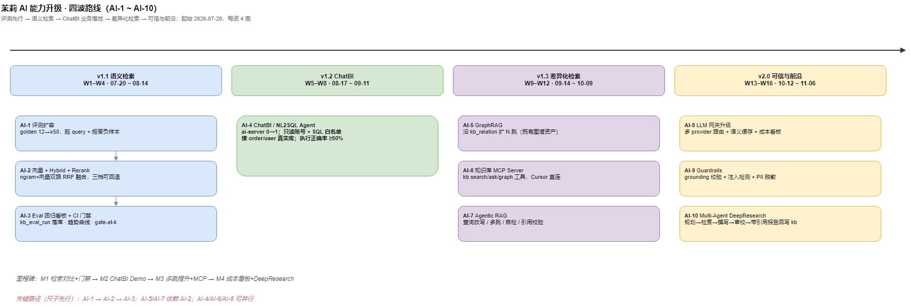

# AI 能力演进路线（RAG 升级 + ChatBI + Agent 基础设施）

> 更新：2026-07-20 · 状态：**M4 收官**（AI-1～AI-10 全部 ✅ · 2026-07-20）
> 归属：跨 **`moli-knowledge`**（检索/评测/网关）与 **`moli-ai`**（ChatBI 0→1）
> 边界：只管 **AI 能力演进**（检索、Agent、评测、LLM 网关）；知识内容管道运维见 [`kb-ops-roadmap.md`](kb-ops-roadmap.md)；BI v1 骨架见 [`ai-module-overview.md`](ai-module-overview.md)
> 前置阅读：[`knowledge-module-overview.md`](knowledge-module-overview.md) · `moli-knowledge/kb/ROADMAP.md` §五（检索升级触发条件）

---

## 1. 背景与定位

知识库的 RAG 基线（chunk 切段 → ngram 全文召回 → LLM 生成带引用答案 → golden 评测）已经闭环，
但对照 2026 年企业级 LLM 应用的主流形态，仍有三个结构性缺口：

1. **检索只有 MySQL ngram 全文**：无向量/语义召回、无 Hybrid、无 Rerank —— 语义改写类 query 召回不稳。
2. **`/kb/ask` 是单轮 retrieve→answer**：无查询改写、多跳检索、答案自检 —— 复杂/跨页问题能力有限。
3. **`moli-ai-server`（服务名 ai-server）是占位骨架**：只有 `AiApplication` + `AiController`，而平台里有 order/user 真实业务库可接。

> 源文件：[moli-ai-capability-roadmap.drawio](../diagrams/moli-ai-capability-roadmap.drawio) · 配套：产品 [`../product/ai-capability-prd.md`](../product/ai-capability-prd.md) · 排期 [`ai-capability-schedule.md`](ai-capability-schedule.md)

本路线把演进拆成 **10 个任务（AI-1 ~ AI-10）、四波执行**，原则：

- **先把尺子做准**（评测扩容）再动检索，每一波都有「升级前后指标对比」作为验收；
- **不推倒重来**：全部构建在现有 `KbAskService` / `KbLlmClient` / `eval_ask.py` / Shiro+Dubbo 底座之上；
- **知识图谱是既有资产**：`kb_relation` / `edges.jsonl` 已成体系，GraphRAG 直接复用而非从零建图。

---

## 2. 现状盘点

### 2.1 已具备（不重复建设）

| 能力 | 代码 / 数据 | 状态 |
|------|-------------|------|
| RAG 问答（检索式 + 生成式带引用） | `KbAskServiceImpl` · `/kb/ask` | ✅ |
| 引用与 LLM 上下文分离控制 | `KbAskProperties`（`citationTopK` / `llmContextTopK` / `llmContextMaxChars`） | ✅ 2026-07-16 |
| Chunk 切段 | `chunk_split.py` · `kb_document_chunk` | ✅ |
| LLM 网关 | `KbLlmClient`（DB 配置优先 + yaml 兜底 + `kb_llm_call_log`） | ✅ |
| 知识图谱关系 | `kb_relation` + `graph/edges.jsonl` + `KbWikiGraphService` | ✅（仅用于展示，未进检索） |
| 检索评测 | `golden.jsonl`（12 题）+ `eval_ask.py`（hit@1/3/5/8、MRR、coverage、`--gate-at-k` 门禁） | ✅ 框架就绪，样本偏小 |
| 可观测 | `KbOpsService` 看板（LLM 调用趋势 / Sync / Lint） | ✅ |
| 多空间 + 权限 | `KbSpace` + Shiro + Dubbo ACL | ✅ |

### 2.2 缺口（= 本路线的任务来源）

| # | 缺口 | 影响 | 对应任务 |
|---|------|------|----------|
| G1 | 无向量/Hybrid/Rerank（服务端代码零 embedding） | 语义 query 召回缺失；`kb/ROADMAP.md` §五 ③ 的「向量库（语义）」一直停在规划 | AI-2 |
| G2 | golden 仅 12 题，hit@3 100% 属小样本，不足以支撑检索改造的回归判断 | 改造效果无法可信度量 | AI-1 / AI-3 |
| G3 | `/kb/ask` 单轮，无改写/多跳/自检 | 口语化、跨页、多跳问题效果差 | AI-7 |
| G4 | 图谱关系未参与检索 | 既有 `kb_relation` 资产闲置 | AI-5 |
| G5 | ai-server 空壳 | 平台缺「AI 接真实业务数据」场景 | AI-4 |
| G6 | LLM 网关单 provider 直连，无路由/缓存/成本看板 | 成本与可用性不可控 | AI-8 |
| G7 | 答案无 grounding 校验、输入无注入/PII 防护 | 企业级可信欠缺 | AI-9 |
| G8 | `/kb/ask` 无多轮会话、无用户级长短期记忆 | 指代接不上、跨天无记忆；对照岗位 Agent 底座缺口 | AI-11 |

---

## 3. 任务总表

| 任务 | 名称 | 层级 | 难度 | 依赖 | 状态 |
|------|------|------|------|------|------|
| **AI-1** | golden 评测集扩容（12 → 50~100 题，含脏 query 与拒答负样本） | 评测 | ★☆ | — | ✅ done（2026-07-17 · golden 59 题） |
| **AI-2** | 向量检索 + Hybrid Search + Rerank | 检索 | ★★☆ | AI-1 | ✅ done（2026-07-19 Opus 签核 · hybrid hit@3 0.8958 / +10.4pp；[契约](contracts/AI-2-contract.md)） |
| **AI-3** | Eval 回归看板（评测结果落库 + `KbOpsService` 展示 + CI 门禁） | 评测 | ★★ | AI-1 | ✅ done（[AI-3 契约](contracts/AI-3-contract.md) §6 全绿）：`kb_eval_run` 落库 + `retrievalQuality` 三档卡片 + `kb-eval.yml` ngram 阻断门禁 |
| **AI-4** | ChatBI / NL2SQL Agent（ai-server 0→1，接 order/user 真实库） | 应用 | ★★★★ | — | ✅ done（[AI-4 契约](bi-chatbi-nl2sql-contract.md) §5 W5–W8 全签核）：AST 白名单校验器 31/31 绿（含 B1 绕过回归）+ SSE 身份修复 + 只读执行 + 评测拦截 100% |
| **AI-5** | GraphRAG（检索时沿 `kb_relation` 扩 N 跳） | 检索 | ★★★☆ | AI-2 | ✅ done（2026-07-20 Opus 签核 · [AI-5 契约](contracts/AI-5-contract.md)）：multi-hop 非回归 Δ0 + 全集 hit@3 +6.25pp；protect-topK/hub 惩罚 + M28/`detectScope`） |
| **AI-6** | 知识库 MCP Server（`kb.search` / `kb.ask` / `kb.graph` 工具） | 基建 | ★★ | — | ✅ done（2026-07-20 Opus 签核 · [AI-6 契约](contracts/AI-6-contract.md)）：`moli-knowledge/mcp/` 三只读工具 + token 透传 + smoke 绿） |
| **AI-7** | Agentic RAG（查询改写 / 多跳 / 答案自检 / 引用校验） | 检索 | ★★★ | AI-2 | ✅ done（2026-07-20 Opus 签核 · [AI-7 契约](contracts/AI-7-contract.md)）：dirty+multi-hop hit@3 +5pp / coverage +7.72pp / 延迟 2.43×） |
| **AI-8** | LLM 网关升级（多 provider 路由 + 语义缓存 + 成本看板） | 基建 | ★★★ | — | ✅ done（2026-07-20 Opus 签核 · [AI-8 契约](contracts/AI-8-contract.md)）：failover 路由 + Redis 语义缓存 + Ops 成本/命中率） |
| **AI-9** | Guardrails（grounding 校验 + 注入检测 + PII 脱敏） | 可信 | ★★★ | AI-7 | ✅ done（2026-07-20 Opus 签核 · [AI-9 契约](contracts/AI-9-contract.md)）：注入金样 20/20 · PII · grounding VO · 默认关零回归） |
| **AI-10** | Multi-Agent DeepResearch（主题 → 大纲 → 检索 → 撰写 → 审校 → 带引用报告，可回写 kb） | 应用 | ★★★★ | AI-2/5 | ✅ done（2026-07-20 Opus 签核 · [AI-10 契约](contracts/AI-10-contract.md)）：四 Agent + `/kb/research` SSE + Ingest 回写 outputs/ · M4 收官） |
| **AI-11** | 对话会话 + 上下文打包 + 用户长短期记忆 | 应用 | ★★★ | AI-8/9 | 🔜 规划（[kb-agent-session-memory.md](kb-agent-session-memory.md)）：`/kb/chat` 不改 `/kb/ask`；记忆与 wiki 向量隔离 |

> 状态图例：🔜 即将开工 · 🔵 排队 · ⚪ 远期 · ✅ 完成。完成后在本表回填并链接方案文档。

---

## 4. 分波执行计划

### 第 1 波 · 把尺子做准，再补最大缺口（AI-1 → AI-2 → AI-3）

> 顺序刻意为「评测先行」：没有足够样本，检索改造的对比数据不可信。

**AI-1 golden 扩容**

- 来源：`kb_qa_log` 真实提问沉淀 + 已有 12 题换说法改写 + 口语化/含错别字/跨语种脏 query + 5~10 条「知识库无据应拒答」负样本。
- 按空间分层（wiki-moli / enterprise-kb），标注 `expected_docs` 与难度标签（`easy/paraphrase/dirty/multi-hop/negative`）。
- 验收：≥50 题；跑出扩容后的**基线报告**（作为 AI-2 的对照组）。

**AI-2 向量 + Hybrid + Rerank**

- 方案：Python 检索 sidecar（FastAPI + bge-m3 embedding + Chroma/本地向量索引），或 `kb_document_chunk` 增加 embedding 列由 Java 侧计算余弦——以 sidecar 为首选（模型生态在 Python）。
- 召回改造：`KbAskServiceImpl` 召回改「ngram 全文 + 向量」双路 → RRF 融合 →（可选）bge-reranker 精排 top-N。
- 配置开关：`kb.search.*` 支持 `ngram-only / hybrid / hybrid+rerank` 三档，可随时回退。
- 验收：同一 golden 集上输出三档对比表（hit@1/3/5、MRR、平均延迟）；hybrid 相对 ngram 的 hit@3 不回退、语义改写子集显著提升。

**AI-3 Eval 回归看板**

- `eval_ask.py` 报告落库（新表 `kb_eval_run`），`KbOpsService` 加「检索质量趋势」卡片。
- CI 集成：`--gate-at-k 3 --min-hit <基线>` 作为回归门禁。
- 验收：每次检索相关改动，看板可见指标曲线，CI 可拦截回退。

**交付物**：`docs/design/kb-hybrid-retrieval.md` 方案 + `docs/diagrams/moli-kb-hybrid-retrieval.drawio`（检索双轨架构图，按 `@drawio-diagrams` 出 PNG）+ `docs/api/KNOWLEDGE_API.md` 增量 + `wiki-moli/develop/` enrich。

### 第 2 波 · ai-server 0→1：ChatBI / NL2SQL Agent（AI-4）

- 场景：自然语言 → 理解 order/user 库 schema → 生成 SQL → 校验 → 执行 → 结果 + 图表 + 解读。
- 安全铁律：**只读账号 + SQL 白名单校验（AST 解析，禁 DML/DDL）+ 行数/超时限制 + 审计日志**；鉴权复用 Shiro（与 order 一致：session 由 user-center 签发）。
- 架构：`ai-server`（Java 壳：API/鉴权/审计/结果缓存）+ Python Agent sidecar（LangGraph：schema 检索 → SQL 生成 → 自纠错重试 → 解读）；LLM 走 `KbLlmClient` 同款「DB 配置优先」模式或复用平台 LLM 配置表。
- 评测：建 `bi/eval/nl2sql_testset.jsonl`（30 题：单表/联表/聚合/时间窗/应拒绝），指标 = SQL 执行正确率 + 拒答正确率。
- 验收：网关 `/AiServer/**` 走通端到端 Demo；测试集执行正确率 ≥80%；危险 SQL 100% 拦截。
- 交付物：`docs/design/bi-chatbi-nl2sql.md` + `docs/diagrams/moli-ai-chatbi-flow.drawio` + `docs/api/ai-api.md` 扩充 + `ai-module-overview.md` §6 状态回填。

### 第 3 波 · 差异化检索 + Agent 互操作（AI-5 / AI-6 / AI-7）

**AI-5 GraphRAG**

- 检索时先经 AI-2 hybrid 定位入口页，再沿 `kb_relation`（`links_to/related/supersedes`）扩 1~2 跳，关联页按边类型加权并入候选；`KbWikiGraphService` 已有遍历基础。
- 验收：在 golden 的 `multi-hop` 子集上对比「hybrid vs hybrid+graph」，多跳题 hit@3 有可量化提升。

**AI-6 MCP Server**

- 将 `kb.search` / `kb.ask` / `kb.graph` 包装为 MCP 工具（复用现有 REST），Cursor / Claude 等客户端可直连 moli 知识库。
- 验收：Cursor 中通过 MCP 完成一次带引用问答的演示；工具鉴权走现有 token 体系。

**AI-7 Agentic RAG**

- 在 `KbAskService` 之上加编排层：① LLM 改写/拆解 query → ② 多轮检索（hybrid/graph）→ ③ 生成 → ④ 自检「每条陈述是否被引用支撑」，不足则回补检索一轮。
- 全程写 trace（复用 `kb_qa_log` 扩展或新表），单轮/Agentic 可配置切换。
- 验收：`dirty` + `multi-hop` 子集上对比单轮 vs Agentic 的 hit@k 与引用覆盖率；平均延迟增幅可控（<2×）。

### 第 4 波 · 企业级可信与前沿（AI-8 / AI-9 / AI-10）

- **AI-8**：`KbLlmClient` 升级多 provider 路由（成本/延迟/可用性 + 失败降级）；Redis 语义缓存（相似问命中）；`KbOpsService` 加成本与缓存命中率看板。
- **AI-9**：答案生成后 grounding 校验（无据陈述标低置信）、输入侧 Prompt 注入检测与 PII 脱敏；输出幻觉率/引用覆盖率前后对比。
- **AI-10**：基于知识库的 Multi-Agent 调研报告（Planner/Retriever/Writer/Reviewer），产物走现有 Ingest 流程回写 `wiki-moli/develop/outputs/`。

---

## 5. 里程碑

| 里程碑 | 内容 | 验收标志 |
|--------|------|----------|
| M1 | AI-1 + AI-2 + AI-3 | golden ≥50 题；三档检索对比表产出；回归看板 + CI 门禁生效 |
| M2 | AI-4 | ChatBI 端到端 Demo；NL2SQL 测试集正确率 ≥80%；安全拦截 100% |
| M3 | AI-5 + AI-6 + AI-7 | 多跳/脏 query 子集指标提升可量化；MCP 演示可复现 |
| M4 | AI-8 + AI-9 + AI-10 | ✅ 收官（2026-07-20）：成本看板 · Guardrails 引用覆盖对比 · DeepResearch Ingest 回写 |

每个里程碑完成后：更新本文件任务总表状态 → 更新根 `README.md` 指标区 → 对应 wiki-moli 页 enrich + sync。

---

## 6. 模块归属与新建项目

大部分任务**复用现有 Maven 模块**，仅需新建 **2 个 Python sidecar**（Java Maven 装不下 embedding/rerank 模型栈）。

| 任务 | 归属项目 | 是否新建 |
|------|----------|----------|
| AI-1 评测扩容 | `moli-knowledge/kb/tools/` · `kb/eval/`（现有 Python） | 否 |
| AI-2 向量+Hybrid+Rerank | `moli-knowledge-server`（Java 编排）+ **`moli-knowledge/kb-retrieval/`** | **新建 sidecar** |
| AI-3 Eval 看板+门禁 | `moli-knowledge-server`（`KbOpsService`）+ `kb/tools` + 新表 `kb_eval_run` | 否 |
| AI-4 ChatBI/NL2SQL | `moli-ai/moli-ai-server`（artifactId `moli-ai-server`，服务名 `ai-server`，Java 壳）+ **`moli-ai/moli-ai-server/ai-agent/`** | **新建 sidecar** |
| AI-5 GraphRAG | `moli-knowledge-server`（复用 `KbWikiGraphService`） | 否 |
| AI-6 MCP Server | `moli-knowledge/` 下新增薄 `mcp/`（复用 REST + 鉴权） | 目录级 |
| AI-7 Agentic RAG | `moli-knowledge-server` + `kb-retrieval` sidecar | 否 |
| AI-8 LLM 网关升级 | `moli-knowledge-server`（`KbLlmClient`） | 否 |
| AI-9 Guardrails | `moli-knowledge-server` | 否 |
| AI-10 DeepResearch | `moli-knowledge`（Python）+ 现有 Ingest 链路 | 否 |

**两个 sidecar 就近归属、部署分离**：

| sidecar | 目录 | 职责 | 为何独立 |
|---------|------|------|----------|
| `kb-retrieval` | `moli-knowledge/kb-retrieval/` | embedding / 向量检索 / rerank | 服务知识检索；被 AI-2/5/7 与 ChatBI schema 检索复用 |
| `ai-agent` | `moli-ai/moli-ai-server/ai-agent/` | schema 检索 / NL→SQL / 结果解读 | **会访问业务库、安全域不同**，不与知识检索混进同一进程 |

> 两者可共用同一 bge 模型依赖库，但**独立部署**。Java 侧经 HTTP 调用；sidecar 无状态、可重启、故障时 Java 自动降级。

---

## 7. ChatBI 与知识库问答的边界（不冲突，互补）

ChatBI（AI-4）与现有智能问答（`/kb/ask`）是**两条独立赛道**，数据域、技术、模块、路由均不同，不存在功能冲突或数据竞争。

| 维度 | 智能问答 `/kb/ask` | ChatBI `/bi/chat/ask` |
|------|--------------------|------------------------|
| 模块 | `moli-knowledge` | `moli-ai/moli-ai-server`（服务名 ai-server） |
| 网关前缀 | `/KnowledgeServer` | `/AiServer` |
| 数据源 | **非结构化**：markdown wiki（`kb_document`/`kb_document_chunk`） | **结构化**：order/user 业务库 |
| 技术 | RAG 检索 + LLM 带引用 | NL2SQL → 校验 → 只读执行 → 图表 |
| 输出 | 带 `[[页slug]]` 引用的文字 | SQL + 数据表 + 图表 + 解读 |
| 写入铁律 | 只读 `kb_document` | 只读业务库（独立只读账号） |

**共用基础设施 = 正向复用，非冲突**：

- 都走 `KbLlmClient` 的「DB 配置优先 + yaml 兜底 + 调用日志」LLM 网关模式（AI-8 统一升级）。
- ChatBI 的 schema 检索复用 AI-2 的 `kb-retrieval` 向量能力，避免重复造轮子。

**边界铁律**：知识只在 `kb/wiki*` 产生；ChatBI 永不写库。若未来要做「单一入口自动判断查文档还是查数据」，需在上层加一个路由 Agent —— 属 v2+ 可选增强，当前两线各自独立、零冲突。

---

## 8. 约定与红线

1. **评测先行**：任何检索/生成改动，先跑 `eval_ask.py` 基线，改后对比，报告随 PR。
2. **可回退**：新检索能力一律配置开关（`kb.search.*` / `kb.ask.*`），默认档位变更需有对比数据支撑。
3. **安全**：ChatBI 只读账号 + 白名单是硬约束，不因 Demo 需要放松；LLM 永不直接拼接执行 SQL。
4. **文档配套**：每个任务落地时按仓库规则交付——`docs/design/` 方案 + draw.io 主图（`@drawio-diagrams`）+ `docs/api/` 契约增量 + `wiki-moli` enrich；禁止 ASCII/Mermaid 作主图。
5. **License**：参考外部开源实现时注意与 Apache-2.0 兼容；NC/无 License 项目只学思路、代码自行重写。

---

## 9. 相关文档

- **产品 PRD**：[`../product/ai-capability-prd.md`](../product/ai-capability-prd.md)
- **排期（Sprint 周计划）**：[`ai-capability-schedule.md`](ai-capability-schedule.md)
- **技术方案 · 混合检索（AI-1/2/3）**：[`kb-hybrid-retrieval.md`](kb-hybrid-retrieval.md)
- **技术方案 · ChatBI（AI-4）**：[`bi-chatbi-nl2sql.md`](bi-chatbi-nl2sql.md)
- 知识库模块总览：[`knowledge-module-overview.md`](knowledge-module-overview.md)
- 知识库内容管道运维：[`kb-ops-roadmap.md`](kb-ops-roadmap.md)
- BI 模块 v1 骨架：[`ai-module-overview.md`](ai-module-overview.md) · API：[`../api/ai-api.md`](../api/ai-api.md)
- 检索升级触发条件（kb 侧）：`moli-knowledge/kb/ROADMAP.md` §五
- 评测使用说明：`moli-knowledge/kb/eval/README.md`
- 知识库 API 契约：[`../api/KNOWLEDGE_API.md`](../api/KNOWLEDGE_API.md)
