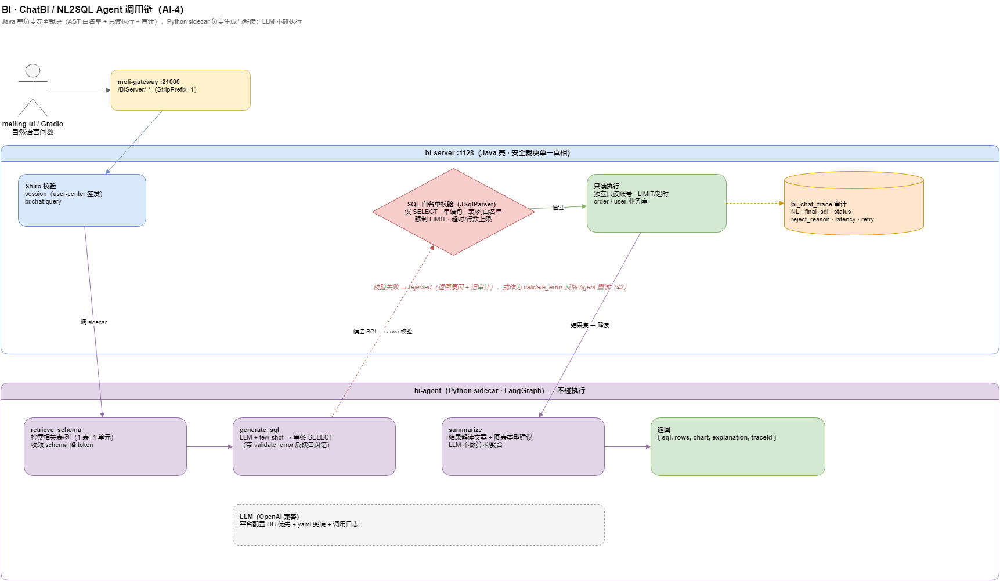

# BI · ChatBI / NL2SQL Agent（AI-4 技术设计）

> **状态**：design · 2026-07-17（未开工，bi-server 0→1）
> **产品 PRD**：[`docs/product/ai-capability-prd.md`](../product/ai-capability-prd.md) §4 P0 v1.2
> **路线总纲**：[`ai-capability-roadmap.md`](ai-capability-roadmap.md) §4 第 2 波
> **模块 v1 骨架**：[`bi-module-overview.md`](bi-module-overview.md) · [`../api/bi-api.md`](../api/bi-api.md)
> **架构图**：[`docs/diagrams/moli-bi-chatbi-flow.drawio`](../diagrams/moli-bi-chatbi-flow.drawio)
> **排期**：[`ai-capability-schedule.md`](ai-capability-schedule.md) W5–W8

---

## 1. 背景与目标

### 1.1 现状

`moli-ai/moli-ai-server`（artifactId `moli-ai-server`，Nacos 服务名 `bi-server`，HTTP **1128** / Dubbo **20883**，网关 `/BiServer/**`）目前仅
`BiApplication` + 占位 `BiController`（`GET /demo/test`）。平台已有 order/user 真实业务库，但只能靠人写 SQL 或等报表看数。

### 1.2 目标

把 bi-server 从占位骨架升级为 **ChatBI / NL2SQL Agent**：

> 自然语言问数 → 理解业务库 schema → 生成 SQL → 校验/纠错 → 只读执行 → 结果 + 图表 + 自然语言解读。

### 1.3 安全铁律（贯穿全设计，不可妥协）

1. **只读**：独立只读 DB 账号，无 DML/DDL 权限（数据库层强约束）。
2. **白名单**：SQL 经 AST 解析，仅允许 `SELECT`；库/表/列白名单校验；禁子查询写、禁多语句。
3. **限额**：强制 `LIMIT`、查询超时、扫描行数上限。
4. **审计**：每次问答的 NL / SQL / 结果摘要 / 耗时落 `bi_chat_trace`。
5. **鉴权**：Shiro session 由 user-center 签发（与 order 一致），bi 只校验；权限码 `bi:chat:query` / `bi:chat:trace`。

### 1.4 非目标（v1.2）

- 不做写操作、交易下单、跨库 JOIN 联邦查询。
- 不做自助建模/大屏（留 v2+）。
- 不做多轮复杂追问记忆（仅单问单答 + 同会话轻量上下文）。

---

## 2. 架构



> 源文件：[moli-bi-chatbi-flow.drawio](../diagrams/moli-bi-chatbi-flow.drawio)

### 2.1 分层（Java 壳 + Python Agent sidecar）

| 组件 | 职责 | 技术 |
|------|------|------|
| `bi-server`（Java） | API 入口、Shiro 鉴权、**SQL 白名单/AST 校验**、只读执行、结果缓存、`bi_chat_trace` 审计 | Spring Boot（现有骨架扩展） |
| `bi-agent`（Python sidecar，新增） | schema 检索、NL→SQL 生成、SQL 自纠错重试、结果解读文案、图表类型建议 | FastAPI + LangGraph |
| LLM | 生成与解读 | 复用平台 LLM 配置模式（DB 优先 + yaml 兜底 + 调用日志） |
| 只读数据源 | order / user 业务库 | 独立只读账号 |

> **校验放 Java**：LLM 生成的 SQL 一律回到 Java 侧做 AST 白名单校验 + 只读执行，**Python 不碰执行**——安全裁决单一真相。

### 2.2 请求链路

```
meiling-ui / Gradio
  → moli-gateway :21000  /BiServer/**（StripPrefix=1）
  → bi-server :1128（Shiro 校验 + bi:chat:query）
      → bi-agent（Python）：schema 检索 → 生成 SQL
      ← 候选 SQL
  → Java：AST 白名单校验 → 只读执行（LIMIT/超时）→ 结果集
  → bi-agent：结果解读 + 图表建议
  → 返回 {sql, rows, chart, explanation, traceId} + 写 bi_chat_trace
```

---

## 3. Agent 工作流（LangGraph）

**State**：
```python
class BiChatState(TypedDict):
    session_id: str
    question: str
    schema_context: list[dict]     # 检索到的相关表/列
    draft_sql: str
    validate_error: str | None     # Java 回传的校验/执行错误
    retry: int                     # 自纠错次数（上限 2）
    rows: list[dict]
    chart: dict                    # {type, x, y}
    explanation: str
    trace: list[dict]
```

**节点**：
```
START
 → retrieve_schema     # 向量/关键词检索相关表（复用 AI-2 检索能力思路）
 → generate_sql        # LLM + few-shot，输出单条 SELECT
 → [Java 校验+执行]     # 白名单失败/执行报错 → validate_error
 → need_retry?         # 有错且 retry<2 → 回 generate_sql（带错误反馈）
 → summarize           # 结果解读 + 图表类型建议
 → END
```

**关键原则**：
1. **LLM 不做算术/聚合**——交给 SQL 引擎，避免幻觉。
2. **schema 收敛**——只把检索到的相关表喂给 LLM，降 token、提准确率。
3. **自纠错有界**——最多重试 2 次，仍失败则返回"无法生成安全查询"并记录。

---

## 4. SQL 安全校验（Java 侧，核心）

| 校验 | 手段 | 拦截示例 |
|------|------|----------|
| 只读 | 只读账号（DB 层）+ AST 判定仅 `SELECT` | `UPDATE/DELETE/DROP/INSERT` |
| 单语句 | 禁分号多语句 | `SELECT ...; DROP ...` |
| 表/列白名单 | 解析引用表列，比对允许清单 | 查 `sys_user.password` |
| 限额 | 强制注入/校验 `LIMIT`，扫描行数/超时上限 | 全表扫描、笛卡尔积 |
| 注入 | 参数化 + AST（非字符串匹配） | 注释绕过、UNION 提权 |

SQL 解析用成熟库（如 JSqlParser）；校验失败直接拒绝并作为 `validate_error` 反馈给 Agent 重试。

---

## 5. 数据模型

### 5.1 新增审计表 `bi_chat_trace`（DDL 走 `docs/sql/` 迁移基线）

| 字段 | 说明 |
|------|------|
| `id` | 主键 |
| `session_id` | 会话 |
| `user_id` | 提问者 |
| `question` | 自然语言 |
| `final_sql` | 最终执行 SQL（拒绝则为空） |
| `status` | success / rejected / error |
| `reject_reason` | 校验拒绝原因 |
| `row_count` / `latency_ms` | 结果行数 / 耗时 |
| `retry` | 自纠错次数 |
| `created_at` | — |

### 5.2 元数据（schema 检索用）

- 从只读库 `information_schema` 抽取表/列/注释，按"1 表 = 1 检索单元"建索引（复用 AI-2 向量检索）。
- 白名单清单以配置维护（`bi.chat.allow-tables`），不依赖 LLM 自由发挥。

---

## 6. API（FastAPI 侧 sidecar + Java 对外）

对外（经网关 `/BiServer/**`）：

| 方法 | 路径 | 说明 |
|------|------|------|
| POST | `/bi/chat/ask` | 提问 → {sql, rows, chart, explanation, traceId}（可 SSE 流式） |
| GET | `/bi/chat/trace/{traceId}` | 查看决策链路（`bi:chat:trace`） |
| GET | `/bi/chat/schema` | 可查询的表/字段白名单（脱敏） |

详细契约在实现时补进 [`docs/api/bi-api.md`](../api/bi-api.md)。

---

## 7. 评测

- 建 `bi/eval/nl2sql_testset.jsonl`（≥30 题）：单表 / 联表 / 聚合 / 时间窗 / **应拒绝**（越权、写操作、模糊到无法生成）。
- 指标：**SQL 执行正确率**（结果集与标准答案一致）+ **拒答正确率**（危险/不可答题被正确拒绝）。
- 沿用 eval 套路，可并入 AI-3 看板。

---

## 8. 验收

- [ ] 端到端 Demo：`/BiServer/**` 自然语言 → SQL → 结果 + 图表 + 解读
- [ ] NL2SQL 测试集执行正确率 ≥80%
- [ ] 危险 SQL（写操作/越权/多语句/超量）**100% 拦截**，`bi_chat_trace` 可查
- [ ] 鉴权走 Shiro（session user-center 签发）；`bi:chat:*` 权限码 enforce
- [ ] sidecar 故障时优雅报错，不暴露连接细节

---

## 9. v2+ 演进（本设计之后）

| 阶段 | 能力 |
|------|------|
| v2 | 多轮追问记忆、图表下钻、常用问法收藏 |
| v2+ | 数据集元数据管理、权限域隔离、对接 ES/MinIO |
| v3 | 大屏、订阅推送（见 [`bi-module-overview.md`](bi-module-overview.md) §6） |

---

## 10. 相关

- 模块 v1 骨架：[`bi-module-overview.md`](bi-module-overview.md)
- 路线总纲：[`ai-capability-roadmap.md`](ai-capability-roadmap.md)
- PRD：[`../product/ai-capability-prd.md`](../product/ai-capability-prd.md)
- 排期：[`ai-capability-schedule.md`](ai-capability-schedule.md)
- LLM 配置模式参考：[`kb-llm-platform-settings.md`](kb-llm-platform-settings.md)
