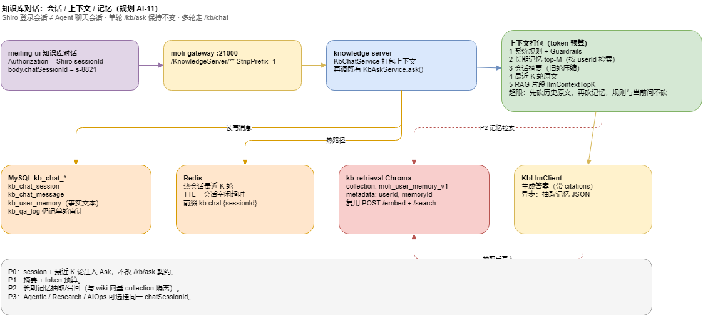

# 知识库对话：会话、上下文与长短期记忆（规划）

> 状态：design · 2026-09-03  
> 建议任务号：**AI-11**（AI-1～10 已收官；本波补「多轮对话」缺口）  
> 范围：`moli-knowledge-server` + meiling-ui 知识库问答；**不**引入 AgentScope / Spring AI / LangChain4j  
> 栈约束：Java 8、Spring Boot 2、既有 `KbAskService` / `KbLlmClient` / `kb-retrieval`



> 源文件：[moli-kb-agent-memory.drawio](../diagrams/moli-kb-agent-memory.drawio)（若 PNG 未导出，用 diagrams.net 打开源文件）

---

## 1. 问题

今日 `/kb/ask` 是**单轮**：请求里只有 `question`，下一句不知道上一句。`kb_qa_log` 是审计流水，不是会话。Shiro `sessionId` 只证明登录身份。

缺的三块：

| 能力 | 缺什么 |
|------|--------|
| 会话管理 | 没有 `chatSessionId`，无法挂多轮消息、列表、关闭 |
| 短期记忆 | 最近 N 轮不会自动进入 prompt |
| 上下文管理 | 没有 token 预算、旧轮摘要、超长裁剪 |
| 长期记忆 | 没有「按用户抽取事实、下次检索再注入」；wiki 是组织知识，不是用户记忆 |

**非目标**：改登录态；把 wiki 当用户记忆；金融级记忆审计；Java 21 / Boot 3 升级。

**不变量**：`POST /kb/ask` 请求/响应语义不变。多轮只走新 API；Ask 仍可被 Chat 内部调用。

---

## 2. 分层（与登录会话拆开）

```
Shiro sessionId     → 你是谁（已有）
kb_chat_session.id  → 这是哪一次聊天
kb_chat_message     → 这一次里说过什么（短时）
kb_user_memory      → 跨聊天还要记住的事实（长时）
上下文打包器         → 这一次 LLM 调用塞哪些 token
```

---

## 3. 数据（建议增量 SQL，落地时走 `@sql-migration-baseline`）

**`kb_chat_session`**

| 列 | 说明 |
|----|------|
| id | 雪花；对外 `chatSessionId` |
| user_id | 必填，= Shiro 用户 |
| space_id | 可空；会话默认检索空间 |
| title | 首问截断或 LLM 短标题 |
| summary | P1：旧轮压缩摘要 |
| status | 1 进行中 / 0 已关闭 |
| last_message_at | 列表排序 |
| 审计 + is_delete | 与现表一致 |

**`kb_chat_message`**

| 列 | 说明 |
|----|------|
| id | 雪花 |
| session_id | FK 逻辑 |
| role | user / assistant / system_note |
| content | 原文 |
| qa_log_id | 可空，链到既有 `kb_qa_log` |
| token_est | 估算，供预算 |
| create_time | |

**`kb_user_memory`**（P2）

| 列 | 说明 |
|----|------|
| id | 雪花 |
| user_id | 隔离边界 |
| kind | episodic / semantic / procedural |
| text | 一条可检索事实（短） |
| source_session_id | 可空 |
| salience | 0–1，衰减用 |
| expires_at | 可空 |
| content_hash | 去重 |

向量：**单独** Chroma collection（如 `moli_user_memory_v1`），metadata 含 `userId` + `memoryId`。禁止写入 wiki 的 `moli_kb_chunks_bgem3_v1`，避免组织知识与个人记忆混检索。

Redis（可选热路径）：`kb:chat:{sessionId}:tail` 存最近 K 条 JSON，TTL = 空闲超时（如 24h）。Miss 回源 MySQL。

---

## 4. API（均挂 `/kb/chat`，权限复用 `kb:ask` 或新码 `kb:chat`）

| 方法 | 路径 | 说明 |
|------|------|------|
| POST | `/kb/chat/sessions` | 创建会话（可带 spaceId） |
| GET | `/kb/chat/sessions` | 当前用户列表 |
| GET | `/kb/chat/sessions/{id}/messages` | 翻页历史 |
| POST | `/kb/chat/sessions/{id}/messages` | **多轮提问**（核心） |
| POST | `/kb/chat/sessions/{id}/close` | 关闭；P2 触发记忆抽取 |

`POST .../messages` 体：与 `AskRequest` 对齐的检索字段（spaceIds、useLlm、retrievalStrategy、graphExpand）+ `question`。服务端：

1. 校验 session 属于当前 user  
2. 写入 user 消息  
3. **打包上下文**（§5）→ 调 `KbAskService.ask`（question 可改写为「带历史的检索 query」，原文仍入库）  
4. 写入 assistant 消息 + `qa_log_id`  
5. 返回 Ask 同构的 answer/citations，外加 `chatSessionId`、`messageId`

P0 检索 query：用「最近 1 轮摘要 + 本轮问题」做召回，避免只搜「那下一步呢」。生成 prompt 才带完整历史。

---

## 5. 上下文打包（P0 简版 → P1 完整预算）

优先级从高到低，超 `kb.chat.max-prompt-tokens`（默认如 6k）则砍低优先级：

1. 系统规则（Ask 现有 +「可使用下列会话摘录，事实仍以检索片段为准」）  
2. 本轮用户问题  
3. RAG 片段（`llmContextTopK`，幻觉约束仍靠引用）  
4. P2 长期记忆 top-M（默认 3）  
5. `session.summary`  
6. 最近 K 轮原文（默认 K=6，user+assistant 各算一轮）

P0 只做 1+2+3+6，K=6，超长从最旧一轮删。  
P1 加：每满 12 轮用 LLM 把更早内容滚进 `summary`（只增补，带日期）。

**幻觉**：历史只当指代消解（「那个网关」= 上一轮的 moli-gateway），数字/结论仍须 citations。Guardrails 在打包后、调 LLM 前照旧走。

---

## 6. 长期记忆（P2）

**写入**（会话关闭或每 N 轮异步）：

- Prompt：从本会话抽出 ≤5 条「对用户以后有用的事实」，JSON 数组；禁止把检索到的 wiki 原文当用户记忆  
- 过滤：PII 走既有脱敏；空/重复 `content_hash` 跳过  
- 同时写 MySQL + sidecar `/embed`

**读出**（每次 messages）：

- `POST /search`，`filter.userId` 必须等于当前用户  
- 与 RAG 分栏进入 prompt：`[用户记忆]` vs `[知识库片段]`

**衰减**：30 天未命中则 `salience` 下调；低于阈值不再召回（行保留可人工）。

---

## 7. 分期与验收

| 阶段 | 做 | 验收 |
|------|----|------|
| **P0** 会话 + 短时 | 表 + CRUD + messages 注入最近 K 轮；UI 对话页带 session | 两轮：「502 查哪」→「日志 connection refused」第二轮答里出现网关/上游，且 `/kb/ask` 单测零回归 |
| **P1** 预算 + 摘要 | token 估算、滚摘要、配置项 | 20 轮后 prompt 仍低于预算；摘要含早期结论 |
| **P2** 长时 | 抽取 + 独立 collection + 召回 | 新 session 问「昨天那个网关」能带出记忆条；搜不到别人的记忆 |
| **P3** 挂接 | Agentic/Research 可选 `chatSessionId`；AIOps 不强制 | 同一会话里先 Ask 再 agentic 不丢指代 |

评测：`eval_ask.py` **默认不带 session**（避免污染 hit@3）。另做 `eval/chat_memory.jsonl`：2～4 轮脚本，断言第二轮 citations 或答案关键词。不纳入 ngram CI 阻断，直到稳定。

---

## 8. 前端

知识库问答页：会话列表 | 消息流 | 发送走 `/kb/chat/sessions/{id}/messages`。  
「新对话」= POST sessions。旧「单次提问」可保留直连 `/kb/ask`（调试/评测）。

---

## 9. 风险

| 风险 | 处理 |
|------|------|
| 历史把错误结论带进下一轮 | Prompt 写明事实以 citations 为准；P2 抽取人工可删 |
| 记忆泄漏到他人 | 所有查询强制 `user_id = 当前用户`；Chroma filter 同等 |
| sidecar 挂了 | P2 降级：只读 MySQL LIKE/最近条，或跳过长时 |
| 与语义缓存冲突 | AI-8 缓存 key 须含 `chatSessionId` 或 Chat 路径禁用语义缓存 |

---

## 10. 建议开工顺序

1. 本方案确认（表名、K、是否新权限码）  
2. `docs/sql/42_kb_chat_session.sql` 增量 + 合并基线  
3. Java `KbChatController` / `KbChatService`（P0）  
4. meiling-ui 对话壳  
5. P1/P2 按上表

未确认前不改 `/kb/ask`、不改 golden 门禁。
