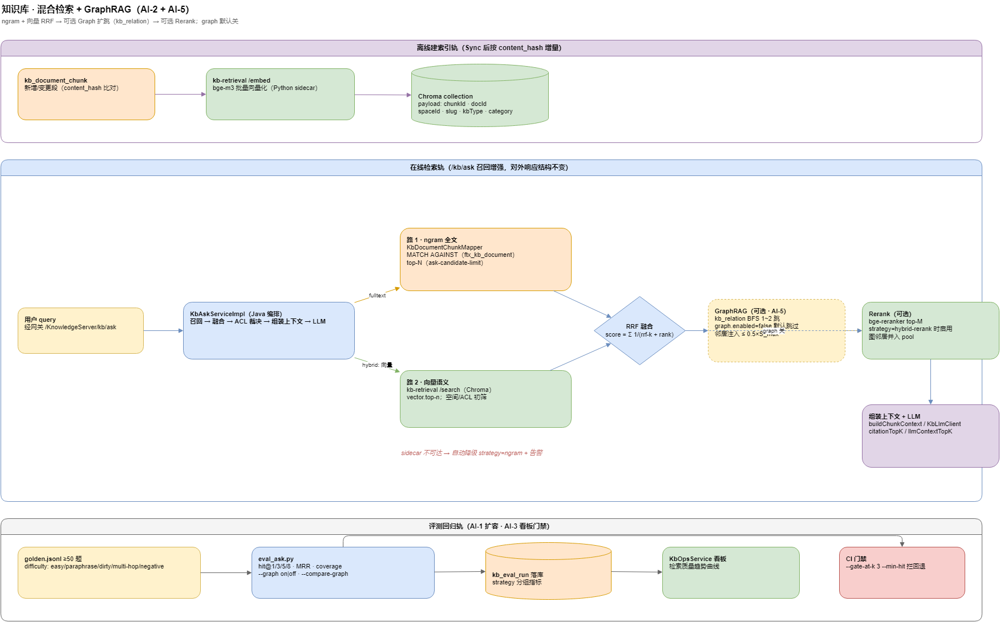
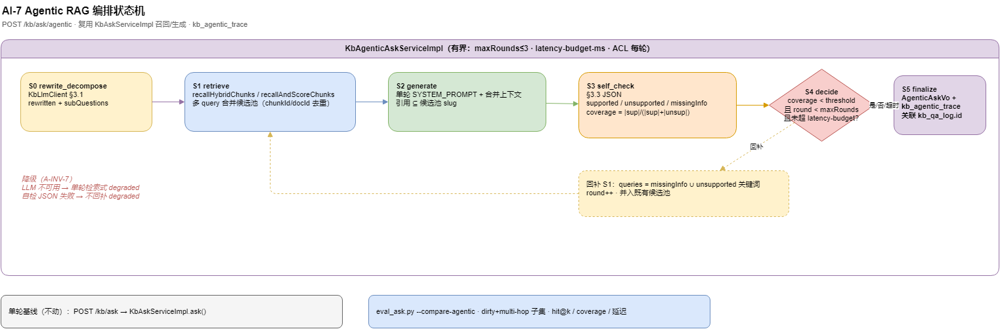

# 知识库 · 混合检索 + 评测升级（AI-1/2/3 技术设计）

> **状态**：design · 2026-07-17（未开工）
> **产品 PRD**：[`docs/product/ai-capability-prd.md`](../product/ai-capability-prd.md) §4 P0
> **路线总纲**：[`ai-capability-roadmap.md`](ai-capability-roadmap.md) §4 第 1 波
> **架构图**：[`docs/diagrams/moli-kb-hybrid-retrieval.drawio`](../diagrams/moli-kb-hybrid-retrieval.drawio)
> **API 契约（实现时补章）**：[`docs/api/KNOWLEDGE_API.md`](../api/KNOWLEDGE_API.md)
> **排期**：[`ai-capability-schedule.md`](ai-capability-schedule.md) W1–W4

---

## 1. 背景与目标

### 1.1 现状（2026-07-17）

| 环节 | 实现 | 位置 |
|------|------|------|
| 文档召回 | MySQL ngram 全文 `MATCH AGAINST`（`ftx_kb_document`），失败降级 LIKE | `KbDocumentMapper.searchFullText` · `KbSearchProperties.mode` |
| chunk 召回 | `kb_document_chunk` 按段 ngram 全文召回 top-N | `KbDocumentChunkMapper` · `kb.search.chunk-enabled=true` |
| 候选精排 | 内存 bigram 打分，召回上限 `kb.search.ask-candidate-limit`（默认 100） | `KbAskServiceImpl` |
| 生成 | `KbLlmClient` 带引用作答；`citationTopK` / `llmContextTopK` / `llmContextMaxChars` 分离控制 | `KbAskServiceImpl` · `KbAskProperties` |
| 评测 | `golden.jsonl`（12 题）+ `eval_ask.py`（hit@1/3/5/8、MRR、coverage、`--gate-at-k`） | `kb/tools/eval_ask.py` |

**已知短板**（`kb/eval/README.md` 首次基线记录）：未命中题的共性是"**问题换说法与页标题词面不重合**"——正是纯词面全文检索的固有缺陷。



> 源文件：[moli-kb-hybrid-retrieval.drawio](../diagrams/moli-kb-hybrid-retrieval.drawio)

### 1.2 目标

1. **AI-1**：把 golden 从 12 题扩到 ≥50 题，覆盖脏 query 与拒答负样本，作为可信基线。
2. **AI-2**：在 ngram 全文之外增加**向量语义召回**，两路 **RRF 融合**，可选 **Rerank** 精排；全部以 `kb.search.*` 开关控制、可回退。
3. **AI-3**：评测结果**落库 + 看板 + CI 门禁**，让检索改动可回归、防退化。

### 1.3 非目标

- 不引入 ES/Milvus 集群；向量存储用轻量方案（见 §3 选型）。
- 不改动 wiki→DB 单向同步铁律；embedding 是 DB 侧派生数据，不回写 wiki。
- 不改 `/kb/ask` 对外响应结构（citations/answer 字段不变），仅内部召回增强。

---

## 2. AI-1 评测集扩容

### 2.1 样本构成（目标 ≥50，理想 100）

| 类别 | 标签 | 数量建议 | 来源 |
|------|------|----------|------|
| 直问（词面命中） | `easy` | 15 | 现有 12 题保留 + 补 |
| 换说法/近义 | `paraphrase` | 15 | 对 easy 题改写提问 |
| 口语化/含错别字 | `dirty` | 10 | 手工造 + `kb_qa_log` 真实脏问 |
| 跨页/多跳 | `multi-hop` | 8 | 需综合 2+ 页才能答 |
| 应拒答（无据） | `negative` | 7 | 知识库确无内容，期望"暂无相关内容" |

### 2.2 golden.jsonl 字段扩展

现有：`id / space / question / expect_slugs / expect_keywords / note`。新增：

```jsonc
{
  "id": "P01",
  "space": "moli-ops-manual",
  "question": "知识库啥时候得换成 meili 那个搜索啊",   // dirty + paraphrase
  "expect_slugs": ["develop/知识库-meilisearch接入规划"],
  "expect_keywords": ["ngram"],
  "difficulty": "dirty",          // 新增：easy|paraphrase|dirty|multi-hop|negative
  "expect_answerable": true,       // 新增：false 时期望拒答，命中判定反转
  "note": "语义换说法 + 口语"
}
```

### 2.3 eval_ask.py 增强

- 读取 `difficulty` 分组，报告按难度分层输出 hit@k（现有 `STANDARD_HIT_AT=(3,5,8)` 复用）。
- `expect_answerable=false` 时，判定"是否正确拒答"（答案含"暂无/无相关"且无 citation），纳入 `refusal_accuracy`。
- 报告 JSON 增 `by_difficulty` 与 `refusal_accuracy` 字段（向后兼容）。

**验收**：golden ≥50 题、分层标注齐；跑出**扩容基线报告**存 `kb/eval/reports/`，作为 AI-2 对照组。

---

## 3. AI-2 向量 + Hybrid + Rerank

### 3.1 选型（两方案，默认 A）

| 方案 | 向量存储 | embedding/rerank | 适配 | 取舍 |
|------|----------|------------------|------|------|
| **A. Python 检索 sidecar（默认）** | Chroma（本地持久化） | bge-m3 embedding + bge-reranker-v2-m3，Python 直跑 | 新增 `kb-retrieval` FastAPI 服务，Java 经 HTTP 调 | 模型生态在 Python；不污染 Java 依赖；与未来 Agent sidecar 同栈 |
| B. Java 内嵌 | `kb_document_chunk` 加 `embedding` 列（MySQL/pgvector） | 调远程 embedding API，余弦在 SQL/内存算 | 不加新服务 | 无 rerank 生态；大向量在 MySQL 算余弦性能一般 |

> 选 A：与 AI-4 ChatBI 的 Python Agent sidecar 同一技术栈，一套 Python 服务化经验复用；rerank 模型只在 Python 侧可得。

### 3.2 数据流（离线建索引 + 在线检索）

**离线（Sync 后触发）**：
```
kb_document_chunk（新增/变更，按 content_hash 增量）
  → kb-retrieval /embed 批量向量化（bge-m3）
  → 写入 Chroma collection（payload: chunkId, docId, spaceId, slug, kbType, category）
```

**在线（/kb/ask 召回）**：
```
用户 query
  ├─ 路 1：MySQL ngram 全文（现有 searchFullText，top-N）
  └─ 路 2：kb-retrieval /search 向量召回（Chroma，top-N，带 ACL/空间 filter）
  → RRF 融合（Reciprocal Rank Fusion，score = Σ 1/(k+rank)）
  → （可选）bge-reranker 精排 top-M
  → 交给现有 buildContext / buildChunkContext 组装 → LLM
```

### 3.3 配置开关（扩展 `KbSearchProperties`，前缀 `kb.search`）

| 键 | 默认 | 说明 |
|----|------|------|
| `mode` | `fulltext` | 现有：fulltext / like |
| `ask-candidate-limit` | 100 | 现有：候选召回上限 |
| `chunk-enabled` | true | 现有：按 chunk 召回 |
| **`retrieval-strategy`** | `ngram` | **新增**：`ngram` / `hybrid` / `hybrid-rerank` 三档 |
| **`vector.base-url`** | — | 新增：kb-retrieval sidecar 地址 |
| **`vector.top-n`** | 20 | 新增：向量召回条数 |
| **`fusion.rrf-k`** | 60 | 新增：RRF 平滑常数 |
| **`rerank.top-m`** | 8 | 新增：rerank 保留条数 |

`retrieval-strategy=ngram` 时行为与现状完全一致（**零风险回退**）；sidecar 不可达时自动降级到 ngram 并告警。

### 3.4 服务边界

| 组件 | 职责 | 技术 |
|------|------|------|
| `moli-knowledge-server`（Java） | 召回编排、RRF 融合、ACL 过滤、组装上下文、LLM 调用、`kb_qa_log` | 现有 `KbAskServiceImpl` 扩展 |
| `kb-retrieval`（Python sidecar，新增） | `/embed` 批量向量化、`/search` 向量检索、`/rerank` 精排 | FastAPI + bge-m3 + bge-reranker + Chroma |

> ACL/空间过滤在 **Java 侧最终裁决**（sidecar filter 只做初筛），保持权限单一真相。

### 3.5 验收

- 三档可切换；`ngram` 档与现状逐题一致。
- 同一扩容 golden：`hybrid` 相对 `ngram` **完整集 hit@3 不回退**，`paraphrase`+`dirty` 子集 hit@3 显著提升。
- 产出 **三档对比表**（hit@1/3/5、MRR、P95 延迟）写入 README 指标区与本文件 §6。

---

## 4. AI-3 评测回归看板 + CI 门禁

> **状态：已落地（2026-07-19）** · 契约 [`contracts/AI-3-contract.md`](contracts/AI-3-contract.md)

### 4.1 结果落库 ✅

表 `kb_eval_run`（[`docs/sql/31_kb_eval_run.sql`](../sql/31_kb_eval_run.sql)）：

| 字段 | 说明 |
|------|------|
| `id` | 主键 |
| `run_at` | 运行时间 |
| `strategy` | ngram / hybrid / hybrid-rerank |
| `use_llm` | 是否生成式 |
| `golden_total` / `hit1` / `hit3` / `hit5` / `hit8` / `mrr` / `coverage` | 指标 |
| `by_difficulty_json` | 分层指标 JSON |
| `report_path` | `kb/eval/reports/*.json` 路径 |
| `git_sha` | 关联提交 |
| `gate_pass` | §1.2 门禁判定 |

`eval_ask.py --emit-db`（Python pymysql 写）；Java **只读**。

### 4.2 看板 ✅

`GET /kb/ops/dashboard` 增 `retrievalQuality` 卡片；`GET /kb/ops/eval-trend`、`GET /kb/ops/eval-runs` 只读明细。权限复用 `kb:ops:dashboard`。

### 4.3 CI 门禁 ✅

`.github/workflows/kb-eval.yml`：

- **ngram-gate**（PR 阻断）：`eval_ask.py --strategy ngram --gate-from-baselines`
- **hybrid-observe**（nightly 非阻断）：`continue-on-error: true`

阈值**只认** `kb/eval/baselines.json`（`eval_gate.py` 单点判定）；CI 不自动改基线。

### 4.4 验收

- 每次检索改动看板可见曲线；人为制造回退能被 CI 拦截（见 AI-3 契约 §6）。

---

## 5. 兼容性与回滚

| 关注点 | 处理 |
|--------|------|
| 对外 API | `/kb/ask` 响应结构不变；仅内部召回增强 |
| 回退 | `kb.search.retrieval-strategy=ngram` 一键回到现状 |
| sidecar 故障 | Java 侧超时/连接失败自动降级 ngram + 告警，不阻断问答 |
| 数据一致 | embedding 由 chunk `content_hash` 增量驱动；wiki 仍是唯一写入源 |
| 权限 | ACL 最终在 Java 裁决，向量 filter 仅初筛 |

---

## 6. 指标对比（W3 首轮 · 2026-07-17）

> 数据源：`kb/eval/reports/ai2-compare-{ngram,hybrid,hybrid-rerank}-20260717-10*.json`（59 题扩容 golden，检索式口径 `use_llm=false`，gate@8）。 
> **结论：hybrid 首轮未达 §3.5 验收，AI-2 W3 判定回退整改中**（见 `contracts/AI-2-contract.md §Review`）。下表为**整改前快照**，供定位问题。

**全集（59 题；report 记录 hit@3/5/8，未单列 hit@1）**

| 策略 | hit@3 | hit@5 | hit@8 | MRR | P95 延迟 | 说明 |
|------|-------|-------|-------|-----|----------|------|
| **ngram（基线）** | **0.7917** | 0.8333 | 0.9167 | 0.7415 | 2963ms | 与 AI-1 基线逐题一致（零回退 ✅） |
| hybrid | 0.7292 🔴 | 0.7500 | 0.7708 🔴 | 0.6233 | 3597ms | 全集 hit@3/@8 **回退** |
| hybrid-rerank | 0.7353 | 0.7941 | 0.8235 | 0.6799 | 11631ms | **21/59 报错**（分母缩水，指标不可比 ⚠️） |

**分层 hit@3（验收关键视图；hybrid vs ngram）**

| 子集 | ngram | hybrid | Δ | 判定 |
|------|-------|--------|-----|------|
| easy | 1.000 | 0.7333 | **−0.267** | 🔴 崩塌 |
| paraphrase | 0.600 | 0.6667 | +0.067 | ✅ 提升 |
| dirty | 0.800 | 0.7000 | **−0.100** | 🔴 回退 |
| multi-hop | 0.750 | 0.8750 | +0.125 | ✅ 提升 |
| **全集** | **0.7917** | **0.7292** | **−0.0625** | 🔴 回退 |

**根因（逐题核对）**：企业库 `bigdata/annex-*` 大附件页在向量召回里泛滥，把聚焦正确页挤出 top3——E01(JVM) rank1→MISS、E02(Redis) rank1→MISS、E05(Dubbo) rank1→MISS、E09 rank7→MISS。ngram 路径有 annex 降权（`finalizeRecallScore`），但向量列表未降权，等权 RRF 让 annex 噪声压过「仅 ngram 强命中」的正确页。hybrid-rerank 的 21 报错 + P95 11.6s 说明 `/rerank` 失败（cross-encoder 冷载/超时）且**未按 §3.4 优雅降级为融合序**，而是整条 query 报错。

> paraphrase / multi-hop 已见语义增益；待整改（annex 降权入向量/融合路径 + 补全 6961 段索引 + rerank 降级修复）后重跑，再据 §3.5 复核。

---

## 6.1 指标对比（W3 整改复测 · 2026-07-19）

> 数据源：`kb/eval/reports/ai2-compare-{ngram,hybrid,hybrid-rerank}-202607{17,19}-*.json`（59 题 golden，检索式 `use_llm=false`，gate@8）。 
> 环境：Chroma **6961** 段 · sidecar `device=cuda` · annex 融合降权 + rerank 降级已合入。 
> **结论：§4 指标达标并经 Opus 签核**（ngram 零回退 · hybrid 全集 hit@3 +10.4pp · dirty 90% · 三档 errors=0）；契约 `status: done`（2026-07-19）。生产默认档位建议 `hybrid`（hit@3 最高、P95 最低），`hybrid-rerank` 保留 opt-in。

**全集**

| 策略 | hit@1 | hit@3 | hit@5 | hit@8 | MRR | P95 | errors |
|------|-------|-------|-------|-------|-----|-----|--------|
| **ngram（基线）** | 0.6458 | **0.7917** | 0.8333 | 0.9167 | 0.742 | 11240ms | 0 |
| hybrid | 0.7083 | **0.8958** | 0.8958 | 0.8958 | 0.792 | 6462ms | 0 |
| hybrid-rerank | 0.6875 | **0.8333** | 0.8542 | 0.8542 | 0.754 | 32908ms | **0** |

**分层 hit@3（hybrid vs ngram）**

| 子集 | ngram | hybrid | hybrid-rerank | Δ hybrid |
|------|-------|--------|---------------|----------|
| easy | 1.000 | **1.000** | 0.8667 | 0 |
| paraphrase | 0.600 | **0.800** | 0.7333 | **+0.200** |
| dirty | 0.800 | **0.900** | **0.900** | **+0.100** |
| multi-hop | 0.750 | **0.875** | 0.875 | +0.125 |
| **全集** | **0.7917** | **0.8958** | 0.8333 | **+0.104** |

**备注**：`hybrid-rerank` 全集 hit@3 略低于 `hybrid`（J01 MISS），但仍高于 ngram 基线；P95 受 cross-encoder 影响偏高，无 HTTP 500。

---

## 7. GraphRAG 对比（AI-5 · W9）

> 契约：[`contracts/AI-5-contract.md`](contracts/AI-5-contract.md) · 架构图叠加分支见 [`docs/diagrams/moli-kb-hybrid-retrieval.drawio`](../diagrams/moli-kb-hybrid-retrieval.drawio)  
> 评测：`python kb/tools/eval_ask.py --strategy hybrid --compare-graph` 或 `--graph on|off`（`AskRequest.graphExpand`）  
> **默认 `kb.search.graph.enabled=false`（G-INV-1）**：hybrid / hybrid-rerank 与 §6.1 AI-2 签核基线逐条一致。

### 7.1 机制摘要

- overlay 叠在 `hybrid` / `hybrid-rerank` 之上；`ngram` 档忽略 graph。
- RRF 融合后、`rerank` 前：`KbGraphExpandSupport` 沿 `kb_relation` BFS 1~2 跳 → 邻居 chunk 注入分 ≤ `graphBoostCap × S_max`（默认 50%）。
- **保护 / 降噪（签核增补）**：`protect-base-top-k=3` 钉住 base 前缀；入度 > `hub-fan-in-threshold` 时 `hub-penalty` 压 boost。
- `hybrid-rerank`：图邻居并入 `rerank.pool` 后统一 cross-encoder 精排。
- `kb_relation` 异常 → 降级纯 hybrid（G-INV-7）。

### 7.2 签核对比（golden 59 题 · hybrid · gate@3 · 2026-07-20）

> **数据源（签核）**：`kb/eval/reports/ai5-graph-compare-hybrid-20260720-001741.json`  
> 环境：KnowledgeServer 8090（A+B+C）· `graphExpand` 请求级开关 · 默认 `kb.search.graph.enabled=false`  
> §5.1 口径（修订）：multi-hop **非回归 Δ≥0** + 全集 **Δ>0**（且 ≥ hybrid−0.05）

| 策略 | multi-hop hit@3 | 全集 hit@3 | MRR | P95 | 说明 |
|------|-----------------|------------|-----|-----|------|
| hybrid（本轮 graphExpand=false） | **1.000** | **0.7292** | 0.6705 | 3413ms | 同轮基线（本机索引/JP 漂移，≠ §6.1 历史 0.8958） |
| **hybrid+graph** | **1.000** | **0.7917** | 0.6708 | 3773ms | Δ multi-hop **0** · Δ 全集 **+6.25pp** |

**验收判定（§5.1 · 签核）**：

| 检查项 | 结果 |
|--------|------|
| multi-hop 非回归 | ✅ 1.0→1.0（Δ0）；M26/M28 PASS |
| 全集可量化提升 | ✅ 0.7292→0.7917（Δ+6.25pp） |
| G-INV-2 封顶 + 不挤 topK | ✅ 单测 + `protectBaseTopK` |
| 默认关生产 | ✅ `graph.enabled=false` |

> **结论**：AI-5 **✅ done**（详见 [`AI-5-contract.md`](contracts/AI-5-contract.md) §Review A+B+C 签核）。默认 graph 关；观察档开 `graphExpand=true`。

<details>
<summary>历史对照（2026-07-19 Phase B 首验 · 未签核）</summary>

| 策略 | multi-hop hit@3 | 全集 hit@3 | 说明 |
|------|-----------------|------------|------|
| hybrid off | 0.875 | 0.8958 | 当时对齐 §6.1 |
| hybrid+graph | 0.750 | 0.8542 | M26 被前端/docker 邻居挤出 → 不通过 |

报告：`ai5-graph-compare-hybrid-20260719-183009.json` · `…-hybrid-rerank-20260719-183919.json`
</details>

---

## 8. Agentic RAG 对比（AI-7 · W12）

> 契约：[`contracts/AI-7-contract.md`](contracts/AI-7-contract.md) · 编排状态机见 [`docs/diagrams/moli-kb-agentic-rag.drawio`](../diagrams/moli-kb-agentic-rag.drawio)  
> 评测：`python kb/tools/eval_ask.py --use-llm --compare-agentic`（dirty + multi-hop 子集 · 单轮 `/kb/ask` vs `/kb/ask/agentic`）  
> **默认 `kb.agentic.enabled=false`（A-INV-4）**：单轮 `/kb/ask` 行为不变；Agentic 为独立端点观察档。

### 8.1 机制摘要



源文件：[`docs/diagrams/moli-kb-agentic-rag.drawio`](../diagrams/moli-kb-agentic-rag.drawio)

- **S0–S2**：改写/拆解 → 多 query 召回合并（复用 AI-2 hybrid + AI-5 graph）→ 单轮 `SYSTEM_PROMPT` 生成。
- **S3–S4**：§3.3 自检 grounding → `coverage < 0.8` 且 `round < maxRounds` 时以 `missingInfo`/unsupported 关键词回补检索一轮（默认至多 2 轮）。
- **S5**：`AgenticAskVo` + `kb_agentic_trace`（关联 `kb_qa_log.id`）；`latency-budget-ms` 超预算提前 finalize。
- **降级**：LLM 不可用 → 单轮检索式 `degraded=true`；自检 JSON 解析失败 → 不回补、`degraded=true`。

### 8.2 签核对比（dirty + multi-hop 子集 · gate@3 · `--use-llm`）

> **数据源（签核）**：`kb/eval/reports/ai7-agentic-compare-20260720-024750.json`  
> 环境：KnowledgeServer 8090 · hybrid · GLM · `agentic=true` 请求覆盖（默认 `kb.agentic.enabled=false`）

| 模式 | hit@3（dirty+multi-hop 均值） | 引用 coverage（子集均值） | avg 延迟 | 延迟比（vs 单轮） |
|------|------------------------------|---------------------------|----------|-------------------|
| 单轮 `/kb/ask` | **90.00%** | **86.45%** | 9692 ms | 1.00× |
| **Agentic** | **95.00%** | **94.17%** | 23570 ms | **2.43×** |

**验收口径（排期出口 · A-INV-8 修订为 ≤2.5×）**：hit@3 **+5.00pp** · coverage **+7.72pp** · 延迟比 **2.43× ≤ 2.5×** ✅；trace 可经 `kb_agentic_trace.qa_log_id` 回溯。

---

## 9. Guardrails 对比（AI-9 · W15 Phase B）

> **契约**：[`contracts/AI-9-contract.md`](contracts/AI-9-contract.md) · 配置 `kb.guardrails.*`（默认 `enabled: false`）

### 9.1 能力摘要

| 层 | 入口 | 行为 |
|----|------|------|
| 输入 | `/kb/ask` · `/kb/ask/agentic` | 注入 BLOCK → 不调 LLM、检索式拒答；PII → 脱敏后进召回/LLM |
| 输出 | 单轮 `mode=generative` | 复用 AI-7 self_check → `guard.coverage` / `unsupportedStatements` / `groundingLow` |
| 输出 | Agentic | S3 已有 self_check，**不双跑**；映射到同名 `guard.*` |

响应 **additive**：`data.guard{ blocked, flagged, piiRedacted, groundingApplied, coverage, groundingLow, unsupportedStatements }`；既有 `answer`/`citations` 语义不变；**不删 unsupported 句、不伪造 citations**（GR-INV-4）。

### 9.2 评测命令（Guardrails 开/关对比）

```bash
# 1) 关 Guardrails（默认）· 生成式 golden + 注入基线
python kb/tools/eval_ask.py --use-llm --strategy hybrid --guardrails-baseline

# 2) application-dev.yml 设 kb.guardrails.enabled=true 并重启 KnowledgeServer

# 3) 开 Guardrails · 对比 off 报告
python kb/tools/eval_ask.py --use-llm --strategy hybrid \
  --compare-guardrails --guardrails-off-report kb/eval/reports/ai9-guardrails-off-YYYYMMDD-HHMMSS.json
```

报告字段：`hit_at` · `citation_coverage` · `refusal_accuracy` · `grounding_coverage_mean` · `hallucination_proxy_mean`（`1-coverage`）· `inject_block_accuracy` · `hallucination_samples`（unsupported 摘录）。

**验收口径（2026-07-20 Opus 签核）**：`guardrails_inject.jsonl` BLOCK **20/20** · PASS **0** 误 BLOCK（单测金样）；默认 `enabled=false` 零回归；开档 hit@3 降幅 ≤5pp 用上表命令复跑 `--compare-guardrails` 补数。

### 9.3 API 增量

见 [`docs/api/KNOWLEDGE_API.md`](../api/KNOWLEDGE_API.md) `POST /kb/ask` · `POST /kb/ask/agentic` 响应 `guard` 嵌套字段。

---

## 10. 相关

- 路线总纲：[`ai-capability-roadmap.md`](ai-capability-roadmap.md)
- PRD：[`../product/ai-capability-prd.md`](../product/ai-capability-prd.md)
- 排期：[`ai-capability-schedule.md`](ai-capability-schedule.md)
- 现状检索：`kb/wiki-moli/develop/知识库服务.md` · `kb/ROADMAP.md` §五
- Meilisearch 备选蓝图：`kb/wiki-moli/develop/知识库-meilisearch接入规划.md`
- 评测说明：`kb/eval/README.md`
