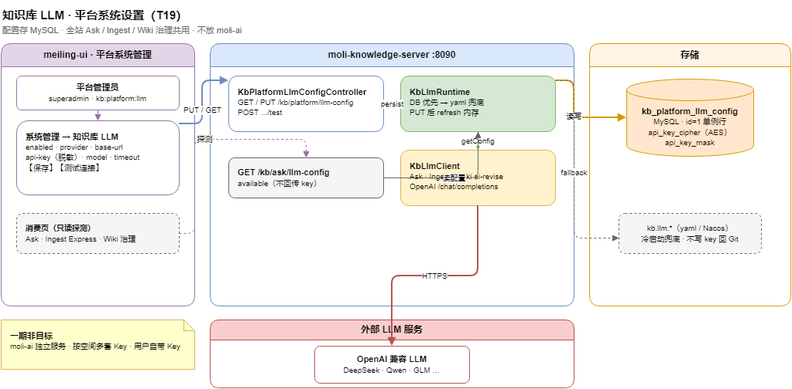

# 知识库 LLM · 平台系统设置（T19 设计）

> 更新：2026-07-13 · 状态：**T19 后端 + T19d 前端 ✅**（`kb:prd` REG-llm-on/off）  
> API 契约（规划）：[`docs/api/KNOWLEDGE_API.md`](../api/KNOWLEDGE_API.md) §3.5  
> DDL：`docs/sql/11_kb_platform_llm_config.sql`  
> 任务跟踪：[`moli-knowledge/TASKS.md`](../../moli-knowledge/TASKS.md) **T19**

---

## 1. 背景与目标

### 1.1 现状

| 项 | 现状 |
|----|------|
| 配置位置 | `application-dev.yml` / Nacos `knowledge-server-kb-llm-dev.yaml` 的 `kb.llm.*` |
| 运行时 | `KbLlmProperties` + `@RefreshScope`；`KbLlmClient` 直接读 Properties |
| 探测 API | `GET /kb/ask/llm-config`（只读、不含 key） |
| 消费方 | `/kb/ask`、Ingest Plan/草稿/Express、Wiki AI 改稿、Wiki 治理批量修复 |
| 前端 | Ask 页 `KbLlmToggle` 仅探测 `available`；**无管理界面** |

问题：多用户 Web 产品不能把 API Key 写在 Git yaml；运维改配置需重启/改 Nacos；Ingest/Ask 失败时用户只看到「LLM 未配置」却无法自助（非平台管理员）。

### 1.2 目标

1. **平台管理员**在 **meiling-ui → 系统管理 → 知识库 LLM** 页面配置：启用开关、provider、base-url、api-key、model、temperature、timeout。
2. 配置存 **MySQL**（加密 api-key），**不写回** yaml/Git。
3. 全站知识库能力（Ask / Ingest / Wiki 治理）共用 **一套平台级 LLM**，所有空间 editor 消费同一配置（与 Express 傻瓜式入库产品决策一致）。
4. 保存后 **无需重启** knowledge-server（内存缓存 + 写库后刷新）。
5. 提供 **连通性测试**（发一条最小 chat/completions 探测）。

### 1.3 非目标（一期）

| 非目标 | 说明 |
|--------|------|
| 独立 `moli-ai` 微服务 | 见 §2；二期多业务共用 LLM 网关时再抽 |
| 按空间多套 Key | 一期平台单例；空间级配额/模型为 T19+ |
| 用户自带 Key | 编辑器个人 Key 不在本期 |
| Cursor / `serve.py` 本地配置 | `llm_config.json` 仍供 CLI；与 Web 平台配置分离 |
| 模型计费 / 限流 / 审计大盘 | 预留 `kb_llm_call_log` 可选，一期可不做 |

---

## 2. 架构决策：放企业知识库，不放 moli-ai

```
meiling-ui  系统管理 → 知识库 LLM
       │  GET/PUT /kb/platform/llm-config
       │  POST    /kb/platform/llm-config/test
       ▼
moli-knowledge-server :8090
  KbPlatformLlmConfigService
  KbLlmRuntime（替代 Properties 直读）
  KbLlmClient
       │
       ├── MySQL kb_platform_llm_config（权威）
       └── application.yml kb.llm.*（仅 bootstrap 默认 / 冷启动兜底）
       ▼
OpenAI 兼容 API（DeepSeek / Qwen / GLM …）
```

**理由**：

- 全部调用方已在 `moli-knowledge-server`（`KbLlmClient`）。
- `moli-ai` 当前为空壳 demo，引入只会多一跳网关，不解决 Ingest/Ask。
- 配置域属于 **知识库平台能力**，与 `kb_space`、`kb_ingest_*` 同库同服务，事务与 ACL 一致。

**演进**：当 order/ai 等也要 LLM 时，可将 `KbLlmClient` 抽为 `moli-ai-server` 的 Dubbo/HTTP 网关；DB 表可迁或双写，API 路径保持不变。

---

## 3. 配置模型

### 3.1 平台单例

- 表内 **固定一行** `id = 1`（`uk_singleton` 约束）。
- 字段与现有 `KbLlmProperties` 对齐，便于迁移。

| 字段 | 类型 | 说明 |
|------|------|------|
| `enabled` | tinyint | 总开关；false 时等同现 `kb.llm.enabled=false` |
| `provider` | varchar(32) | 展示用：`deepseek` / `qwen` / `glm` / `custom` |
| `base_url` | varchar(512) | OpenAI 兼容根 URL，无尾斜杠 |
| `api_key_cipher` | varchar(1024) | AES-GCM 密文（Base64） |
| `api_key_mask` | varchar(32) | 脱敏展示，如 `****7w474NtdLzM0` |
| `model` | varchar(128) | 默认模型 |
| `temperature` | decimal(3,2) | 默认 0.30 |
| `timeout_seconds` | int | 默认 90 |
| `extra_models` | json | 可选；治理/Ingest 模型下拉（`kb.wiki.govern.models` 迁入） |
| `update_id` / `update_time` | | 审计 |

### 3.2 读取优先级

```
1. MySQL kb_platform_llm_config（id=1 且 api_key_cipher 非空）→ 解密后注入 KbLlmRuntime
2. 否则回退 kb.llm.*（yaml / Nacos）→ 兼容旧环境
3. KbLlmClient.usable() = enabled && apiKey 非空
```

**冷启动**：服务启动时 `KbPlatformLlmConfigLoader` 读 DB；无行则 insert 默认行（enabled=0，其余 copy yaml）。

**热更新**：PUT 成功 → 写 DB → `KbLlmRuntime.refresh()` → 已有 `@RefreshScope` 的 Properties 可选同步（仅非敏感字段）。

### 3.3 API Key 安全

| 规则 | 说明 |
|------|------|
| 加密 | AES-256-GCM；密钥来自环境变量 `KB_LLM_CONFIG_SECRET`（32 字节 Base64） |
| GET 响应 | **永不**返回明文 key；仅 `apiKeyMask` + `apiKeyConfigured` |
| PUT 请求 | `apiKey` 可选；**空字符串 = 不改**；非空 = 替换并重新加密 |
| 日志 | 禁止打印 key；操作记 `sys_operation_log`（参数脱敏） |
| 权限 | 仅平台超管或 `kb:platform:llm` 动作 |

---

## 4. API 设计（规划）

> 实现后写入 [`KNOWLEDGE_API.md`](../api/KNOWLEDGE_API.md) §3.5 为权威。

### 4.1 `GET /kb/platform/llm-config`

**权限**：`kb:platform:llm` 或平台超管。

响应（示例）：

```json
{
  "enabled": true,
  "provider": "glm",
  "baseUrl": "https://open.bigmodel.cn/api/paas/v4",
  "apiKeyConfigured": true,
  "apiKeyMask": "****tdLzM0",
  "model": "glm-4-flash",
  "temperature": 0.3,
  "timeoutSeconds": 90,
  "extraModels": ["glm-4-flash", "glm-4-air"],
  "available": true,
  "source": "database",
  "updateTime": "2026-06-28 15:00:00"
}
```

| 字段 | 说明 |
|------|------|
| `available` | `enabled && apiKeyConfigured`（与现有 `GET /kb/ask/llm-config` 语义一致） |
| `source` | `database` / `yaml_fallback`（便于排障） |

### 4.2 `PUT /kb/platform/llm-config`

**权限**：同上。

请求体：

```json
{
  "enabled": true,
  "provider": "glm",
  "baseUrl": "https://open.bigmodel.cn/api/paas/v4",
  "apiKey": "",
  "model": "glm-4-flash",
  "temperature": 0.3,
  "timeoutSeconds": 90,
  "extraModels": ["glm-4-flash", "glm-4-air"]
}
```

校验：

- `baseUrl` 必须 `http(s)://`；禁止内网 SSRF 段（127.0.0.1、metadata）可配置黑名单。
- `temperature` ∈ [0, 2]；`timeoutSeconds` ∈ [5, 300]。

### 4.3 `POST /kb/platform/llm-config/test`

用 **当前表单值**（或已保存配置）发一条最小请求：

```json
{ "message": "ping" }
```

响应：

```json
{
  "success": true,
  "latencyMs": 842,
  "model": "glm-4-flash",
  "replyPreview": "pong"
}
```

失败返回 `success=false` + `error`（HTTP 状态码仍 200，便于前端展示）。

### 4.4 与现有 API 关系

| API | 变更 |
|-----|------|
| `GET /kb/ask/llm-config` | **保留**；改为读 `KbLlmRuntime`（DB 优先），供 Ask/Ingest 页探测 |
| `GET /kb/wiki-moli/govern/options` | `models` 来自 DB `extra_models` 或默认 `model` |

---

## 5. 前端：平台系统设置（T19d）

> **联调权威文档**：[`docs/api/kb-llm-platform-frontend.md`](../api/kb-llm-platform-frontend.md)（TypeScript 类型、API 封装、验收清单、联调步骤）

### 5.1 入口

| 项 | 值 |
|----|-----|
| 菜单路径 | **系统管理** → **知识库 LLM** |
| 路由 component | `system/kb-llm/index` → `KbPlatformLlmSettingsView.vue` |
| 权限码 | 菜单 `kb:platform:llm`；按钮保存/测试同权限 |
| 可见性 | 平台超管默认可见；可授权给「系统管理员」角色 |

> **不放**知识库空间管理页：这是 **平台级** 密钥，不是空间 metadata。

### 5.2 页面结构

1. **状态条**：`available` 绿/红；`source` 标签（数据库 / yaml 兜底）。
2. **表单**：启用开关、provider 下拉（预设 + custom）、base-url、api-key（password +「更换密钥」）、model、temperature、timeout。
3. **扩展模型**：多选 tags（供治理/Ingest 下拉）。
4. **操作**：保存、测试连接、恢复 yaml 默认（仅清空 DB 行，二次确认）。
5. **说明**：列出生效范围（Ask / Ingest / Wiki 治理 / Express）。

### 5.3 i18n

`system.kbLlm.*`（zh/en/ja），与 `knowledge.ask.llm` 探测文案区分。键表见 [`kb-llm-platform-frontend.md`](../api/kb-llm-platform-frontend.md) §12。

### 5.4 加密密钥（运维 · 前端需提示）

保存 api-key 到 MySQL 前，服务端必须配置 **`KB_LLM_CONFIG_SECRET`**（或 yaml `kb.llm.config-secret`）。这是**加密主密钥**，不是 LLM 厂商的 api-key。

| 方式 | 示例 |
|------|------|
| 环境变量（推荐） | `KB_LLM_CONFIG_SECRET`；**进程启动后注入亦生效**（`KbLlmProperties.resolveConfigSecret()` 回退读 env，无需重启 JVM） |
| yaml / Nacos | `kb.llm.config-secret`；Nacos 变更可 `@RefreshScope` 刷新 |

支持：32 字节 Base64，或任意字符串（内部 SHA-256）。**密钥轮换后**需用户在 UI 重新保存 api-key。

未配置时 PUT 带新 key 失败，前端应展示后端 `msg` 并提示联系运维。GET 响应 **`encryptionReady`**（bool）可在表单顶部提前展示「加密主密钥未配置」。

生成密钥示例：PowerShell `[Convert]::ToBase64String((1..32 | ForEach-Object { Get-Random -Max 256 }))` 或 `openssl rand -base64 32`。

---

## 6. 后端实现要点

### 6.1 类职责

| 类 | 职责 |
|----|------|
| `KbPlatformLlmConfigController` | `/kb/platform/llm-config` CRUD + test |
| `KbPlatformLlmConfigService` | 读写 DB、加密、刷新 Runtime |
| `KbLlmRuntime` | 线程安全快照；`usable()` / `getEffectiveConfig()` |
| `KbLlmClient` | 改为依赖 `KbLlmRuntime`，不再直接 `@Resource KbLlmProperties` |
| `KbLlmConfigServiceImpl` | `getConfig()` 改读 Runtime |
| `SecretCipher` | AES-GCM 加解密（common 或 knowledge 内 util） |

### 6.2 权限断言

```java
kbAclService.assertPlatformLlmManage(); 
// 平台超管 || Shiro has kb:platform:llm
```

与 `KbAclService.isAdmin()` 对齐，**不**走空间 ACL。

### 6.3 菜单 SQL

见 `docs/sql/12_kb_platform_llm_menu.sql`（系统管理目录下新增菜单 + sys_action + 角色授权）。

---

## 7. 迁移与兼容

| 场景 | 行为 |
|------|------|
| 新环境 | 执行 `11_kb_platform_llm_config.sql` + `12_kb_platform_llm_menu.sql`；管理员在 UI 配 Key |
| 已有 yaml 配 Key | 首次启动 DB 无 key → fallback yaml → `source=yaml_fallback`；管理员保存一次即迁到 DB |
| Nacos `kb.llm.nacos.enabled=true` | 一期 **DB 优先**；Nacos 仅作无 DB 时的第二 fallback（文档注明，避免三源冲突） |
| 密钥轮换 | UI 填新 key → 保存；旧 cipher 覆盖 |

---

## 8. 流程图



源文件：[`docs/diagrams/moli-kb-llm-settings-flow.drawio`](../diagrams/moli-kb-llm-settings-flow.drawio)

---

## 9. 验收标准（T19）

1. 平台管理员登录 → **系统管理 → 知识库 LLM** → 保存 GLM/DeepSeek 配置 → `GET /kb/ask/llm-config` 返回 `available=true`。
2. **不重启**服务：Ask `useLlm=true`、Ingest 生成草稿、Wiki ai-revise 均可调用。
3. GET 响应无明文 key；DB 中 `api_key_cipher` 非明文。
4. 非授权用户 PUT 返回 403。
5. 「测试连接」成功/失败有明确提示。
6. yaml 中 key 删除后，只要 DB 有配置，服务仍可用。

---

## 10. 任务拆分（T19）

| 子任务 | 内容 |
|--------|------|
| **T19a** | DDL `kb_platform_llm_config` + 加密工具 + `KbLlmRuntime` |
| **T19b** | `GET/PUT/POST test` API + 权限 + 操作日志 |
| **T19c** | `KbLlmClient` / `KbLlmConfigService` 切 Runtime；回归 Ask/Ingest/Wiki |
| **T19d** | 前端 `KbPlatformLlmSettingsView` + 菜单 SQL + i18n |
| **T19e** | 文档：`KNOWLEDGE_API.md` §3.5、`KNOWLEDGE_SCHEMA.md`、运维说明 |

---

## 12. AI-8 路由 / 语义缓存（W13–W14）

> 契约：[`docs/design/contracts/AI-8-contract.md`](contracts/AI-8-contract.md) · 默认 **router/cache 均关**，零回归。

### 12.1 调用链

```
KbLlmClient.chat(scene, …)
  ├─ kb.llm.cache.enabled → KbLlmSemanticCache.lookup（Redis 精确键；可选 approx）
  ├─ miss → kb.llm.router.enabled → KbLlmRouter failover
  └─ KbLlmCallLogService.record*（cache_hit / failover / estimated_cost_usd）
```

### 12.2 配置键

| 前缀 | 默认 | 说明 |
|------|------|------|
| `kb.llm.router.enabled` | `false` | primary 失败切 `fallbacks[]`（env key） |
| `kb.llm.cache.enabled` | `false` | Redis 语义缓存 |
| `kb.llm.cache.ttl-seconds` | `3600` | 精确键 TTL |
| `kb.llm.cache.approx-enabled` | `false` | embedding 近似命中（sidecar `POST /embed-query`） |

缓存键含 **scene + 归一化 userPrompt + model + system 指纹**，防跨 scene / 跨 system 串答。

### 12.3 运维看板

`GET /kb/ops/dashboard` → `llm.cacheHitRate` · `llm.estimatedCostUsd` · `llm.costTrend[]`（需执行 `35_kb_llm_call_log_ai8.sql`）。

---

## 11. 相关

- [`docs/nacos/knowledge-server-kb-llm-dev.yaml`](../nacos/knowledge-server-kb-llm-dev.yaml)（bootstrap 模板，一期降级为兜底）
- [`kb/wiki-moli/develop/Ingest工作台产品方案.md`](../../moli-knowledge/kb/wiki-moli/develop/Ingest工作台产品方案.md) §3.3 Express（依赖平台 LLM）
- [`user-center-detailed-design.md`](user-center-detailed-design.md)（系统管理菜单 / RBAC 模式）
