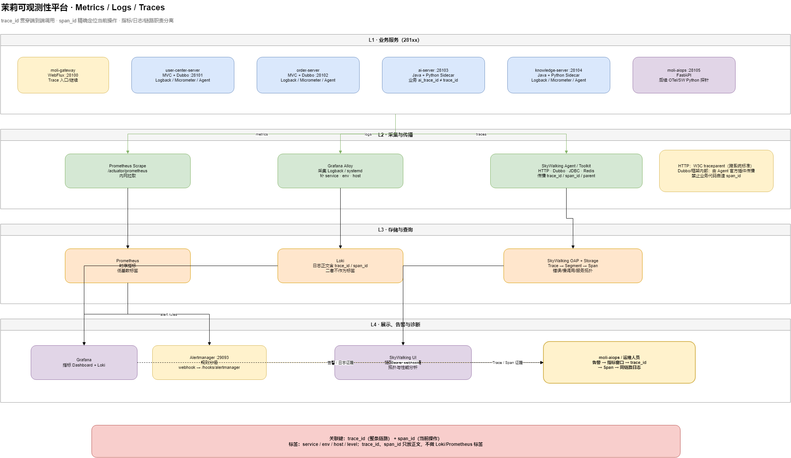
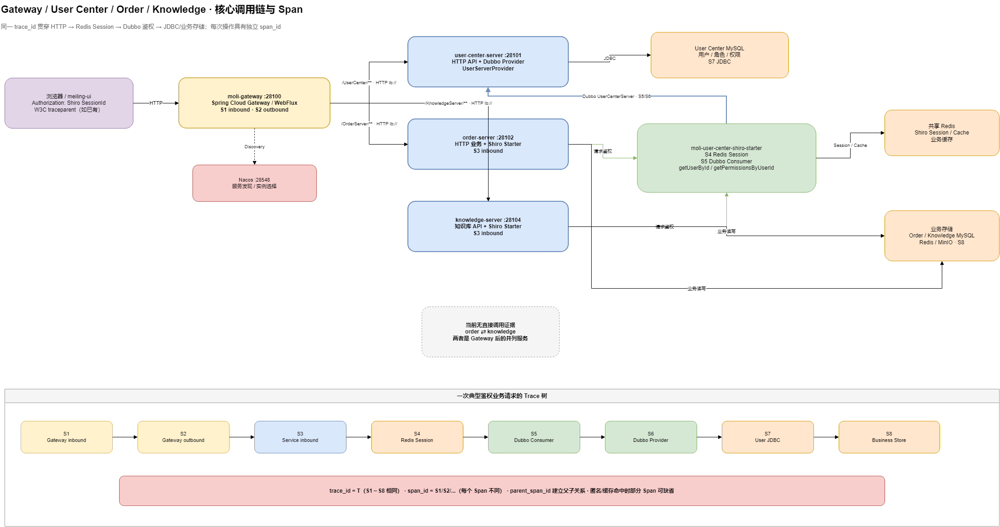

# 可观测性平台规划 · Metrics / Logs / Traces

> 状态：**PoC 已落地**（`deploy/observability/`）；生产高可用/TLS/告警待办  
> 范围：`moli-gateway`、user-center、order、ai、knowledge、moli-aiops 及基础设施  
> 目标：统一指标、日志与分布式链路，支持从告警定位到具体日志和调用跨度。  
> 端口权威表：`docs/ops/local-dev-ports.md` · 操作手册：`docs/ops/monitoring-and-logs.md` · wiki [[监控与日志]]

---

## 1. 结论与边界

采用以下职责分工：

| 信号 | 组件 | 职责 |
|------|------|------|
| Metrics | Prometheus | 拉取 JVM、HTTP、数据库连接池、网关和业务指标 |
| Dashboard / Alert | Grafana | 展示 Prometheus 指标、查询 Loki 日志、配置告警 |
| Logs | Loki + Grafana Alloy | Alloy 采集宿主机日志并写入 Loki；新项目不使用已 EOL 的 Promtail |
| Traces | SkyWalking Agent + OAP + UI | 采集 HTTP、Dubbo、JDBC 等调用链，展示拓扑、慢调用和错误 Span |

**整合进仓库的是配置与接入契约，不是第三方框架源码或二进制：**

- 仓库维护 Docker Compose、Prometheus/Alloy 配置、Grafana provisioning、Dashboard、告警规则和部署文档。
- 业务模块仅维护 Actuator/Micrometer 依赖、必要的业务指标、日志格式及启动参数模板。
- SkyWalking Java Agent、OAP、Grafana、Loki、Prometheus 使用固定版本镜像或部署时下载，不提交第三方二进制。
- 生产环境建议部署在独立监控主机或独立 Compose，不与业务 JVM 共用小规格主机。



> 可编辑源文件：[moli-observability-platform.drawio](../diagrams/moli-observability-platform.drawio)

---

## 2. Trace Context 契约

### 2.1 必须字段

| 字段 | 必须性 | 含义 | 生命周期 |
|------|--------|------|----------|
| `trace_id` | 必须 | 一次端到端分布式调用的全局标识 | 从入口到所有下游保持不变 |
| `span_id` | 必须 | 当前操作/调用跨度标识 | 每个 HTTP、Dubbo、JDBC 等 Span 不同 |
| `parent_span_id` | Trace 后端必须，普通日志可选 | 当前 Span 的直接父 Span | 由追踪系统维护 |
| `service` | 必须 | 服务名，使用 Nacos/SkyWalking 一致命名 | 进程固定 |
| `env` | 必须 | `dev` / `test` / `pre` / `prod` | 进程固定 |
| `host` / `instance` | 必须 | 运行实例 | 实例固定 |

`trace_id` 用于一次检索整条链路；`span_id` 用于把某条日志精确关联到 SkyWalking 中的具体 Span。只记录 `trace_id` 可以完成链路级检索，但不能可靠定位同一链路中的哪次下游调用，因此本项目规划两者都保留。

### 2.2 传播规则

1. 浏览器/调用方进入 Gateway 时，由 SkyWalking Agent 创建或继续 Trace。
2. HTTP 使用 W3C `traceparent` 作为跨系统标准上下文；SkyWalking Agent 自身所需传播头由 Agent 插件处理。
3. Gateway WebFlux、Spring MVC、Dubbo、JDBC 的上下文传播优先依赖 SkyWalking 官方插件，业务代码不手写复制追踪头。
4. 异步线程池、`CompletableFuture`、定时任务和消息队列需要专项验证；上下文丢失时使用官方 Toolkit/插件，不自行发明 ThreadLocal 协议。
5. 未携带合法上下文的入口创建新 Trace；不信任客户端提供的日志字段。
6. 对外响应默认不回传 `span_id`；排障接口可按安全策略返回 `trace_id`，禁止泄露内部拓扑。

### 2.3 日志字段

结构化日志的目标字段：

```json
{
  "timestamp": "2026-08-30T20:00:00.123+08:00",
  "level": "ERROR",
  "service": "user-center-server",
  "env": "prod",
  "host": "uc-01",
  "trace_id": "distributed-trace-id",
  "span_id": "current-span-id",
  "logger": "com.moli...",
  "thread": "http-nio-28101-exec-1",
  "message": "login failed",
  "exception": "..."
}
```

实施时先验证选定 SkyWalking Agent/Toolkit 版本能否同时向 Logback 暴露 Trace ID 与 Span ID；若 Toolkit 仅稳定提供 Trace ID，则：

- Trace 数据中仍必须包含 `trace_id`、`span_id`、父子关系；
- 日志第一阶段至少落 `trace_id`；
- Span ID 日志关联在 PoC 验证后启用，不能用自生成值冒充真实 SkyWalking Span ID。

### 2.4 现有业务 `traceId` 冲突

`moli-ai` 的 `AiChatTrace.traceId` 当前是 ChatBI/AI 审计标识，不等同于分布式追踪 Trace ID。规划中：

- 数据库/API 现有字段保持兼容，不直接改变语义；
- 日志统一使用 `trace_id` 表示分布式追踪；
- AI 业务标识后续新增或映射为 `ai_trace_id` / `conversation_trace_id`；
- 两者同时写日志，支持从业务会话跳转到基础设施链路。

### 2.5 四个核心服务的真实调用链



> 可编辑源文件：[moli-observability-core-trace-flow.drawio](../diagrams/moli-observability-core-trace-flow.drawio)

当前代码对应的核心调用关系：

1. 客户端统一进入 `moli-gateway :28100`。
2. Gateway 通过 Nacos 服务发现和 `lb://` 路由转发：
   - `/UserCenter/**` → `user-center-server :28101`
   - `/OrderServer/**` → `order-server :28102`
   - `/KnowledgeServer/**` → `knowledge-server :28104`
3. order 和 knowledge 引入 `moli-user-center-shiro-starter`：
   - Shiro Session 通过共享 Redis 恢复；
   - 已认证请求由 `AuthenticationFilter` 通过 Dubbo 调用 `UserCenterServer.getUserById()` 校验账号状态；
   - 需要权限判定时，`ShiroRealm` 通过 Dubbo 调用 `getPermissionsByUserId()`；
   - user-center 的 `UserServerProvider` 是对应 Dubbo Provider。
4. order 中显式 `UserCenterServer` 业务调用目前仅有注入和注释示例；现阶段不能把它描述成独立的订单业务 RPC。
5. knowledge 未发现绕过 Shiro Starter 的直接 user-center 业务调用。
6. 当前没有 order → knowledge 或 knowledge → order 的直接调用证据；二者是经 Gateway 暴露的并列服务。

典型 Trace 的 Span 结构：

| 顺序 | Span 示例 | 说明 |
|------|-----------|------|
| 1 | Gateway inbound | 接收浏览器请求，创建或继续 `trace_id` |
| 2 | Gateway outbound | `lb://` 选择服务实例并转发 |
| 3 | order/knowledge inbound | 下游服务接收 HTTP 请求 |
| 4 | Redis session | Shiro Starter 恢复 Session |
| 5 | Dubbo consumer | order/knowledge 调用 `UserCenterServer` |
| 6 | Dubbo provider | user-center 执行账号/权限查询 |
| 7 | JDBC/Redis | user-center 访问 MySQL/Redis |
| 8 | 业务存储 Span | order 或 knowledge 访问自身 MySQL/Redis/MinIO |

以上 Span 共用同一 `trace_id`，每个节点使用不同 `span_id`，通过父子关系还原完整调用树。并非每个请求都会产生表中的所有 Span：匿名接口无 Shiro Dubbo 校验，权限缓存命中时也可能减少查询。

---

## 3. 总体架构

### 3.1 采集路径

- Prometheus 从内网直连各服务 `/actuator/prometheus`，不经公开 Gateway。
- Alloy 在每台应用主机采集 `/opt/moli-project-distribute/moli-*/logs/`，增加 `service`、`env`、`host` 标签后推送 Loki。
- SkyWalking Java Agent 通过 `JAVA_OPTS` 注入，向 OAP 上报 Trace；业务 JAR 不打包 Agent。
- Grafana配置 Prometheus 与 Loki 数据源；SkyWalking UI 负责链路树、拓扑和 Span 分析。
- Grafana 日志面板按 `trace_id` 过滤；SkyWalking Trace 详情提供对应日志跳转条件。

### 3.2 标签与基数

允许作为 Prometheus/Loki 标签：

- `service`、`env`、`host`、`level`、`log_type`
- HTTP 指标允许低基数的 method、status、route 模板

禁止作为标签：

- `trace_id`、`span_id`、userId、订单号、完整 URL、异常消息

`trace_id`、`span_id` 保留在日志正文/解析字段中，查询时过滤，避免 Loki 标签基数爆炸。

---

## 4. 仓库现状与缺口

### 4.1 已有能力

- 五个 Java 服务均已接入 Actuator 与 `micrometer-registry-prometheus`。
- `load-test/docker/docker-compose.monitoring.yml` 已包含 Prometheus + Grafana。
- `load-test/docker/grafana/` 已有数据源与 Dashboard provisioning。
- 五个 Java 服务均有文件日志或生产启动脚本重定向日志。
- user-center 已有 Druid 连接池自定义指标。
- `deploy/observability/` 已提供 Prometheus、Grafana、Loki、Alloy、SkyWalking OAP/UI 单机 PoC。
- Logback Toolkit 输出 `trace_id=%tid` 与 `%sw_ctx`；`sw_ctx` 包含 service、instance、trace、segment、span。
- Linux 启动脚本支持通过环境变量按服务启用 SkyWalking Agent。

### 4.2 缺口

- 仍需在运行环境完成 Gateway → HTTP → Dubbo → JDBC 全链路 PoC，并核对异步线程上下文传播。
- Actuator 已按最小端点暴露，但生产安全组/防火墙白名单尚需部署侧实施。
- 单机 Loki filesystem 与 SkyWalking H2 仅供 PoC，生产存储、高可用、备份策略未落地。
- Grafana 日志 Dashboard 和 `trace_id` 检索入口（**Moli Trace Logs** Dashboard + `docs/ops/monitoring-and-logs.md` §4）。
- **W3 已落地**：Prometheus 规则 + Alertmanager webhook → `POST /hooks/alertmanager` → `/diagnose`。钉钉/企微等通知通道仍待办。

---

## 5. 分阶段计划

### Phase 0 · 基线校准

交付：

- 修正 Prometheus 旧端口目标。
- 固化服务命名：`moli-gateway`、`user-center-server`、`order-server`、`ai-server`、`knowledge-server`。
- 固化 `env`、`host`、`service` 标签规范。
- 建立可观测性 Compose 目录与版本锁定策略。

验收：

- 所有镜像使用明确版本，不使用 `latest`。
- 现有压测 Dashboard 能读取 281xx 端口指标。

### Phase 1 · Prometheus + Grafana

交付：

- 五个 Java 服务统一接入 Actuator + Prometheus Registry。
- dev/pre/pro 使用统一 management 配置模板。
- 首批 Dashboard：JVM、HTTP、Gateway、Druid、Dubbo关键指标。
- 首批告警：实例离线、5xx、P95 延迟、堆内存、GC、连接池耗尽、磁盘水位。

验收：

- Prometheus Targets 全部为 UP。
- Grafana 能按 `env/service/instance` 筛选。
- Actuator 仅内网可达，不经公网暴露。

### Phase 2 · Loki + Alloy

交付：

- Loki 单机部署与保留期配置。
- 每台应用主机部署 Alloy，采集 Logback 文件和 systemd/stdout 日志。
- 统一日志字段与脱敏规则。
- Grafana 日志 Dashboard 和 `trace_id` 检索入口。

验收：

- 任一 ERROR 日志 30 秒内可在 Grafana 查询。
- 可按 service/env/host/level 过滤。
- `trace_id`、`span_id` 不作为 Loki 标签。
- 密码、Token、Cookie、Authorization、LLM Key 不得进入日志。

### Phase 3 · SkyWalking

交付：

- SkyWalking OAP、UI 和生产存储配置。
- 在 `deploy/linux/moli-*.env.example` 通过 `JAVA_OPTS` 提供 Agent 模板。
- 首批覆盖 gateway → user-center → knowledge/order，后续覆盖 ai。
- 完成 WebFlux、Spring MVC、Dubbo、JDBC、Redis、异步线程场景 PoC。
- Logback 注入真实 `trace_id`，并验证 `span_id` 能力。

验收：

- 一次网关请求能看到完整跨服务 Trace。
- HTTP 与 Dubbo Span 父子关系正确。
- 错误 Span 能跳转到同一 `trace_id` 的 Loki 日志（Grafana **Moli Trace Logs** Dashboard；SkyWalking → Grafana 深链接待配置）。
- 关闭 Agent 后业务仍能正常启动，作为回滚路径。

### Phase 4 · Python 与 AIOps

交付：

- **W1 已落地**：`ops_trace_get`（OAP `queryTraces` v2）+ `ops_logs_by_trace`（Loki 正文 `|=`）已挂 MCP 与 investigator；告警 / `POST /diagnose` 带 `trace_id` 时诊断报告含 Span 摘要与同 trace 日志。Servlet 服务错误信封 `MoliResult.traceId` 回 32 位根 ID。
- moli-aiops、knowledge Python sidecar 使用 OpenTelemetry/SkyWalking Python 探针或标准 Trace Context（待办）。
- **W3 已落地**：Alertmanager → `POST /hooks/alertmanager`（Bearer）→ 诊断；investigator 用 `ops_metrics_query` 读 Prom 窗口。钉钉/企微通知仍待办。

---

## 6. 安全、容量与保留策略

### 6.1 网络

- Prometheus、Loki、SkyWalking OAP、Grafana 仅管理网/内网开放。
- Grafana启用登录与最小权限；Prometheus/Loki/OAP 不直接暴露公网。
- `/actuator/prometheus` 可使用独立 management 端口或防火墙白名单。

### 6.2 脱敏

禁止记录：

- Authorization、Shiro Session ID、Cookie、密码、数据库连接密码
- LLM API Key、SSH 私钥、审批 Token
- 未脱敏的手机号、身份证、邮箱等个人信息

### 6.3 初始保留建议

| 数据 | dev | prod 初始值 |
|------|-----|-------------|
| Prometheus | 7 天 | 15～30 天 |
| Loki 普通日志 | 7 天 | 15 天 |
| Loki ERROR/WARN | 7 天 | 30 天（按容量调整） |
| SkyWalking Trace | 3 天 | 7 天 |

保留期不是固定承诺；上线前根据日增量、压缩率和磁盘预算压测后确定。

### 6.4 采样

- dev/pre：可 100% Trace 采样。
- prod：初始建议 10%～20%，错误和慢请求优先保留。
- 采样策略由 OAP/Agent 配置统一控制，不在业务代码中散落。

---

## 7. 部署与回滚

> **生产部署细节**（业务机/监控机分离、日志四层可靠性、Alloy systemd、Loki 对象存储、故障矩阵）：[observability-production.md](../ops/observability-production.md)


> 可编辑源文件：[moli-observability-prod-topology.drawio](../diagrams/moli-observability-prod-topology.drawio) · 日志分层：[moli-observability-log-resilience.drawio](../diagrams/moli-observability-log-resilience.drawio)

部署建议：

1. 独立监控主机运行 Prometheus、Grafana、Loki、SkyWalking OAP/UI。
2. 业务主机只运行 Alloy 和 SkyWalking Java Agent。
3. 配置目录、数据目录和镜像版本纳入备份与变更记录。

回滚顺序：

1. SkyWalking：移除 `-javaagent` 后重启服务。
2. Alloy：停止采集进程，不影响业务日志落盘。
3. Prometheus：关闭抓取不影响 Actuator 和业务接口。
4. Grafana/Loki/OAP 故障不得阻塞业务请求；Agent/采集端必须具备断路与限流。

---

## 8. 实施任务拆分

| 编号 | 状态 | 任务 | 主要路径 |
|------|------|------|----------|
| OBS-01 | 已完成 | 校准现有 Prometheus 抓取与 Dashboard | `load-test/docker/` |
| OBS-02 | 已完成 | knowledge/ai 接入 Actuator + Prometheus | 各模块 `pom.xml`、`application*.yml` |
| OBS-03 | PoC 已完成 | 建立单机 monitoring Compose；生产化待办 | `deploy/observability/` |
| OBS-04 | PoC 已完成 | Alloy + Loki 日志采集 | `deploy/observability/alloy/`、`loki/` |
| OBS-05 | 基础完成 | 统一 Logback Trace/Span 上下文；脱敏规则待办 | 各服务 `logback-spring.xml` |
| OBS-06 | PoC 已完成 | SkyWalking OAP/UI + Agent 模板 | `deploy/observability/`、`deploy/linux/*.env.example` |
| OBS-07 | 待运行验收 | Trace/Span 传播 PoC | gateway、Dubbo、异步线程、knowledge |
| OBS-08 | 部分完成 | Grafana 基础 Dashboard + **Moli Trace Logs** 全链路日志；告警与 SkyWalking 深链接待办 | `deploy/observability/grafana/`、`docs/ops/monitoring-and-logs.md` §4 |
| OBS-09 | W1+W3 | AIOps 按 `trace_id` 关联 SW/Loki；AM webhook 进诊断；钉钉/企微待办 | `moli-aiops/`、`deploy/observability/` |
| OBS-10 | 部分完成 | 运维 Runbook、容量压测与故障演练 | `docs/ops/`、`load-test/` |
| OBS-11 | 已完成 | MyBatis `Slf4jImpl` + mapper DEBUG 落盘（dev/pro），Loki 可采 SQL | 各模块 `application-*.yml`、`logback-spring.xml` |
| OBS-12 | 待办 | 生产主机 Alloy systemd 安装与日志路径验收 | `docs/ops/observability-production.md`、`deploy/observability/` |
| OBS-13 | 已完成 | 生产日志可靠性 Runbook + 部署/分层架构图 | `docs/ops/observability-production.md`、`docs/diagrams/moli-observability-prod-*.drawio` |

---

## 9. 暂不做

- 不同时引入 SkyWalking 和另一套完整 Trace 后端（Tempo/Jaeger）。
- 不把 `trace_id` / `span_id` 设为 Prometheus 或 Loki 高基数标签。
- 不以自研 Filter 替代 SkyWalking 的 HTTP/Dubbo 插件传播。
- 不在 Phase 1 就引入长期指标存储、集群 Loki 或多集群联邦。
- 不把监控组件与业务服务打进同一个 JAR 或同一个 JVM。

---

## 10. 相关

- [监控与日志 · v1 运维要点](../ops/monitoring-and-logs.md)
- [可观测性 · 生产部署与日志可靠性](../ops/observability-production.md)
- [生产检查清单](../ops/production-checklist.md)
- [本地开发端口](../ops/local-dev-ports.md)
- [技术栈](../zh-CN/TECH_STACK.md)
- [图清单](../diagrams/README.md)
