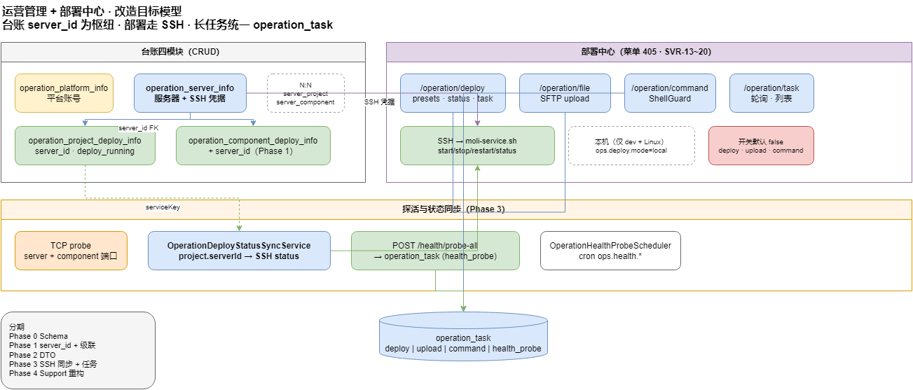

# 运营管理 + 部署中心 · 改造方案（v1.1）

> 更新：2026-07-13  
> 范围：**平台 / 服务器 / 项目 / 组件** + **部署中心** + **拓扑/关系** + **DC-4 任务分组**  
> 归属：`moli-user-center` · 表 `operation_*` · API `/operation/*`  
> 原则：**可渐进上线、API 尽量向后兼容、先修数据一致性再提性能**  
> 关联路线图：[`server-ops-module-roadmap.md`](server-ops-module-roadmap.md) · API [`operation-deploy-api.md`](../api/operation-deploy-api.md)

---

## 1. 改造目标

| 目标 | 说明 |
|------|------|
| **G1 迁移一致** | 新装/老库同一套 Schema；不再出现 `Unknown column 'deploy_running'` / `operation_task` 缺失 |
| **G2 关联统一** | 项目/组件都以 `server_id` 为主键关联，IP 为冗余展示字段 |
| **G3 删除安全** | 删服务器/项目/组件时，关联表与孤儿数据自动清理 |
| **G4 入参可靠** | DTO + 校验，禁止空名称、非法环境、重复 IP |
| **G5 探测可信** | 健康探活、**部署状态**在**目标机**上执行（SSH），非 Windows 本机误判 |
| **G6 代码可维护** | 四模块 CRUD/密钥/探活逻辑收敛，减少 4 份复制粘贴 |
| **G7 部署路径统一** | 部署中心「本机脚本」与「SSH 远程」共用同一执行抽象；定时 `deploy_running` 与 UI 手动查询一致 |
| **G8 任务可观测** | `operation_task` 覆盖 deploy / upload / command / health_probe；列表、轮询、锁键规范统一 |
| **G9 服务键对齐** | `serviceKey` ↔ `project_name` ↔ Registry 单一映射；**order/ai 已入 YAML**（远程启停待 `moli-service.sh` 扩展） | ✅ |
| **G10 安全默认关** | `ops.deploy/upload/command` 默认 false；Runbook 写清生产开启步骤与权限最小集 |

**不做（本方案外）**：meiling-ui 大改版（仅列接口变更点）；与知识库 KBOPS 合并；CI/CD 流水线编排。

---

## 2. 现状评估

### 2.1 四模块台账（已实现 · SVR-1~12）

| 菜单 | 表 | API | 状态 |
|------|-----|-----|------|
| 平台管理 | `operation_platform_info` | `/operation/platform` | CRUD + AES 凭据 |
| 服务器管理 | `operation_server_info` + N:N | `/operation/server` | CRUD + SSH + 拓扑 |
| 项目管理 | `operation_project_deploy_info` | `/operation/project` | CRUD + `deploy_running` |
| 组件管理 | `operation_component_deploy_info` | `/operation/component` | CRUD，**缺 `server_id`** |

**已落地能力**：密码 AES-GCM、TCP 探活、端口矩阵审计、N:N links、定时探活调度器。

### 2.2 部署中心（已实现 · SVR-13~20）

菜单 **部署中心**（`sys_menu` id=405），与台账共用服务器 SSH 配置。

| Controller | 前缀 | 能力 |
|------------|------|------|
| `OperationDeployController` | `/operation/deploy` | presets、status、同步/异步启停 |
| `OperationTaskController` | `/operation/task` | 任务轮询、列表 |
| `OperationFileController` | `/operation/file` | SFTP 上传 + 后置动作 |
| `OperationCommandController` | `/operation/command` | 远程 Shell（`OperationShellGuard`） |

依赖迁移：`docs/sql/21_operation_ssh_deploy.sql`（SSH 字段 + `operation_task`）、`22_operation_command_flex.sql`（`upload_allowed_roots` + `operation:command:exec`）。

### 2.3 问题清单（台账 + 部署中心）

| # | 问题 | 严重度 | 模块 |
|---|------|--------|------|
| R-1 | **`scripts/moli.sql` 与增量漂移**：基线有 `deploy_running`，但缺 `operation_task`、SSH 列、`upload_allowed_roots` | 🔴 高 | Schema |
| R-2 | **组件无 `server_id`**：仅靠 `server_ip` 字符串，拓扑/N:N 与主表不一致 | 🔴 高 | 组件 |
| R-3 | **删除无级联**：删服务器后 N:N 悬空；project/component 仍挂旧 IP | 🔴 高 | 台账 |
| R-4 | **`deploy_running` 同步走本机脚本**：`OperationHealthProbeServiceImpl` 只调 `OperationDeployServiceImpl.status()`，Windows/跨机不准 | 🔴 高 | 探活 + 部署 |
| R-5 | **双轨执行未收敛**：UI `?serverId=` 走 SSH；定时任务走本机；行为不一致 | 🔴 高 | 部署中心 |
| R-6 | **`serviceKey` 硬编码仅 3 个**：远程 `user-center/gateway/knowledge`；`OperationDeployServiceKeys` 含 order 等，两处不一致 | 🟡 中 | 部署中心 |
| R-7 | **远程只读 status 不自动上传脚本**：异步 deploy 会 `ensureRemoteScript`，同步 status 不会 → 首次查询易失败 | 🟡 中 | 部署中心 |
| R-8 | **无 DTO 校验**：Controller 直接收 Entity；Swagger 注解有误（project `serverIp` 重复描述） | 🟡 中 | 台账 |
| R-9 | **probe-all N+1 写库**：逐条 `updateById`；同步 HTTP 易超时 | 🟡 中 | 探活 |
| R-10 | **三开关默认关** + 权限分散 5 码：新环境「能进菜单但不能操作」，缺 Runbook 易误判为 bug | 🟢 低 | 部署中心 |
| R-11 | **种子明文密码** `change-me` | 🟢 低 | Schema |
| R-12 | **CRUD 四份重复**：list/page/mask/encrypt 模式相同 | 🟢 低 | 代码 |

---

## 3. 目标模型（改造后）



源文件：[`moli-operation-refactor.drawio`](../diagrams/moli-operation-refactor.drawio)

**关联规则（单一真相）**：

1. **主关联**：`project.server_id` / `component.server_id` → `operation_server_info.id`
2. **冗余字段**：`server_ip` 由服务器表回填，只读展示；禁止单独改 IP 而不改 `server_id`
3. **N:N 表**：与 `server_id` 双向维护
4. **部署执行**：`project` → `server_id` → SSH → `moli-service.sh {serviceKey} {action}`；本机模式仅 `ops.deploy.mode=local` 且 Linux 开发机
5. **任务表**：所有长耗时操作写 `operation_task`（type: `deploy` | `upload` | `command` | `health_probe`）

<details>
<summary>ASCII 备查（非主图）</summary>

```
平台 ──(可选)──► 服务器 ◄──N:N──► 项目 / 组件
                  │
                  ├── SSH 凭据 ──► 部署中心（deploy/file/command）
                  │                      │
                  │                      └── operation_task（异步轮询）
                  └── TCP 探活 ──► status / last_check_time
项目.deploy_running ◄── SSH status 同步（按 server_id + serviceKey）
```

</details>

---

## 4. 分期路线图

```
Phase 0（1–2 天）  Schema & 文档对齐 —— 零业务逻辑变更
Phase 1（2–3 天）  数据一致性 & 删除级联
Phase 2（2–3 天）  DTO 校验 & API 契约收紧
Phase 3（3–5 天）  探活/部署远程化 + 部署中心收敛 + 性能
Phase 4（2 天）     代码重构 & 测试补齐
```

**建议起手**：Phase 0 + 1（修迁移漂移 + 删级联 + 组件 `server_id`），再 Phase 3 中 **3.2 部署远程化**（与部署中心直接相关）。

---

## Phase 0 · Schema 与文档对齐（P0）

### 0.1 合并基线 SQL

| 文件 | 内容 |
|------|------|
| 更新 `scripts/moli.sql` | 并入 `21_operation_ssh_deploy.sql`、`22_operation_command_flex.sql` 的最终 DDL |
| 新增 `docs/sql/23_operation_schema_hardening.sql` | Phase 1 的 ALTER（见下），**不**重复 17–22 |
| 更新 `docs/sql/USER_CENTER_SCHEMA.md` | 补 `operation_task`、SSH 列、迁移 17–23 清单 |
| 更新 `docs/ops/sql-migration-order.md` | 固定顺序：`moli.sql` → 17 → … → 23 |

**验收**：空库只跑 `moli.sql`，四模块 CRUD + 部署中心 SSH/任务接口不报错。

### 0.2 种子数据安全 ✅

- `moli.sql` 中 `password='change-me'` 已改为 **`NULL`**
- 已有库：`UPDATE operation_platform_info SET password = NULL WHERE password = 'change-me'`（见 [`deploy/上线流程.md`](../../deploy/上线流程.md) §14）

### 0.3 部署中心 Runbook 补全 ✅

[`deploy/上线流程.md`](../../deploy/上线流程.md) **§14** — 三开关、SSH、权限、冒烟、order/ai 说明。

---

## Phase 1 · 数据一致性与删除级联（P0）

### 1.1 组件表补 `server_id`

```sql
-- docs/sql/23_operation_schema_hardening.sql（节选）

ALTER TABLE `operation_component_deploy_info`
  ADD COLUMN `server_id` bigint NULL COMMENT '服务器ID' AFTER `component_name`,
  ADD INDEX `idx_operation_component_server_id` (`server_id`);

UPDATE operation_component_deploy_info c
JOIN operation_server_info s
  ON c.server_ip = s.ip OR c.server_ip = s.inner_ip
SET c.server_id = s.id
WHERE c.server_id IS NULL;
```

### 1.2 N:N 唯一约束 + 查询索引

```sql
ALTER TABLE `operation_server_project`
  ADD UNIQUE KEY `uk_server_project` (`server_id`, `project_id`);

ALTER TABLE `operation_server_component`
  ADD UNIQUE KEY `uk_server_component` (`server_id`, `component_id`);
```

（环境/IP/名称索引见 Phase 1 原稿，略。）

### 1.3 删除级联（应用层）

| 删除对象 | 级联动作 |
|----------|----------|
| **服务器** | 删 N:N 行；`project/component.server_id` 置 NULL；**可选**拒绝删除若存在 `operation_task.status=running` |
| **项目** | 删 `operation_server_project` |
| **组件** | 删 `operation_server_component` |

### 1.4 IP / server_id 同步策略

```
若 serverId 有值 → 从 server 表读 ip 写入冗余字段
若仅 serverIp（兼容旧前端）→ syncServerIdFromIp → 再回填
若两者不一致 → 400，以 serverId 为准
```

---

## Phase 2 · DTO 校验与 API 契约（P1）

### 2.1 Request DTO

| DTO | 约束 |
|-----|------|
| `OperationPlatformSaveRequest` | `platformName` @NotBlank；`environment` 1–4 |
| `OperationServerSaveRequest` | `serverName` @NotBlank；同 environment 下 ip 唯一 |
| `OperationProjectSaveRequest` | `projectName` @NotBlank；`serverId` @NotNull |
| `OperationComponentSaveRequest` | `componentName` @NotBlank；`serverId` @NotNull |

### 2.2 部署中心 DTO（新增）

| DTO | 约束 |
|-----|------|
| `OperationDeployTaskRequest` | `serverId` 可选；`serviceKey` 枚举校验 |
| `OperationFileUploadRequest` | `targetPath` 前缀白名单；`postAction` 枚举 |
| `OperationCommandExecRequest` | `command` 长度 ≤ `ops.command.max-chars`；ShellGuard 前置 |

### 2.3 错误码

| 场景 | HTTP | code |
|------|------|------|
| 重复 IP | 400 | `OPERATION_DUPLICATE_IP` |
| SSH 未配置 | 400 | `OPERATION_SSH_NOT_CONFIGURED` |
| 部署开关关 | 403 | `OPERATION_DEPLOY_DISABLED` |
| 删服务器仍有关联任务 | 409 | `OPERATION_SERVER_TASK_RUNNING` |

---

## Phase 3 · 探活、部署状态与部署中心收敛（P1）

### 3.1 探活批量化 + 异步化

1. 并行 TCP probe（有界线程池）
2. 批量 `updateBatchById`
3. `POST /operation/health/probe-all` → 创建 `operation_task`（type=`health_probe`），返回 `taskId`

### 3.2 部署状态远程化（**部署中心 + 台账交界**）

**现状问题**：`OperationHealthProbeServiceImpl` 第 73–87 行对本机 `operationDeployService.status()` 按 `serviceKey` 去重，**忽略 project 所在 server**。

**改造**：

```
OperationDeployStatusSyncService.syncProject(project):
  serviceKey = OperationDeployServiceKeys.resolve(project.projectName)
  if serviceKey == null → skip
  if project.serverId != null && ops.deploy.status-sync-mode != local:
      vo = remoteDeploy.executeRemoteReadOnly(project.serverId, serviceKey, "status", null)
  else if local Linux:
      vo = operationDeployService.status(serviceKey)
  else:
      skip（Windows 本机不同步）
  project.deployRunning = vo.running
```

配置：

```yaml
ops:
  deploy:
    status-sync-mode: ssh   # local | ssh | off
  health:
    probe-enabled: false
```

### 3.3 部署中心执行层收敛

| 项 | 改造 |
|----|------|
| **统一 ServiceKeys** | 抽出 `OperationDeployServiceRegistry`（YAML 或 DB），合并 `OperationDeployServiceKeys` 与 `OperationRemoteDeployServiceImpl.SERVICE_KEYS` |
| **只读 status 补脚本** | `executeRemoteReadOnly` 在脚本缺失时调用与异步 deploy 相同的 `ensureRemoteScript`（或文档明确要求先跑一次 deploy task） | ✅ |
| **本机回退显式化** | `serverId=null` 仅当 `ops.deploy.allow-local=true`；生产默认 false | ✅ |
| **任务与项目联动** | `operation_task` 增可选 `project_id`；部署中心从项目列表跳转时预填 serverId + serviceKey | ✅ |
| **删服务器** | 拒绝或 cancel 该 server 上 `status=running` 的任务 | ✅ 拒绝删除 |

### 3.4 拓扑 IP 匹配 ✅

`loadComponents`：`server_ip IN (server.ip, server.inner_ip)`，与项目侧一致。

---

## Phase 4 · 代码重构与测试（P2）

### 4.1 Support 抽取 ✅

```
operation/support/
  OperationCrudSupport          # 分页 / requireRow / deleteEach
  OperationSecretCrudSupport    # 加密 / 合并 / reveal / mask
  OperationHealthSupport        # （待）
  OperationDeployExecutor       # local | ssh 统一入口（延后）
```

已接入：`OperationPlatformServiceImpl`、`OperationProjectServiceImpl`、`OperationComponentServiceImpl`、`OperationServerServiceImpl`。

### 4.2 测试清单

| 测试 | 覆盖 | 状态 |
|------|------|------|
| `OperationDeployStatusSyncServiceTest` | 有 serverId 走 SSH mock；无 serverId local/off | ✅ |
| `OperationHealthProbeServiceImplTest` | 批量 update；异步 taskId | ✅ |
| `OperationRemoteDeployServiceImplTest` | status 自动上传脚本 | ✅ |
| `OperationCrudSupportTest` | 分页 / requireRow / deleteEach | ✅ |
| `OperationSecretCrudSupportTest` | 加密合并 / reveal / mask | ✅ |
| `OperationServerServiceImplDeleteTest` | N:N 清理 + 成功删除 | ✅ |
| `OperationServerServiceImplRunningTaskTest` | running task 10107 | ✅ |
| `OperationSaveRequestValidationTest` | DTO `@Valid` | ✅ |
| `OperationControllersApiTest` | probe-all 异步等 | ✅（400 校验见 ValidationTest） |

### 4.3 文档

- [`server-ops-module-roadmap.md`](server-ops-module-roadmap.md) **Phase R** 章节（本文链接）
- [`operation-frontend.md`](../api/operation-frontend.md)：`serverId` 必填、probe-all 异步、部署中心启用表 — **§13 已写**
- [`operation-deploy-api.md`](../api/operation-deploy-api.md)：`status-sync-mode`、`allow-local`、`serviceKeys`、10101–10109 — **已更新**

---

## 5. API 变更摘要（前端需知）

| 接口 | 变更 | 兼容 |
|------|------|------|
| `POST/PUT /operation/project` | 建议传 `serverId` | 是 |
| `POST/PUT /operation/component` | 建议传 `serverId`（DTO：`serverId` 或 `serverIp` 二选一） | 需补字段 |
| `POST /operation/health/probe-all` | 返回 `{ taskId }` | **Breaking**，需轮询 |
| `GET /operation/deploy/presets` | 增 `serviceKeys[]` | 是 |
| `GET /operation/deploy/{key}/status?serverId=` | 无 serverId 需 `allow-local=true` | 生产 Breaking |
| `DELETE /operation/server` | 有 running task 返回 **10107** | 新行为 |

前端对接详见 [`operation-frontend.md`](../api/operation-frontend.md) **§13**。

---

## 6. 上线与回滚

1. 执行 `23_operation_schema_hardening.sql`
2. 发版 user-center（Phase 1）
3. 验证 CRUD + 删服务器 + 部署中心 SSH status
4. 配置 `ops.deploy.status-sync-mode=ssh` 后验证 `deploy_running`
5. Phase 2–4 按迭代发布

回滚：Phase 独立 revert；`status-sync-mode=off` 可关闭远程同步。

---

## 7. 验收标准（DoD）

- [x] 新环境：`moli.sql` 一次建库，SSH/任务/部署中心可用
- [x] 老环境：文档明确 17→25 顺序（[`sql-migration-order.md`](../ops/sql-migration-order.md)）
- [x] 删服务器：N:N 清空；running task 返回 **10107**
- [x] 组件列表：每条有 `serverId` 或 orphan 标记
- [ ] **腾讯云 Ubuntu**：`deploy_running` 与 SSH `status` 一致（联调验收）
- [x] 部署中心：启停/上传/命令三开关 + Runbook（[`deploy/上线流程.md`](../../deploy/上线流程.md) §14）
- [x] probe-all：HTTP 异步返回 taskId（100 台压测待联调）
- [x] `serviceKey` 扩展 order/bi：YAML + presets；远程脚本待扩展
- [x] 多服务器关联双轨同步（2026-07-13）：`PUT .../links` 对齐主 `server_id`；关系计数以 N:N 为准 — 见 [`operation-server-links.md`](operation-server-links.md) §2.3
- [x] **前端 P4 + P3**：SVR-25b 拓扑 · SVR-28 RelationDrawer · **DC-4** 任务分组 — ✅ 2026-07-13

---

## 8. 工作量粗估

| Phase | 后端 | SQL/文档 | 前端（meiling-ui） |
|-------|------|----------|-------------------|
| 0 | 0.5d | 1d | 0 |
| 1 | 2d | 0.5d | 0.5d（组件 serverId） |
| 2 | 2d | 0 | 1d |
| 3 | 4d | 0.5d | 1.5d（probe 轮询 + 部署中心联动） |
| 4 | 2d | 0.5d | 0 |
| **合计** | **~10.5d** | **~2.5d** | **~3d** |

---

## 9. 相关

- 路线图：[`server-ops-module-roadmap.md`](server-ops-module-roadmap.md)
- 部署 API：[`operation-deploy-api.md`](../api/operation-deploy-api.md)
- 前端对接：[`operation-frontend.md`](../api/operation-frontend.md) §11
- SQL 顺序：[`sql-migration-order.md`](../ops/sql-migration-order.md)
- 验收：[`operation-deploy-center-acceptance.md`](../test/operation-deploy-center-acceptance.md)
