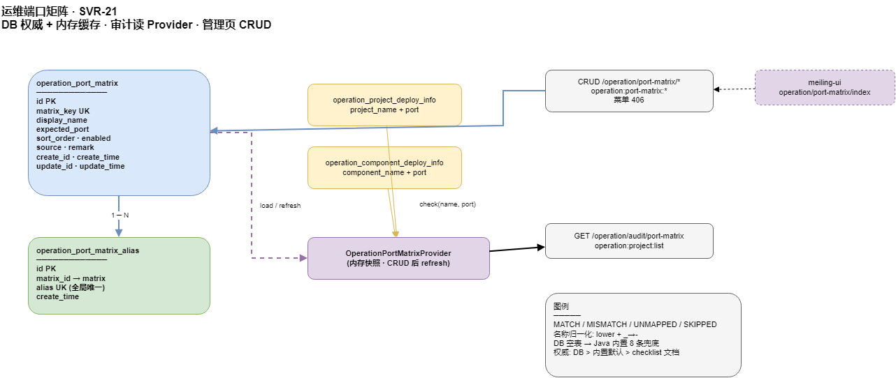

# 端口矩阵可配置化 · 技术方案（SVR-21）

> **状态**：设计稿（待评审） · **更新**：2026-07-11 · **后端**：SVR-21a–c ✅  
> **归属**：`moli-user-center` · 运维模块 · 菜单「运营管理」(id 400)  
> **前置**：SVR-7 已落地（`OperationPortMatrix` Java 硬编码 + `GET /operation/audit/port-matrix`）  
> **关联**：[`server-ops-module-roadmap.md`](server-ops-module-roadmap.md) · [`operation-port-matrix-api.md`](../api/operation-port-matrix-api.md) · [`24_operation_port_matrix.sql`](../sql/24_operation_port_matrix.sql)

---

## 1. 背景与问题

### 1.1 现状

端口审计（SVR-7）用 Java 类 `OperationPortMatrix` 维护「服务名 → 期望端口」映射：

```15:24:moli-user-center/moli-user-center-server/src/main/java/com/moli/user/center/server/operation/audit/OperationPortMatrix.java
    private static final List<Entry> ENTRIES = Arrays.asList(
            entry("gateway", "21000", "gateway", "moli-gateway"),
            entry("user-center", "8888", "user-center", "moli-user-center", "user-center-server", "moli-server"),
            // ...
    );
```

文档侧对照表在 `docs/ops/production-checklist.md` §2 与 `docs/api/operation-frontend.md` §7。

### 1.2 痛点

| # | 问题 | 影响 |
|---|------|------|
| P1 | 改端口要改 Java + 重编译发版 | 运维无法自助 |
| P2 | 文档与代码双份维护 | 易漂移 |
| P3 | 新增服务/别名要走开发流程 | 台账 `UNMAPPED` 长期存在 |
| P4 | 与 `ops.deploy.services` 别名部分重叠 | 两处各改一遍 |

### 1.3 目标

1. **运行时权威**改为 DB：运维在 Web 管理页维护矩阵，**无需发版**即可改期望端口与别名。
2. **审计行为不变**：项目/组件 `portMatchStatus`、`GET /operation/audit/port-matrix` 逻辑与 SVR-7 一致。
3. **可迁移**：`24_operation_port_matrix.sql` 种子数据 = 当前 Java 硬编码，上线无感切换。
4. **权限独立**：矩阵 CRUD 与台账查看分离（见 §5）。

---

## 2. 范围

### 2.1 本迭代（SVR-21 v1）

| 包含 | 不包含 |
|------|--------|
| 表 `operation_port_matrix` + `operation_port_matrix_alias` | 按环境（dev/test/pro）分套矩阵 |
| CRUD API + 菜单 + 权限码 | 从各服务 `server.port` 自动发现 |
| 内存缓存 + CRUD 后热刷新 | 与 `ops.deploy.services` 双向自动同步 |
| 审计读 DB；空表回退内置默认 | 变更审批工作流 |
| 前端管理页契约（用户方实现） | Agent 改 `meiling-ui` |

### 2.2 与 `production-checklist.md` 的关系

| 层级 | 角色 |
|------|------|
| **DB 矩阵** | **运行时审计标准**（比对台账时的期望端口） |
| **`production-checklist.md` §2** | 发布前人工核对清单；实现后加注「以运维台端口矩阵为准」 |
| **Java 内置默认** | 仅 DB 为空时的兜底（启动告警日志），不作为长期维护入口 |

---

## 3. 数据模型

### 3.1 ER



源文件：[`moli-operation-port-matrix.drawio`](../diagrams/moli-operation-port-matrix.drawio)

### 3.2 表 `operation_port_matrix`

| 字段 | 类型 | 约束 | 说明 |
|------|------|------|------|
| `id` | bigint | PK | 雪花 ID |
| `matrix_key` | varchar(64) | UK | 矩阵主键，如 `user-center`；小写+连字符 |
| `display_name` | varchar(128) | | 展示名，如「用户中心」 |
| `expected_port` | varchar(16) | NOT NULL | 期望端口，如 `8888` |
| `sort_order` | int | DEFAULT 0 | 列表排序 |
| `enabled` | tinyint(1) | DEFAULT 1 | 0=停用，不参与匹配 |
| `source` | varchar(256) | | 来源说明，默认 `ops-console` |
| `remark` | varchar(512) | | 备注 |
| `create_id` / `create_time` / `update_id` / `update_time` | | | 标准审计字段 |

**索引**：`uk_matrix_key(matrix_key)`、`idx_port_matrix_enabled(enabled, sort_order)`。

### 3.3 表 `operation_port_matrix_alias`

| 字段 | 类型 | 约束 | 说明 |
|------|------|------|------|
| `id` | bigint | PK | |
| `matrix_id` | bigint | NOT NULL | → `operation_port_matrix.id` |
| `alias` | varchar(128) | UK | 归一化后全局唯一；如 `moli-server` |
| `create_time` | datetime | | |

**索引**：`uk_alias(alias)`、`idx_matrix_alias_matrix_id(matrix_id)`。

**设计说明**：

- 别名**全局唯一**，避免 `moli-server` 同时映射两个 matrix_key。
- `matrix_key` 本身参与匹配，**不必**写入 alias 表（与现 `OperationPortMatrix` 一致）。
- 逻辑外键，无物理 FK（与 `operation_*` 其它表风格一致）。

### 3.4 种子数据

迁移脚本从当前硬编码插入 8 条主记录 + 别名，与 §7 对照表一致。详见 [`24_operation_port_matrix.sql`](../sql/24_operation_port_matrix.sql)。

---

## 4. 匹配与审计算法（与 SVR-7 兼容）

### 4.1 名称归一化

```
normalize(name) = trim(name).toLowerCase().replace('_', '-')
```

### 4.2 解析顺序

1. 加载所有 `enabled=1` 的主记录 + 别名（内存缓存，按 `sort_order` 升序）。
2. 对台账 `project_name` / `component_name` 做 `normalize`。
3. 遍历条目：若 `normalize(matrix_key) == normalized` → 命中；否则遍历别名。
4. **先命中先返回**（`sort_order` 决定遍历顺序；别名全局唯一，无歧义）。

### 4.3 端口比对

| 实际端口 | 状态码 | 说明 |
|----------|--------|------|
| 空 / `-` | `SKIPPED` (3) | 无端口可比对 |
| 无匹配名 | `UNMAPPED` (0) | 未在矩阵登记 |
| 等于 `expected_port` | `MATCH` (1) | 一致 |
| 不等 | `MISMATCH` (2) | 返回期望与实际 |

状态码定义不变：`OperationPortMatchStatus`。

### 4.4 缓存

| 项 | 约定 |
|----|------|
| 组件 | `OperationPortMatrixProvider`（新建） |
| 加载时机 | `@PostConstruct` + 每次矩阵 CRUD 成功后 `refresh()` |
| 并发 | `volatile` 不可变快照或 `ReentrantReadWriteLock` |
| 空表 | 回退 `OperationPortMatrixDefaults`（当前 8 条），`WARN` 日志一次 |
| 停用条目 | `enabled=0` 不参与匹配，审计结果变为 `UNMAPPED` |

---

## 5. 权限与菜单

父菜单：**运营管理** `sys_menu.id = 400`。

| 资源 | menu_id | perm_code | 说明 |
|------|---------|-----------|------|
| 端口矩阵管理（新菜单） | **406** | `operation:port-matrix:list` | 列表/详情 |
| 按钮 | 406 | `operation:port-matrix:add` | 新增 |
| 按钮 | 406 | `operation:port-matrix:edit` | 编辑 |
| 按钮 | 406 | `operation:port-matrix:remove` | 删除 |

| 接口 | 权限 |
|------|------|
| `GET/POST/PUT/DELETE /operation/port-matrix/*` | 上表 `operation:port-matrix:*` |
| `GET /operation/audit/port-matrix` | **保持** `operation:project:list`（只读审计，不改） |
| 项目/组件列表 `portMatchStatus` | **保持** 各模块 `list` 权限 |

**角色种子**：`sys_role_action` 为 role 1/2 授予四项权限（与平台/服务器 CRUD 一致）。

---

## 6. 后端改造要点

### 6.1 新增类（规划）

| 类 | 职责 |
|----|------|
| `OperationPortMatrix`（实体） | MyBatis 表映射 |
| `OperationPortMatrixAlias` | 别名实体 |
| `OperationPortMatrixMapper` / `AliasMapper` | CRUD |
| `OperationPortMatrixService` | 业务校验、别名全量替换、缓存刷新 |
| `OperationPortMatrixController` | REST `/operation/port-matrix` |
| `OperationPortMatrixProvider` | `check(name, port)`、`entries()` 供审计 |
| `OperationPortMatrixDefaults` | 内置 8 条兜底 |

### 6.2 替换调用点

| 调用方 | 改动 |
|--------|------|
| `OperationAuditServiceImpl` | `OperationPortMatrix.check` → `provider.check` |
| `OperationProjectServiceImpl` | 同上 |
| `OperationComponentServiceImpl` | 同上 |
| 原 `audit.OperationPortMatrix` | 标记 `@Deprecated`，测试迁到 `Provider` + 集成测 |

### 6.3 校验规则

| 字段 | 规则 |
|------|------|
| `matrix_key` | 必填；`^[a-z][a-z0-9-]{0,63}$`；唯一 |
| `expected_port` | 必填；`1..65535` 整数 |
| `alias` | 每条 `^[a-z][a-z0-9-]{0,127}$`；列表内去重；全局不可与其它行的 key/alias 冲突 |
| 删除 | 支持批量；无「至少保留一条」限制 |
| 别名数量 | 单条主记录 ≤ 32 个别名 |

### 6.4 `OperationPortAuditVo` 增量

`matrix[].source` 改为 DB 行 `source`（如 `ops-console`、`migration:java-default`），不再写死 `docs/ops/production-checklist.md`。

---

## 7. 矩阵初始对照（种子 = 现硬编码）

| matrix_key | display_name | expected_port | 别名（不含 key 自身） |
|------------|--------------|---------------|----------------------|
| gateway | 网关 | 21000 | gateway, moli-gateway |
| user-center | 用户中心 | 8888 | user-center, moli-user-center, user-center-server, moli-server |
| order | 订单服务 | 8087 | order, moli-order |
| knowledge | 知识库 | 8090 | knowledge, moli-knowledge, knowledge-server |
| bi | BI 服务 | 1128 | bi, moli-bi |
| nacos | Nacos | 8848 | nacos |
| mysql | MySQL | 3306 | mysql |
| redis | Redis | 6379 | redis |

---

## 8. 前端管理页（契约 · 用户方实现）

> 路由与组件由 **meiling-ui** 维护；后端只保证 API 契约。详见 [`operation-port-matrix-api.md`](../api/operation-port-matrix-api.md) 与 [`operation-frontend.md`](../api/operation-frontend.md) §14。

### 8.1 路由

| 项 | 值 |
|----|-----|
| 菜单 path | `operation/port-matrix/index` |
| route_name | `OperationPortMatrix`（建议） |
| 权限 | `operation:port-matrix:list` |

### 8.2 页面结构

```
┌─────────────────────────────────────────────────────────┐
│ 端口矩阵管理                          [新增] [刷新缓存提示] │
├─────────────────────────────────────────────────────────┤
│ 表格：matrixKey | 展示名 | 期望端口 | 别名(tags) | 启用 | 操作 │
│ 行内：编辑 | 删除                                         │
├─────────────────────────────────────────────────────────┤
│ 弹窗表单：                                                │
│   matrixKey（新增可编辑，编辑只读）                        │
│   displayName / expectedPort / sortOrder / enabled       │
│   aliases：Tag 多选输入（回车添加，× 删除）                  │
│   remark / source（可选，默认 ops-console）                │
└─────────────────────────────────────────────────────────┘
```

### 8.3 与现有页联动

| 入口 | 行为 |
|------|------|
| 项目管理 / 组件管理 · 端口审计弹窗（S3） | 增加链接「管理端口矩阵」→ 跳转本页 |
| 驾驶舱 ops KPI `portMismatches` | 无改动（仍读 stats API） |

### 8.4 i18n 键（建议）

`operation.portMatrix.title`、`operation.portMatrix.aliasHint`、`operation.portMatrix.expectedPort` 等，与 `operation/project` 命名风格一致。

---

## 9. 实施步骤

| 步骤 | 交付 | 负责 |
|------|------|------|
| 1 | 评审本文 + API 契约 | 产品/运维 |
| 2 | `24_operation_port_matrix.sql` 在目标库执行 | 运维 |
| 3 | 后端 Entity/Mapper/Service/Controller/Provider | Agent |
| 4 | 单测：`OperationPortMatrixProviderTest`、CRUD 校验 | Agent |
| 5 | 替换三处 `portMatchStatus` 调用 | Agent |
| 6 | `operation-frontend.md` §14、`user-center-api-map.md` 更新 | Agent |
| 7 | meiling-ui 管理页 + 菜单 406 | 用户方 |
| 8 | `production-checklist.md` §2 加注 DB 权威说明 | Agent |
| 9 | 验收：改矩阵端口 → 无需重启 → 审计即时变化 | 联调 |

**迁移顺序**：在 `23_operation_schema_hardening.sql` 之后执行 `24_operation_port_matrix.sql`（见 [`sql-migration-order.md`](../ops/sql-migration-order.md)）。

---

## 10. 验收标准

| # | 场景 | 期望 |
|---|------|------|
| A1 | 新库执行 24 脚本后 `GET /operation/audit/port-matrix` | `matrix` 含 8 条种子 |
| A2 | 台账 `moli-server:9080` | `MISMATCH`，期望 8888 |
| A3 | 管理页把 user-center 改为 9080 并保存 | 无需重启，同一台账变为 `MATCH` |
| A4 | 新增别名 `moli-uc` 映射 user-center | 台账名 `moli-uc:8888` → `MATCH` |
| A5 | 停用 mysql 行 | `MySQL:3306` → `UNMAPPED` |
| A6 | 无 `operation:port-matrix:edit` 用户调用 PUT | 403 |
| A7 | DB 表清空后重启 | 回退内置默认 + WARN 日志，审计仍可用 |

---

## 11. 后续演进（v2，不在本迭代）

| 方向 | 说明 |
|------|------|
| 按环境矩阵 | `environment` 列；pro 用 8888、dev 用 9080 |
| 与 deploy 同步 | 保存矩阵时可选「同步到 `ops.deploy.services` 别名」 |
| 导出 checklist | `GET /operation/port-matrix/export` 生成 Markdown 片段 |
| 变更审计 | `sys_operation_log` 记录矩阵变更前后 diff |

---

## 12. 相关文档

- API 契约：[`operation-port-matrix-api.md`](../api/operation-port-matrix-api.md)
- 前端对接：[`operation-frontend.md`](../api/operation-frontend.md) §14
- SQL：[`24_operation_port_matrix.sql`](../sql/24_operation_port_matrix.sql)
- 验收：[`operation-port-matrix-acceptance.md`](../test/operation-port-matrix-acceptance.md)
- 路线图：[`server-ops-module-roadmap.md`](server-ops-module-roadmap.md) §5 SVR-21
- 现网端口清单：[`production-checklist.md`](../ops/production-checklist.md) §2
