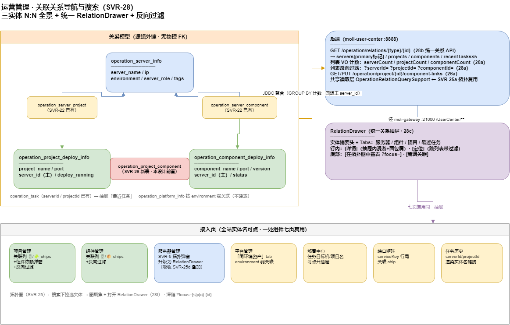

# 运营管理 · 关联关系导航与搜索（SVR-28）

> 更新：2026-07-12 · 状态：**设计稿（待排期）**
> 归属：`moli-user-center` · 菜单「运营管理」(id 400) 全部子页 · meiling-ui
> 姊妹篇：[`server-topology-visualization.md`](server-topology-visualization.md)（SVR-25 拓扑图 = 全局视角；本篇 = **列表内的关系视角**，两者共用关系数据）
> 前置：**SVR-26a `operation_project_component` 表提级为本设计前置**（没有它「项目↔组件」无从谈起）

---

## 1. 需求与问题

运营管理台账三实体互相关联，但目前**关系是单向、藏在弹窗里的**：

| # | 问题 | 现状 |
|---|------|------|
| 1 | 项目列表看不出「这个项目挂了几台服务器、依赖几个组件」 | 只有「关联服务器」单元格（SVR-22 弹窗），组件依赖不存在 |
| 2 | 组件列表看不出「这个组件部署在几台机、被几个项目用」 | 只有服务器方向；**项目方向缺失** |
| 3 | 服务器 → 项目/组件 有拓扑弹窗（SVR-5），但项目/组件反向没有对称入口 | 不对称 |
| 4 | 无法按关系**搜索/定位**：如「找出用到 MySQL 组件的所有项目」「8.155 这台机上跑了什么」 | 只能逐页人肉翻 |
| 5 | 部署中心/任务历史/端口矩阵里的 serverId/projectId 是裸数字或纯文本，点不动 | 断链 |

## 2. 关系模型（全景）

```
operation_server_info ──N:N── operation_project_deploy_info
        │                              │
        N:N                    N:N（SVR-26 新表 operation_project_component）
        │                              │
operation_component_deploy_info ───────┘
（server↔project / server↔component 已有 SVR-22；主 server_id 回退规则不变）
```

- **平台（operation_platform_info）不建关系表**：它是外部系统账号台账，只有 `environment` 字段，按环境**弱关联**展示即可（见 §6 平台行）。
- **任务（operation_task）**已带 `serverId` / `projectId` 逻辑外键，天然是关系数据，只缺前端联动。

ER + 交互图：[`moli-operation-relations-nav.drawio`](../diagrams/moli-operation-relations-nav.drawio)



---

## 3. 后端设计

### 3.1 列表 VO 带关系计数（避免 N+1）

`OperationProjectVo` / `OperationComponentVo` / `OperationServerVo`（列表接口）各加计数字段，一次 `GROUP BY` 聚合回填：

| VO | 新增字段 |
|----|----------|
| 项目 | `serverCount`（已可由 `serverIds.size()` 推得，显式化）、`componentCount` |
| 组件 | `serverCount`、`projectCount` |
| 服务器 | `projectCount`、`componentCount`（列表页直接显示，不用点拓扑才知道） |

实现：`OperationRelationCountSupport`，对当前页 id 集合各查一条 `SELECT xx_id, COUNT(*) ... WHERE xx_id IN (...) GROUP BY xx_id`（含主 `server_id` 回退合并），O(1) 条 SQL/关系方向。

### 3.2 统一关系详情 API

```http
GET /operation/relations/{entityType}/{id}     # entityType = server | project | component
```

权限复用对应列表权限（server→`operation:server:list`，其余→`operation:project:list`）。响应（`OperationRelationsVo`）：

```jsonc
{
  "entityType": "project",
  "entity": { "id": 101, "name": "moli-user-center", "environment": 1 },
  "servers":    [ { "id", "serverName", "ip", "environment", "serverRole", "tags", "status", "primary": true } ],
  "projects":   [ /* 组件/服务器视角才有 */ ],
  "components": [ { "id", "componentName", "port", "version", "status", "portMatchStatus" } ],
  "recentTasks": [ { "id", "taskType", "action", "status", "createTime" } ]   // 最多 5 条
}
```

要点：

- **一个接口吃三个方向**，`servers` 里标 `primary`（主 `server_id`）
- `recentTasks` 按 `serverId` / `projectId` 命中 `operation_task` 取最近 5 条
- 单机版 `GET /operation/server/{id}/topology`（SVR-5）**保留不动**，新 API 是它的泛化；前端逐步迁到新 API 后再评估下线
- SVR-25a 的 `GET /operation/topology`（全局图）与本 API 共享 `OperationRelationQuerySupport` 的 N:N 读取（含回退），只写一份

### 3.3 列表反向过滤

现有列表接口加 query 参数（MyBatis-Plus 拼接，走 N:N 子查询 + 主 `server_id` 回退）：

| 接口 | 新增参数 | 语义 |
|------|----------|------|
| `GET /operation/project/list` | `serverId` / `componentId` | 部署在某机 / 依赖某组件的项目 |
| `GET /operation/component/list` | `serverId` / `projectId` | 部署在某机 / 被某项目依赖的组件 |
| `GET /operation/server/list` | `projectId` / `componentId` | 承载某项目 / 某组件的服务器 |

### 3.4 SVR-26（项目↔组件）落地项（自 SVR-25 设计提级）

- 表 `operation_project_component(project_id, component_id, remark)`，逻辑外键，`uk(project_id, component_id)`
- `GET/PUT /operation/project/{id}/component-links`（对称 SVR-22 links 风格，PUT 全量替换）
- 删除项目/组件时 `OperationServerCascadeSupport` 级联清理
- 迁移脚本编号顺延（预计 `29_operation_project_component.sql`，28 已留给拓扑菜单）

---

## 4. 前端设计

### 4.1 列表「关联」列（三个管理页统一）

项目/组件/服务器列表各加一列「关联」，用计数 chips（可点）：

| 页 | chips 示例 |
|----|-----------|
| 项目管理 | `🖥 2` `🧩 3`（服务器数 / 组件数） |
| 组件管理 | `🖥 1` `📦 4`（服务器数 / 项目数） |
| 服务器管理 | `📦 3` `🧩 2`（项目数 / 组件数） |

- 计数为 0 显示灰色 `—`；点 chip 打开 **RelationDrawer** 并定位到对应 tab
- 现有「关联服务器」单元格（SVR-22 `OperationLinkedServersCell`）保留编辑入口，查看职责移交 chips

### 4.2 `RelationDrawer`（统一关系抽屉，核心新组件）

`meiling-ui/src/components/operation/RelationDrawer.vue`，任意实体一键展开：

```
┌─ RelationDrawer ────────────────────────────┐
│ [icon] moli-user-center  · dev · 运行中      │  ← 实体摘要头
│ ─────────────────────────────────────────── │
│ Tabs: [服务器 2] [组件 3] [最近任务 5]        │  ← 按 entityType 显示 2~3 个关系 tab
│  ├ 172.20.8.155  主✦  app  [详情] [定位]     │  ← 行内操作
│  ├ 172.20.8.156       db   [详情] [定位]     │
│ ─────────────────────────────────────────── │
│ [在拓扑图中查看]  [编辑关联]                  │  ← 底部动作
└─────────────────────────────────────────────┘
```

行内操作语义：

| 操作 | 行为 |
|------|------|
| **详情** | 服务器行 → `ServerDetailModal`；项目/组件行 → 抽屉内切换实体（`push` 面包屑，可返回，形成**关系漫游**） |
| **定位** | 跳对应管理页并带过滤参数（如组件行 → `operation/component/index?projectId=101`），列表自动筛出该关系集 |
| **在拓扑图中查看** | 跳 SVR-25 拓扑页 `operation/topology/index?focus=p-101`（深链参数从 `?serverId=` 泛化为 `?focus={s|p|c}-{id}`） |
| **编辑关联** | 打开既有 `OperationServerLinksModal` / 新的组件依赖多选弹窗（复用同一模板） |
| 任务行 | 点开 `DeployTaskDrawer`（已有） |

数据源：§3.2 统一 API，一次请求填满抽屉。

### 4.3 列表页过滤联动（定位）

- 三个管理页 URL query 支持 `serverId` / `projectId` / `componentId`，进页读取并显示**可关闭的过滤 chip**（如 `筛选：服务器 172.20.8.155 ×`），关闭即清参重查
- 与现有 环境/角色/标签/关键字 筛选可叠加

### 4.4 全局关系搜索（拓扑页搜索框升级）

SVR-25b 拓扑页工具栏的关键字筛选升级为**实体搜索下拉**：

- 输入即在**本次已加载的全量图数据**内存匹配（服务器名/IP/项目名/组件名/端口，无需新 API）
- 下拉分组显示三类实体，选中 → 图聚焦该节点 + 打开 RelationDrawer
- 列表页顶部不重复做全局搜索，统一引导到拓扑页（避免三处维护）

---

## 5. 设计如何复用到运营管理其它子页（问题 1 的回答）

| 子页 | 应用点 | 改动量 |
|------|--------|--------|
| **项目管理** | 关联列 chips + RelationDrawer + `serverId/componentId` 过滤 + 组件依赖维护入口 | 主战场 |
| **组件管理** | 对称：chips（服务器/项目）+ 反向过滤 | 主战场 |
| **服务器管理** | 拓扑弹窗（SVR-5 列表式）**升级为 RelationDrawer**，SVR-25d 的部署/端口/任务叠加直接做进抽屉，不再单独改旧弹窗 | 替换升级 |
| **平台管理** | 抽屉「同环境资产」tab：按 `environment` 弱关联列出同环境服务器/项目（只读、不建表），解决「这个平台账号对应哪套环境的机器」 | 低 |
| **部署中心** | 任务卡片/行内的服务器、项目名变为可点 → RelationDrawer；发任务前可从抽屉确认目标机上还跑着什么 | 低 |
| **端口矩阵** | 矩阵行 `serviceKey` 若映射到项目/组件，行尾加「关联」chip → RelationDrawer；端口冲突排查时直接看该机全部占用 | 低 |
| **任务历史** | `serverId` / `projectId` 列渲染为实体名链接 → RelationDrawer；列表加同名过滤参数 | 低 |

统一原则：**全站任何出现服务器/项目/组件名字的地方，都应可点、点开都是同一个 RelationDrawer**——一处组件、七页复用。

---

## 6. 验收用例

| # | 用例 |
|---|------|
| 1 | 项目列表「关联」列计数与 N:N 行数一致（含主 `server_id` 回退去重） |
| 2 | 项目 A 依赖 MySQL、Redis → 组件 tab 显示 2 行；在组件管理页对 MySQL 点「项目 4」→ 列表筛出含 A 的 4 个项目 |
| 3 | RelationDrawer 内 组件行点「详情」→ 抽屉切到该组件视角，面包屑可回退 |
| 4 | 抽屉「在拓扑图中查看」→ 拓扑页聚焦对应节点 |
| 5 | 任务历史行点项目名 → 打开该项目 RelationDrawer，最近任务 tab 含该条 |
| 6 | 平台管理抽屉列出同环境服务器/项目；无关联表数据也能工作 |
| 7 | 删除组件 → `operation_project_component` 级联清理，项目 chips 计数 -1 |

---

## 7. 任务编号（并入 roadmap）

| 任务 | 内容 | 依赖 |
|------|------|------|
| **SVR-26a** | `operation_project_component` 表 + 级联 + `component-links` API（`29_operation_project_component.sql`） | — |
| **SVR-26b** | 项目页组件依赖维护弹窗（复用 links 弹窗模板） | 26a |
| **SVR-28a** | 列表 VO 关系计数（`OperationRelationCountSupport`）+ 三列表反向过滤参数 | 26a |
| **SVR-28b** | 统一关系 API `GET /operation/relations/{type}/{id}`（含 recentTasks） | 26a |
| **SVR-28c** | `RelationDrawer` + 三管理页「关联」列 chips + URL 过滤 chip | 28a/b |
| **SVR-28d** | 服务器页拓扑弹窗替换为 RelationDrawer（吸收 SVR-25d） | 28c |
| **SVR-28e** | 平台/部署中心/端口矩阵/任务历史 四页接入（实体名可点 + 过滤） | 28c |
| **SVR-28f** | 拓扑页搜索下拉 + `?focus=` 深链泛化（与 SVR-25b 合并实施） | SVR-25b |

**建议实施顺序**：26a → 28a → 28b → 28c →（25a/25b 拓扑图并行）→ 28d/e/f。
拓扑图（SVR-25）与关系导航（SVR-28）共用后端关系读取层，先做 28a/b 时把 `OperationRelationQuerySupport` 抽出来，25a 直接复用。

## 8. 非目标

- 平台↔项目实体关联表（环境弱关联够用，有真实需求再建）
- 关系变更审计流水（`MoliLog` 已覆盖 PUT links）
- 组件间依赖（组件↔组件，如 canal→mysql）——规模不需要
