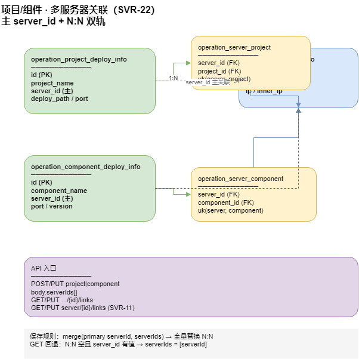

# 项目/组件 · 多服务器关联（SVR-22）

> 更新：2026-07-13 · 状态：**后端 ✅**（项目 + 组件对称）· **前端 S6-b ✅**  
> 归属：`moli-user-center` · `operation_server_project` / `operation_server_component`  
> 前端任务：**S6-b**（项目/组件编辑页多选服务器）· 图 [`moli-operation-server-links.drawio`](../diagrams/moli-operation-server-links.drawio)

---

## 1. 背景

运维台账中，同一逻辑项目（如 `moli-server`）或组件（如 `Redis`）常部署在**多台服务器**（dev / test / pre / pro）。  
早期 UI 仅支持单选「关联服务器」，与业务期望不符。

后端已有 N:N 关联表与**从服务器侧**维护的 API（SVR-11），但项目/组件 CRUD 未暴露 `serverIds`，列表 VO 也未回填多选结果。

---

## 2. 数据模型（双轨）



[源文件：`moli-operation-server-links.drawio`](../diagrams/moli-operation-server-links.drawio)

| 层 | 表 / 字段 | 含义 |
|----|-----------|------|
| **主表（部署实例）** | `operation_project_deploy_info` / `operation_component_deploy_info` | 一行 = 一条部署台账 |
| **主服务器** | `server_id` + `server_ip` | **主**关联，用于部署中心 `projectId`/`serverId`、探活、端口矩阵、进程状态同步 |
| **N:N 关联** | `operation_server_project` / `operation_server_component` | `(server_id, project_id|component_id)` 多对多，表达「还关联哪些服务器」 |
| **唯一约束** | `uk_server_project` / `uk_server_component` | 同一对不可重复（见 `23_operation_schema_hardening.sql`） |

### 2.1 语义约定

1. **`server_id`（主）**：部署/探活/启停的**默认目标**；`serverIds[0]` 与 `serverId` 应对齐（保存时后端自动校正）。
2. **`serverIds`（N:N）**：完整关联集合，**含主服务器**；GET 列表/详情时回填。
3. **同名多行**：仍允许（如 `moli-server` 在 dev/pro 各一条台账）；N:N 描述**单条台账**关联的服务器集合，不跨行合并。

### 2.2 与拓扑 / 部署 API 的关系

| 能力 | 使用字段 |
|------|----------|
| `GET /operation/relations/server/{id}` | N:N 非空时仅 N:N；空时回退主 `server_id`（§2.3） |
| `GET /operation/deploy/{key}/status?serverId=` | 单条台账的 **主** `serverId` |
| `POST .../task?serverId=&projectId=` | `projectId` 定位台账行；`serverId` 指定远程主机（须在 N:N 或主 `server_id` 中） |

### 2.3 关系解析与保存同步（2026-07-13）

**原则**：关联以 **`server_id`（数字 ID）** 为准；`server_ip` 为展示/探活冗余字段，随 `serverId` 自动回填。

| 操作 | 行为 |
|------|------|
| `PUT /operation/project/{id}/links` | 全量替换 N:N；**同步**主表 `server_id` / `server_ip` 为 `serverIds[0]`；清空关联时清空主 `server_id` |
| `POST`/`PUT` 项目/组件 CRUD | `serverIds` 非空时 **`serverId` 强制对齐 `serverIds[0]`**，再 `syncLinks` |
| `OperationRelationQuerySupport.resolveServerIdsForProject` | N:N **非空** → 仅返回 N:N；N:N 空 → 回退 `[serverId]`（§6 兼容） |
| `OperationServerBindingSupport.bindProject` | 有 `serverId` → 用服务器台账 IP **覆盖**行内 `server_ip`（换机不留旧 IP） |

**易踩坑**：

- 多台服务器 **同 IP 不同 ID**（如本地 `127.0.0.1` 的 dev/pro 两条台账）→ 必须用弹窗 **按 ID 选**，勿只靠填 IP 反查。
- **`project_name` 可重复**（dev/pro 各一行）→ 计数、关系 API 按 **`project_id`**，不按名称合并。

---

## 3. API 契约

### 3.1 项目（`/operation/project`）

| 方法 | 路径 | 说明 |
|------|------|------|
| `POST` / `PUT` | `/operation/project` | body 增 **`serverIds?: number[]`**；保存后全量同步 `operation_server_project`；**`POST` 响应 `data` 为新建 `id`（Long）** |
| `GET` | `/operation/project/{id}` | VO 含 **`serverIds`** |
| `GET` | `/operation/project/list` | 每行 VO 含 **`serverIds`** |
| `GET` | `/operation/project/{id}/links` | 返回 `{ projectId, serverIds }` |
| `PUT` | `/operation/project/{id}/links` | 全量替换 N:N，并同步主表 `server_id`/`server_ip` 为 `serverIds[0]` |

**`OperationProjectSaveRequest`**（节选）：

```json
{
  "projectName": "moli-server",
  "serverId": 201,
  "serverIds": [201, 202, 204],
  "deployPath": "/opt/moli/moli-server",
  "port": "9080",
  "environment": 1
}
```

校验：`serverId`、`serverIds`、`serverIp` **至少一项**；`serverIds` 中 ID 须存在于 `operation_server_info`。

### 3.2 组件（`/operation/component`）

与项目对称：

| 方法 | 路径 | 说明 |
|------|------|------|
| `POST` / `PUT` | `/operation/component` | body 增 **`serverIds`**；**`POST` 响应 `data` 为新建 `id`（Long）** |
| `GET` | `/operation/component/{id}` / `list` | VO 含 **`serverIds`** |
| `GET` | `/operation/component/{id}/links` | `{ componentId, serverIds }` |
| `PUT` | `/operation/component/{id}/links` | 全量替换 `operation_server_component`，并同步主表 `server_id` |

### 3.3 服务器侧（已有 · SVR-11）

| 方法 | 路径 | 说明 |
|------|------|------|
| `GET` | `/operation/server/{id}/links` | `{ serverId, projectIds, componentIds }` |
| `PUT` | `/operation/server/{id}/links` | 从服务器视角全量替换 |

---

## 4. 后端实现要点

| 类 | 职责 |
|----|------|
| `OperationProjectLinkService` | 项目 N:N 读/写 + `syncLinks(projectId, serverIds, primaryServerId)` |
| `OperationComponentLinkService` | 组件 N:N（对称） |
| `OperationProjectServiceImpl` | create/update 后调用 `syncLinks`；`toVo` 回填 `serverIds` |
| `OperationComponentServiceImpl` | 同上 |
| `OperationServerCascadeSupport` | 删项目/组件/服务器时清理 N:N 行 |

**`syncLinks` 规则**：

1. 合并 `primaryServerId` + `serverIds`（去重，主 ID 排首）。
2. 删除该 project/component 的全部 N:N 行后重新插入。
3. 若合并结果为空，则仅当 `primaryServerId != null` 时插入一条。

---

## 5. 前端对接（S6-b · ✅ 2026-07-12）

实现：`meiling-ui` · `OperationServerLinksModal` · `OperationLinkedServersCell` · `useOperationServerLabelCache`

| ID | 页面 | 改动 | 状态 |
|----|------|------|------|
| **S6-b-1** | 项目列表行 / 编辑弹窗 | 「关联服务器」→ **多选弹窗**；编辑内 `OperationLinkedServersFormSection` | ✅ |
| **S6-b-2** | 组件列表行 / 编辑弹窗 | 同上 | ✅ |
| **S6-b-3** | 列表列 | 主服务器 `名称 · IP` + `+N`；点击主标签查看详情 | ✅ |
| **S6-b-4** | 部署操作 | 启停/status 仍用 **主** `serverId`；多机关联仅台账展示 | ✅ |

**列表数据补全**：列表接口可能只带主 `serverId`；前端 `enrichRowsWithLinks` 对每行补拉 `GET .../links`。若 links 返回空数组 `[]`，应清空行内 `serverIds`/`serverId` 展示（避免取消关联后仍显示旧缓存）。

TypeScript 类型扩展：

```typescript
export type OperationProject = {
  serverId?: number
  serverIds?: number[]   // 含 serverId
  // ...
}
export type OperationComponent = {
  serverId?: number
  serverIds?: number[]
  // ...
}
```

---

## 6. 迁移与兼容

- **已有库**：N:N 表与唯一约束已在 `23_operation_schema_hardening.sql`；**无需新迁移**。
- **历史数据**：若 N:N 为空但 `server_id` 有值，GET 时 **回退** 为 `serverIds: [serverId]`。
- **旧前端**：仅传 `serverId` 仍可用；后端写入单条 N:N。

---

## 7. 验收

| # | 场景 | 期望 |
|---|------|------|
| L1 | 新建项目，`serverIds: [201,202]` | 主表 `server_id=201`；N:N 两行 |
| L2 | 更新项目，改 `serverIds` | N:N 全量替换 |
| L3 | GET 详情 | `serverIds` 与库一致 |
| L4 | 删项目 | N:N 级联删除 |
| L5 | 组件 L1–L4 | 与项目对称 |
| L6 | 仅 `serverId` 无 `serverIds` | N:N 一条，GET 回填 `[serverId]` |
| L7 | 弹窗只选 1 台保存后 | `serverCount`=1；`GET /operation/relations/project/{id}` 仅 1 台；主表 `server_id` 与 N:N 首项一致 |
| L8 | 换关联服务器（旧 IP 仍留在行上） | 保存成功，不报「serverIp 与 serverId 不一致」；`server_ip` 更新为新机 IP |

---

## 8. 相关

- 路线图：[server-ops-module-roadmap.md](server-ops-module-roadmap.md) · **SVR-22**
- 前端说明：[operation-frontend.md](../api/operation-frontend.md) §5.5
- API 索引：[user-center-api-map.md](../api/user-center-api-map.md)
- 改造总览：[operation-module-refactor-plan.md](operation-module-refactor-plan.md)
