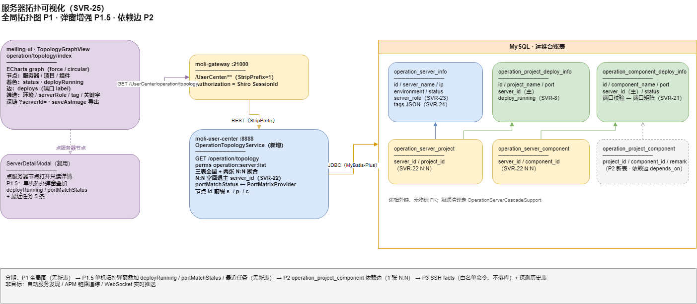

# 服务器拓扑可视化 · 设计（SVR-25）

> 更新：2026-07-13 · 状态：**后端 P1/P2 ✅**（SVR-25a、26a）；**前端 ✅**（SVR-25b/c/d、26b · meiling-ui `OperationTopologyGraphView`）
> 归属：`moli-user-center` · 菜单「运营管理」 · meiling-ui
> 上游：[`server-ops-module-roadmap.md`](server-ops-module-roadmap.md)（SVR-5 拓扑、SVR-8 部署状态、SVR-21 端口矩阵、SVR-22 多服务器、SVR-23 角色、SVR-24 标签）
> 前端契约：[`../api/operation-frontend.md`](../api/operation-frontend.md)
> 姊妹篇：[`operation-relations-navigation.md`](operation-relations-navigation.md)（SVR-28 列表内关系导航；P2 依赖表 SVR-26 已提级为其前置，P1.5 弹窗增强并入 SVR-28d）

---

## 1. 背景与现状

SVR-5 曾提供单服务器拓扑 `GET /operation/server/{id}/topology`，**已于 2026-07-12 删除**；由 `GET /operation/relations/server/{id}`（SVR-28b）承接，前端 RelationDrawer 统一调用。

局限：

| # | 问题 |
|---|------|
| 1 | 只能看**单台**；没有全局视角（哪台机器空、哪台堆满、生产/开发混布一目了然做不到） |
| 2 | 列表式表达不了**结构**；服务器↔项目↔组件的关系靠脑补 |
| 3 | 已有的状态数据没有叠加进来：`deployRunning`（SVR-8）、`portMatchStatus`（SVR-21）在拓扑弹窗里看不到 |
| 4 | 只有「部署在哪」，没有「谁依赖谁」——项目↔组件无关系表，画不出调用链 |

已有可复用资产：

- **ECharts 5.6 + vue-echarts** 已在 meiling-ui（`KnowledgeGraphView.vue` 的 force/circular graph 可直接照搬）
- 健康状态 `status`、部署状态 `deployRunning`、端口校验 `portMatchStatus` 均已入库/入 VO
- `serverRole`（SVR-23）/ `tags`（SVR-24）恰好是图的着色与筛选维度
- `ServerDetailModal`（服务器只读详情弹窗）可作为图上点击的落点

---

## 2. 分期总览

| 期 | 内容 | 动库 | 状态 |
|----|------|------|------|
| **P1** | 全局拓扑图页 `operation/topology/index` + 聚合 API | 否 | ✅ |
| **P1.5** | `RelationDrawer` 叠加部署状态、端口徽章、最近任务 | 否 | ✅（SVR-28d） |
| **P2** | 项目↔组件依赖表 + 图上依赖边（调用链） | **是**（1 张 N:N） | ✅ |
| **P3** | SSH facts 采集、探测历史曲线 | P3b 需新表 | ⬜ |

架构图：[`moli-operation-topology-graph.drawio`](../diagrams/moli-operation-topology-graph.drawio)



---

## 3. P1 · 全局拓扑图

### 3.1 后端：聚合 API

```http
GET /operation/topology            # 权限 operation:server:list
```

一次返回全量图数据（当前规模 6 服务器 / 8 组件 / 若干项目，无分页必要；>200 节点再考虑按环境分片）：

```jsonc
// MoliResult<OperationTopologyGraphVo>
{
  "servers":    [ { "id", "serverName", "ip", "innerIp", "environment", "serverRole", "tags", "status" } ],
  "projects":   [ { "id", "projectName", "port", "environment", "deployRunning", "portMatchStatus" } ],
  "components": [ { "id", "componentName", "port", "version", "environment", "status", "portMatchStatus" } ],
  "links": [
    { "source": "s-201", "target": "p-101", "type": "deploys" },   // 服务器→项目
    { "source": "s-201", "target": "c-301", "type": "deploys" }    // 服务器→组件
  ]
}
```

实现要点：

- 新增 `OperationTopologyService.getGraph()`：三表全量 + `operation_server_project` / `operation_server_component` 两张 N:N；**N:N 为空回退主 `server_id`**（与 SVR-22 读规则一致）
- 节点 ID 前缀区分类型：`s-` / `p-` / `c-`（前端 ECharts 需要全局唯一 id）
- 不含密码/SSH 字段；VO 只挑图需要的列
- 复用 `OperationPortMatrixProvider` 给组件补 `portMatchStatus`

### 3.2 前端：`TopologyGraphView`

路由 `operation/topology/index`，菜单挂「运营管理」下（perms `operation:server:list`，无需新权限码；菜单 SQL 见 §3.4）。

**图渲染**（复用 `KnowledgeGraphView` 模式）：

| 维度 | 映射 |
|------|------|
| 节点大小 | 服务器 > 项目 > 组件 |
| 节点颜色 | 健康状态：绿 `1` / 红 `2` / 灰 `0` / 琥珀 `3`；项目用 `deployRunning` 绿/灰 |
| 节点符号 | 服务器=roundRect、项目=circle、组件=diamond（或 `serverRole` 图标） |
| 边 | `deploys` 实线；label 显示组件端口；`portMatchStatus=2` 边红色 |
| 布局 | force（默认）/ circular 切换，与知识图谱一致 |

**工具栏筛选**（前端内存过滤，不重复请求）：

- 环境（`EnvironmentSelect` include-all）
- 角色（`ServerRoleSelect` include-all）
- 标签（`tag-options` 下拉）
- 关键字（名称/IP）

**交互**：

- 点服务器节点 → `ServerDetailModal`；点项目/组件 → tooltip 或跳对应管理页（带 query 过滤）
- 双击服务器 → 高亮其一跳邻居（ego 聚焦），再双击还原
- ECharts toolbox `saveAsImage` 导出 PNG
- 深链 `?serverId=201`：进页后自动聚焦该节点
- 顶部统计条：服务器/项目/组件计数 + 不可达数（红字），数据即本次响应聚合，不再调 `/operation/stats`

### 3.3 验收（P1）

| # | 用例 |
|---|------|
| 1 | 全量渲染：6 服务器 + 项目 + 组件，边数 = N:N 行数（含主 `server_id` 回退） |
| 2 | MinIO 不可达（`status=2`）→ 节点红色 |
| 3 | 筛选 `environment=4` 只剩生产泳道相关节点 |
| 4 | 筛选 `serverRole=db` / `tag=pro` 正确过滤 |
| 5 | 点服务器节点弹 `ServerDetailModal`；深链 `?serverId=201` 自动聚焦 |
| 6 | 导出 PNG 成功 |

### 3.4 菜单 SQL（上线时）

新 C 菜单挂 400 下：`operation/topology/index`，perms 复用 `operation:server:list`（无新权限码，不需要角色重新授权）。迁移脚本编号顺延（预计 `28_operation_topology_menu.sql`）。

---

## 4. P1.5 · 现有拓扑弹窗增强（不画图也先变有用）

单服务器拓扑弹窗（`ServerManageView` 内）叠加已有数据：

| 项 | 数据源 | UI |
|----|--------|-----|
| 项目行部署状态 | `deployRunning`（列表 VO 已有；topology VO 需补） | 运行中/已停止/未同步 徽章 |
| 组件行端口校验 | `portMatchStatus` / `expectedPort`（topology VO 需补） | `PortMatchBadge` |
| 最近任务 | `GET /operation/task/list?serverId=`（已有） | 弹窗底部「最近任务」5 条：类型/状态/时间，点击开 `DeployTaskDrawer` |

P1.5 弹窗增强（部署/端口徽章 + 最近任务）由 `OperationRelationsVo` 字段直接提供，在 RelationDrawer（SVR-28d）中展示。

---

## 5. P2 · 项目↔组件依赖（调用链）

### 5.1 表

```sql
CREATE TABLE `operation_project_component` (
  `id` bigint NOT NULL,
  `project_id` bigint NOT NULL,
  `component_id` bigint NOT NULL,
  `remark` varchar(256) NULL DEFAULT NULL COMMENT '依赖说明，如 业务库/会话缓存',
  PRIMARY KEY (`id`),
  UNIQUE INDEX `uk_operation_project_component`(`project_id`, `component_id`),
  INDEX `idx_opc_component`(`component_id`)
) COMMENT = '项目→组件依赖（手工维护）';
```

- 逻辑外键、无物理 FK（与现有 N:N 一致）；删除项目/组件时级联清理（`OperationServerCascadeSupport` 扩展）

### 5.2 API 与 UI

- `GET/PUT /operation/project/{id}/component-links`（对称 SVR-22 的 links 风格；PUT 全量替换）
- 项目管理行内「依赖组件」按钮 → 复用 `OperationServerLinksModal` 的多选形态（列表换组件）
- 拓扑图新增边型 `depends_on`（虚线箭头 项目→组件）；开关「显示依赖边」

### 5.3 数据来源策略

先**手工维护**（6 台机器规模够用）；将来可选从 Nacos 注册/网关路由自动发现，属独立课题不在本期。

---

## 6. P3 · 运行时增强（远期）

| 项 | 方案 | 依赖 |
|----|------|------|
| **P3a SSH facts** | 「采集」按钮跑**固定白名单**命令（`uptime` / `df -h` / `free -m` / `docker ps --format ...`），走已有 `OperationSshClient`；结果存内存缓存（TTL 5min）不落库；权限 `operation:command:exec` | 无新表 |
| **P3b 探测历史** | 新表 `operation_probe_history(server_or_component, status, cost_ms, created)`；probe-all 与单点探测后 append；详情页画最近 7 天可用率折线 | 新表 + 定时清理（保留 30 天） |

P3a 安全约束：命令列表硬编码在服务端常量，**不接受前端传入命令**（与 SVR-19 自由命令通道区分开）。

---

## 7. 非目标

- 自动服务发现（Nacos/网关抓取拓扑）——P2 之后单独评估
- APM / 链路追踪（SkyWalking 等）——超出台账定位
- 实时推送（WebSocket 刷新拓扑）——探活是手动/定时触发，轮询已够

---

## 8. 任务编号（并入 roadmap）

| 任务 | 内容 |
|------|------|
| **SVR-25a** | 后端 `GET /operation/topology` 聚合 API + VO |
| **SVR-25b** | 前端 `TopologyGraphView`（ECharts force/circular + 筛选 + 详情联动 + 导出） |
| **SVR-25c** | 菜单 SQL `28_operation_topology_menu.sql` |
| **SVR-25d** | P1.5 弹窗增强（部署/端口徽章 + 最近任务） |
| **SVR-26a** | `operation_project_component` 表 + 级联 + API |
| **SVR-26b** | 项目页依赖维护 UI + 拓扑依赖边 |
| **SVR-27a/b** | P3 SSH facts / 探测历史 |
