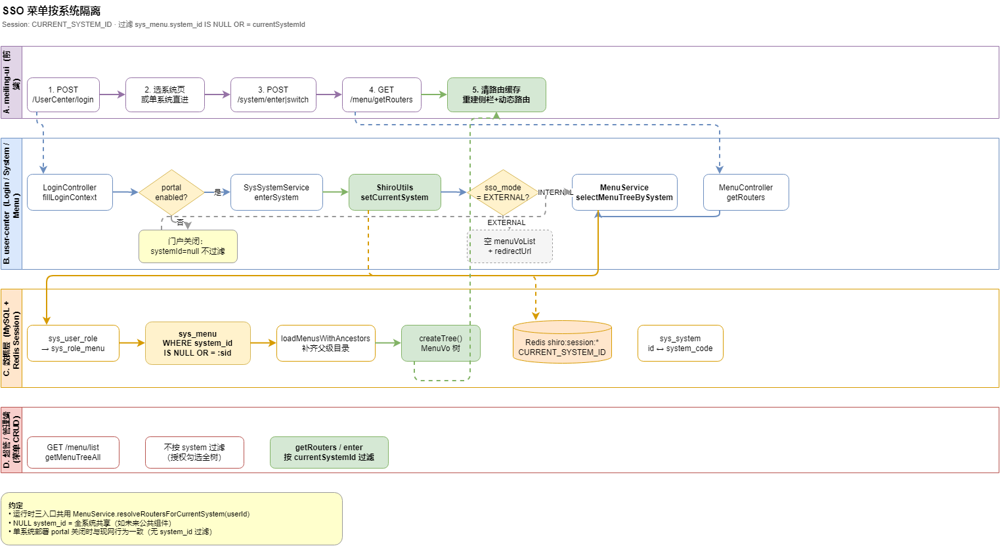

# SSO · 菜单按系统隔离（技术设计）

> **状态**：design · 2026-07-13 · **Q3/Q5 已定案（2026-07-13）**  
> **问题域**：多系统门户 `sys_system` 已落地，运行时菜单未按当前系统过滤，切换系统后侧栏「串台」。  
> **流程图**：[`docs/diagrams/moli-sso-menu-flow.drawio`](../diagrams/moli-sso-menu-flow.drawio) · PNG 见 [`docs/diagrams/png/moli-sso-menu-flow.png`](../diagrams/png/moli-sso-menu-flow.png)（需导出）  
> **SQL 草案**：[`docs/sql/30_sso_menu_system_id.sql`](../sql/30_sso_menu_system_id.sql)  
> **相关**：[portal-system-group.md](portal-system-group.md) · [frontend-routes-map.md](../api/frontend-routes-map.md) · [frontend-backend-dependencies.md §4](../api/frontend-backend-dependencies.md#4-sso--按系统隔离菜单)

---

## 1. 背景与现状

### 1.1 已有基础设施

| 能力 | 实现位置 | 说明 |
|------|----------|------|
| 业务系统注册 | `sys_system` + `SystemController` | `GET /system/my`、`POST /system/enter`、`POST /system/switch` |
| 当前系统写入 Session | `ShiroUtils.setCurrentSystem(systemId, systemCode)` | Session 键 `CURRENT_SYSTEM_ID` / `CURRENT_SYSTEM_CODE` |
| 进入系统 | `SysSystemServiceImpl.enterSystem()` | INTERNAL 返回 `menuVoList`；EXTERNAL 返回 `redirectUrl` + 空菜单 |
| 门户开关 | `SysSystemServiceImpl.isPortalEnabled()` | `sso.enabled=true` 且 `sys_system` 有启用行 |
| 菜单树查询 | `MenuServiceImpl` | 按用户角色 → `sys_role_menu` → `sys_menu`，**无** `system_id` 条件 |

### 1.2 问题表现（串台）

1. **`MenuController.getRouters()`**（`MenuController.java:34-44`）对普通用户调用 `selectMenuTreeByUserId`，对超管调用 `getMenuTreeAll()`，均未读取 `ShiroUtils.getCurrentSystemId()`。
2. **`LoginController.fillLoginContext()`**（`LoginController.java:219-248`）与 **`SysSystemServiceImpl.resolveMenus()`**（`SysSystemServiceImpl.java:366-371`）重复相同未过滤逻辑。
3. **`sys_menu` 无 `system_id` 列**（`SysMenu.java` 实体无对应字段），无法在数据层区分菜单归属。
4. 用户从门户进入 `moli-admin`（INTERNAL）后，侧栏同时出现系统管理（1 段）、运营管理（400 段）、知识库（900 段）等**全部**已授权菜单；切换系统或再次 `getRouters` 仍返回全量树。

### 1.3 菜单 ID 段位（种子数据）

权威对照：[frontend-routes-map.md](../api/frontend-routes-map.md) · `scripts/moli.sql` `sys_menu` INSERT。

| menu_id 根 | 名称 | 典型子 ID | 当前承载 |
|------------|------|-----------|----------|
| **1** | 系统管理 | 2–9、动作目录 | meiling-ui · `moli-admin` |
| **400** | 运营管理 | 401–407 | meiling-ui · 同上 |
| **500** | ChatGPT | 501 | meiling-ui（status 多禁用） |
| **600** | 烛龙 BI | 601–603 | meiling-ui |
| **700** | 洞察与控制 | 701–703 | meiling-ui |
| **800** | 身份与门户 | 系统注册、分配系统 | meiling-ui |
| **810** | 安全审计 | 操作/登录日志 | meiling-ui |
| **900** | 企业知识库 | 901–910、920 等 | meiling-ui 内嵌于 **moli-admin**；`sys_system` id=39 为 EXTERNAL 第二入口 |

`sys_system` 种子：仅 **id=1 `moli-admin`** 为 `INTERNAL`；**id=39 `moli-knowledge`** 等为 `EXTERNAL`（`scripts/moli.sql`）。

---

## 2. 目标与非目标

### 2.1 目标

1. 运行时菜单（`getRouters`、`login`、`enter/switch`）**仅返回当前 Session 系统**可见的子树。
2. 数据模型：`sys_menu.system_id` 可空 FK（逻辑）指向 `sys_system.id`；**NULL = 全系统共享**。
3. 查询算法与 RBAC 交集：`角色菜单 ∩ (system_id IS NULL OR system_id = currentSystemId)`，并保留**祖先补齐**建树逻辑。
4. 门户关闭（`isPortalEnabled()=false`）时行为与现网单系统一致。
5. 超管运行时路由按当前系统过滤；菜单管理/角色授权 UI **仍展示全树**。

### 2.2 非目标

| 非目标 | 说明 |
|--------|------|
| 改造 `sys_role_menu` 按系统拆角色 | 仍用全局角色；靠 `system_id` 过滤运行时视图 |
| 权限码 `permissions` 按系统拆分（P0） | P0 可保持全局；P1 可选按菜单 `system_id` 过滤 `buildCapabilities` |
| EXTERNAL 系统内嵌菜单 | 维持空 `menuVoList` + `redirectUrl` |
| 前端多 SPA 拆分 | 仍单 meiling-ui；靠动态路由刷新 |
| 物理 FK 约束 | 与项目惯例一致，仅索引 + 应用层校验 |

---

## 3. 数据模型

### 3.1 `sys_menu.system_id`

```sql
ALTER TABLE sys_menu
  ADD COLUMN system_id BIGINT NULL DEFAULT NULL
  COMMENT '所属业务系统 sys_system.id；NULL=全系统共享'
  AFTER order_num;

CREATE INDEX idx_sys_menu_system_id ON sys_menu (system_id);
```

| 取值 | 语义 |
|------|------|
| `NULL` | 全系统共享（所有 INTERNAL 系统进入后均可见，慎用） |
| `N` | 仅当 `ShiroUtils.getCurrentSystemId() = N` 时参与运行时菜单 |

**实体**：`SysMenu.java` 增加 `private Long systemId;`（MyBatis-Plus 驼峰映射 `system_id`）。

**管理端**：`POST/PUT /menu` 请求体可带 `systemId`；菜单管理列表展示该列，便于运营归类。

### 3.2 菜单 → 系统回填映射表（Backfill）

执行脚本：[`docs/sql/30_sso_menu_system_id.sql`](../sql/30_sso_menu_system_id.sql)。

| menu_id 段 | 目录/模块 | 建议 `system_id` | `sys_system` | 备注 |
|------------|-----------|------------------|--------------|------|
| **1** 及 `parent_id=1` 子树（不含 800/810 根） | 系统管理 | **1** | `moli-admin` | 用户/角色/菜单/部门等 |
| **800** 及子 | 身份与门户 | **1** | `moli-admin` | 系统注册、分配系统 |
| **810** 及子 | 安全审计 | **1** | `moli-admin` | 操作/登录日志 |
| **400** 及子 | 运营管理 | **1** | `moli-admin` | 现网均在 meiling-ui；若未来 `moli-ops` 改 INTERNAL 可改为 **2** |
| **500** 及子 | ChatGPT | **4** | `ai-copilot` | 演示段；现多为禁用菜单 |
| **600** 及子 | 烛龙 BI | **6** | `bi-report` | 与 BI 门户对齐 |
| **700** 及子 | 洞察与控制 | **1** | `moli-admin` | **开放问题**：是否独立系统 |
| **900** 及子 | 企业知识库 | **1** | `moli-admin` | **已定案 Q5-A**：admin 侧栏内嵌；门户 enter **39** 为 EXTERNAL `redirectUrl` 第二入口 |

**新增菜单约定**：运维/知识库等增量 SQL（如 `28_operation_topology_menu.sql`、`04_knowledge_menu.sql`）在 INSERT 时**显式写 `system_id`**，避免再依赖段位 UPDATE。

---

## 4. 查询与过滤算法

### 4.1 统一入口（消除三处重复）

新增 **`MenuService.resolveRoutersForCurrentSystem(Long userId)`**（命名可微调），供以下调用方共用：

- `MenuController.getRouters()`
- `LoginController.resolveMenus()` → 改为委托 `MenuService`
- `SysSystemServiceImpl.resolveMenus()` → 改为委托 `MenuService`

伪代码：

```
Long systemId = resolveEffectiveSystemId()
  // portal 关闭 → null（不过滤，现网全量）
  // portal 开启 + Session 有 currentSystemId → 过滤
  // portal 开启 + Session 无 currentSystemId → EMPTY_SENTINEL（Q3-A：直接返回 []，不过滤全表）

if (systemId == EMPTY_SENTINEL):
  return emptyList()

if (user is superadmin/fullPermission):
  menus = selectAllMenusForSystem(systemId)   // 非 getMenuTreeAll 无过滤版
else:
  menus = selectMenuListByUserId(userId)
  menus = filterBySystemId(menus, systemId)

return createTree(menus)
```

### 4.2 `filterBySystemId` 规则

对候选 `SysMenu` 列表（或 SQL 层 WHERE）：

```
保留 menu 当且仅当：
  systemId == null（参数）                    -- 门户关闭
  OR menu.system_id IS NULL                   -- 全局共享
  OR menu.system_id == systemId               -- 归属当前系统
```

**不在 SQL 层单独过滤祖先**：先按角色得到 `menuIdList`，`loadMenusWithAncestors(menuIdList)` 拉取行后，再对结果集做 `filterBySystemId`；若子菜单属于当前系统但父目录 `system_id` 不同，则**仍补齐父级**（父级作为纯结构节点，不要求 `system_id` 匹配），与现有 `loadMenusWithAncestors` 行为一致。

推荐实现顺序：

1. 角色 → `menuIdList`
2. `loadMenusWithAncestors` → 全量候选行
3. `filterBySystemId`（子节点匹配则保留其祖先链）
4. `createTree`

### 4.3 超管分支

| 场景 | 行为 |
|------|------|
| `getRouters` / `enter` / `login` 运行时 | **按 `currentSystemId` 过滤**，与普户同一算法 |
| `GET /menu/getMenuTreeAll`、`/menu/list`、角色授权树 | **不过滤**，展示全部 `sys_menu` 供 CRUD/勾选 |

`CommonConstant.hasFullPermission` 不再在运行时直接 `return getMenuTreeAll()`，改为 `selectAllMenusForSystem(systemId)`。

### 4.4 EXTERNAL 系统

`SysSystemServiceImpl.enterSystem()` 已有分支（`SysSystemServiceImpl.java:132-138`）：

- `menuVoList = empty`
- `redirectUrl` + SSO ticket

**无需改动**；`getRouters` 在 `currentSystemId` 指向 EXTERNAL 时也应返回空树（或 400 提示先 switch 至 INTERNAL），避免缓存旧 INTERNAL 菜单。

### 4.5 门户关闭降级

`isPortalEnabled() == false` 时：

- `resolveEffectiveSystemId()` 返回 `null`
- 跳过 `system_id` 条件 → 与现网「单系统全菜单」一致

---

## 5. API 契约变更

### 5.1 `GET /menu/getRouters`

| 项 | 变更 |
|----|------|
| 过滤依据 | **以 Session `currentSystemId` 为准**（推荐）；可选 query `?systemId=` 仅用于调试，生产以 Session 为准 |
| 响应形状 | 不变，仍为 `List<MenuVo>` 树 |
| 前置条件 | 门户多系统时，应先 `POST /system/enter` |
| **未定 enter** | **已定案 Q3-A**：`getRouters` 返回 **`[]` 空树**；前端路由守卫跳「选系统」页（与 `login` 多系统 `menuVoList=[]` 一致） |

### 5.2 `POST /login`

| 场景 | `menuVoList` |
|------|----------------|
| 门户关闭 | 全量（同现网，`systemId` 过滤关闭） |
| 门户开启 · 多系统 | 空数组，引导选系统 |
| 门户开启 · 唯一 INTERNAL | `enterSystem` 拷贝，**已过滤** |

### 5.3 `POST /system/enter` · `POST /system/switch`

| 项 | 变更 |
|----|------|
| `menuVoList` | INTERNAL 使用 `resolveRoutersForCurrentSystem` |
| Session | 继续 `setCurrentSystem` |
| `permissions` | P0 可不变；P1 可与菜单同范围过滤 |

### 5.4 管理端（不变更过滤）

- `GET /menu/list`、`GET /menu/getMenuTreeAll`、`GET /menu/selectMenuTreeByRoleId/{roleId}`：**不过滤** `system_id`

---

## 6. 前端变更（meiling-ui · P2）

| 项 | 动作 |
|----|------|
| 进入/切换系统 | `enter` / `switch` 成功后 **强制** `GET /menu/getRouters`（勿仅信任 enter 内嵌 `menuVoList` 缓存） |
| 未 enter | **Q3-A**：`getRouters` 空树 → 路由守卫跳「选系统」页（勿注册上一次的动态路由） |
| 路由缓存 | 清空 `permissionStore` / 动态路由表；`resetRouter()` 后按新树 `addRoutes` |
| 当前系统态 | 与 `currentSystem` 一并存 Pinia；切换时清 tabs/keep-alive（可选） |
| EXTERNAL | 收到 `redirectUrl` 跳转，不注册动态路由 |

参考：[sso-menu-frontend-handoff.md](../api/sso-menu-frontend-handoff.md) · [frontend-backend-dependencies.md §5](../api/frontend-backend-dependencies.md#5-ssosso-menu-1)。

---

## 7. Java 改动清单（实现阶段）

| 文件 | 改动 |
|------|------|
| `SysMenu.java` | 字段 `systemId` |
| `MenuMapper.xml` / `MenuMapper` | 可选：`selectBySystemId`；列表查询带 `system_id` |
| `MenuService.java` | `resolveRoutersForCurrentSystem(Long userId)` |
| `MenuServiceImpl.java` | 实现过滤 + 抽取 `filterBySystemId`；改造 `selectMenuTreeByUserId`、`getMenuTreeAll` 调用链 |
| `MenuController.java` | `getRouters` → 统一入口 |
| `LoginController.java` | `resolveMenus` 委托 `MenuService` |
| `SysSystemServiceImpl.java` | `resolveMenus` 委托 `MenuService` |
| `PermissionServiceImpl.java` | **可选 P1**：`buildCapabilities` 按当前系统过滤动作码 |
| `MenuControllerApiTest` / 新增单测 | 门户开/关、超管过滤、祖先补齐、EXTERNAL 空树 |

---

## 8. 发布阶段

| 阶段 | 内容 | 验收 |
|------|------|------|
| **P0** | 执行 `30_sso_menu_system_id.sql`（仅 ADD COLUMN + INDEX）；Java 过滤逻辑上线；门户关闭回归 | 单系统部署无行为变化 |
| **P1** | 执行 backfill UPDATE；新菜单 SQL 带 `system_id`；合并 `moli.sql` 基线 | `enter moli-admin` 仅见 1/400/800/810 段（按角色） |
| **P2** | meiling-ui 切换后重拉 `getRouters` + 清路由 | 手动切换系统不串台 |

---

## 9. 测试用例 / Smoke 清单

| # | 场景 | 步骤 | 期望 |
|---|------|------|------|
| S1 | 门户关闭 | `sso.enabled=false` 或空 `sys_system`，登录 | 菜单与现网一致（全量授权） |
| S2 | 单 INTERNAL | 仅 `moli-admin`，登录 | 自动 enter，`menuVoList` 按 system_id=1 过滤 |
| S3 | 多系统 · 运营账号 | 进入 `moli-admin` | 侧栏**无** 500/600 等其它系统段；**可见 900**（`system_id=1` 且角色授权） |
| S4 | 切换系统 | `POST /system/switch` → `getRouters` | 菜单集随 `currentSystemId` 变化 |
| S5 | EXTERNAL | enter `moli-knowledge`(39) | 空菜单 + `redirectUrl`；`getRouters` 不返回路由（Session 在 EXTERNAL 时亦空树） |
| S6 | 超管运行时 | superadmin enter `moli-admin` | 无 500/600 段（若映射到 4/6 且当前系统=1） |
| S7 | 超管管理端 | `GET /menu/getMenuTreeAll` | 仍见全树 |
| S8 | 角色仅勾子菜单 | 角色只勾 401 | 树含 400 目录 + 401，且仅当前系统 |
| S9 | 祖先补齐 | 子菜单 system_id=1，父 400 目录 system_id=1 | 树结构完整 |
| S10 | 未 enter | 门户开启直接 `getRouters` | **空树 `[]`**；前端跳选系统（Q3-A） |

---

## 10. 兼容性

| 部署形态 | 行为 |
|----------|------|
| 单系统 · 门户关闭 | `systemId` 过滤不生效，**零感知** |
| 单系统 · 门户开启仅 moli-admin | 等价于始终 `currentSystemId=1`，过滤后仍显示 moli-admin 归属菜单 |
| 老库未 backfill | 列全 NULL → 等价全共享；**建议 P0 后尽快 P1 backfill** |
| 新菜单未填 `system_id` | 视为共享，在所有 INTERNAL 系统可见（兜底） |

---

## 11. 流程图



> 可编辑源文件：[moli-sso-menu-flow.drawio](../diagrams/moli-sso-menu-flow.drawio)  
> PNG：运行 `docs/diagrams/export-diagrams.ps1` 或 `npx draw.io-export docs/diagrams/moli-sso-menu-flow.drawio -o docs/diagrams/png/moli-sso-menu-flow.png`

---

## 12. 产品决策

### 12.1 已定案（2026-07-13）

| # | 决策 | 结论 | 实现要点 |
|---|------|------|----------|
| **Q3** | 门户开启、Session 无 `currentSystemId` 时 `getRouters` | **返回空树 `[]`** | `resolveEffectiveSystemId()` 在门户开启且无 Session 系统时 → 过滤参数为「仅空」；与 `LoginController.fillLoginContext` 多系统 `menuVoList=[]` 一致；**前端**路由守卫跳选系统页 |
| **Q5** | 知识库 900 与 `moli-knowledge`(39) | **admin 内嵌为主** | backfill：**900 → `system_id=1`**；enter `moli-admin` 侧栏可见 900（按角色）；enter **39** 仍走 EXTERNAL `redirectUrl` 作第二入口，不依赖 `getRouters` 下发 900 |

### 12.2 仍开放

| # | 问题 | 建议 | 待确认 |
|---|------|------|--------|
| Q1 | 700 段（洞察与控制）归属哪个 `sys_system`？ | 暂归 **moli-admin (1)** | 是否拆独立 INTERNAL |
| Q2 | 400 段是否迁移到 `moli-ops (2)` 当其为 INTERNAL？ | 短期仍归 **1** | 运维门户产品路线 |
| Q4 | `permissions` 是否按系统过滤？ | P1 与菜单同源过滤 | 动作码跨系统引用场景 |
| Q6 | 新增 INTERNAL 系统时菜单段分配规则？ | 文档化段位表 + 菜单管理 UI 必选 `system_id` | 运营流程 |

---

## 13. 相关文档

- [portal-system-group.md](portal-system-group.md) — 门户分组
- [user-center-detailed-design.md](user-center-detailed-design.md) §3.3 多系统 enter
- [moli-rbac-menu-query.drawio](../diagrams/moli-rbac-menu-query.drawio) — 改造前菜单查询
- [USER_CENTER_SCHEMA.md](../sql/USER_CENTER_SCHEMA.md) — 实现后补充 `system_id` 字段说明
