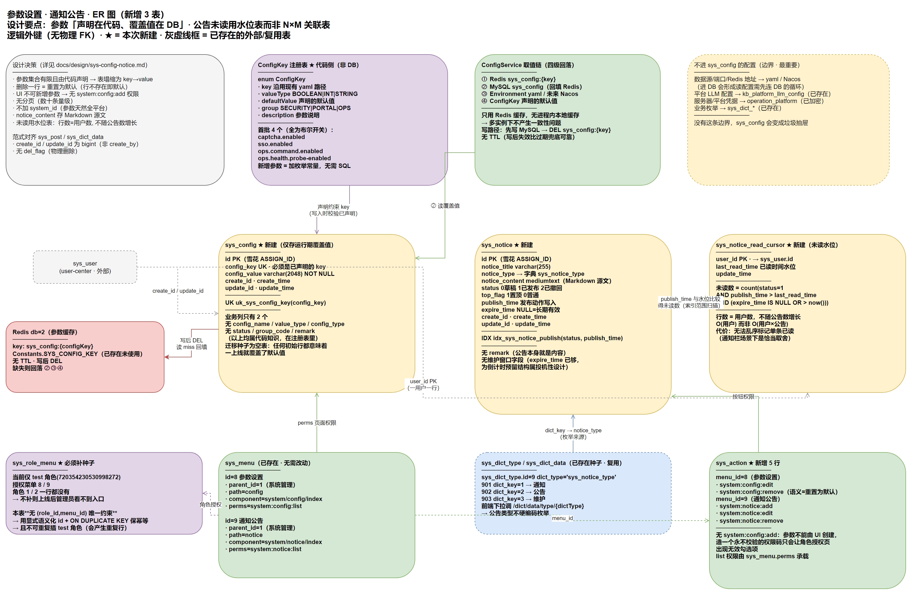

# 参数设置 · 通知公告（技术设计）

> **状态**：draft · 待评审 · 2026-08-16
> **问题域**：`sys_menu` 已预埋「参数设置」(id=8)、「通知公告」(id=9) 两个菜单，但业务表、Java 分层、按钮权限、API 契约全部为空。
> **ER 图**：[`docs/diagrams/moli-sys-config-notice-er.drawio`](../diagrams/moli-sys-config-notice-er.drawio) · PNG 见 [`docs/diagrams/png/moli-sys-config-notice-er.png`](../diagrams/png/moli-sys-config-notice-er.png)
> **SQL 草案**：[`docs/sql/38_sys_config.sql`](../sql/38_sys_config.sql) · [`docs/sql/39_sys_notice.sql`](../sql/39_sys_notice.sql)（待落）
> **相关**：[`docs/api/user-center-api-map.md`](../api/user-center-api-map.md) · [`docs/api/user-center-dubbo.md`](../api/user-center-dubbo.md)

---

## 1. 真正要解决的问题

### 1.1 现状：运行期开关全靠 `@Value` + 重启

这两个菜单是历史模板遗留，但「参数设置」在本项目有一个具体且真实的痛点——**当前所有运行期可调开关都是启动时静态注入的**：

| 参数 key | 注入位置 | 改一次的代价 |
|----------|----------|--------------|
| `captcha.enabled` | `LoginController` → `private boolean captchaEnabled` | 改 yaml + 重启 |
| `sso.enabled` | `SysSystemServiceImpl` **和** `MenuServiceImpl`（**两处重复注入**） | 改 yaml + 重启，且易漏改一处 |
| `sso.ticket-ttl-seconds`、`sso.entry-path`、`sso.shared-secret` | `SsoServiceImpl` / `SsoController` | 同上 |
| `moli.user-center.shiro.session-expire-seconds` | `ShiroConfig` | 同上 |
| `swagger.show` | `Swagger2Config` | 同上 |
| `ops.health.probe-enabled`、`ops.health.probe-cron` | 运维健康调度 | 同上 |
| `ops.command.enabled`、`ops.upload.allow-any-under` | 运维命令/上传 | 同上（且是安全开关，最需要能紧急关停） |

`@Value` 注入到 `boolean` 字段是**启动时快照**。`ops.command.enabled` 这类安全开关需要能在事故时立刻关掉，而现在做不到。

### 1.2 Nacos 配置中心是空的

所有服务的 `bootstrap.yml` 里 `spring.cloud.nacos.config.enabled: **false**`（dev 与 pro 均是），Nacos **只承担服务发现**。所以：

- **不存在**「MySQL 参数表 vs Nacos 配置中心」双写冲突——那一格现在是空的。
- 但基础设施在，未来可能启用。设计**必须与 Nacos 可组合**，不能假设 yaml 是唯一来源（见 §3.3 取值链）。

### 1.3 结论：这不是一个通用 key-value CRUD

参数集合 = §1.1 那张表，**有限、已知、由开发声明**。这个事实推翻了模板式设计的前提：

| 模板式做法 | 为什么在本项目不成立 |
|------------|---------------------|
| UI 可任意「新增参数」 | 代码里没有读它的地方，新增出来就是死数据；反而制造垃圾键 |
| 表里存 `config_name` / `remark` 自由文本 | 参数含义属于代码知识，写在 DB 里会与代码注释不一致 |
| 表里存 `value_type` 供前端渲染 | 类型是声明的一部分，不该由录入人填，填错就渲染错 |
| `config_type` 区分「内置/自定义」 | 全部参数都是声明的，不存在自定义；这一列恒为同值 |
| `status` 停用参数 | 停用一个参数语义不明——代码仍会读它。要么有覆盖值，要么用默认值 |
| 列表分页 | 参数是数十条量级，分页是纯负担 |

---

## 2. 设计取向

**参数设置 = 已声明参数的「运行期覆盖值」管理台**，不是任意键值仓库。

```
参数定义（代码 · ConfigKey 注册表）   ← 谁能被调、类型、默认值、校验规则、说明
        ↓
参数覆盖值（DB · sys_config）        ← 只存 key → value，一行 = 一个覆盖
        ↓
生效值（ConfigService）             ← DB 覆盖 > Environment(yaml/Nacos) > 声明默认
```

由此得到的直接收益：

1. **表塌缩成 key→value**——`config_name`/`value_type`/`config_type`/`status`/`group_code`/`remark` 六列全部消失，因为它们是代码知识。
2. **删除有了明确语义**——删掉一行 = 恢复默认值，「行不存在」本身就表达默认。不需要额外的重置字段或标记。
3. **写入可校验**——声明里带类型与取值范围，写非法值直接 400，而通用键值表做不到（它不知道 key 意味着什么）。
4. **UI 能展示全量可调面**——列表来自注册表而非 DB，包含从未被覆盖过的参数。运维第一次进页面就能看到「这个系统有哪些旋钮」，而不是一张空表。
5. **调用点不再散落默认值**——`@Value("${captcha.enabled:false}")` 里的 `false` 在多处重复；改为注册表单点声明。

### 2.1 边界：什么不进 `sys_config`

| 类型 | 归属 | 理由 |
|------|------|------|
| 数据源、连接池、端口、Redis 地址 | **yaml / 未来 Nacos** | 启动期依赖，进 DB 会形成「读配置需要先连 DB，连 DB 需要配置」的循环 |
| 平台 LLM 配置 | 既有 `kb_platform_llm_config` | knowledge 模块自有，含厂商密钥与模型路由，结构化程度远超 key-value |
| 服务器 / 平台凭据 | 既有 `operation_platform`、`operation_server` SSH | 已有加密与「只写不读」通道，不能降级成明文参数 |
| 业务枚举（通知类型等） | 既有 `sys_dict_*` | 字典是给业务数据打标签，参数是改系统行为，两者不混 |

**这条边界是本设计最重要的部分**：没有它，`sys_config` 会在半年内变成什么都往里塞的垃圾抽屉，并与上面三套既有机制打架。

---

## 3. 参数设置：数据模型与实现



源文件：[`docs/diagrams/moli-sys-config-notice-er.drawio`](../diagrams/moli-sys-config-notice-er.drawio)

### 3.1 `sys_config`（只存覆盖值）

```sql
CREATE TABLE `sys_config` (
  `id`           bigint        NOT NULL COMMENT '主键',
  `config_key`   varchar(128)  NOT NULL COMMENT '参数键名, 必须是 ConfigKey 注册表中已声明的 key',
  `config_value` varchar(2048) NOT NULL COMMENT '覆盖值, 以字符串存储, 由声明的类型解析',
  `create_id`    bigint        NULL DEFAULT NULL,
  `create_time`  datetime      NULL DEFAULT NULL,
  `update_id`    bigint        NULL DEFAULT NULL,
  `update_time`  datetime      NULL DEFAULT NULL,
  PRIMARY KEY (`id`),
  UNIQUE INDEX `uk_sys_config_key`(`config_key`)
) ENGINE = InnoDB CHARACTER SET = utf8mb4 COMMENT = '系统参数运行期覆盖值';
```

**全表 7 列，业务列只有 2 个。** 没有 `config_name`、`value_type`、`config_type`、`status`、`group_code`、`remark`——见 §1.3 与 §2 的推导。

`config_value` 为 `NOT NULL`：「值为空」应通过删除该行（回落默认）表达，而不是留一行空值。这样 DB 里不存在语义模糊的中间态。

`config_value` 用 `varchar(2048)` 而非 `text`：单个参数超过 2KB 说明它不该是参数。这个上限本身在约束设计。

无 `del_flag`——与 `sys_post`/`sys_dict_data` 一致，物理删除；且删除在这里恰好等于「重置为默认」，语义天然。

### 3.2 参数声明（代码侧，本设计的核心）

**首批只收 4 个纯开关**（Q1 已确认）：

```java
public enum ConfigKey {
    CAPTCHA_ENABLED("captcha.enabled", ValueType.BOOLEAN, "false",
            ConfigGroup.SECURITY, "登录验证码开关"),
    SSO_ENABLED("sso.enabled", ValueType.BOOLEAN, "true",
            ConfigGroup.PORTAL, "多系统门户开关, 关闭后登录直出菜单"),
    OPS_COMMAND_ENABLED("ops.command.enabled", ValueType.BOOLEAN, "false",
            ConfigGroup.OPS, "运维远程命令开关, 事故时可紧急关停"),
    OPS_HEALTH_PROBE_ENABLED("ops.health.probe-enabled", ValueType.BOOLEAN, "true",
            ConfigGroup.OPS, "服务器健康巡检开关"),
}
```

`ValueType` 落地为 `BOOLEAN` / `INT` / `STRING`（丢掉了草案里的 `JSON`：没有消费方，而校验一个字符串是不是合法 JSON 还得引依赖）。

**没有落地 `Validators`（range / enumOf / regex）**。首批 4 个键全是布尔，`ValueType.BOOLEAN.check()`
已经能拒掉一切非 `true/false` 的输入，range 校验没有校验对象。等第一个数值型参数（如
`sso.ticket-ttl-seconds`）进注册表时再加 —— 那时才知道需要哪几种校验器，而不是现在猜。
`ConfigKey` 构造器届时多一个参数即可，无需改动取值链与接口。

**key 沿用现有 yaml 路径**（`captcha.enabled` 而非另起 `sys.captcha.enabled`）。这样 §3.3 的取值链可以直接落到 `Environment`，存量 yaml 与部署脚本无需改动，也不会出现「yaml 一个名、DB 另一个名」的对照负担。

### 3.3 取值链与热生效

```
ConfigService.getBoolean(ConfigKey.CAPTCHA_ENABLED)
  ①  Redis  sys_config:{key}        命中 → 返回
  ②  MySQL  sys_config              命中 → 回填 Redis → 返回
  ③  Environment(yaml / 未来 Nacos) 命中 → 返回
  ④  ConfigKey 声明的默认值
```

③ 让**存量 yaml 继续作为部署期默认值**，DB 只做运行期覆盖。好处有三：现网部署不受影响；未来启用 Nacos 时自动纳入链条（Nacos 就是 `Environment` 的一个 PropertySource）；DB 挂了也只是回落默认而不是全线不可用。

**只用 Redis 缓存，不做进程内本地缓存。** user-center 经 Nacos discovery 可多实例部署，本地缓存会让 A 实例改完 B 实例仍读旧值，需要引入 Redis pub/sub 或定时刷新来解决。而参数读取频率很低（登录、SSO enter、调度触发等），一次 Redis 往返完全可接受——**用不产生一致性问题的方案，而不是产生问题再补机制**。

写路径：先写 MySQL → 再 `DEL sys_config:{key}`。不设 TTL：参数改动极少，写后失效比靠过期兜底更可靠，也避免「改了参数要等几分钟生效」这种难排查的现象。

### 3.4 存量 `@Value` 迁移

这是模板式设计不会遇到、但本项目必须处理的一步。`@Value` 是启动快照，光有表不会让开关变热。

```java
// 迁移前：启动时定死
@Value("${captcha.enabled:false}")
private boolean captchaEnabled;
...
if (!captchaEnabled) { ... }

// 迁移后：使用处取值
if (!configService.getBoolean(ConfigKey.CAPTCHA_ENABLED)) { ... }
```

顺带修掉 `sso.enabled` 在 `SysSystemServiceImpl` 与 `MenuServiceImpl` **两处重复注入**的问题——迁移后两处走同一个 `ConfigService`，不会再出现改了一处漏另一处。

> **实施记录**：两处 `isPortalEnabled()` 的**方法实现**未合并。`SysSystemServiceImpl` 已 `@Autowired MenuService`，让 `MenuServiceImpl` 反向依赖 `SysSystemService` 会形成 Bean 循环依赖。本次只统一了参数来源（都读 `ConfigKey.SSO_ENABLED`），方法去重需要先拆出一个不依赖两者的 `PortalPolicy`，属独立重构。

**`hotReload` 标记未落地**（Q3 因此仍是未决而非已决）。原方案想用它标注 `session-expire-seconds` 这类 Bean 构建期参数，但首批 4 个键全部可热生效，这个字段没有承载对象；先加一个恒为 `true` 的字段只会让人以为已经支持了「只读参数」这件事。等真要纳入此类参数时，需一并决定 UI 只读呈现与写接口是否拒绝——那时再加字段。

`ShiroConfig` 里的 `session-expire-seconds` 因此**暂不纳入注册表**：它属 Bean 构建期读取，改它需重建 SessionManager，纳入后只会给运维「改了就生效」的错误预期。

### 3.5 API

接口形态由设计推导而来，不是照搬 CRUD 五件套：

| 方法 | 路径 | 权限 | 说明 |
|------|------|------|------|
| GET | `/config/list` | `config:list` | **注册表 ∪ 覆盖值**，返回每项的 生效值 / 默认值 / 类型 / 分组 / 来源 / 是否被覆盖；可按 `group` 过滤；**无分页** |
| PUT | `/config` | `config:edit` + `list` | 写覆盖值 `{configKey, configValue}`；校验 key 已声明 + 值可按声明类型解析；upsert |
| DELETE | `/config/{configKey}` | `config:remove` + `list` | **重置为默认**（删除覆盖行） |

**没有 `POST`**——参数不能由 UI 创建，新增参数是代码变更。
**不用 `id` 寻址**——`config_key` 就是业务主键，`/config/{id}` 会迫使前端多存一个无意义的 id。
**没有分页**——数十条参数，`PageRes` 在这里是负担。

草案里的 `GET /config/effective/{configKey}`（仅需登录的单值查询）**未落地**：目前没有消费方——
`captcha.enabled` 由 `/captchaImage` 的响应表达，`sso.enabled` 由 `LoginVo` 表达。而一个对所有登录用户
开放的通用配置读取口，会把内部参数键名与取值暴露给全体用户，属于无收益的额外面。真出现需要读开关的
前端场景时，优先在既有业务响应里加字段。

契约明细：[`../api/sys-config-notice-api.md`](../api/sys-config-notice-api.md) §2。

`config:remove` 语义是「重置」而非「删除参数」，UI 按钮文案用**重置为默认**，避免运维以为会删掉参数本身。

### 3.6 跨服务读取（明确非目标）

`sys_config` 由 **user-center 独占**，声明的也只是 user-center 自己的参数。knowledge / order / bi 继续用各自 yaml。

理由：现在没有一个具体的跨服务参数需求，为假想需求先建 Dubbo 通道会引入无人使用的接口和缓存一致性负担。真需要时的路径是明确的——在 `UserCenterServer`（Dubbo，见 `docs/api/user-center-dubbo.md`）加一个只读方法，或该服务按同一模式建自己的注册表。**留路径，不留代码。**

---

## 4. 通知公告：数据模型与实现

### 4.1 先回答「谁会看到」

模板式 `sys_notice` 的通病是**只有后台管理页，没有阅读侧**：发布后没有任何人会看到，于是这个模块永远处于「做了但没用」的状态。所以先定阅读侧，再定表。

本项目的高价值场景是**维护公告**——平台自带部署中心（`operation_task` 批量启停服务）与健康巡检，运维在批量重启前需要提前通告。字典里 `sys_notice_type` 已有 `3 = 维护` 这一项，说明当初就是这个意图。

阅读侧因此必须有两样东西，缺一个功能就失效：

1. **有效公告查询** — 已发布、未过期、置顶优先，全员可读（不要求 `notice:list` 权限）。
2. **未读提示** — 没有红点/角标，就没人主动点进公告页。

### 4.2 `sys_notice`

```sql
CREATE TABLE `sys_notice` (
  `id`             bigint       NOT NULL COMMENT '主键',
  `notice_title`   varchar(255) NOT NULL COMMENT '公告标题',
  `notice_type`    int          NOT NULL COMMENT '类型, 对应字典 sys_notice_type: 1通知 2公告 3维护',
  `notice_content` mediumtext   NULL COMMENT '公告正文(Markdown 源文)',
  `status`         int          NOT NULL DEFAULT 0 COMMENT '0草稿 1已发布 2已撤回',
  `top_flag`       int          NULL DEFAULT 0 COMMENT '1置顶 0普通',
  `publish_time`   datetime     NULL DEFAULT NULL COMMENT '发布时间, 发布动作写入',
  `expire_time`    datetime     NULL DEFAULT NULL COMMENT '过期时间, NULL=长期有效',
  `create_id`      bigint       NULL DEFAULT NULL,
  `create_time`    datetime     NULL DEFAULT NULL,
  `update_id`      bigint       NULL DEFAULT NULL,
  `update_time`    datetime     NULL DEFAULT NULL,
  PRIMARY KEY (`id`),
  INDEX `idx_sys_notice_publish`(`status`, `publish_time`)
) ENGINE = InnoDB CHARACTER SET = utf8mb4 COMMENT = '通知公告';
```

设计取舍：

- **`status` 三态含「已撤回」**，不是布尔发布位。运维发错信息必须能撤下，而删除会丢失「发过什么」的痕迹——公告是对外表达过的内容，撤回要留档。
- **`status` 默认 0 草稿**：新建不直接对外，避免半成品推给全员。
- **`notice_content` 存 Markdown 源文**（已定案），与 `kb_document.content` 形态统一。相比存 HTML，渲染端控制允许语法即可，不需要维护 XSS 标签白名单。
- **无 `remark` 列**：公告本身就是内容，再加备注属于冗余。
- **`top_flag` 保留**：长期有效的常驻公告（如固定维护窗口）需要压在顶部，一列布尔的成本远低于让运维靠反复改 `publish_time` 来置顶。

**明确不加**「维护窗口」`window_start`/`window_end`：`expire_time` 已能让维护公告到期自动隐藏，具体时段写在 Markdown 正文里对读者同样清楚。为「将来也许要渲染倒计时」预留结构化字段是投机性设计。

### 4.3 未读追踪：游标表而非 N×M 关联表

```sql
CREATE TABLE `sys_notice_read_cursor` (
  `user_id`        bigint   NOT NULL COMMENT '→ sys_user.id, 主键',
  `last_read_time` datetime NOT NULL COMMENT '最后一次读公告列表的时间水位',
  `update_time`    datetime NULL DEFAULT NULL,
  PRIMARY KEY (`user_id`)
) ENGINE = InnoDB CHARACTER SET = utf8mb4 COMMENT = '用户公告已读水位';
```

未读数：

```sql
SELECT count(*) FROM sys_notice
 WHERE status = 1
   AND publish_time > #{lastReadTime}
   AND (expire_time IS NULL OR expire_time > now());
```

**行数 = 用户数**，不随公告数增长；走 `idx_sys_notice_publish` 是一次索引范围扫描。相比「每用户每公告一行」的关联表，规模从 O(用户×公告) 降到 O(用户)。

**如实说明代价**：水位模型只能表达「X 时刻之前都已读」，无法乱序标记单条已读。对通知栏这是恰当的取舍——用户行为就是「扫一眼列表，全都算看过」。如果将来要做单条已读/收藏，再引入关联表，届时水位表可保留作快路径。

### 4.4 API

| 方法 | 路径 | 权限 | 说明 |
|------|------|------|------|
| GET | `/notice/list` | `notice:list` | 后台管理列表（含草稿、已撤回），分页，不返回正文 |
| GET | `/notice/{id}` | `notice:list` | 后台详情，任意状态可见 |
| POST | `/notice` | `notice:add` + `list` | 新建草稿 |
| PUT | `/notice` | `notice:edit` + `list` | 修改；已发布的公告改动需重新发布 |
| PUT | `/notice/publish/{id}` | `notice:edit` + `list` | 发布：`status=1` 并写 `publish_time` |
| PUT | `/notice/revoke/{id}` | `notice:edit` + `list` | 撤回：`status=2`，立即从阅读侧消失 |
| DELETE | `/notice/{ids}` | `notice:remove` + `list` | 批量删除 |
| GET | `/notice/feed` | **仅需登录** | 阅读侧：有效公告 + `unreadCount`，置顶优先 |
| GET | `/notice/feed/{id}` | **仅需登录** | 阅读侧详情，**仅** `status=1` 且未过期可见 |
| PUT | `/notice/feed/read` | **仅需登录** | 推进已读水位到当前时刻 |

阅读侧独立成 `/notice/feed/*` 前缀，而不是给后台接口降权。原因：一个接口里混两套可见性规则（管理员能看草稿、普通用户只能看已发布）迟早会写出把草稿泄露给全员的分支。**用路径把两种受众分开，可见性规则各自单一。**（这也是上一版遗留的 Q1，此处定案。）

---

## 5. 权限与菜单

`PermissionConstants` 新增 7 个常量，命名照 `SYSTEM_POST_*`：

```java
public static final String SYSTEM_CONFIG_LIST   = "system:config:list";
public static final String SYSTEM_CONFIG_EDIT   = "system:config:edit";
public static final String SYSTEM_CONFIG_REMOVE = "system:config:remove";
public static final String SYSTEM_NOTICE_LIST   = "system:notice:list";
public static final String SYSTEM_NOTICE_ADD    = "system:notice:add";
public static final String SYSTEM_NOTICE_EDIT   = "system:notice:edit";
public static final String SYSTEM_NOTICE_REMOVE = "system:notice:remove";
```

**没有 `system:config:add`**——参数不能由 UI 创建（§3.5），造一个永不校验的权限码只会让角色授权页出现无效勾选项。

`sys_action` 新增 5 行：`menu_id=8` → `config:edit` / `config:remove`；`menu_id=9` → `notice:add` / `notice:edit` / `notice:remove`。`list` 由 `sys_menu.perms` 承载。

`sys_role_menu` **必须补种子**：当前只有 test 角色（`720354230530998272`）授权了菜单 8/9，系统管理员角色 `id=2` 一行都没有。不补则功能上线后管理员看不到入口。用 `INSERT ... SELECT ... WHERE NOT EXISTS` 保证幂等。

`sys_menu` 8/9 两行无需改动。

---

## 6. 文件清单（已落地实况）

```
moli-distribute-common/
  .../constant/PermissionConstants.java              [改] +7 常量

moli-user-center/moli-user-center-common/
  .../domain/entity/SysConfig.java                   [新] key + value + 审计
  .../domain/entity/SysNotice.java                   [新] 含 STATUS_* 三态常量
  .../domain/entity/SysNoticeReadCursor.java         [新] 主键 user_id，不继承 BaseEntity
  .../domain/vo/ConfigItemVo.java                    [新] 生效值/默认值/类型/分组/来源/是否被覆盖
  .../domain/vo/ConfigUpdateRequest.java             [新] configKey + configValue
  .../domain/vo/NoticeVo.java                        [新] 后台查询条件
  .../domain/vo/NoticeBriefVo.java                   [新] 阅读侧条目（不含正文）
  .../domain/vo/NoticeFeedVo.java                    [新] list + unreadCount

moli-user-center/moli-user-center-server/
  .../sysparam/ConfigKey.java                        [新] 参数注册表（枚举，内嵌 ConfigGroup）
  .../sysparam/ValueType.java                        [新] BOOLEAN / INT / STRING + 解析校验
  .../sysparam/ConfigSource.java                     [新] DB_OVERRIDE / ENVIRONMENT / DEFAULT
  .../mapper/ConfigMapper.java                       [新]
  .../mapper/NoticeMapper.java                       [新]
  .../mapper/NoticeReadCursorMapper.java             [新]
  .../service/ConfigService.java                     [新] 取值链 + 缓存 + 校验
  .../service/impl/ConfigServiceImpl.java            [新]
  .../service/NoticeService.java                     [新] 发布/撤回 + feed + 水位
  .../service/impl/NoticeServiceImpl.java            [新]
  .../controller/ConfigController.java               [新]
  .../controller/NoticeController.java               [新]
  .../controller/LoginController.java                [改] captchaEnabled → ConfigService
  .../service/impl/SysSystemServiceImpl.java         [改] sso.enabled → ConfigService
  .../service/impl/MenuServiceImpl.java              [改] 同上（统一参数来源）
  src/test/java/.../sysparam/ConfigServiceImplTest.java [新] 19 例：四级回落 + 哨兵 + 校验拒绝
  src/test/java/.../service/NoticeServiceImplTest.java  [新] 17 例：状态机 + 水位三情形
  src/test/java/.../api/ConfigControllerApiTest.java    [新] 4 例
  src/test/java/.../api/NoticeControllerApiTest.java    [新] 16 例
  src/test/java/.../testsupport/MybatisPlusTestSupport.java [改] 注册三张新表的 lambda 缓存
  src/test/java/.../api/LoginControllerApiTest.java     [改] 反射设字段 → mock ConfigService
  src/test/java/.../service/impl/MenuServiceImplTest.java [改] 同上

docs/sql/38_sys_config.sql                           [新] 建表 + sys_action + role_action + role_menu
docs/sql/39_sys_notice.sql                           [新] 建表 ×2 + sys_action + role_action + role_menu
docs/sql/USER_CENTER_SCHEMA.md                       [改] 26→29 张表、ER、迁移与种子快照
docs/api/sys-config-notice-api.md                    [新] HTTP 契约（前端据此开工）
docs/api/user-center-api-map.md                      [改] 登记两组接口
docs/diagrams/moli-sys-config-notice-er.drawio       [新] 本文 ER 图
docs/diagrams/README.md                              [改] 图清单加一行
```

**尚未做**：`scripts/moli.sql` 基线合并（38/39 仍是独立增量，新环境需手动追）；前端 `meiling-ui`（不在当前工作区）。

**放弃未落地的三处草案机件**（理由见 §3.2、§3.4、§3.5）：`Validators`、`hotReload` 标记、`GET /config/effective/{configKey}`。共同理由是首批 4 个布尔开关不构成它们的使用场景，而它们各自都会带来「看起来支持了某能力」的错误暗示。

**参数设置有 Service，通知公告也有 Service**——但理由不同：参数是取值链 + 缓存 + 校验；公告是发布/撤回状态机 + 水位推进。两者都有超出「转发 Mapper」的逻辑。这与 `PostServiceImpl`（空壳）形成对照：那里没有逻辑，所以不该有那一层。

**注意 SQL 迁移种子里没有参数初始值**：参数默认值在 `ConfigKey` 声明里，`sys_config` 初始应为**空表**——一行都不插。任何初始行都意味着「一上线就覆盖了默认值」，与 §2 的分层相悖。

---

## 7. 实施顺序

| 阶段 | 内容 | 状态 |
|------|------|------|
| **S1** | SQL 迁移 `38`/`39` | ✅ 已写；**未**在库上执行、**未**合并基线 |
| **S2** | `ConfigKey` 注册表 + `ConfigService` 取值链 | ✅ 19 例单测覆盖四级回落、哨兵缓存、非法值拒绝 |
| **S3** | `ConfigController` + 存量 `@Value` 迁移（§3.4） | ✅ 三处 `@Value` 已摘除（`LoginController`、`SysSystemServiceImpl`、`MenuServiceImpl`） |
| **S4** | 公告后台：CRUD + 发布/撤回状态机 | ✅ 状态只由 publish/revoke 改；新增/编辑强制忽略 `status` |
| **S5** | 公告阅读侧：`/notice/feed*` + 水位 | ✅ 17 例覆盖无水位/部分已读/全部已读 |
| **S6** | 文档：API 契约 + SCHEMA + 索引 | ✅ 新增 `docs/api/sys-config-notice-api.md` |
| **S7** | 合并 `scripts/moli.sql` 基线 | ⬜ 待做（走 [`@sql-migration-baseline`](../../.cursor/skills/sql-migration-baseline/SKILL.md)） |
| **S8** | 前端 `meiling-ui`：参数表格（按 `group` 分区、按 `valueType` 渲染控件、重置按钮）+ 公告管理页 + 通知栏角标 | ⬜ 该仓不在当前工作区 |

**S3 的验证点是整个设计成立与否的判据**：如果关掉验证码仍需重启，那这个模块就只是个漂亮的表格。代码层面已满足（`captchaImage()` 每次请求走 `configService.getBoolean`），但**尚未在真实环境端到端验证过**——需执行 SQL、起服务、改开关、观察不重启是否生效。

全量单测：`moli-user-center-server` 403 例通过（新增 56 例）。

SQL 迁移走 [`@sql-migration-baseline`](../../.cursor/skills/sql-migration-baseline/SKILL.md)；ER 图走 [`@drawio-diagrams`](../../.cursor/skills/drawio-diagrams/SKILL.md)。

---

## 8. 待评审确认点

| # | 议题 | 结论 |
|---|------|------|
| Q1 | 首批纳入注册表的参数范围 | ✅ **已定**：只收 `captcha.enabled`、`sso.enabled`、`ops.command.enabled`、`ops.health.probe-enabled` 四个开关。其余（`swagger.show`、`sso.entry-path`）留 yaml，等有实际改动需求再纳入——注册表的价值在于精准，不在于全 |
| Q2 | 公告是否需要按角色/部门/系统定向 | ⬜ **未决**，本期按全员可见实现。定向会引入 `sys_notice_target` 关联表与「谁能看到」的鉴权分支。**注意这与参数不加 `system_id` 的理由不同**：参数天然全平台，公告的受众是本质属性，所以这一条更可能在二期回来 |
| Q3 | `session-expire-seconds` 等 Bean 构建期参数怎么呈现 | ⬜ **未决**，本期回避：该参数不纳入注册表，`hotReload` 标记也未落地（§3.4）。真要纳入时需一并决定 UI 只读呈现与写接口是否拒绝 |
| Q4 | 公告过期清理 | ⬜ 暂不做定时物理删除。过期公告是运营留档，靠 `expire_time` 从阅读侧隐藏即可 |

---

## 9. 变更记录

| 日期 | 变更 |
|------|------|
| 2026-08-16 | **后端落地完成**（S1–S6），本文回写为实况。实施中相对草案的三处收窄：① 未落地 `Validators`（首批全布尔，无校验对象）；② 未落地 `hotReload` 标记（Q3 因此仍未决）；③ 未落地 `GET /config/effective/{configKey}`（无消费方，且会对全体登录用户暴露内部参数）。另修正两点：`isPortalEnabled()` 方法未去重（会形成 Bean 循环依赖，只统一了参数来源）；公告保存校验从「过期时间 vs 入参发布时间」改为「过期时间不得为过去」——原校验比较的 `publishTime` 随后就被丢弃，实为空转。参数注册表包名由 `config/param` 调整为 `sysparam`（`config` 包是 Spring 基础设施配置，混入业务注册表易误解） |
| 2026-08-16 | **重写**。初版沿用通用后台模板的 `sys_config`（9 业务列，自由录入键值）与 `sys_notice`，未结合本项目实际。核查发现 Nacos 配置中心处于 `enabled: false`、运行期开关全为 `@Value` 静态注入且 `sso.enabled` 重复注入两处，据此改为**注册表驱动**：表塌缩为 key→value 两列、删除即重置、UI 不可新增参数、去分页、四级取值链兼容 yaml/Nacos，并新增存量 `@Value` 迁移方案。公告侧补齐阅读面（`/notice/feed*` 独立前缀、撤回态、水位未读表），替代原「已读表延后」的搁置结论 |
| 2026-08-16 | 初稿（已废弃）：定案不加 `system_id`、正文存 Markdown |
