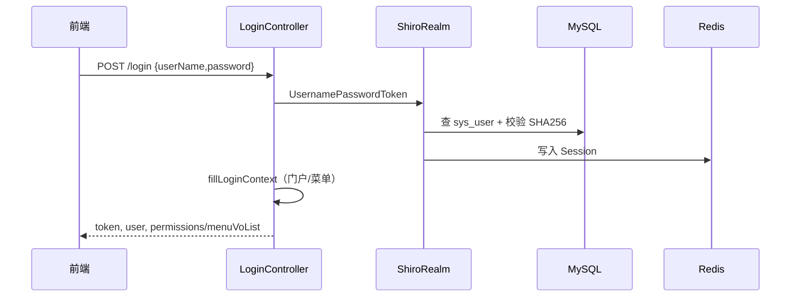

# 用户中心 · 详细设计

> 更新：2026-06-25 · 概要：[`user-center-overview.md`](user-center-overview.md)

## 1. 分层结构（server 模块）

```
controller/          HTTP 入口，参数校验，@RequiresPermissions
service/impl/        业务逻辑，事务边界
mapper/ + resources/mapper/*.xml
config/shiro/        ShiroConfig, ShiroRealm, SessionManager, Filters
config/              Druid、Swagger、MyBatis-Plus 填充
aspectj/LogAspect     操作日志 AOP
operation/controller  运维资产域（独立包）
loadtest/             压测 Profile 专用 Controller
provider/             UserServerProvider（Dubbo）
```

## 2. 关键类职责

| 类 | 职责 |
|----|------|
| `LoginController` | 登录/登出/验证码；调用 `Subject.login` |
| `ShiroRealm`（server） | 认证：DB 查用户+盐密码；授权：`PermissionService` |
| `PermissionServiceImpl` | 合并 menu perms + action codes；超管 `*:*:*` |
| `MenuServiceImpl` | 菜单树、角色菜单、`getRouters`、INTERNAL 系统过滤 |
| `SysSystemServiceImpl` | 门户列表、enter/switch、Ticket 载荷 |
| `UserServiceImpl` | 用户 CRUD、角色/系统分配、特殊账号隐藏逻辑 |
| `RoleServiceImpl` | 角色+菜单+动作；强制动作依附菜单 |
| `SsoController` | Ticket 校验，返回用户与 `fullPermission` |
| `UserServerProvider` | Dubbo 三接口实现 |
| `LogAspect` | 解析 `@MoliLog`，写 `sys_operation_log` |

**Starter 模块**（业务服务内）：

| 类 | 职责 |
|----|------|
| `UserCenterShiroAutoConfiguration` | 自动注册 Shiro、Dubbo Reference |
| `AuthenticationFilter` | 从 `Authorization` 头取 sessionId |
| `ShiroRealm`（starter） | 不登录；Redis 还原 Session + Dubbo 拉权限 |

## 3. 核心流程

### 3.1 登录


> 可编辑源文件：[moli-auth-flow.drawio](../../../docs/diagrams/moli-auth-flow.drawio)

<details>
<summary>Mermaid 备查</summary>



</details>

### 3.2 业务服务请求校验（Starter）

1. `AuthenticationFilter` 读取 `Authorization`
2. `RedisSessionDAO` 按 sessionId 取 Session
3. `ShiroRealm.doGetAuthorizationInfo` → Dubbo `getPermissionsByUserId`
4. Dubbo `getUserById` 校验用户未删未锁
5. `@RequiresPermissions` 判定

### 3.3 多系统 enter

1. Session 属性写入 `currentSystemId`
2. INTERNAL：`MenuService.getRoutersBySystem` 过滤菜单
3. EXTERNAL：返回 `baseUrl + entryPath?ticket=...`
4. `PermissionService` 按当前系统上下文刷新 permissions

## 4. 权限模型细节

### 4.1 菜单类型

| menuType | 含义 | perms 用途 |
|----------|------|------------|
| M | 目录 | 通常为空 |
| C | 页面 | 路由 + 列表权限如 `system:user:list` |
| F | 按钮 | 按钮权限如 `system:user:add` |

### 4.2 动作码（sys_action）

- 与菜单通过 `menu_id` 关联
- 角色授权：`sys_role_action(action_code)`
- 与菜单 perms **并集** 后进入 Shiro

### 4.3 特殊账号

- `superadmin`、`admin`：列表隐藏规则、全系统可见、`*:*:*`
- 详见 `PrivilegedUserUtils`

## 5. 配置项（application-dev.yml 摘要）

| 配置 | 说明 |
|------|------|
| `spring.datasource.*` | MySQL `moli` |
| `spring.redis.*` | Session 存储；**须与 order/bi/knowledge 一致** |
| `sso.enabled` | 是否启用多系统门户 |
| `sso.shared-secret` | Ticket 校验密钥 |
| `captcha.enabled` | 验证码开关 |
| `swagger.show` | Swagger 是否暴露 |

Nacos：`bootstrap.yml` → `discovery.server-addr`、`namespace: dev`。

Dubbo：`dubbo.protocol.port: 20881`（server 模块）。

## 6. 运维资产域（operation_*）

历史功能，与 RBAC 独立：

| Controller | 表 |
|------------|-----|
| OperationPlatformController | operation_platform_info |
| OperationServerController | operation_server_info, operation_server_project |
| OperationComponentController | operation_server_component, operation_component_deploy_info |
| OperationProjectController | operation_project_deploy_info |

权限前缀 `operation:*`，菜单在 `sys_menu` 中单独分组。

## 7. 异常与返回码

| 场景 | 响应 |
|------|------|
| 未登录 | token 失效 JSON（Filter） |
| 无权限 | HTTP 200, `code=10009`, `msg=无权限操作` |
| 业务校验 | `MoliResult` + `ResponseCodeEnums` |

全局处理：`GlobalExceptionHandler`、`ShiroExceptionHandler`。

## 8. 扩展点（未实现）

- OAuth2 授权服务器
- 多租户 `tenant_id` 隔离
- 数据权限 SQL 拦截

规划见 `kb/wiki-moli/develop/articles/用户中心-扩展能力规划.md`。

## 9. 代码索引

| 路径 | 说明 |
|------|------|
| `moli-user-center-server/.../controller/` | 15+ HTTP Controller |
| `moli-user-center-server/.../config/shiro/` | 服务端 Shiro |
| `moli-user-center-api/.../UserCenterServer.java` | Dubbo 契约 |
| `moli-user-center-common/.../domain/entity/` | 实体 |
| `moli-user-center-shiro-starter/` | 跨服务 Starter |
