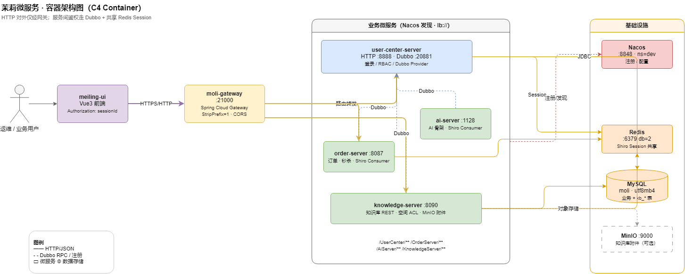
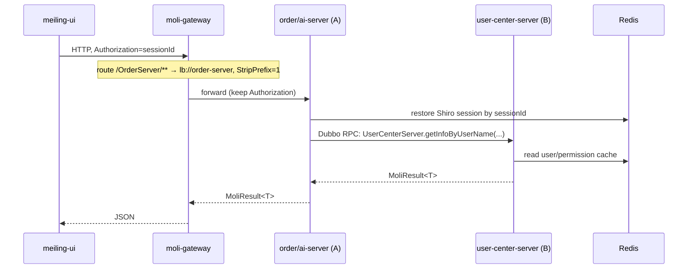
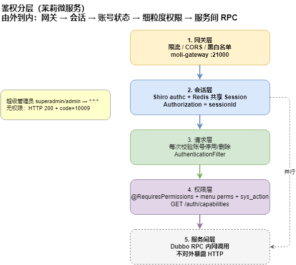
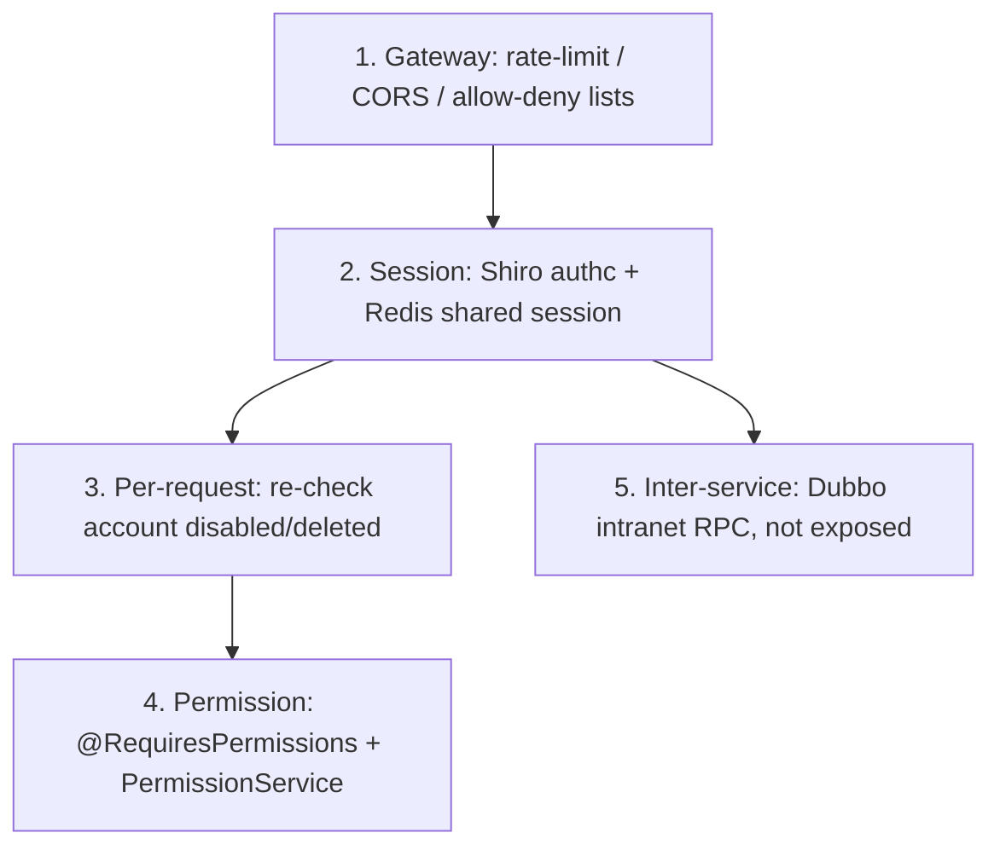

# Moli Microservices — Architecture / Invocation / Authentication

**Languages / 语言 / 言語**: [中文](../zh-CN/ARCHITECTURE.md) | [English](ARCHITECTURE.md) | [日本語](../ja/ARCHITECTURE.md)

> This document describes the tech stack, invocation patterns, and authentication for the full chain
> "external request ↔ gateway ↔ service A ↔ service B".
> Mapping: **Service A = order-server / ai-server** (business services), **Service B = user-center-server** (callee).

---

## 1. Request Flow



> Source: [moli-container-architecture.drawio](../diagrams/moli-container-architecture.drawio)


> Source: [moli-auth-flow.drawio](../diagrams/moli-auth-flow.drawio)

<details>
<summary>ASCII backup</summary>

```
meiling-ui (browser)
   │  HTTP + Header: Authorization=sessionId
   ▼
moli-gateway :21000            Spring Cloud Gateway (routing / rate-limit / CORS)
   │  lb://<service>  +  StripPrefix=1
   ▼
order-server / ai-server       Shiro authc validates the session (shared Redis session)
   │  Dubbo RPC (version=1.0.0, group=moli)
   ▼
user-center-server :8888       Dubbo Provider → business logic
   │
   ▼
Redis (shared session/cache)  /  MySQL (business & permission data)
```

</details>

<details>
<summary>Mermaid backup (sequence)</summary>



</details>

---

## 2. Tech Stack

| Segment | Technology | In this project |
|---------|-----------|-----------------|
| Browser → Gateway | HTTP/JSON | `meiling-ui` |
| Gateway | Spring Cloud Gateway (reactive WebFlux) | `moli-gateway` |
| Discovery | Nacos 2.0.3 Discovery | service `bootstrap.yml` |
| Config | Nacos Config (`extension-configs`) | enabled on user-center |
| Load balancing | Ribbon (`lb://`, Hoxton built-in) | gateway routes |
| Inter-service | **Spring Cloud Dubbo (RPC)** | `UserServerProvider` / `@DubboReference` |
| Auth framework | Apache Shiro + Redis shared session | service `ShiroConfig` |
| Session/cache | Redis (`shiro:session:` / `shiro:cache:`) | `RedisSessionDAO` |
| Resilience | Sentinel (selected; recommended on gateway + consumers) | — |
| Unified result | `MoliResult<T>` / `PageRes<T>` | distribute-common |

Baseline: JDK 8, Spring Boot 2.3.12, Spring Cloud Hoxton.SR12, Spring Cloud Alibaba 2.2.7, Nacos 2.0.3.

---

## 3. Invocation Patterns

### 3.1 External → Gateway (HTTP)

Unified entry `:21000`. Routes (`moli-gateway/application-dev.yml`):

| Path prefix | Target | Filter |
|-------------|--------|--------|
| `/UserCenter/**` | `lb://user-center-server` | `StripPrefix=1` |
| `/OrderServer/**` | `lb://order-server` | `StripPrefix=1` |
| `/AiServer/**` | `lb://ai-server` | `StripPrefix=1` |

`StripPrefix=1` removes the first segment, e.g. `/UserCenter/user/list` → `/user/list`.

### 3.2 Gateway → Service (HTTP + LB)

Routes by Nacos service name via Ribbon; forwards the `Authorization` header for downstream session restore.

### 3.3 Service A ↔ Service B (Dubbo RPC, the single mechanism)

#### Decision summary

| Scenario | Invocation | Auth |
|----------|------------|------|
| Browser / `meiling-ui` → gateway → any service | **HTTP/REST** | Shiro `authc` + `Authorization` header (sessionId) |
| Business service login (no user session yet) | **Dubbo RPC** | Intranet RPC, no HTTP exposure |
| Business service calling user-center with user context | **Dubbo RPC** (if needed) | Shared Redis session + local Shiro |

> **OpenFeign is no longer used for inter-service calls.** `UserCenterClient` and the `/user/getInfoByUserName` HTTP endpoint were removed.

#### Contract and coordinates

- **Contract**: `UserCenterServer` in `moli-user-center-client`
- **Provider**: `UserServerProvider` on `user-center-server` (`@DubboService(version="1.0.0", group="moli")`)
- **Consumer**: `@DubboReference` on a Spring `@Configuration` (e.g. client `ShiroConfig`), then pass into `ShiroRealm` via setter — **do not put `@DubboReference` on a plain class instantiated with `new`**

```java
@Configuration
public class ShiroConfig {
    @DubboReference(version = "1.0.0", group = "moli", protocol = "dubbo", check = false)
    private UserCenterServer userCenterServer;

    @Bean
    public ShiroRealm shiroRealm() {
        ShiroRealm realm = new ShiroRealm();
        realm.setUserCenterServer(userCenterServer);
        return realm;
    }
}
```

- **Registry**: `spring-cloud://` on Nacos; consumers use `dubbo.cloud.subscribed-services: user-center-server`
- **Ports**: user-center `20881`, order `20882`, bi `20883`

#### `moli-user-center-client` module

| Content | Description |
|---------|-------------|
| `UserCenterServer` | Dubbo contract interface |
| `shiro/*` | Reusable Shiro config for order/ai |
| Dependencies | `spring-cloud-starter-dubbo`, `spring-context-support`, Nacos Discovery |
| Excludes | OpenFeign, internal HTTP endpoints |

---

## 4. Authentication (layered)



> Source: [moli-auth-layers.drawio](../diagrams/moli-auth-layers.drawio)

<details>
<summary>Mermaid backup</summary>



</details>

| Layer | Mechanism | Implementation |
|-------|-----------|----------------|
| Entry | gateway rate-limit/CORS | `moli-gateway` (recommend Sentinel + global filter) |
| Session | Shiro `authc`; token = sessionId | `ShiroSessionManager` reads `Authorization` header, cookies disabled |
| Shared session | all services share one Redis | `RedisSessionDAO`, prefix `shiro:session:` |
| Per-request | re-check account status | server `AuthenticationFilter` (logs out disabled/deleted) |
| Fine-grained | page `perms` + action `sys_role_action` union | `@RequiresPermissions` + `PermissionService` + `GET /auth/capabilities` |
| Super admin | `superadmin`/`admin` hold `*:*:*` | `PrivilegedUserUtils` |
| Cross-system SSO | Ticket + `X-Sso-Secret` header | `SsoController` (`/sso/validate` anon + secret) |
| Inter-service | Dubbo intranet RPC, no HTTP exposure | combine with network isolation |

Anonymous whitelist (user-center `ShiroConfig`): `/login`, `/sso/validate`, Swagger, static resources; everything else `authc`. Unauthorized response: HTTP 200 + `code=10009`.

---

## 5. Key Conventions

| Item | Convention |
|------|------------|
| Nacos namespace (dev) | gateway and all services share `4fa85588-6ab5-479b-aea2-2b1d2e52db7a`, otherwise discovery/Dubbo fail |
| Token carrier | sessionId in HTTP header `Authorization`; cookies disabled end-to-end |
| Dubbo coordinates | `version=1.0.0` + `group=moli`, provider and consumer must match |
| Consumer subscription | `dubbo.cloud.subscribed-services: user-center-server`, `dubbo.consumer.check: false` |
| Result/exception | `MoliResult` + global handlers (`ShiroExceptionHandler` / `GlobalExceptionHandler`) |

---

## 6. Login flow (business service example)

```
1. Frontend POST /OrderServer/login → gateway → order-server
2. Shiro UsernamePasswordToken → client/ShiroRealm.doGetAuthenticationInfo()
3. userCenterServer.getInfoByUserName(userName) via @DubboReference in ShiroConfig
4. Dubbo RPC → UserServerProvider → UserService → MySQL
5. Return SysUser → local password check → Redis session (shiro:session:*)
6. Response LoginVo; token = sessionId in Authorization header
```

All services share the same Redis, so one sessionId works across user-center / order / bi.

---

## 7. Dubbo vs Feign (project decision)

| Aspect | Dubbo (adopted) | OpenFeign (removed) |
|--------|-----------------|---------------------|
| Protocol | Binary RPC | HTTP/JSON |
| REST exposure | No | Yes (Controller + Shiro rules) |
| Login-time user lookup | Native | Needs anon or internal secret |
| Use case | **Inter-service** | External/browser via gateway HTTP |

---

## 8. Production Hardening

1. **Network isolation**: expose only the gateway `:21000`; service HTTP and Dubbo ports (20881/20882/20883) intranet-only.
2. **Gateway protection**: Sentinel rate-limiting + a global auth/allow-deny filter.
3. **Dubbo intranet**: keep registry and Dubbo ports off the public network; optionally add Dubbo token auth or TLS.
4. **Secrets**: Redis password + intranet isolation; SSO `shared-secret` and DB credentials via env/Nacos, not hard-coded.
5. **Swagger**: disable `swagger.show` in prod or restrict via gateway.

---

## 9. Startup Order

1. Nacos (`:8848`), Redis, MySQL
2. `moli-gateway` (`:21000`)
3. `user-center-server` (`:1127`, Dubbo `20881`)
4. `order-server` (`:8087`, Dubbo `20882`), `ai-server` (`:1128`, Dubbo `20883`)
5. `meiling-ui` proxy → `http://localhost:21000/UserCenter`
