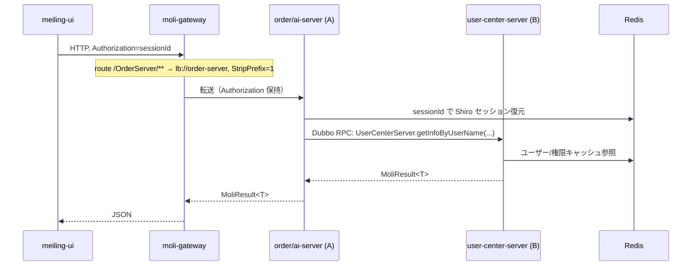
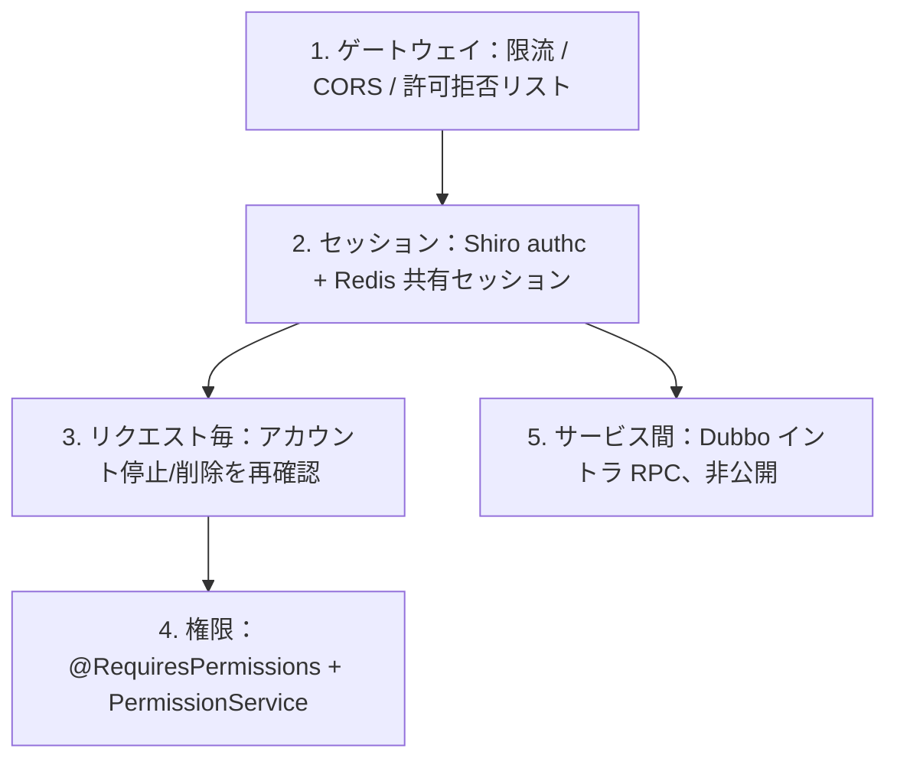

# 茉莉マイクロサービス — アーキテクチャ / 呼び出し / 認証

**Languages / 语言 / 言語**: [中文](../zh-CN/ARCHITECTURE.md) | [English](../en/ARCHITECTURE.md) | [日本語](ARCHITECTURE.md)

> 「外部リクエスト ↔ ゲートウェイ ↔ サービス A ↔ サービス B」全経路の技術スタック・呼び出し方式・認証方式を記載する。
> 対応：**サービス A = order-server / ai-server**（業務サービス）、**サービス B = user-center-server**（呼び出される側）。

---

## 1. リクエストの流れ


> ソース：[moli-container-architecture.drawio](../diagrams/moli-container-architecture.drawio)


> ソース：[moli-auth-flow.drawio](../diagrams/moli-auth-flow.drawio)

<details>
<summary>ASCII 備考</summary>

```
meiling-ui (ブラウザ)
   │  HTTP + Header: Authorization=sessionId
   ▼
moli-gateway :21000            Spring Cloud Gateway（ルーティング/限流/CORS）
   │  lb://<service>  +  StripPrefix=1
   ▼
order-server / ai-server       Shiro authc がセッション検証（Redis 共有セッション）
   │  Dubbo RPC（version=1.0.0, group=moli）
   ▼
user-center-server :8888       Dubbo Provider → 業務処理
   │
   ▼
Redis（共有セッション/キャッシュ）  /  MySQL（業務・権限データ）
```

</details>

<details>
<summary>Mermaid 備考</summary>



</details>

---

## 2. 技術スタック

| 区間 | 技術 | 本プロジェクト |
|------|------|----------------|
| ブラウザ → ゲートウェイ | HTTP/JSON | `meiling-ui` |
| ゲートウェイ | Spring Cloud Gateway（リアクティブ WebFlux） | `moli-gateway` |
| 発見 | Nacos 2.0.3 Discovery | 各 `bootstrap.yml` |
| 設定 | Nacos Config（`extension-configs`） | user-center で有効 |
| 負荷分散 | Ribbon（`lb://`、Hoxton 内蔵） | ゲートウェイルート |
| サービス間 | **Spring Cloud Dubbo（RPC）** | `UserServerProvider` / `@DubboReference` |
| 認証基盤 | Apache Shiro + Redis 共有セッション | 各 `ShiroConfig` |
| セッション/キャッシュ | Redis（`shiro:session:` / `shiro:cache:`） | `RedisSessionDAO` |
| 回復性 | Sentinel（採用予定、ゲートウェイ＋消費側に推奨） | — |
| 統一レスポンス | `MoliResult<T>` / `PageRes<T>` | distribute-common |

基盤：JDK 8、Spring Boot 2.3.12、Spring Cloud Hoxton.SR12、Spring Cloud Alibaba 2.2.7、Nacos 2.0.3。

---

## 3. 呼び出し方式

### 3.1 外部 → ゲートウェイ（HTTP）

統一入口 `:21000`。ルート（`moli-gateway/application-dev.yml`）：

| パス接頭辞 | 宛先 | フィルタ |
|------------|------|----------|
| `/UserCenter/**` | `lb://user-center-server` | `StripPrefix=1` |
| `/OrderServer/**` | `lb://order-server` | `StripPrefix=1` |
| `/AiServer/**` | `lb://ai-server` | `StripPrefix=1` |

`StripPrefix=1` は先頭セグメントを除去（例：`/UserCenter/user/list` → `/user/list`）。

### 3.2 ゲートウェイ → サービス（HTTP + LB）

Nacos サービス名 + Ribbon でインスタンス選択。`Authorization` ヘッダーを転送し下流でセッション復元。

### 3.3 サービス A ↔ サービス B（Dubbo RPC に統一）

#### 選型結論

| シナリオ | 呼び出し | 認証 |
|----------|----------|------|
| ブラウザ / `meiling-ui` → ゲートウェイ → 各サービス | **HTTP/REST** | Shiro `authc` + `Authorization` ヘッダー |
| 業務サービスログイン（ユーザーセッションなし） | **Dubbo RPC** | イントラ RPC、HTTP 非公開 |
| ユーザーコンテキスト付きでユーザーセンター呼び出し | **Dubbo RPC** | Redis 共有セッション + ローカル Shiro |

> **サービス間呼び出しに OpenFeign は使用しない。** `UserCenterClient` と `/user/getInfoByUserName` HTTP エンドポイントは削除済み。

#### 契約と座標

- **契約**：`moli-user-center-client` の `UserCenterServer`
- **プロバイダ**：`UserServerProvider`（`@DubboService(version="1.0.0", group="moli")`）
- **コンシューマ**：Spring `@Configuration`（client `ShiroConfig`）に `@DubboReference` を置き、`ShiroRealm` へ setter で注入。**`new ShiroRealm()` の通常クラスに `@DubboReference` を置かない**

```java
@Configuration
public class ShiroConfig {
    @DubboReference(version = "1.0.0", group = "moli", protocol = "dubbo", check = false)
    private UserCenterServer userCenterServer;

    @Bean
    public ShiroRealm shiroRealm() {
        ShiroRealm realm = new ShiroRealm();
        realm.setUserCenterServer(userCenterServer);
        return realm;
    }
}
```

- **レジストリ**：Nacos 上 `spring-cloud://`；`dubbo.cloud.subscribed-services: user-center-server`
- **ポート**：user-center `20881`、order `20882`、bi `20883`

---

## 4. 認証（多層）


> ソース：[moli-auth-layers.drawio](../diagrams/moli-auth-layers.drawio)

<details>
<summary>Mermaid 備考</summary>



</details>

| 層 | 仕組み | 実装 |
|----|--------|------|
| 入口 | ゲートウェイ限流/CORS | `moli-gateway`（Sentinel + グローバルフィルタ推奨） |
| セッション | Shiro `authc`、token = sessionId | `ShiroSessionManager` が `Authorization` から取得、Cookie 無効 |
| 共有セッション | 全サービスが同一 Redis | `RedisSessionDAO`、接頭辞 `shiro:session:` |
| リクエスト毎 | アカウント状態を再確認 | server `AuthenticationFilter`（停止/削除はログアウト） |
| 細粒度権限 | ページ `perms` + 動作 `sys_role_action` の和集合 | `@RequiresPermissions` + `PermissionService` + `GET /auth/capabilities` |
| スーパー管理者 | `superadmin`/`admin` は `*:*:*` | `PrivilegedUserUtils` |
| クロスシステム SSO | Ticket + `X-Sso-Secret` ヘッダー | `SsoController`（`/sso/validate` 匿名 + シークレット） |
| サービス間 | Dubbo イントラ呼び出し、HTTP 非公開 | ネットワーク分離と併用 |

匿名許可リスト（user-center `ShiroConfig`）：`/login`、`/sso/validate`、Swagger、静的リソース；その他は `authc`。権限なし応答：HTTP 200 + `code=10009`。

---

## 5. 主要な取り決め

| 項目 | 取り決め |
|------|----------|
| Nacos namespace（dev） | ゲートウェイと全サービスで `4fa85588-6ab5-479b-aea2-2b1d2e52db7a` を統一。さもないと発見/Dubbo が失敗 |
| トークン媒体 | sessionId を HTTP ヘッダー `Authorization` に格納、Cookie は全経路で無効 |
| Dubbo 座標 | `version=1.0.0` + `group=moli`、提供側と消費側で一致必須 |
| 消費側購読 | `dubbo.cloud.subscribed-services: user-center-server`、`dubbo.consumer.check: false` |
| レスポンス/例外 | `MoliResult` + グローバル例外（`ShiroExceptionHandler` / `GlobalExceptionHandler`） |

---

## 6. ログイン認証フロー（業務サービス例）

```
1. フロント POST /OrderServer/login → ゲートウェイ → order-server
2. Shiro UsernamePasswordToken → client/ShiroRealm.doGetAuthenticationInfo()
3. ShiroConfig の @DubboReference 経由 userCenterServer.getInfoByUserName(userName)
4. Dubbo RPC → UserServerProvider → UserService → MySQL
5. SysUser 返却 → ローカルパスワード検証 → Redis セッション
6. LoginVo 返却；token = sessionId（Authorization ヘッダー）
```

全サービスが同一 Redis を共有し、sessionId は user-center / order / bi 間で共通。

---

## 7. Dubbo と Feign の選型（本プロジェクト）

| 観点 | Dubbo（採用） | OpenFeign（削除） |
|------|---------------|-------------------|
| プロトコル | バイナリ RPC | HTTP/JSON |
| REST 公開 | なし | あり |
| ログイン時ユーザー取得 | ネイティブ対応 | anon または内部キーが必要 |
| 用途 | **サービス間** | 外部/ブラウザ（ゲートウェイ HTTP） |

---

## 8. 本番ハードニング

1. **ネットワーク分離**：公開はゲートウェイ `:21000` のみ；サービス HTTP と Dubbo ポート（20881/20882/20883）はイントラのみ。
2. **ゲートウェイ防御**：Sentinel 限流 + グローバル認証/許可拒否フィルタ。
3. **Dubbo イントラ**：レジストリと Dubbo ポートは非公開；必要に応じ Dubbo トークン認証や TLS を追加。
4. **シークレット**：Redis パスワード + イントラ分離；SSO `shared-secret` や DB 資格情報は env/Nacos 経由でハードコードしない。
5. **Swagger**：本番では `swagger.show` を無効化、またはゲートウェイで制限。

---

## 9. 起動順序

1. Nacos（`:8848`）、Redis、MySQL
2. `moli-gateway`（`:21000`）
3. `user-center-server`（`:1127`、Dubbo `20881`）
4. `order-server`（`:8087`、Dubbo `20882`）、`ai-server`（`:1128`、Dubbo `20883`）
5. `meiling-ui` プロキシ → `http://localhost:21000/UserCenter`
