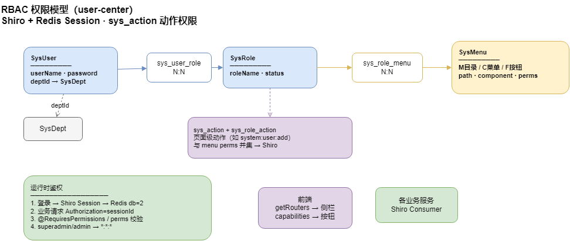
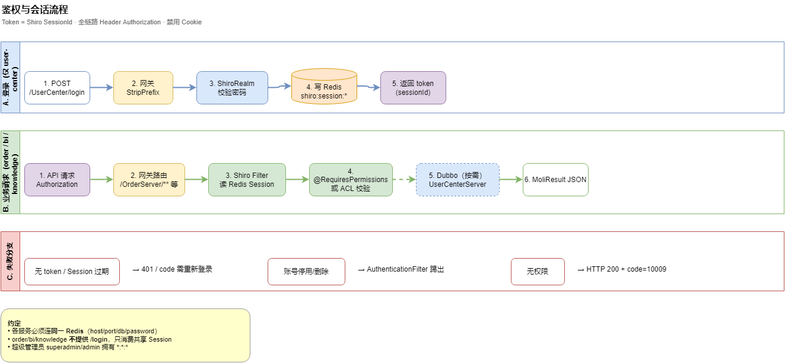
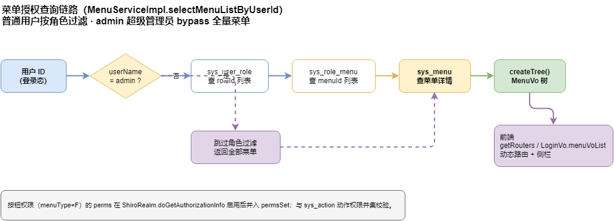
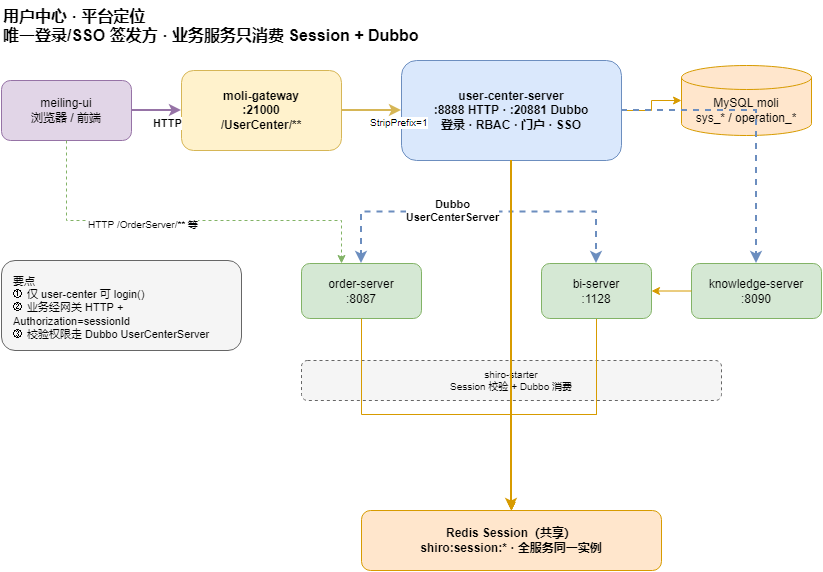

# RBAC 権限設計ドキュメント

**Languages / 语言 / 言語**: [中文](../zh-CN/RBAC.md) | [English](../en/RBAC.md) | [日本語](RBAC.md)

> `moli-user-center` の RBAC モデル、認証・認可フロー、API 設計。

---

## 1. 設計概要

クラシックな **ユーザー — ロール — 権限（メニュー）** モデル：

- **ユーザー** ↔ **ロール**：`sys_user_role`（N:N）
- **ロール** ↔ **メニュー**：`sys_role_menu`（N:N）
- **メニュー**はフロントルートと **権限識別子（`perms`）** を担う；ボタン型メニューが API 権限

**Apache Shiro** で認証・認可；Session と権限キャッシュは **Redis** に保存。



> ソース：[moli-rbac-model.drawio](../diagrams/moli-rbac-model.drawio)

<details>
<summary>ASCII 備考</summary>

```
ユーザー (SysUser) ──N:N──▶ ロール (SysRole) ──N:N──▶ メニュー (SysMenu)
                                                              │
                                                      perms（ボタン権限）
     │
     ▼ deptId
部門 (SysDept)
```

</details>

---

## 2. コアエンティティ

### SysUser

| フィールド | 説明 |
|-----------|------|
| `userName` | ログインユーザー名 |
| `password` | SHA-256 + ソルト、15 回反復 |
| `salt` | パスワードソルト |
| `deptId` | 所属部門 |
| `status` | ロック（0=未、1=済） |
| `isDelete` | 論理削除（0=未、1=済） |

### SysRole

| フィールド | 説明 |
|-----------|------|
| `roleName` | ロール名 |
| `status` | 1=正常、0=停止 |
| `orderNum` | 並び順 |
| `remark` | 備考 |

### SysMenu

| フィールド | 説明 |
|-----------|------|
| `menuName` | メニュー名 |
| `parentId` | 親メニュー ID（0=ルート） |
| `path` | フロントルート |
| `component` | フロントコンポーネント |
| `menuType` | M=ディレクトリ、C=メニュー、F=ボタン |
| `perms` | 権限識別子（ボタン用） |
| `status` | 1=有効、0=無効 |

**メニュータイプ**

| コード | 種別 | 用途 |
|--------|------|------|
| `M` | ディレクトリ | メニューツリー |
| `C` | メニュー | ページルート |
| `F` | ボタン | ボタン/API 権限（`perms`） |

### 関連テーブル

| テーブル | フィールド | 説明 |
|---------|-----------|------|
| `sys_user_role` | `userId`, `roleId` | ユーザー-ロール N:N |
| `sys_role_menu` | `roleId`, `menuId` | ロール-メニュー N:N |

---

## 3. 権限識別子

形式：**`モジュール:リソース:操作`**（`CommonPermissionConstant` 参照）

| 識別子 | 説明 |
|--------|------|
| `sys:user:create` | ユーザー作成 |
| `sys:user:update` | ユーザー更新 |
| `sys:user:delete` | ユーザー削除 |
| `sys:role:create` | ロール作成 |
| `sys:role:update` | ロール更新 |
| `sys:role:delete` | ロール削除 |
| `sys:dept:create` | 部門作成 |
| `sys:dept:update` | 部門更新 |
| `sys:dept:delete` | 部門削除 |

Shiro 認可有効化後、`@RequiresPermissions("sys:user:create")` で API 検証可能。

---

## 4. 認証フロー



> ソース：[moli-auth-flow.drawio](../diagrams/moli-auth-flow.drawio)

### ログイン — `POST /login`

1. クライアントが `{userName, password}` を送信
2. Shiro `subject.login()` で資格情報検証
3. Session を Redis に保存（`shiro:session:*`）
4. `selectMenuTreeByUserId` でメニューツリー取得
5. `LoginVo` 返却：`token`（Session ID）+ `user` + `menuVoList`

### パスワード暗号化

- アルゴリズム：**SHA-256**、**15 回反復**、ユーザーごとの `salt`
- ユーティリティ：`SHA256Util.sha256(password, salt)`

### Session と Token

- Redis キー：`shiro:session:` / `shiro:cache:`
- Principal フィールド：`userName`
- ログアウト：`POST /logout` → `ShiroUtils.logout()`

### ホワイトリスト（認証不要）

| パス | 用途 |
|------|------|
| `/login` | ログイン |
| `/swagger-ui.html`、`/v2/**` | Swagger |
| `/static/**` | 静的リソース |

---

## 5. 認可フロー

### メニュー認可（実装済み）



> ソース：[moli-rbac-menu-query.drawio](../diagrams/moli-rbac-menu-query.drawio)

<details>
<summary>ASCII 備考</summary>

```
ユーザー ID → sys_user_role → sys_role_menu → sys_menu → MenuVo ツリー
```

</details>

- **スーパー管理者**：ユーザー名 `admin` は全メニュー取得
- 実装：`MenuServiceImpl.selectMenuListByUserId()`

### API 権限（予約）

`ShiroRealm.doGetAuthorizationInfo()` のロジックはコメントアウト中。有効化後：

1. ロール → `rolesSet`
2. ボタンメニュー（`menuType = F`）→ `perms` → `permsSet`
3. Redis キャッシュ、`@RequiresPermissions` / `@RequiresRoles` 対応

### フロントルート

`GET /menu/getRouters` が `MenuVo` ツリー（`path`、`component`、`meta`、`children`）を返却。

---

## 6. 管理 API

### `/user`

| メソッド | パス | 説明 |
|---------|------|------|
| GET | `/user/list` | ユーザー一覧（ページング） |
| POST | `/user` | ユーザー作成 |
| PUT | `/user/inserUserRole` | ロール割当 |

### `/role`

| メソッド | パス | 説明 |
|---------|------|------|
| GET | `/role/list` | ロール一覧 |
| POST | `/role` | ロール作成（`menuIds` 同時指定可） |
| DELETE | `/role/{ids}` | ロール削除 |

### `/menu`

| メソッド | パス | 説明 |
|---------|------|------|
| GET | `/menu/getRouters` | 現在ユーザーのルートツリー |
| GET | `/menu/getMenuTreeAll` | 全メニューツリー |
| GET | `/menu/selectMenuTreeByRoleId/{roleId}` | ロールメニュー割当プレビュー |

### `/dept`

部門 CRUD；`deptId` でユーザーと関連、RBAC ロールとは独立。

---

## 7. サービス間認証



> ソース：[moli-user-center-position.drawio](../diagrams/moli-user-center-position.drawio)

他サービスは **`moli-user-center-shiro-starter`** を利用：

<details>
<summary>ASCII 備考</summary>

```
業務サービス                      ユーザーセンター
    │── Dubbo: getInfoByUserName ──▶│  UserServerProvider（RPC、HTTP 非公開）
    │── Redis セッション共有 ────────│  shiro:session:* / shiro:cache:*
    │── Authorization ヘッダー ──────│  外部トラフィックはゲートウェイ経由
```

</details>

- **`ShiroConfig`**：`@DubboReference` で `UserCenterServer` を注入し、`ShiroRealm` へ setter で渡す
- **`ShiroRealm`（starter）**：user-center 発行 Session を復元；Dubbo で権限取得
- 詳細は [アーキテクチャ / 呼び出し / 認証](ARCHITECTURE.md)

---

## 8. 実装状況

| 機能 | 状態 | 備考 |
|------|------|------|
| ユーザー/ロール/メニュー CRUD | ✅ 実装済 | Controller |
| ユーザー-ロール割当 | ✅ 実装済 | `inserUserRole` |
| ロール-メニュー紐付け | ✅ 実装済 | ロール作成時 |
| ログイン + Redis Session | ✅ 実装済 | Shiro + shiro-redis |
| ロール別メニューツリー | ✅ 実装済 | admin バイパス含む |
| Shiro `@RequiresPermissions` | ⏳ 予約 | Realm 認可ロジック未有効化 |
| キャプチャ | ⏳ 予約 | フレームワークのみ |

---

## 9. コード位置

| モジュール | パス | 責務 |
|-----------|------|------|
| エンティティ | `moli-user-center-common/.../entity/` | SysUser、SysRole、SysMenu |
| 定数 | `.../CommonPermissionConstant.java` | 権限識別子 |
| Shiro 設定 | `.../config/shiro/ShiroConfig.java` | フィルタチェーン、Redis Session |
| Realm | `.../config/shiro/ShiroRealm.java` | 認証・認可 |
| メニューサービス | `.../MenuServiceImpl.java` | メニューツリー・RBAC クエリ |
| ログイン | `.../LoginController.java` | ログイン/ログアウト |
| Client | `moli-user-center-client/` | Dubbo 契約 + Shiro 統合 |
