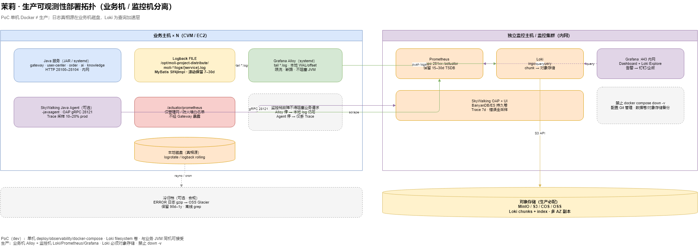
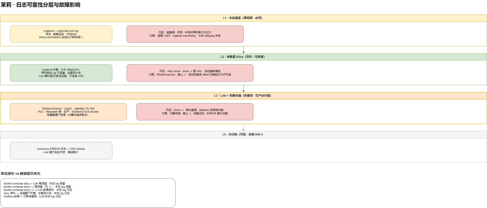

# 可观测性 · 生产部署与日志可靠性

> **读者**：运维、SRE、发布负责人  
> **定位**：PoC（`deploy/observability/` 单机 Docker）与 **生产** 的差异、日志不丢策略、故障影响矩阵  
> **关联**：[可观测性平台规划](../design/observability-platform-plan.md) · [监控与日志](monitoring-and-logs.md) · [生产检查清单](production-checklist.md)

---

## 1. 核心原则

**不要把「Grafana 里能查到」当成唯一日志来源。**

| 原则 | 说明 |
|------|------|
| **本地落盘是真相源** | Logback 写 `logs/{service}.log`；Alloy/Loki/Grafana 全挂，业务仍写盘 |
| **采集与业务解耦** | Alloy、SkyWalking Agent 独立进程；**不得**阻塞 HTTP/Dubbo |
| **监控机与业务机分离** | PoC 可同机；生产监控组件独立主机或集群 |
| **Loki 生产必须对象存储** | PoC filesystem 卷不够；用 MinIO/S3/COS/OSS 存 chunk |
| **可观测栈故障 ≠ 业务故障** | Loki/Grafana/OAP down 时，请求仍应成功 |

---

## 2. 部署拓扑



> 若 PNG 未生成，在仓库根执行：`powershell -ExecutionPolicy Bypass -File docs/diagrams/export-diagrams.ps1`

> 可编辑源文件：[moli-observability-prod-topology.drawio](../diagrams/moli-observability-prod-topology.drawio)

### 2.1 业务主机（× N）

| 组件 | 部署方式 | 说明 |
|------|----------|------|
| Java 服务 | systemd + `moli-service.sh` | HTTP 28100–28104，内网 |
| Logback | 各模块 `logback-spring.xml` | 路径 `/opt/moli-project-distribute/moli-*/logs/{service}.log` |
| MyBatis | `Slf4jImpl`（`deploy/*/application-pro.yml`） | SQL 以 DEBUG 进 log 文件 |
| **Alloy** | **systemd 独立服务** | tail `*.log` → push Loki；本地 WAL/offset |
| SkyWalking Agent | 可选 `-javaagent` | `SKYWALKING_ENABLED=true`；OAP 内网 gRPC |
| Actuator | `/actuator/prometheus` | **仅管理网**；不经 Gateway 暴露 |

### 2.2 独立监控主机

| 组件 | 说明 |
|------|------|
| Prometheus | scrape 各业务机 Actuator；TSDB 保留 15～30 天 |
| Loki | ingest + query；**chunk/index → 对象存储** |
| Grafana | 内网 HTTPS；Dashboard + Loki Explore + 告警 |
| SkyWalking OAP/UI | BanyanDB/ES **挂持久卷**；Trace 保留 7 天；prod 采样 10～20% |

### 2.3 PoC vs 生产

| 项 | 本地 PoC | 生产 |
|----|----------|------|
| 部署 | 单机 `docker-compose.observability.yml` | 业务机 Alloy + 监控机集群 |
| Loki 存储 | Docker 卷 `loki-data`（filesystem） | **对象存储**（S3/MinIO/COS） |
| SkyWalking 存储 | BanyanDB 容器 `/tmp`（无卷） | 命名卷或 ES/BanyanDB 集群 |
| 与业务同机 | 可接受（开发） | **不建议** |
| `docker compose down -v` | 会清 Loki/Prometheus 卷 | **禁止** |

---

## 3. 日志可靠性分层



> 可编辑源文件：[moli-observability-log-resilience.drawio](../diagrams/moli-observability-log-resilience.drawio)

### L1 · 本地落盘（必须）

- **dev / pro 统一**单文件 `{LOG_PATH}/{LOG_FILE}`，pro 仅 FILE、不写 stdout 给采集。
- logback **按大小/天滚动**，保留 7～30 天（按磁盘预算）。
- **磁盘告警**：日志分区使用率 >80% 告警。
- 运维兜底：`ssh` + `tail` / `grep` 直接查 `logs/*.log`。

### L2 · Alloy 采集（异步、可恢复）

- **systemd**：`Restart=always`；配置纳入 Git（`deploy/observability/alloy/`）。
- 停机期间：JVM 继续写盘；Alloy 恢复后从 **offset/WAL** 补采（`alloy-data` 卷或生产等价路径）。
- Loki 慢/挂：Agent **背压/丢弃远程**，不拖垮业务 JVM。
- **禁止** `docker compose down -v` 清 Alloy 状态（生产用 systemd 则无此问题）。

### L3 · Loki + 对象存储（热查询）

- 保留期：普通日志 **15 天**；ERROR/WARN **30 天**（见 [可观测性平台规划 §6.3](../design/observability-platform-plan.md)）。
- 生产 **必须** 将 Loki `storage_config` 指向对象存储，避免容器重建丢库。
- Grafana 仅查询层；Grafana 故障不影响 Loki 与本地 log。

### L4 · 冷归档（可选 · 合规）

- ERROR/审计日志 `cron`/`rsync` → OSS Glacier 等，保留 90 天～1 年。
- Loki retention 到期后的历史，靠离线归档 + `zgrep`。

---

## 4. 故障影响矩阵

| 操作 / 故障 | 本地 `*.log` | Loki 已采集数据 | Grafana 查询 | 业务请求 |
|-------------|--------------|-----------------|--------------|----------|
| `docker compose stop` | ✅ 保留 | ✅ 卷保留 | 暂不可用 | ✅ 正常 |
| `docker compose down`（无 `-v`） | ✅ 保留 | ✅ 卷保留 | 暂不可用 | ✅ 正常 |
| `docker compose down -v` | ✅ 保留 | ❌ **丢失** | ❌ | ✅ 正常 |
| Alloy 进程 down | ✅ 仍写入 | 暂停 ingest | 无新日志 | ✅ 正常 |
| Alloy 恢复 | ✅ | 通常 **补采** | 恢复 | ✅ 正常 |
| Loki down | ✅ | 暂停写入 | 失败 | ✅ 正常 |
| Grafana down | ✅ | ✅ | ❌ | ✅ 正常 |
| 日志磁盘满 | ❌ **风险** | — | — | 可能异常 |

**结论**：生产防丢靠 **L1 落盘 + L3 对象存储**；PoC 单机 Docker 的主要风险是 **`down -v` 与 filesystem 无对象存储备份**。

---

## 5. 生产检查项（可观测专项）

发布前对照 [production-checklist.md](production-checklist.md) §6，并补充：

| # | 检查项 | ✓ |
|---|--------|---|
| 1 | 各服务 `logs/{service}.log` 存在且 rolling 正常 | |
| 2 | `log-impl: Slf4jImpl` 已生效（发版后 log 中有 SQL DEBUG） | |
| 3 | 业务机 Alloy systemd 运行，`journalctl` 无持续 ERROR | |
| 4 | Loki 使用对象存储（非仅 container filesystem） | |
| 5 | Prometheus 仅内网 scrape；Actuator 未暴露公网 | |
| 6 | Grafana 已改默认密码；Loki/Prometheus 未暴露公网 | |
| 7 | SkyWalking OAP 存储有持久卷或外部 ES | |
| 8 | 磁盘/ingest 失败告警已配置 | |
| 9 | 演练：停 Loki 10 分钟 → 业务无影响 → 恢复后 Alloy 补采 | |

---

## 6. Alloy systemd 模板（业务机）

> 路径与账号按实际 CVM 调整；配置源文件：`deploy/observability/alloy/config.alloy`。

```ini
# /etc/systemd/system/moli-alloy.service
[Unit]
Description=Moli Grafana Alloy log shipper
After=network-online.target
Wants=network-online.target

[Service]
Type=simple
User=moli
ExecStart=/usr/local/bin/alloy run \
  --server.http.listen-addr=127.0.0.1:12345 \
  --storage.path=/var/lib/moli-alloy \
  /opt/moli-project-distribute/deploy/observability/alloy/config.prod.alloy
Restart=always
RestartSec=5
LimitNOFILE=65536

[Install]
WantedBy=multi-user.target
```

生产 `config.prod.alloy` 须修改：

- Loki push URL → 监控机内网地址（非 `127.0.0.1:28110`）
- tail 路径 → `/opt/moli-project-distribute/moli-*/logs/*.log`
- 标签：`env=prod`、`host=<hostname>`

验收：`systemctl status moli-alloy` · 监控机 Loki `{service="user-center-server"}` 有行。

---

## 7. Loki 对象存储（生产方向）

PoC 使用 `filesystem` + Docker 卷。生产 `loki-config.yml` 需增加 `storage_config` 指向对象存储，例如 MinIO：

```yaml
storage_config:
  aws:
    s3: s3://<endpoint>/moli-loki
    bucketnames: moli-loki-chunks
    access_key_id: ${LOKI_S3_ACCESS_KEY}
    secret_access_key: ${LOKI_S3_SECRET_KEY}
    s3forcepathstyle: true
```

具体字段以 Loki 3.x 官方文档与所选云厂商为准；上线前在预发压测 **日增量、压缩率、保留期**。

---

## 8. 回滚顺序

与 [可观测性平台规划 §7](../design/observability-platform-plan.md) 一致：

1. **SkyWalking**：移除 `-javaagent` 后重启服务（仅丢 Trace）。
2. **Alloy**：`systemctl stop moli-alloy`（**不影响** log 落盘）。
3. **Prometheus**：停 scrape（不影响 Actuator 与业务接口）。
4. **Grafana/Loki/OAP**：停服务（不影响业务请求）。

---

## 9. 相关

| 文档 | 说明 |
|------|------|
| [monitoring-and-logs.md](monitoring-and-logs.md) | 日常 Runbook、LogQL 示例 |
| [idea-local-dev.md](idea-local-dev.md) | 本地 IDEA 与 PoC 栈 |
| [local-dev-ports.md](local-dev-ports.md) | 端口表 |
| [deploy/observability/README.md](../../deploy/observability/README.md) | PoC Compose 启动 |
| [observability-platform-plan.md](../design/observability-platform-plan.md) | 完整规划与 OBS 任务 |
| wiki [[可观测性生产部署]] · [[监控与日志]] | 茉莉系统手册浏览版 |
