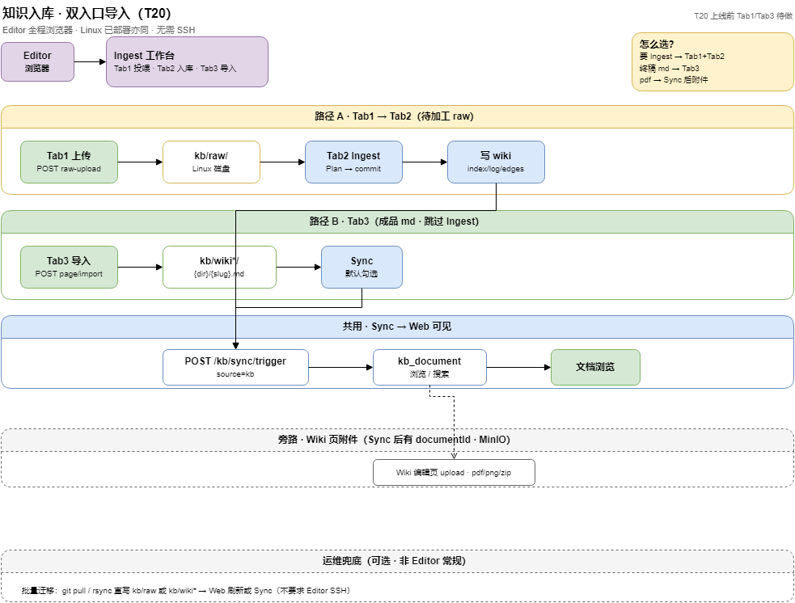

# 知识库 · 双入口导入 PRD（T20）

> **状态**：draft · 2026-07-05 · **技术设计**：[`docs/design/kb-import-entry-design.md`](../design/kb-import-entry-design.md)  
> **里程碑**：M6 扩展（Ingest 工作台 · 投喂 + 成品导入）  
> **上级索引**：[knowledge-workbench-requirements.md](knowledge-workbench-requirements.md) · [knowledge-module-requirements.md](knowledge-module-requirements.md)  
> **HTTP 契约（待补）**：`docs/api/KNOWLEDGE_API.md` §9.x / §8.x  
> **操作手册（待补）**：`docs/ops/knowledge-workbench-operations.md` §2.x  

---

## 1. 背景与目标

### 1.1 问题

当前用户要把内容放进知识库，路径分散、心智成本高：

| 现状 | 痛点 |
|------|------|
| Ingest 只能**读** `kb/raw/`，不能 Web 投喂 | Editor 无法在界面传 raw；T20 Tab1 待做 |
| Wiki 成品 md 无统一「导入」入口 | 与「新建文档」T14e 未闭环；易误以为 `POST /kb/document` |
| MinIO 附件与 raw/wiki 概念混用 | 用户不清楚 pdf 该放 raw 还是附件 |

### 1.2 目标

在 **「知识入库 / Ingest 工作台」** 内提供 **两条正路** + **一条旁路说明**：

| 入口 | 用户心智 | 存储 | 加工 | Web 可见时机 |
|------|----------|------|------|--------------|
| **A. Raw 投喂** | 还没整理好，要 Ingest/LLM | `kb/raw/` | Ingest（Express/Expert/模板） | commit + **Sync** |
| **B. Wiki 成品导入** | md 已是终稿，直接上线 | `kb/wiki*/` | **无** Ingest | 写盘 + **Sync** |
| **C. 页附件（旁路）** | 挂在某篇文档下的 pdf/图片 | MinIO | 无 | Sync 后有 `documentId` 后可传 |

**铁律不变**（[知识库设计哲学-docs-as-code.md](../../moli-knowledge/kb/wiki-moli/develop/知识库设计哲学-docs-as-code.md)）：

- 正文真相源 = wiki 磁盘 markdown；**禁止** Web 直写 `kb_document` 正文。
- raw = **只读投喂池**（Web 可**追加**文件，不改正文 wiki）。
- MinIO = **wiki 页附件**，不是 raw，也不是 wiki 正文。

### 1.3 非目标（v1）

- 不把 pdf/word **自动转成** wiki 正文（除 Ingest LLM 路径外）。
- 不做 MinIO **大文件分片直传**（另开 T21 附件增强，本 PRD 仅引用）。
- 不替代 Cursor Agent 批量厚 Ingest（CLI/Agent 仍保留）。

---

## 2. 用户与场景

> **Editor 全程浏览器**；服务器部署在 Linux 不改变此结论。SSH/SFTP 仅 **运维批量兜底**，见 [技术设计 §1.4](../design/kb-import-entry-design.md#14-editor-路径-vs-运维兜底必读)。

| 角色 | 场景 | 入口 |
|------|------|------|
| editor | 有道/Notion 导出 md，需 LLM 合并进库 | Tab1 上传 raw → Tab2 Ingest（**浏览器**） |
| editor | 运维 Runbook 已写好 md，直接发布 | Tab3 成品导入 → Sync（**浏览器**） |
| editor | 技术方案 pdf 挂在某页下下载 | Sync 后 Wiki 编辑页传附件（MinIO） |
| 运维 / CI | 批量迁移、首发语料 | `git pull` / rsync 写入 `kb/raw` 或 `kb/wiki*` → Web 刷新/Sync（**非 Editor 常规**） |

---

## 3. 产品结构

**菜单**：仍为 **知识库 → Ingest 工作台**（`knowledge/ingest/index`），扩展为三 Tab，**不新增一级菜单**。

```text
Ingest 工作台
├── Tab1 · 投喂 Raw（新 · T20a）
├── Tab2 · 选源入库（现有 · T15）
└── Tab3 · 成品导入（新 · T20b）
```

Wiki 编辑页保留 **MinIO 附件区（T4/T21）**，不在 Tab1/2 处理二进制正文。

### 3.1 流程总览



> 源文件：[moli-kb-import-entry.drawio](../diagrams/moli-kb-import-entry.drawio)

### 3.2 决策树（界面文案）

```text
你的文件是成品 Markdown、可直接当正式页？
  是 → Tab3 成品导入
  否 → Tab1 投喂 Raw → Tab2 Ingest

需要附带 pdf/图片/zip？
  → 先完成 Wiki 页并 Sync → Wiki 编辑页上传附件（MinIO）
```

---

## 4. 功能需求

### 4.1 Tab1 · 投喂 Raw（T20a）

#### 4.1.1 上传

| 项 | 规格 |
|----|------|
| 支持 | 单文件、多文件、`.zip` 解压到指定 prefix（P1） |
| 允许扩展名 | `.md`、`.markdown`、`.txt`、`.note.md`；zip 内同上（P1） |
| 禁止 | 可执行文件、路径含 `..`、绝对路径 |
| 目标路径 | `{kb.ingest.raw-root}/{用户选 prefix}/{原名}` |
| prefix | 下拉 + 新建（单段 `[A-Za-z0-9_-/]`，禁止 `..`） |
| 冲突 | 同名：跳过 / 覆盖 / 重命名（三选一，默认跳过并列表提示） |
| 权限 | 空间 **editor** + 动作 **`kb:ingest:rawUpload`**（新） |

#### 4.1.2 批量与运维（P1 · 非 Editor 主路径）

| 方式 | 行为 |
|------|------|
| Web 多选上传（Tab1） | 同 prefix 批量写入 raw（**Editor 常规**） |
| 运维 / CI 直写磁盘 | `git pull`、rsync、SFTP 写入 `kb/raw/` 后，Editor 点 **刷新 raw 树**（**兜底**，不要求 Editor SSH） |
| 刷新 | 复用 `GET /kb/ingest/raw-tree`（已有） |

#### 4.1.3 上传后引导

- 成功列表展示 **raw 相对路径**。
- CTA：**「去选源入库」** → 切 Tab2，raw-tree **高亮**刚上传项。
- 不自动 Ingest（避免误触 LLM）。

---

### 4.2 Tab2 · 选源入库（现有 T15 · 不变）

沿用 [Ingest工作台产品方案](../../moli-knowledge/kb/wiki-moli/develop/Ingest工作台产品方案.md)：

- raw-tree 勾选 → Express / Expert / 模板 `useLlmGenerate=false`
- commit → 可选 Sync → `nextSteps`

**与 T20 关系**：Tab1 只负责 **把源放进 raw**；加工逻辑 **全部在 Tab2**。

---

### 4.3 Tab3 · 成品导入（T20b）

#### 4.3.1 适用范围

| 包含 | 不包含 |
|------|--------|
| 单/多 `.md` 成品 | pdf/docx（走附件或先 raw+Ingest） |
| 可选保留文件内 frontmatter | 无 frontmatter 时服务端补模板 |

#### 4.3.2 导入向导

| 步 | UI | 规则 |
|----|-----|------|
| 1 | 选 **空间** | 同 Ingest |
| 2 | 选 **分类**（`kb_category.dir_slug`） | 与 T17 落盘一致 |
| 3 | 每文件：**slug**（裸名，默认文件名 stem）、**标题**（默认 frontmatter 或 H1） | slug 冲突：报错或改 slug |
| 4 | 预览路径 | `{dir_slug}/{slug}.md` |
| 5 | 确认导入 | 写 wiki + 可选 lint 摘要 |
| 6 | **Sync** | 默认勾选；成功后 nextSteps |

#### 4.3.3 写盘规则

- 路径：`kb/{wikiDir}/{dir_slug}/{slug}.md`（`wikiDir` 见 `kb.wiki.space-dirs`）。
- API：优先 **`POST /kb/wiki-moli/page/import`**（multipart）；MVP 可前端读文本 + **`PUT /kb/wiki-moli/page`**。
- **不写入 raw**；**不创建 Ingest job**。
- 单文件大小：受 `kb.wiki.max-bytes`（默认 2MB，可配置）；超限提示走 Ingest 或拆篇。

#### 4.3.4 批量 md（P1）

- 多文件 → 逐条 PUT → **一次 Sync**。
- 返回：`{ imported: [{ slug, relativePath, created }], failed: [{ fileName, reason }] }`。

---

### 4.4 Wiki 页附件（T4 已有 · T21 增强 · 不在本 Tab）

| 项 | 说明 |
|----|------|
| 定位 | 某篇 **已 Sync** wiki 页的 binary 附件 |
| API | `POST /kb/attachment/upload`（`documentId` + `file`） |
| **UI 入口** | **Wiki 编辑页** upload/delete；**文档浏览页** 仅 list + 下载（2026-07-05 定案） |
| 存储 | MySQL `kb_attachment.object_key`（MinIO 键）；下载 URL 用 `id` 拼 `/kb/attachment/{id}`，**不入库** |
| 与导入关系 | Tab3 导入成功后，若用户上传 pdf → 先 Sync 拿 id → 编辑页附件 API |

---

## 5. API 草案（后端 T20）

### 5.1 Raw 投喂

| 方法 | 路径 | 说明 |
|------|------|------|
| POST | `/kb/ingest/raw-upload` | multipart：`prefix` + `file`（可多 file 字段） |
| POST | `/kb/ingest/raw-upload/zip` | P1：`prefix` + zip，服务端解压校验后写入 raw |
| GET | `/kb/ingest/raw-tree` | 已有；上传后刷新 |

**响应示例**：

```json
{
  "uploaded": [{ "path": "test-walkthrough/demo.md", "size": 1024, "overwritten": false }],
  "skipped": [{ "path": "test-walkthrough/exists.md", "reason": "ALREADY_EXISTS" }]
}
```

**安全**：路径规范化；根目录 = `kb.ingest.raw-root`；禁止写 wiki 目录。

### 5.2 Wiki 成品导入

| 方法 | 路径 | 说明 |
|------|------|------|
| POST | `/kb/wiki-moli/page/import` | multipart：`spaceId`, `categoryId`, `slug?`, `file` |
| POST | `/kb/wiki-moli/page/import/batch` | P1：多 md + 同一 space/category 或每行 meta JSON |
| PUT | `/kb/wiki-moli/page` | 已有；MVP 可仅用此接口 |
| POST | `/kb/sync/trigger` | 已有；导入后触发 |

**import 逻辑**：

1. 读 md UTF-8；校验/补 frontmatter（`title`, `slug`, `type`, `status`, `created`, `updated`）。
2. `fullSlug = {dir_slug}/{slug}`；`writePage`。
3. 可选 `lint-preview` 返回 warn 列表（不阻塞，与 T14d 一致）。
4. `sync=true` 时调 Sync，返回 `documentId`（便于后续附件）。

### 5.3 权限

| 动作 | perm |
|------|------|
| raw-upload | `kb:ingest:rawUpload`（新 · 挂 menu 906） |
| wiki import | `kb:wiki:edit` + 空间 editor |
| sync | `kb:sync:trigger` |

---

## 6. 前端需求（meiling-ui · T20f）

| 模块 | 路径建议 |
|------|----------|
| Tab 容器 | 扩展 `KnowledgeIngestWorkbenchView.vue` |
| Raw 上传 | `KbRawUploadPanel.vue` |
| 成品导入 | `KbWikiImportPanel.vue` |
| API | 扩展 `src/api/knowledge/kbIngest.ts`、`kbWiki.ts` |

**交互要点**：

- Tab1 上传完成 → 自动切 Tab2 并 `raw-tree` 选中上传路径。
- Tab3 导入完成 → Toast + `nextSteps`（治理 Lint / 健康体检）+ 链 Wiki 编辑。
- 三个 Tab 顶部固定 **决策树折叠说明**（§3.2 文案）。

---

## 7. 与现有能力对照

| 能力 | 关系 |
|------|------|
| T15 Ingest | Tab2 不变；Tab1 为其补充输入 |
| T14 Wiki 编辑 / T14e 新建 | Tab3 与「新建文档」共享 PUT + Sync；可复用 `KbDocumentCreateModal` 分类选择 |
| T17 categoryId 落盘 | Tab3 / Ingest commit 均用 `{dir_slug}/{slug}.md` |
| T4 MinIO 附件 | 独立；Sync 后挂页 |
| raw 覆盖门禁 | 仅 **Ingest commit** 触发；Tab1 上传 raw **不**触发 |
| `lint.py --strict` | Tab3 可选预检；Ingest commit 仍 ERROR 阻塞 |

---

## 8. 分期与优先级

| 阶段 | 范围 | 验收 |
|------|------|------|
| **T20a · P0** | Tab1 单/多文件 raw-upload + 跳 Tab2 | 上传 md 至 raw → Ingest 模板入库 → Sync → 浏览可见 |
| **T20b · P0** | Tab3 单 md 导入 + Sync | 成品 md 不进 raw；直写 wiki → Sync → 浏览可见 |
| **T20c · P1** | zip 投喂、Tab3 批量 md、import API | 10 篇 md 批量导入 ≤1 次 Sync |
| **T20d · P1** | 菜单动作 SQL、`nextSteps` 文案 | 权限与引导完整 |
| **T21 · P2** | 附件多文件 + 大文件 presign | 见单独 PRD（引用本 PRD §4.4） |

---

## 9. 验收标准

### 9.1 Raw 路径（A）

1. editor 在 Tab1 上传 `demo.md` 到 `raw/test-walkthrough/`。
2. Tab2 raw-tree 可见该文件。
3. Express + 模板入库 → commit → Sync。
4. 浏览/搜索可见；`kb_document.source=kb`；磁盘路径为 `{dir_slug}/{slug}.md`（非 raw 路径）。

### 9.2 Wiki 成品路径（B）

1. editor 在 Tab3 上传成品 `运维手册.md`，分类选 `ops`，slug `运维手册`。
2. 磁盘存在 `kb/wiki-moli/ops/运维手册.md`（空间为 moli-ops-manual 时）或对应 wiki 目录。
3. **未**在 `kb/raw/` 留下副本。
4. Sync 后浏览可见；GET `/kb/page?slug=ops/运维手册` 正文一致。

### 9.3 附件（C · 回归）

1. Tab3 导入并 Sync 后得到 `documentId`。
2. Wiki 编辑页上传 pdf → MinIO + `kb_attachment`。
3. 列表 `GET /kb/attachment/list?documentId=` 可见；下载流正常。

### 9.4 负例

| 操作 | 预期 |
|------|------|
| Tab3 上传 pdf | 400，提示用 Tab1 raw 或附件 |
| raw-upload 路径 `../../wiki` | 400 路径非法 |
| 未 Sync 即搜正文 | 列表可能无或旧快照（提示先 Sync） |

---

## 10. 文档与交付物

| 交付 | 路径 |
|------|------|
| 本 PRD | `docs/product/knowledge-import-entry-prd.md` |
| **技术设计** | [`docs/design/kb-import-entry-design.md`](../design/kb-import-entry-design.md) |
| wujinsen 图片回迁 | [wujinsen-wiki-image-remediation-prd.md](wujinsen-wiki-image-remediation-prd.md)（T22） |
| 流程图 | `docs/diagrams/moli-kb-import-entry.drawio` + PNG |
| API 补章 | `docs/api/KNOWLEDGE_API.md` §9.9 / §8.1（实现时） |
| 前端对接 | `docs/api/ingest-workbench-frontend.md` §T20（实现时） |
| 操作手册 | `docs/ops/knowledge-workbench-operations.md` §2.4–2.5（实现时） |
| wiki 产品页（可选 ingest） | `moli-knowledge/kb/wiki-moli/develop/`（enrich 时） |

---

## 11. 变更记录

| 日期 | 说明 |
|------|------|
| 2026-07-06 | Editor 浏览器主路径；SSH/rsync 降为运维兜底；链技术设计 §1.4 |
| 2026-07-06 | 链到技术设计 `kb-import-entry-design.md` |
| 2026-07-05 | 初稿：双入口 Raw/Wiki + MinIO 旁路；并入 Ingest 工作台三 Tab |
