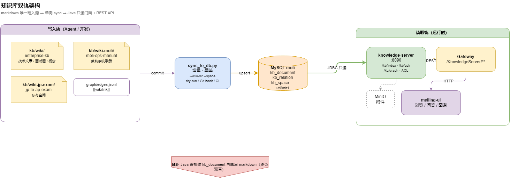

# 知识库 · 内容管道运维 PRD（KBOPS）

> **状态**：draft · 2026-07-09  
> **技术设计**：[`docs/design/kb-ops-roadmap.md`](../design/kb-ops-roadmap.md)  
> **前端对接**：[`docs/api/knowledge-ops-frontend.md`](../api/knowledge-ops-frontend.md)  
> **操作 SOP**：[`docs/ops/knowledge-workbench-operations.md`](../ops/knowledge-workbench-operations.md) · [`wiki-moli/ops/wiki同步指南.md`](../../moli-knowledge/kb/wiki-moli/ops/wiki同步指南.md)  
> **上级索引**：[knowledge-workbench-requirements.md](knowledge-workbench-requirements.md)

---

## 1. 背景与定位

### 1.1 问题

知识库「markdown wiki → MySQL → Web 浏览/问答」管道已跑通，但**运维侧**存在：

| 痛点 | 影响 |
|------|------|
| Sync 失败在日志里不可见 | 运维以为成功，Web 与磁盘不一致 |
| 定时/手动 Sync 可并发 | 同一空间互相覆盖，难排查 |
| 治理/LLM 后端齐、前端缺按钮 | 日常靠 Swagger，SOP 落不了地 |
| 健康体检与 `lint.py` 检查项不一致 | 不知道以谁为准 |
| 三空间仅部分自动 Sync | `wiki-moli` / `jp-fe-ap-exam` 易漏 sync |

### 1.2 产品定义

**知识库内容管道运维**（KBOPS）面向 **知识库管理员 / 空间 editor**，保障：

1. **同步正确性** — wiki 磁盘与 DB 一致、失败可感知  
2. **内容质量** — Lint → 修复 → 复检 → Sync 闭环  
3. **LLM 可用性** — 平台级配置可管理、可探测  

> **边界**：不含 user-center「服务器运维」台账（`operation_*`）；不含平台 APM/ELK。见 [`server-ops-module-roadmap.md`](../design/server-ops-module-roadmap.md)。

### 1.3 非目标

- 不做全文向量检索上线（Meilisearch 另立规划）  
- 不替代 Cursor Agent 批量 Ingest  
- 不在本 PRD 内做服务器探活、凭据台账  

---

## 2. 用户与场景

| 角色 | 场景 | 期望 |
|------|------|------|
| **空间 admin** | 改完 wiki 后要 Web 可见 | 一键 Sync + 看见成功/失败 |
| **editor** | commit 后仍有断链 | 被引导到 Wiki 治理 → 修复 → 再 Sync |
| **平台 admin** | 配置 Ask/Ingest/治理用 LLM | 系统管理里改 Key，无需重启 |
| **运维** | 夜间定时同步三空间 | 失败告警、日志可查、不并发踩库 |
| **CI** | PR 合并前门禁 | lint-strict + dry-run 拦截坏 wiki |

---

## 3. 产品结构

### 3.1 菜单与页面（现有 + 待补）

| 菜单 | 路由 | 状态 | KBOPS 关联 |
|------|------|------|------------|
| 健康体检 | `knowledge/lint/index` | ✅ 已有 | 增强 Sync 状态、失败展示（O1–O4） |
| Wiki 治理 | `knowledge/wiki-govern/index` | 🔵 MVP | **T16f / KBOPS-6** 全按钮 |
| Ingest 工作台 | `knowledge/ingest/index` | 🔵 部分 | **T20f** Tab1/3 |
| 系统管理 → 知识库 LLM | `system/kb-llm` | 🔵 待做 | **T19d / KBOPS-7** |
| （P2）运维看板 | `knowledge/ops/dashboard` | 📋 规划 | KBOPS-9 |

### 3.2 管道总览



> 源文件：[moli-knowledge-sync.drawio](../diagrams/moli-knowledge-sync.drawio)

### 3.3 标准运维闭环

```text
改 wiki / Ingest commit
  → lint.py --strict（CLI 或治理页 lint-space）
  → Sync（手动 / 自动 / sync-all）
  → 健康体检 → 扫描并落库（kb_lint_issue）
  → 工单处理 → 再 Sync
```

Wiki 治理链路见 [moli-kb-wiki-govern.drawio](../diagrams/moli-kb-wiki-govern.drawio)。

---

## 4. 功能需求与优先级

### P0 — 正确性与安全（后端为主，前端配合展示）

| ID | 需求 | 用户价值 | 验收要点 |
|----|------|----------|----------|
| **KBOPS-1** | Sync **失败可观测** | 失败不再「假成功」 | `kb_sync_log.status=fail`；脚本非 0 退出；Web `failCount>0` |
| **KBOPS-2** | Sync **并发锁** | 同空间不并行踩库 | 第二个 trigger 被拒绝或排队；Redis 锁 |
| **KBOPS-3** | **权限码对齐** | 菜单权限与 API 一致 | `kb:sync:trigger` / `kb:lint:scan` enforce 或文档声明仅用空间 ACL |

**前端配合（O1–O4）**：健康体检/Sync 区展示真实 `status`、`message`、最近批次；失败 Toast + 链到日志列表。

### P1 — 闭环与界面

| ID | 需求 | 用户价值 | 验收要点 |
|----|------|----------|----------|
| **KBOPS-4** | 定时 **sync-all 三空间** | 手册/Certify 不漏 sync | 配置化 `space-codes`；文档与 Scheduler 一致 |
| **KBOPS-5** | Sync **失败告警** | 夜间失败有人知 | webhook 可开关 |
| **KBOPS-6** | **Wiki 治理全链路 UI**（T16f） | 不用 Swagger 修 wiki | W1–W8 见 [wiki-govern-frontend.md](../api/wiki-govern-frontend.md) |
| **KBOPS-7** | **平台 LLM 设置页**（T19d） | 管 Key、测连通 | 见 [kb-llm-platform-frontend.md](../api/kb-llm-platform-frontend.md) |
| **KBOPS-8f** | **体检工单 UI**（O5–O8） | 类型筛选、指派、批量 | 见 [knowledge-ops-frontend.md](../api/knowledge-ops-frontend.md) §3.7 · 后端 ✅ KBOPS-8 |
| **（关联）T20f** | Ingest **三 Tab** | raw 上传 + 成品导入 | [kb-import-entry-frontend.md](../api/kb-import-entry-frontend.md) |

### P2 — 增强（按需）

| ID | 需求 | 说明 |
|----|------|------|
| **KBOPS-8** | 体检工单增强 | issue_type 扩展、assignee、批量、定时 scan | ✅ 后端 · 前端 **KBOPS-8f（O5–O8）** 📋 · 验收见 [knowledge-lint-ops-acceptance.md](../test/knowledge-lint-ops-acceptance.md) |
| **KBOPS-9** | 运维 Dashboard | Sync 趋势、Lint 工单、LLM 调用率 | ✅ 后端 |
| **KBOPS-10** | Web 体检对齐 lint.py | `issue-types` 对照 + DB/文件分工文档 | ✅ |

### 工程补充（与 KBOPS 并行，非菜单功能）

| ID | 需求 | 说明 |
|----|------|------|
| **KBOPS-A1** | CI **lint-strict 硬门禁** | PR 必须 lint-strict-all + dry-run-all |
| **KBOPS-A2** | Sync **失败 Runbook** | 运维文档：怎么看、怎么重跑、三空间验 |
| **KBOPS-A3** | wiki↔DB **漂移检测** | 脚本或 Dashboard 前置 |

---

## 5. 与现有产品线的关系

| 产品线 | 关系 |
|--------|------|
| **Ingest** | commit/publish 默认 auto-sync；失败时需运维页可见 + nextSteps |
| **Wiki 治理** | 文件真值 Lint/修复；修完必须 Sync 才进 DB |
| **健康体检** | DB 快照 + 工单；Scan 后写 `kb_lint_issue` |
| **单页编辑** | 保存 wiki 源文件后走 Sync，不直写 DB 正文 |

**分工铁律**：

| 页 | 数据源 |
|----|--------|
| Wiki 治理 | 磁盘 `lint-space` |
| 健康体检 | MySQL `GET /kb/lint` + scan |

---

## 6. 三空间 Sync

| wiki 目录 | space_code | 典型内容 |
|-----------|------------|----------|
| `kb/wiki/` | `enterprise-kb` | 通用技术文库 |
| `kb/wiki-moli/` | `moli-ops-manual` | 茉莉系统手册 |
| `kb/wiki-jp-exam/` | `jp-fe-ap-exam` | 日本语考试 / Certify |

**产品要求**：运维动作（手动 trigger、定时任务、CI）应支持 **三空间** 或明确勾选；默认演示勿只 sync enterprise-kb。

---

## 7. 权限

| 权限码 | 用途 | 备注 |
|--------|------|------|
| `kb:sync:trigger` | 触发 Sync | KBOPS-3 应对齐 enforce |
| `kb:lint:scan` | 扫描并落库 | 同上 |
| `kb:wiki:govern:list` | Wiki 治理菜单 | 已有 |
| `kb:platform:llm` | 平台 LLM 设置 | T19d |
| 空间 **editor** | lint-space / govern 写盘 | 空间 ACL |

---

## 8. 验收（产品级）

### 8.1 P0 发布门槛

- [ ] 故意制造 Sync 失败 → 日志 status=fail，前端可见  
- [ ] 同空间并发 trigger → 第二个有明确提示  
- [ ] 空间 admin 在无平台权限时行为与文档一致  

### 8.2 P1 发布门槛

- [ ] Wiki 治理：script-fix / auto-fix / merge-hint / syncAfter 可点通  
- [ ] 平台 LLM：保存、脱敏展示、test 连通  
- [ ] Ingest Tab1 上传 raw + Tab3 成品 import（T20f）  
- [ ] commit/publish 后 nextSteps 跳转治理/体检  

### 8.3 回归场景

- [ ] sync-all 后三空间 browse 抽样 3 slug  
- [ ] 治理修复 → Sync → 体检 scan 工单减少  
- [ ] LLM 关闭时治理页 AI 按钮 disabled + 文案  

---

## 9. 文档地图

| 类型 | 路径 |
|------|------|
| **本 PRD** | `docs/product/knowledge-ops-prd.md` |
| 技术路线图 | `docs/design/kb-ops-roadmap.md` |
| **前端总览** | `docs/api/knowledge-ops-frontend.md` |
| 治理前端细则 | `docs/api/wiki-govern-frontend.md` |
| LLM 设置前端 | `docs/api/kb-llm-platform-frontend.md` |
| 工作台前端总览 | `docs/api/knowledge-workbench-frontend.md` |
| HTTP 契约 | `docs/api/KNOWLEDGE_API.md` §4、§8.6 |
| 操作手册 | `docs/ops/knowledge-workbench-operations.md` |
| 任务跟踪 | `moli-knowledge/TASKS.md`（KBOPS / T16f / T19d） |

---

## 10. 变更记录

| 日期 | 说明 |
|------|------|
| 2026-07-09 | 初稿：KBOPS P0–P2 + 前端 O 项 + 工程补充 A1–A3 |
| 2026-07-02 | 技术规划见 kb-ops-roadmap.md |
