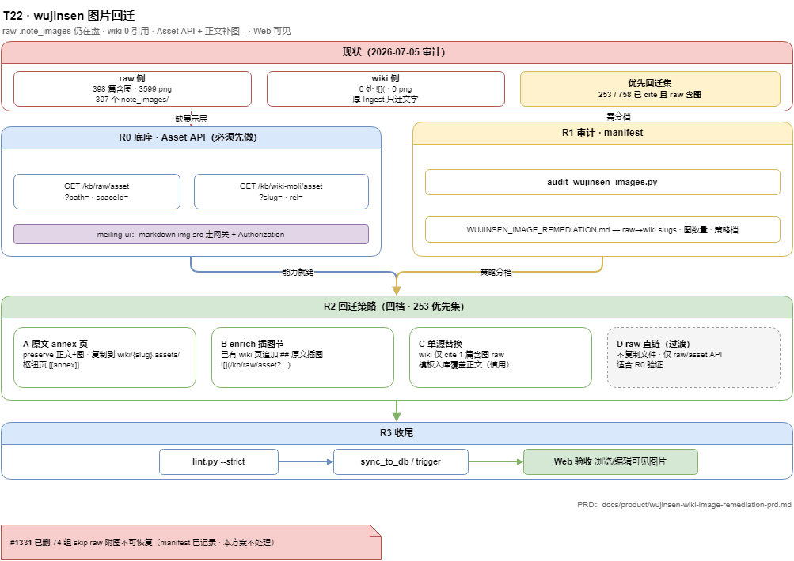

# wujinsen 图片回迁方案（T22）

> **状态**：draft · 2026-07-05  
> **触发**：wujinsen 厚 Ingest 只迁文字，Web 无 Asset API，wiki 正文 **0** 处 `（T20 导入）· [知识库设计哲学-docs-as-code.md](../../moli-knowledge/kb/wiki-moli/develop/知识库设计哲学-docs-as-code.md)  
> **流程图**：[moli-kb-wujinsen-image-remediation.drawio](../diagrams/moli-kb-wujinsen-image-remediation.drawio)



---

## 1. 问题陈述

### 1.1 用户可见现象

- 原 `raw/wujinsen_markdown/**/*.note.md` 在有道/本地导出中 **能看图**（旁路 `*.note_images/`）。
- 入库后 **enterprise-kb wiki 页** 多为 LLM/摘要正文，**无图片**；Web 浏览同样无图。
- 用户感知：**「大量图片漏了」**。

### 1.2 审计结论（2026-07-05）

| 指标 | 数量 | 说明 |
|------|------|------|
| raw 中含 `![](` / `.note_images/` 的 md | **398** | 仍在 `kb/raw/wujinsen_markdown/` |
| 磁盘图片文件（png 等） | **3599** | **397** 个 `note_images` 目录 |
| wiki 中 `![](` 引用 | **0** | `kb/wiki/**` 无 png |
| wiki `sources` 引用的 wujinsen raw | **758** 路径 |
| 其中 **原文含图** 的 cited raw | **253**（**33%**） | **优先回迁集** |
| #1331 已物理删除 skip raw 的附图 | **74** 组 | 见 `WUJINSEN_SKIP_DELETED.md`，**不可恢复** |

**结论**：

1. 图片 **没有** 从整个 raw 库消失（除 skip 批次）；**丢在 wiki 层 + Web 展示层**。
2. 厚 Ingest（PageWriter「提炼、不照抄」）**主动不迁** 图片语法与资产。
3. 即使把 ` → 前端渲染
                                    ↳ img src 无后端 → 404
```

---

## 4. 总体方案（两轨 + 三档回迁）

### 4.1 能力轨 R0：Asset API（必须先做）

在 **knowledge-server** 增加只读资源接口（空间 ACL 与文档读权限一致）：

| 接口 | 用途 | 路径解析 |
|------|------|----------|
| `GET /kb/raw/asset` | **过渡/回迁**：直接读 `kb.ingest.raw-root` 下文件 | `path=wujinsen_markdown/.../imageFile1.png` |
| `GET /kb/wiki-moli/asset` | **长期**：读 wiki 树内 `{slug}.assets/**` | `slug=java/foo&rel=imageFile1.png` |

**安全**：

- 规范化路径，禁止 `..`；根目录分别限定 `raw-root` / `wiki root`。
- 仅允许图片 MIME：`png/jpg/jpeg/gif/webp/svg`（svg 可选禁用以防 XSS）。
- 响应 `Cache-Control` + `Content-Type`；下载可 `Content-Disposition: inline`。

**前端（meiling-ui）**：

- markdown 渲染器对 `src` 以 `/KnowledgeServer/kb/` 开头或专用前缀 `kb-asset://` 的请求 **带 Authorization**。
- 或 SSR 代理：网关 `GET /KnowledgeServer/kb/wiki-moli/asset/**` 透传。

**Markdown 引用形态（回迁后）**：

```markdown

```

长期改为 wiki 侧复制后：

```markdown

```

前端按当前页 `slug` 解析为 `/kb/wiki-moli/asset?slug=...&rel=assets/imageFile1.png`。

### 4.2 内容轨 R1–R3：wujinsen 回迁策略

对 **253 优先集** 中每条 raw，在 manifest 标注 **策略档**：

| 档 | 名称 | 适用条件 | 动作 |
|----|------|----------|------|
| **A** | **原文 annex 页** | 高价值长文/多图（面试题、架构图） | 新建 `{dir}/annex-{stem}.md`：preserve raw 正文；复制图到 `{slug}.assets/`；rewrite ``；**不删**摘要 |
| **C** | **单源替换** | wiki **仅 cite 1 篇**含图 raw 且用户确认要全文 | 模板入库 `useLlmGenerate=false` 覆盖正文 + 复制 assets（**需人工批准**） |
| **D** | **raw 直链（过渡）** | R0 验证 / 暂不落盘复制 | 仅在正文或 annex 写 `/kb/raw/asset?path=...`；**不复制** png 到 wiki |

**默认推荐**：P0 用 **D** 验证链路；P1 对 Top 50 高图量 raw 用 **A**；其余 cited 用 **B**。

### 4.3 多 cite 冲突（重要）

例：`java/hashmap-面试题.md` **cite 5 篇** raw，其中多篇含图。

- **禁止** C 档覆盖（会丢其它 sources 的摘要结构）。
- 用 **A**：每篇含图 raw 一篇 annex（`annex-hashmap-夺命二十一问` …），枢纽页保留现有 Q&A + 链 annex。
- 或 **B**：同一页下分 `### 来自：{raw 标题}` 小节列图。

---

## 5. 资产复制与路径规则

### 5.1 raw 侧图片目录（已有）

与 `delete_wujinsen_skip_raw.companion_paths` 一致：

| 模式 | 路径 |
|------|------|
| 标准 | `{stem}.note_images/`（`foo.note.md` → `foo.note_images/`） |
| 变体 | `{name}.note_images/`、`*.note.attach/` |

### 5.2 复制到 wiki（A/C 档）

```text
wiki/{dir_slug}/{annex-slug}.md
wiki/{dir_slug}/{annex-slug}.assets/{imageFileN.png}
```

- 文件名保持 `imageFileN.png`（避免中文路径在 Windows/Linux 差异）。
- annex slug 建议：`annex-{raw-stem-slugified}`，不超过 80 字符。
- frontmatter `sources` 保留原 raw 路径；`type` 与枢纽页协调（`interview`/`article`）。

### 5.3 图片链接重写

脚本 `remediate_wujinsen_images.py`：

1. 解析 `` 与 HTML `![...]`。
2. 复制 png → `.assets/`。
3. 替换为 `` 或 raw/asset URL（D 档）。
4. 可选：strip 无效 HTML table，保留 markdown 表格。

---

## 6. 工具与交付物

### 6.1 脚本（`moli-knowledge/kb/tools/`）

| 脚本 | 阶段 | 作用 |
|------|------|------|
| `audit_wujinsen_images.py` | R1 | 扫描 raw/wiki；输出 CSV/MD manifest |
| `remediate_wujinsen_images.py` | R2 | 按 manifest 执行 A/B/C/D；`--dry-run` |
| `verify_wujinsen_images.py` | R3 | 检查 wiki 每条 `** |
| F2 | Wiki 编辑：插入图片 → 上传至 `.assets/` + 插入 markdown（T22 后续） |

---

## 7. 分期计划

| 阶段 | 内容 | 验收 |
|------|------|------|
| **R0** | Asset API + 前端 img 鉴权渲染 | 手工 md 写一条 raw/asset URL，浏览可见 |
| **R1** | `audit_wujinsen_images.py` → manifest | 253 条优先集有 strategy 列 |
| **R2a** | D 档：10 篇试点 raw/asset 链 | 10 页 Web 可见图 |
| **R2b** | A 档：Top 50 高图量 → annex + `.assets` | lint strict 0 error；Sync 后浏览 |
| **R2c** | B 档：其余 cited 含图 raw 插图节 | 枢纽页可展开看图 |
| **R3** | 全量 253 + spot check 398 | 抽样 20 页人工看图 |

**预估工作量**（工程向）：

- R0：后端 1–2d + 前端 1d  
- R1 脚本：0.5d  
- R2 批量回迁：2–3d（含 lint 修复、断链）  

---

## 8. 验收标准

### 8.1 能力验收

1. `GET /kb/raw/asset?path=...` 对 enterprise-kb editor/viewer 返回 **200** + 正确 `Content-Type`。
2. 越权 path（`../wiki/...`）返回 **400/403**。
3. meiling-ui 浏览页渲染含 asset URL 的 markdown，**图片可见**。

### 8.2 回迁验收（253 集）

1. manifest 中 **253** 条均有 `status=done` 或 `waived`（注明原因）。
2. 每个 `waived=skip-deleted` 对应 #1331 清单，不记为失败。
3. 回迁后 `lint.py --strict` 通过（允许新增 annex 页更新 index）。
4. `sync_to_db` 后 Web 搜索仍能命中枢纽页；annex 可被 `[[链接]]` 到达。

### 8.3 负例

| 场景 | 预期 |
|------|------|
| 仅复制 png 不写 markdown | 浏览仍无图 → 失败 |
| 只写 `` 相对 raw 路径 | Web 仍 404 → 失败 |
| 未 Sync | DB 页可能无 annex → 提醒 Sync |

---

## 9. 风险与对策

| 风险 | 对策 |
|------|------|
| 中文/特殊字符路径 | asset API 用 URL encode；wiki `.assets` 内文件名只用 `imageFileN.png` |
| raw 内 HTML 表格嵌 `![...]` | 脚本先转 markdown 或 annex 保留 HTML + sanitize |
| 3599 图复制进 Git 体积膨胀 | P0 用 D 档 raw 直链；P1 仅复制 253 集相关图（预估 ≤2000） |
| 与摘要正文重复 | A/B 不删原摘要，annex/插图节并列 |
| #1331 已删图 | manifest 标记 `skip-deleted`，不纳入成功率 |

---

## 10. 与 T20 / Ingest 的长期关系

| 能力 | 关系 |
|------|------|
| T20 Tab3 成品导入 | 若 md 含 `![](` + 旁路目录，**必须**复制 assets + R0 API |
| Ingest 模板模式 | 新增 `preserveAssets=true`：commit 时复制 `note_images` → wiki `.assets` |
| Ingest LLM 模式 | 默认仍为摘要；含图 raw 自动建议 **A annex** 而非 LLM 正文 |

---

## 11. 文档与索引

| 文件 | 说明 |
|------|------|
| 本 PRD | `docs/product/wujinsen-wiki-image-remediation-prd.md` |
| 流程图 | `docs/diagrams/moli-kb-wujinsen-image-remediation.drawio` |
| 审计 manifest（待生成） | `moli-knowledge/kb/tools/WUJINSEN_IMAGE_REMEDIATION.md` |
| skip 不可恢复清单 | `moli-knowledge/kb/tools/WUJINSEN_SKIP_DELETED.md` |

---

## 12. 变更记录

| 日期 | 说明 |
|------|------|
| 2026-07-05 | 初稿：审计数据、R0 Asset API、A/B/C/D 回迁档、253 优先集 |
