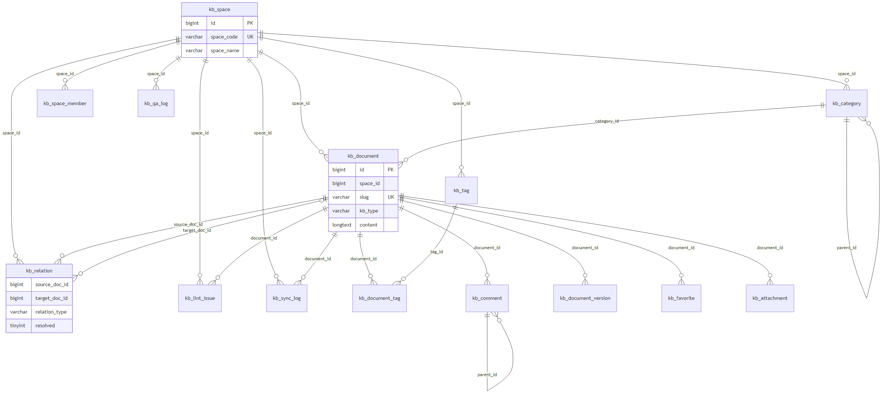

# 企业知识库 · 表结构设计

> 更新：2026-06-28 · 配套脚本 [`03_knowledge_schema.sql`](03_knowledge_schema.sql)、[`11_kb_platform_llm_config.sql`](11_kb_platform_llm_config.sql)（T19）
> 范式：LLM-Wiki —— `kb/`（markdown）是**唯一写入源**，`moli-knowledge-server` 是**下游只读门面 + 对外 Web/API**。
> 规划见 [`../../moli-knowledge/kb/ROADMAP.md`](../../moli-knowledge/kb/ROADMAP.md)。

---

## 1. 设计目标

表结构同时覆盖**已做功能**与 ROADMAP 上**后面要做的功能**：

| 功能 | 状态 | 涉及的表 |
|------|------|----------|
| 空间 / 分类 / 文档 / 标签 / 评论 / 版本 / 收藏 / 附件 CRUD | ✅ 已做 | `kb_space` `kb_category` `kb_document` `kb_tag` `kb_document_tag` `kb_comment` `kb_document_version` `kb_favorite` `kb_attachment` |
| 图谱 `/kb/graph`、体检 `/kb/lint` | ✅ 已做（运行时算） | 落库到 `kb_relation` `kb_lint_issue` |
| **kb → kb_document 单向增量同步（M2）** | 🔜 | `kb_document`(+slug/source_path/content_hash) `kb_sync_log` |
| **Query `/kb/ask`（带引用 + 反馈）** | 🔜 | `kb_qa_log` |
| **空间级 ACL（复用 Shiro/Dubbo）** | 🔜 | `kb_space_member` |
| 面试题系列 / 作用域过滤（type/domain） | 🔜 | `kb_document`(+kb_type/domain) |
| 全文检索（先 MySQL FULLTEXT，量大再外置） | ✅ | `kb_document` ngram 全文索引 |
| **chunk 切段（/kb/ask 按段召回）** | ✅ | `kb_document_chunk`（sync 派生，见 `29_kb_document_chunk.sql`） |
| **平台 LLM Web 配置（T19）** | ✅ | `kb_platform_llm_config`（设计 [`../design/kb-llm-platform-settings.md`](../design/kb-llm-platform-settings.md)） |

通用约定：`bigint` 雪花主键；`create_id/create_time/update_id/update_time` 审计字段（MyBatis-Plus 自动填充）；`is_delete` 逻辑删除；**`utf8mb4`**。

**导入含中文的种子 SQL**（如 `kb_space.space_name`、菜单名）时，mysql 客户端必须 `--default-character-set=utf8mb4`，脚本头建议 `SET NAMES utf8mb4;`。**禁止** PowerShell `Get-Content | mysql` 管道（会写成 `?`）。详见 [`README.md`](README.md)「字符集与导入约束」、[`../../scripts/README.md`](../../scripts/README.md)。

---

## 2. 表清单（15 张 · 含 T19 平台 LLM）

### 核心内容（9）

| 表 | 说明 | 本次变化 |
|----|------|----------|
| `kb_space` | 知识空间（多租户 / 权限边界） | 不变 |
| `kb_category` | 分类树（`parent_id` 自关联） | +`icon` |
| `kb_document` | **知识文档（核心）** | +`slug` +`source` +`source_path` +`content_hash` +`kb_type` +`domain`，+全文索引 |
| `kb_document_chunk` | **文档切段（ask 召回）** | sync 从正文按 `##` 派生；`ftx_kb_document_chunk(heading,content)` ngram |
| `kb_tag` | 标签 | +`(space_id,tag_name)` 唯一 |
| `kb_document_tag` | 文档-标签关联 | +`tag_id` 索引 |
| `kb_comment` | 评论（`parent_id` 楼中楼） | 不变 |
| `kb_document_version` | 版本历史 | +`content_hash`，+`(document_id,version_no)` 唯一 |
| `kb_favorite` | 个人收藏 | +`document_id` 索引 |
| `kb_attachment` | 附件（MinIO） | 不变 |

### 图谱治理（2）

| 表 | 说明 |
|----|------|
| `kb_relation` | 文档关系/图谱边落库：`links_to`（正文 `[[]]` 引用）/ `same_tag` / `related` / `supersedes` / `references`。`resolved=0` 即断链（`target_title` 保留原始标题） |
| `kb_lint_issue` | 体检问题持久化：`broken_link`/`orphan`/`no_summary`/`duplicate`/`stale`/`conflict`，带处理状态（待处理/已忽略/已修复） |

### 同步 / 权限 / 问答（3）

| 表 | 说明 |
|----|------|
| `kb_sync_log` | kb→DB 单向增量同步审计：批次、原始路径、`action`(insert/update/delete/skip)、内容 hash、结果 |
| `kb_space_member` | 空间级 ACL：成员可为**用户或角色**（复用用户中心），角色 `viewer/editor/admin` |
| `kb_qa_log` | Query 历史：问题、答案、`citations`(JSON 引用)、作用域、provider/model、token、`useful` 反馈 |

### 平台配置（1 · T19）

| 表 | 说明 |
|----|------|
| `kb_platform_llm_config` | 平台级 LLM 单例（`id=1`）：provider/base-url/加密 api-key/model；Web **系统管理 → 知识库 LLM** 维护 |

> **向量库刻意不建**：ROADMAP §五把向量/ES 列为「按需」。先用 MySQL `ngram` 全文索引，文档量过千且召回变差时再外置 Meilisearch/ES/向量库，届时新增 `kb_chunk`/`kb_embedding` 即可，不影响现有表。

---

## 3. 关键字段设计说明

### 3.1 `kb_document` 的两个「类型」

容易混淆，明确区分：

| 字段 | 含义 | 取值 |
|------|------|------|
| `doc_type` | **内容格式** | `markdown` / `rich` |
| `kb_type` | **知识类型**（对应 kb frontmatter `type`） | `guide`/`service`/`concept`/`article`/`interview`/`output` |

`kb_type` + `domain`(FE/AP/DB…) 用于 Query 的**作用域过滤**（例如"只搜文章不搜面试题"），等价于 RAG 的元数据预过滤。

### 3.2 同步三件套：`slug` + `source_path` + `content_hash`

支撑 M2「单向、增量、幂等」同步：

- `slug`：空间内唯一（`uk_kb_document_slug(space_id, slug)`），作为 kb→DB 的**幂等 upsert 主键**，同时是干净 URL。
- `source_path`：kb/ 中 markdown 的相对路径，便于回溯与删除（kb 删页 → DB 置 `is_delete`）。
- `content_hash`：正文+frontmatter 的 SHA-256，**只同步变更页**（hash 未变则 `skip`）。
- `source`：`kb`（wiki 同步，**Web 唯一来源**）/ `manual`（历史遗留行，Web 已停用直连写库；清理见 sync `--purge` 或 DBA）

### 3.3 图谱/体检从「运行时算」到「落库」

当前 `KbInsightServiceImpl` 是查文档后**运行时**正则解析 `[[标题]]` + 同标签两两配对，文档多时较重且每次重算。新表把结果落库：

- 同步/编辑时写 `kb_relation`，`/kb/graph` 直接读边表。
- 断链不再只在内存里，存为 `kb_relation.resolved=0`，也可固化进 `kb_lint_issue` 供跟踪与「忽略/修复」。

> 过渡期：`/kb/graph`、`/kb/lint` 可继续走运行时实现；落库为后续优化项，两者结果语义一致。

### 3.4 ACL：成员既能是用户也能是角色

`kb_space_member(member_type, member_id, role)`：
- `member_type=0` → `member_id` 是用户中心用户 ID；`=1` → 是角色 ID。
- 服务层 / 检索选页时按 `space_id` + 当前登录用户（经 Shiro/Dubbo 取角色）过滤，实现空间级可见性与编辑权限。

---

## 4. 执行方式

```powershell
# 仓库根目录：init-db.ps1 已含知识库表/菜单/操作手册空间（utf8mb4 + source）
.\scripts\init-db.ps1 -SkipSeckill
# 若仅补知识库表（勿用 Get-Content | mysql 管道导入含中文种子）：
# mysql --default-character-set=utf8mb4 moli -e "source D:/path/docs/sql/03_knowledge_schema.sql"
```

> `ngram` 全文索引需 MySQL 5.7.6+（项目用 8.0.3，满足）。
> 已存在旧表时，本脚本用 `CREATE TABLE IF NOT EXISTS`，**不会改动已建旧表**；如需应用新列，请对 `kb_document` 等手动 `ALTER TABLE` 或先 drop 再重建（开发环境）。

---

## 5. 表关系图

> 关系为**逻辑关联**（`space_id` / `document_id` 等 + 索引），DDL **未建物理外键**，便于独立迁移与批量同步。
> 用户/角色 ID 指向用户中心 `sys_user` / `sys_role`（库外引用）。



**可编辑 draw.io 版（推荐维护）**：[`../diagrams/moli-kb-er.drawio`](../diagrams/moli-kb-er.drawio) · 全链路 [`moli-kb-raw-pipeline.drawio`](../diagrams/moli-kb-raw-pipeline.drawio) · 见 [`../diagrams/README.md`](../diagrams/README.md)

**按模块速览**

| 模块 | 中心表 | 关联 |
|------|--------|------|
| 内容 CRUD | `kb_document` | ← `kb_space` / `kb_category`；→ 标签、评论、版本、收藏、附件 |
| 标签 | `kb_tag` | 经 `kb_document_tag` 多对多挂文档 |
| 图谱 | `kb_relation` | 文档自引用边（`links_to` / `related` / …），`target_doc_id` 空 = 断链 |
| 体检 | `kb_lint_issue` | 按空间/文档记录 lint 问题与处理状态 |
| 同步 | `kb_sync_log` | 记录 kb→DB 每批 insert/update/delete/skip |
| ACL | `kb_space_member` | 空间 × 用户或角色（`member_type`） |
| 问答 | `kb_qa_log` | 空间 + 用户 + 引用 JSON |

> **维护者**：改表结构后请同步改 [`KNOWLEDGE_SCHEMA_ER.mmd`](KNOWLEDGE_SCHEMA_ER.mmd) 并重新导出 PNG（见 [`README.md`](README.md)「ER 图导出」），保证对外文档始终用静态图、不依赖 Mermaid 渲染器。
