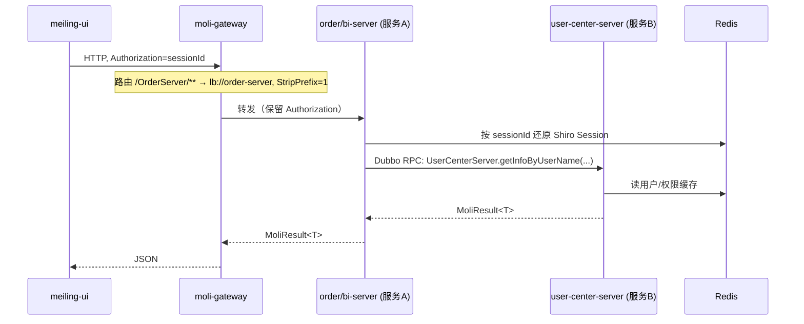
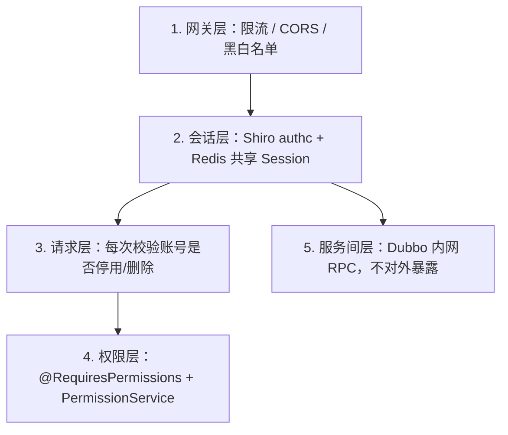

# 茉莉项目微服务 — 架构 / 调用 / 鉴权设计

**Languages / 语言 / 言語**: [中文](ARCHITECTURE.md) | [English](../en/ARCHITECTURE.md) | [日本語](../ja/ARCHITECTURE.md)

> 本文档描述「外部请求 ↔ 网关 ↔ 服务 A ↔ 服务 B」全链路所采用的技术栈、调用方式与鉴权方式。
> 映射到本项目：**服务 A = order-server / bi-server**（业务服务），**服务 B = user-center-server**（用户中心，被调方）。

---

## 1. 链路全景

```
meiling-ui (浏览器)
   │  HTTP + Header: Authorization=sessionId
   ▼
moli-gateway :21000            Spring Cloud Gateway（路由/限流/CORS）
   │  lb://<service>  +  StripPrefix=1
   ▼
order-server / bi-server       Shiro authc 校验会话（共享 Redis Session）
   │  Dubbo RPC（version=1.0.0, group=moli）
   ▼
user-center-server :1127       Dubbo Provider → 业务处理
   │
   ▼
Redis（共享 Session/缓存）   /   MySQL（业务与权限数据）
```

时序：



---

## 2. 技术栈

| 链路段 | 技术 | 项目对应 |
|--------|------|----------|
| 浏览器 → 网关 | HTTP/JSON | `meiling-ui` |
| 网关 | Spring Cloud Gateway（WebFlux 响应式） | `moli-gateway` |
| 注册发现 | Nacos 2.0.3 Discovery | 各服务 `bootstrap.yml` |
| 配置中心 | Nacos Config（`extension-configs` 动态刷新） | user-center 已启用 |
| 负载均衡 | Ribbon（`lb://`，Hoxton 内置） | 网关路由 |
| 服务间调用 | **Spring Cloud Dubbo（RPC）** | `UserServerProvider` / `@DubboReference` |
| 鉴权框架 | Apache Shiro + Redis 共享 Session | 各服务 `ShiroConfig` |
| 会话/缓存 | Redis（`shiro:session:` / `shiro:cache:` 前缀） | `RedisSessionDAO` |
| 熔断限流 | Sentinel（已选型，建议接入网关与消费端） | — |
| 统一返回 | `MoliResult<T>` / `PageRes<T>` | distribute-common |

版本基线：JDK 8、Spring Boot 2.3.12、Spring Cloud Hoxton.SR12、Spring Cloud Alibaba 2.2.7、Nacos 2.0.3。

---

## 3. 调用方式

### 3.1 外部请求 → 网关（HTTP）

- 统一入口 `:21000`，协议 HTTP/JSON。
- 路由规则（`moli-gateway/application-dev.yml`）：

| 路径前缀 | 目标服务 | 过滤 |
|----------|----------|------|
| `/UserCenter/**` | `lb://user-center-server` | `StripPrefix=1` |
| `/OrderServer/**` | `lb://order-server` | `StripPrefix=1` |
| `/BiServer/**` | `lb://bi-server` | `StripPrefix=1` |

> `StripPrefix=1` 去掉第一段前缀，例如 `/UserCenter/user/list` → 转发 `/user/list`。

### 3.2 网关 → 服务（HTTP + 负载均衡）

- 通过 Nacos 服务名 + Ribbon 选实例。
- 透传 `Authorization` 头，供下游 Shiro 还原会话。

### 3.3 服务 A ↔ 服务 B（Dubbo RPC，统一方式）

#### 选型结论

| 场景 | 调用方式 | 鉴权 |
|------|----------|------|
| 浏览器 / `meiling-ui` → 网关 → 任意服务 | **HTTP/REST** | Shiro `authc` + `Authorization` 头（sessionId） |
| 业务服务登录时查用户（无用户会话） | **Dubbo RPC** | 内网 RPC，不暴露 HTTP |
| 业务服务带用户上下文调用户中心 | **Dubbo RPC**（如需） | 共享 Redis Session + 各服务本地 Shiro |

> **不再使用 OpenFeign 做服务间调用**。已移除 `UserCenterClient` 及 `/user/getInfoByUserName` HTTP 端点，避免为内部能力额外暴露 REST 接口。

#### 契约与坐标

- **契约接口**：`moli-user-center-client` 模块的 `UserCenterServer`
- **提供方**：`user-center-server` → `UserServerProvider`

```java
@DubboService(version = "1.0.0", group = "moli", protocol = "dubbo")
public class UserServerProvider implements UserCenterServer {
    @Override
    public MoliResult<SysUser> getInfoByUserName(String userName) { ... }
}
```

- **消费方**：`order-server` / `bi-server` 依赖 `moli-user-center-client`，在 Spring `@Configuration` 中引用：

```java
@Configuration
public class ShiroConfig {
    @DubboReference(version = "1.0.0", group = "moli", protocol = "dubbo", check = false)
    private UserCenterServer userCenterServer;

    @Bean
    public ShiroRealm shiroRealm() {
        ShiroRealm realm = new ShiroRealm();
        realm.setUserCenterServer(userCenterServer);  // 注入后传给 Realm
        return realm;
    }
}
```

> **`@DubboReference` 必须写在 Spring 管理的 Bean 上**（如 `ShiroConfig`），不要写在 `new ShiroRealm()` 的普通类字段上，否则 Dubbo 无法完成代理注入。

#### 注册与端口

- Dubbo 注册：`spring-cloud://127.0.0.1`（挂载 Nacos，与 Spring Cloud 共用注册中心）
- 消费端订阅：`dubbo.cloud.subscribed-services: user-center-server`
- Dubbo 协议端口：user-center `20881`、order `20882`、bi `20883`

#### client 模块职责（`moli-user-center-client`）

| 内容 | 说明 |
|------|------|
| `UserCenterServer` | Dubbo 契约接口 |
| `shiro/*` | 业务服务复用的 Shiro 配置（Realm、SessionManager、Filter） |
| 依赖 | `spring-cloud-starter-dubbo`、`spring-context-support`、Nacos Discovery |
| 不含 | OpenFeign、HTTP 内部接口 |

---

## 4. 鉴权方式（分层）



| 层级 | 机制 | 实现 |
|------|------|------|
| 入口 | 网关限流/CORS | `moli-gateway`（建议接入 Sentinel + 全局过滤器） |
| 会话 | Shiro `authc`，token 即 sessionId | `ShiroSessionManager` 从请求头 `Authorization` 取 token，禁用 Cookie |
| 会话共享 | 各服务连同一 Redis | `RedisSessionDAO`，前缀 `shiro:session:` |
| 请求校验 | 每次请求校验账号状态 | server `AuthenticationFilter`（停用/删除即登出，返回需重新登录） |
| 细粒度权限 | 页面 `perms` + 动作 `sys_role_action` 并集 | `@RequiresPermissions` + `PermissionService` + `GET /auth/capabilities` |
| 超级管理员 | `superadmin`/`admin` 拥有 `*:*:*` | `PrivilegedUserUtils` |
| 跨系统 SSO | Ticket + 请求头 `X-Sso-Secret` | `SsoController`（`/sso/validate` 匿名 + 密钥校验） |
| 服务间 | Dubbo 内网调用，不经 HTTP | 配合网络隔离（仅暴露网关） |

### 会话放行白名单（user-center-server `ShiroConfig`）

- 匿名：`/login`、`/sso/validate`、Swagger 相关、静态资源。
- 其余：`/**` 走 `authc`，未登录返回 token 失效 JSON。
- 无权限统一响应：HTTP 200 + `code=10009`。

---

## 5. 关键配置约定

| 项 | 约定 |
|----|------|
| Nacos namespace（dev） | 网关与各服务统一使用 `4fa85588-6ab5-479b-aea2-2b1d2e52db7a`，否则网关/Dubbo 无法发现服务 |
| Token 载体 | 用户 sessionId 放 HTTP 头 `Authorization`，全链路禁用 Cookie |
| Dubbo 坐标 | `version=1.0.0` + `group=moli`，提供方与消费方必须一致 |
| 消费端订阅 | `dubbo.cloud.subscribed-services: user-center-server`，`dubbo.consumer.check: false` |
| 统一返回/异常 | `MoliResult` + 全局异常（`ShiroExceptionHandler` / `GlobalExceptionHandler`） |

---

## 6. 登录认证链路（业务服务示例）

以 `order-server` 用户登录为例：

```
1. 前端 POST /OrderServer/login  →  网关  →  order-server LoginController
2. Shiro UsernamePasswordToken  →  client/ShiroRealm.doGetAuthenticationInfo()
3. ShiroConfig 中 @DubboReference 注入的 userCenterServer.getInfoByUserName(userName)
4. Dubbo RPC  →  user-center-server/UserServerProvider  →  UserService  →  MySQL
5. 返回 SysUser（密码+盐）→  Shiro 本地校验密码  →  写入 Redis Session（shiro:session:*）
6. 响应 LoginVo，token = sessionId，前端后续请求带 Authorization 头
```

各业务服务与用户中心**共用同一 Redis**，因此同一 sessionId 可在 user-center / order / bi 间通用。

---

## 7. Dubbo 与 Feign 选型说明（本项目决策）

| 维度 | Dubbo（已采用） | OpenFeign（已移除） |
|------|-----------------|---------------------|
| 协议 | 二进制 RPC | HTTP/JSON |
| 是否暴露 REST | 否，仅内网 RPC | 是，需 Controller + Shiro 白名单 |
| 登录阶段查用户 | 天然支持（无用户 token） | 需 `anon` 或内部密钥，有安全风险 |
| 调试 | 需 Dubbo/日志 | curl 友好 |
| 适用 | **服务间调用** | 外部/浏览器流量（经网关 HTTP 即可） |

**结论**：外部流量走 **Gateway + HTTP**；服务间统一走 **Dubbo**，职责清晰、安全边界明确。

---

## 8. 安全加固建议（生产）

1. **网络隔离**：公网仅暴露网关 `:21000`；各服务 HTTP 端口与 Dubbo 端口（20881/20882/20883）只在内网可达。
2. **网关防护**：接入 Sentinel 限流、补充全局鉴权/黑白名单过滤器。
3. **Dubbo 内网**：注册中心与 Dubbo 端口不对公网开放；如需更强可叠加 Dubbo Token 鉴权或 TLS。
4. **会话与密钥**：Redis 设访问密码并内网隔离；SSO `shared-secret`、数据库口令通过环境变量/Nacos 下发，不写死。
5. **Swagger**：生产关闭 `swagger.show` 或经网关限制访问。

---

## 9. 启动顺序

1. Nacos（`:8848`）、Redis、MySQL
2. `moli-gateway`（`:21000`）
3. `user-center-server`（`:1127`，Dubbo `20881`）
4. `order-server`（`:8087`，Dubbo `20882`）、`bi-server`（`:1128`，Dubbo `20883`）
5. 前端 `meiling-ui` 代理指向 `http://localhost:21000/UserCenter`
