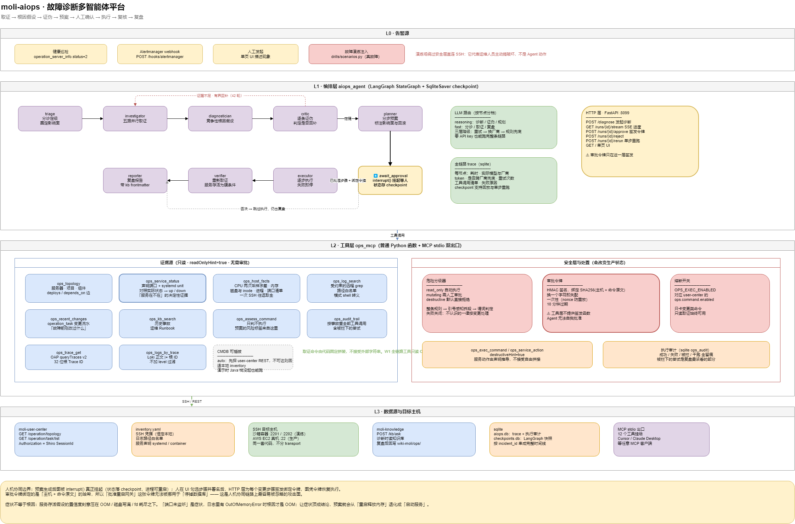

# moli-aiops · AIOps 故障诊断多智能体平台

> 告警进来，平台自己上机器取证、提出几种根因、互相证伪、给出分步预案；
> **要动生产的那一步停下来等人**，人勾选签名后才继续，最后自动出复盘报告。

面向茉莉自己的微服务集群（`moli-gateway` / `moli-user-center` / `moli-order` / `moli-knowledge`），
CMDB 直接读 `moli-user-center` 的运维台账，知识检索直接调 `moli-knowledge` 的 `/kb/ask`。

---

## 1. 架构



源文件：[`docs/diagrams/moli-aiops-architecture.drawio`](../docs/diagrams/moli-aiops-architecture.drawio)

分成两层，边界很硬：

| 层 | 目录 | 职责 |
|----|------|------|
| 编排层 | `aiops_agent/` | LangGraph 状态机、LLM 路由、trace、HTTP/SSE、单页 UI |
| 工具层 | `ops_mcp/` | CMDB、SSH 取证、日志检索、危险分级、审批校验、执行审计 |

工具层是一组普通 Python 函数，同时通过 `ops_mcp/mcp_server.py` 以 MCP stdio 暴露出去。
所以这 13 个工具既服务于自家编排层，也能直接挂到 Cursor / Claude Desktop 上手工排障。
其中 `ops_trace_get` / `ops_logs_by_trace` 是 W1 只读全链路工具；`ops_metrics_query` 读 Prometheus 即时值。Alertmanager 经 `POST /hooks/alertmanager`（独立 Bearer）进诊断。

---

## 2. 九个节点在干什么

| 节点 | 输入 | 产出 | 降级行为 |
|------|------|------|----------|
| `triage` | 告警文本 | 等级、影响面、排查方向 | 关键词规则定级 |
| `investigator` | 排查方向 | 服务存活 / 主机指标 / 日志 / 近期变更 / 知识库；告警带 `trace_id` 时再加 SkyWalking + Loki | 单路取证失败只丢这一路证据，不中断 |
| `diagnostician` | 证据集 | 2–4 条**竞争性**根因假设 + 置信度 | 指标阈值 + 日志模式规则出假设 |
| `critic` | 假设 + 证据 | 逐条 confirm / refute / insufficient | 证据不足时回补取证，最多 2 轮 |
| `planner` | 定稿根因 | 分步预案，每步带影响面与回滚 | 按根因类型套预置预案 |
| `await_approval` | 预案 | **`interrupt()` 挂起等人** | 纯只读预案自动放行 |
| `executor` | 已批准步骤 | 逐步执行，失败即停 | — |
| `verifier` | 处置结果 | 重新取证，确定性判定是否恢复 | — |
| `reporter` | 全过程 trace | 复盘报告（带 kb frontmatter） | 模板拼装 |

`critic` 是这条链路上最值钱的一环。让模型直接给"根因"，它几乎总能编出一个听着合理的；
让它先给几个竞争假设、再拿证据逐条证伪，说不出反证的才留下——错误率的差别很明显。

### 症状不等于根因

`investigator` 的默认五路证据里，**服务存活**（`ops_service_status`）是单独一路而不是并进主机指标：
一台 CPU 2%、内存 20% 的机器上服务照样可能是停着的，资源指标全绿不代表服务活着。

但服务存活假设的置信度刻意压在 OOM、磁盘写满、fd 耗尽这些之下。
"端口 8080 未监听"是**症状**——日志里有 `OutOfMemoryError` 时，真正的根因是 OOM，
服务不在只是它的后果。让症状顶成结论，预案就会从"重启释放内存"退化成"启动服务"，
治了表面下次还犯。这条排序有专门的回归测试守着。

`verifier` 同理把服务存活当**硬条件**：资源指标回到阈值内但服务没起来，不算恢复。
只看 CPU/内存/磁盘的复核会在重启失败时给出假的"已恢复"，那比不做复核更危险。

---

## 3. 三条设计上的硬约束

### 3.1 危险分级不问模型

命令风险由 `ops_mcp/safety/classifier.py` 用确定性规则判定，分 `read_only` / `mutating` / `destructive`。

预案里每一步的风险标签**不是 LLM 自己填的**——`planner` 拿到 LLM 输出后会逐条重跑分级器覆盖掉。
模型说"这条很安全"不作数。

分级器按「整条规则 → 引号感知拆段 → 谓词判定」三级走，处理管道、`&&`、命令替换、重定向。
遇到不认识的命令**失败关闭**，按变更处理走审批，而不是放行。

### 3.2 审批令牌绑定命令原文

这是人机协同链路上最容易被忽略的攻击面：如果令牌只是"这次运行已批准"，
Agent 完全可以拿着它去执行一条人没看过的命令。

所以令牌用 HMAC 签名，载荷是 `SHA256(主机 + 命令原文)`：

- 命令改一个字符 → 签名失配，拒绝
- 一次性，nonce 防重放
- 10 分钟过期
- **工具层不提供签发函数**，只有 HTTP 审批接口能签发；Agent 无法自我批准

`ops_mcp` 里搜不到任何 `issue_token` 的调用路径，这是刻意的。

### 3.3 取证命令不接受外部字符串

`ops_host_facts` 的命令由代码固定拼装，`ops_log_search` 的路径走白名单、模式做 shell 转义。
LLM 不能往取证通道里塞任意命令——它只能选"查哪台机器的什么日志"，不能选"用什么命令查"。

---

## 4. 没有 API key 也能跑完

LLM 路由三层降级：单次失败指数退避重试 → 该厂商重试耗尽换下一个厂商 → 全部不可用抛
`LlmUnavailable`，节点切规则兜底。

最后一层不是摆设：一个 key 都不配，整条九节点链路照样跑完，只是结论质量下降。
演示不依赖外部服务，"有兜底"这件事也变成可验证的，而不是文档里的一句承诺。

按节点分档而不是全局一个模型：`diagnostician` / `critic` / `planner` 走 `reasoning`，
`triage` / `investigator` / `reporter` 走 `fast`。高频巡检场景下成本差异很明显。

---

## 5. 快速开始

### 5.1 装依赖

```powershell
cd moli-aiops
python -m venv .venv
.\.venv\Scripts\pip install -r requirements.txt
```

### 5.2 配 inventory

```powershell
Copy-Item inventory.example.yaml inventory.yaml
```

SSH 凭据、日志路径白名单、服务声明都在这里，**恒定留在本地**，不会经过 CMDB REST。

### 5.3 起服务

```powershell
$env:OPS_CMDB_MODE = "file"          # Java 栈没起时用本地 inventory
.\.venv\Scripts\python.exe -m uvicorn aiops_agent.server:app --host 127.0.0.1 --port 8099
```

打开 http://127.0.0.1:8099 是单页控制台：发起诊断、看实时进度、审批预案、翻历史。

### 5.4 拉起演练沙箱

```powershell
docker compose -f drills/sandbox/docker-compose.yml up -d --build
```

两个容器：`sandbox-app`（:2201）和 `sandbox-db`（:2202）。

容器里放了一个 `systemctl` 垫片，用 PID 文件模拟 systemd 的 `start` / `stop` / `restart` /
`status` / `is-active`。这样诊断平台在沙箱执行的命令和打生产真机时**完全一致**，
演练环境不需要任何特判代码。

### 5.5 注入一个真故障

```powershell
.\.venv\Scripts\python.exe -m drills.scenarios list
.\.venv\Scripts\python.exe -m drills.scenarios inject service_down
# 到 UI 发起诊断，看它能不能自己找出来
.\.venv\Scripts\python.exe -m drills.scenarios heal service_down
```

六个场景：`service_down`（进程被停）、`oom`（内存泄漏）、`cpu`（CPU 打满）、
`disk_full`（挂载点写满）、`db_unreachable`（下游不可达）、`port_conflict`（端口被占启动失败）。

演练场**故意绕过安全层直连 SSH**：它代表运维人员主动搞破坏，不是 Agent 动作，
不该走审批。混进安全层反而会让审计记录失真。

### 实测（2026-08-18，零 API key 全程规则兜底）

`service_down` 注入后发起诊断：

```
[triage]         P0 · moli-gateway
[investigator]   5 条证据，0 条失败
[diagnostician]  服务 moli-gateway 进程未运行，端口 8080 未监听（conf 0.65）
[critic]         第 1 轮证伪：采信 h1
[planner]        2 步，其中 1 步需人工确认，最高风险 mutating
                 s1 [read_only]  systemctl is-active …; ss -lntp; ps …
                 s2 [mutating]   systemctl start moli-gateway
→ 图挂起等人。审批后签发 1 张令牌（只给 s2）
[executor]       s1 success / s2 success
[verifier]       recovered=true，services.down=[]
```

沙箱实际状态从 `inactive` / 8080 无监听变回 `active` / 8080 监听。审计表里
`systemctl start moli-gateway` 一行带 `approver=wujinsen`，只读那行不带。

`oom` 注入后再跑一次，根因给的是"JVM 堆内存溢出"（conf 0.85）而非"服务未监听"，
预案变成"重启释放内存"——排序符合预期。

---

## 6. HTTP 接口

| 方法 | 路径 | 说明 |
|------|------|------|
| POST | `/diagnose` | 发起诊断，返回 `run_id` |
| POST | `/hooks/alertmanager` | Alertmanager webhook（`Authorization: Bearer`，不走 Shiro） |
| GET | `/runs/{id}/stream` | SSE 实时进度 |
| GET | `/runs` · `/runs/{id}` | 列表 / 详情（含 interrupt 待审内容） |
| POST | `/runs/{id}/approve` | 勾选步骤 + 署名，**为每个变更步骤签发绑定令牌** |
| POST | `/runs/{id}/reject` | 否决，跳过执行但仍出复盘 |
| GET | `/runs/{id}/history` | checkpoint 历史 |
| POST | `/runs/{id}/rerun` | 从指定节点单步重跑 |
| GET | `/health` | 依赖自检（无需登录）：LLM、CMDB、执行开关、本地 inventory 目标列表 |

---

## 7. 配置

复制 [`.env.example`](.env.example) 按需改。几个要紧的：

| 变量 | 默认 | 说明 |
|------|------|------|
| `OPS_EXEC_ENABLED` | `false` | **处置总开关**，对应 user-center 的 `ops.command.enabled`，事故时可立即关停 |
| `OPS_ALLOW_DESTRUCTIVE` | `false` | 即便有令牌，`destructive` 级是否放行。默认永不 |
| `OPS_APPROVAL_SECRET` | 进程内随机 | 令牌签名密钥，不配则重启即全部失效 |
| `AIOPS_FORCE_DRY_RUN` | `false` | 人已审批也仍走干跑。首次接生产建议先开着 |
| `OPS_CMDB_MODE` | `auto` | `auto` 先探 REST，不可达回退 inventory |
| `AIOPS_PROVIDERS` | 空 | 厂商链，顺序即优先级；留空则全程规则兜底 |
| `OPS_SW_OAP_GRAPHQL_URL` | `http://127.0.0.1:28122/graphql` | SkyWalking OAP GraphQL（只走 `queryTraces` v2） |
| `OPS_LOKI_URL` | `http://127.0.0.1:28110` | Loki，按 32 位根 `trace_id` 正文检索 |
| `OPS_PROMETHEUS_URL` | `http://127.0.0.1:29090` | Prometheus，供 `ops_metrics_query` |
| `AIOPS_ALERT_WEBHOOK_SECRET` | 空（拒绝） | Alertmanager Bearer；本地 compose 用 `moli-local-alert-webhook` |

只读取证不受 `OPS_EXEC_ENABLED` 影响——关停开关时仍然能查，只是不能改。

### meiling-ui 整合

前端入口在 **运营管理 → 故障诊断 / 诊断历史**（`meiling-ui`）。

| 项 | 说明 |
|----|------|
| 联调契约 | [`docs/api/aiops-frontend-handoff.md`](../docs/api/aiops-frontend-handoff.md) |
| 菜单 SQL | [`docs/sql/40_operation_aiops_menu.sql`](../docs/sql/40_operation_aiops_menu.sql) |
| 浏览器前缀 | `/AiOpsServer/*` → FastAPI `:8099` |
| 入站鉴权 | `Authorization` → user-center `/auth/capabilities`（默认开启） |
| 独立演示页 | `GET /` 仍提供 `static/index.html`；可设 `AIOPS_AUTH_DISABLED=true` |

---

## 8. 测试

```powershell
.\.venv\Scripts\python.exe -m pytest -q
```

pytest 覆盖安全闸门、MCP 注册与全链路取证：

| 文件 | 覆盖 |
|------|------|
| `test_classifier.py` | 管道、`&&`、命令替换、`rm -rf` 变形、重定向误判、未知命令失败关闭 |
| `test_safety_gate.py` | 令牌篡改 / 过期 / 重放 / 换命令复用、熔断开关、被拦尝试是否进审计 |
| `test_mcp_tools.py` | 13 个工具的 schema 与 `ToolAnnotations` 是否如实反映危险等级 |
| `test_alert_webhook.py` | AM 载荷解析、Bearer、同指纹去重 |
| `test_observability.py` | Trace ID 归一化、`queryTraces` v2、Loki `|=` 正文检索（HTTP 全 mock） |
| `test_service_health.py` | 信号缺失 vs 信号为负、无 systemd 的容器服务、unit 名含 shell 元字符 |
| `test_diagnosis_flow.py` | 端到端：规则兜底、interrupt 挂起与恢复、风险标签来源、症状不得盖过根因 |

---

## 9. 相关文档

- 架构图源文件：[`docs/diagrams/moli-aiops-architecture.drawio`](../docs/diagrams/moli-aiops-architecture.drawio)
- 运维台账 API（CMDB 数据源）：`docs/api/` 下 operation 相关契约
- 知识库检索：`moli-knowledge/kb/AGENTS.md`
- 全仓库规则：[`AGENTS.md`](../AGENTS.md)
