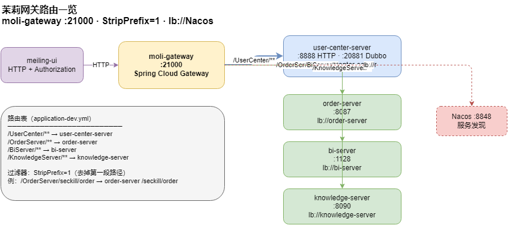

# moli-gateway · API 网关

茉莉微服务 **统一 HTTP 入口**：Spring Cloud Gateway，按路径转发至 user-center / order / bi / knowledge。

## 运行时

| 项 | 值 |
|----|----|
| Nacos 服务名 | `moli-gateway` |
| HTTP 端口 | **21000** |
| Profile | `dev`（日常）、`loadtest`（压测） |

## 路由表

| 网关路径 | 目标服务 | 说明 |
|----------|----------|------|
| `/UserCenter/**` | `user-center-server` | StripPrefix=1 |
| `/OrderServer/**` | `order-server` | StripPrefix=1 |
| `/BiServer/**` | `bi-server` | StripPrefix=1 |
| `/KnowledgeServer/**` | `knowledge-server` | StripPrefix=1 |

完整说明：[docs/api/gateway-routes.md](../docs/api/gateway-routes.md)



## 职责

- 服务发现（Nacos `lb://`）
- 路径转发与 **Authorization 头透传**（Shiro Session）
- CORS / 限流（Sentinel 配置预留）

**不做**：业务鉴权逻辑（由各业务服务 Shiro 处理）

## 依赖

- **Nacos** — 下游服务必须已注册
- 下游至少一个业务服务可用（否则路由 503）

## 本地启动

```bash
cd moli-distribute-parent && mvn clean install -DskipTests
cd ../moli-gateway
mvn spring-boot:run "-Dspring-boot.run.profiles=dev"
```

**建议最后启动 gateway**（待 user-center 等已注册）。

## 配置

| 文件 | 内容 |
|------|------|
| `application.yml` | 端口 21000 |
| `application-dev.yml` | 四路由定义 |
| `bootstrap.yml` | Nacos |

## 文档索引

| 类型 | 路径 |
|------|------|
| **路由契约** | [`docs/api/gateway-routes.md`](../docs/api/gateway-routes.md) |
| **全链路架构** | [`docs/zh-CN/ARCHITECTURE.md`](../docs/zh-CN/ARCHITECTURE.md) |
| **部署拓扑** | [`docs/diagrams/moli-deploy-topology.drawio`](../docs/diagrams/moli-deploy-topology.drawio) |
| **冒烟** | [`docs/test/release-smoke-checklist.md`](../docs/test/release-smoke-checklist.md) §1 |
| **v1 范围** | [`docs/product/moli-v1-release-scope.md`](../docs/product/moli-v1-release-scope.md) |
| **启动** | [`kb/wiki-ops/guides/本地启动指南.md`](../moli-knowledge/kb/wiki-ops/guides/本地启动指南.md) |

## 探测

```bash
curl http://127.0.0.1:21000/OrderServer/seckill/ping
curl -X POST http://127.0.0.1:21000/UserCenter/login \
  -H "Content-Type: application/json" \
  -d '{"userName":"admin","password":"123456"}'
```
