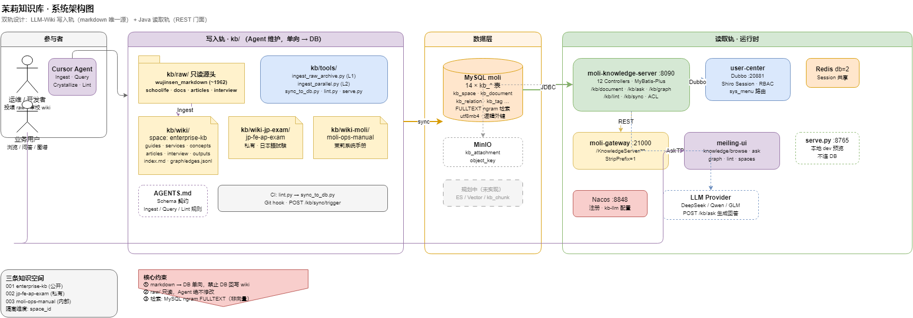

# moli-knowledge · 企业知识库（模块总览）

茉莉的企业级知识库模块。采用 **AutoSci / LLM-Wiki 范式**（以 Karpathy「LLM-Wiki」为主、AutoSci 为辅），由两条轨道组成：



> 可编辑源文件：[moli-kb-architecture.drawio](../docs/diagrams/moli-kb-architecture.drawio) · 全链路见 [moli-kb-raw-pipeline.drawio](../docs/diagrams/moli-kb-raw-pipeline.drawio)

<details>
<summary>ASCII 备查</summary>

```
                 投喂源 / 提问 / 定方向
                          │
                          ▼
   ┌──────────────────────────────────────────┐
   │  kb/   LLM-Wiki（大脑 · 单一知识源）        │
   │  raw/ 原始源 → wiki/ 结构化页 + 交叉引用      │
   └──────────────────────────────────────────┘
                          │
                          ▼
   ┌──────────────────────────────────────────┐
   │  moli-knowledge-server/  Java REST 后端     │
   └──────────────────────────────────────────┘

   kb/tools/serve.py  轻量 Viewer
```

</details>

**一句话分工**：知识在 `kb/`（markdown）里产生与保鲜；`moli-knowledge-server` 把它对外服务化；`viewer` 用来快速看效果。详见 [`kb/ROADMAP.md`](kb/ROADMAP.md)。

**架构图（draw.io）**：[`docs/diagrams/`](../docs/diagrams/README.md)  
**五类文档规范**：[`docs/README.md`](../docs/README.md)

---

## 三个组成部分

| 部分 | 是什么 | 怎么用 | 文档 |
|------|--------|--------|------|
| **`kb/`** | LLM-Wiki：AI Agent 维护的互链 markdown 知识库（大脑、单一知识源） | 在 Cursor 里对 AI 说「ingest / query / lint」 | [README](kb/README.md) · [AGENTS](kb/AGENTS.md) · [ROADMAP](kb/ROADMAP.md) |
| **`moli-knowledge-server/`** | Java REST 后端（Spring Boot），对外提供空间/分类/文档/标签/评论/收藏 + 鉴权 | `mvn spring-boot:run -Dspring-boot.run.profiles=dev`（:8090） | [README](moli-knowledge-server/README.md) |
| **`kb/tools/serve.py`** | 零依赖本地 Viewer：浏览 wiki + 检索式 Query + 高亮引用 | `python kb/tools/serve.py` → `http://127.0.0.1:8765` | 见下「看效果」 |
| **`kb/tools/sync_to_db.py`** | kb→DB 单向增量同步：把 wiki 写进 `kb_document` 供 Java/前端使用 | `python kb/tools/sync_to_db.py --dry-run`（先校验）/ 去掉 `--dry-run` 写库 | 见下「同步到数据库」 |
| **`kb/tools/enrich.py`** | 已有 wiki 页 **Enrich 治理**：追加 patch + log/index/edges（与 Web `POST /kb/wiki/enrich`、Ingest EnrichWriter 对齐） | `python kb/tools/enrich.py --slug guides/foo --patch-file p.md --apply` | [`KNOWLEDGE_API.md`](../docs/api/KNOWLEDGE_API.md) §8.4 |
| **`deep-research/`** | **AI-10 DeepResearch** sidecar（Planner/Retriever/Writer/Reviewer） | `uvicorn deep_research.main:app --port 8095` · [`deep-research/README.md`](deep-research/README.md) | [`AI-10-contract.md`](../docs/design/contracts/AI-10-contract.md) · [`KNOWLEDGE_API.md`](../docs/api/KNOWLEDGE_API.md) §3 |

---

## 快速看效果（推荐先跑这个）

无需数据库 / Java / 联网，纯 Python 标准库：

```powershell
python kb/tools/serve.py            # 默认 http://127.0.0.1:8765
python kb/tools/serve.py --port 9000
```

打开后可：
- **浏览**：左侧按类型（指导/微服务/概念…）看所有 wiki 页，markdown + 表格 + `[[wikilink]]` 跳转。
- **Query 问答**：输入问题 → 自动识别**作用域**（搜哪些类型）→ 选出相关页 + 高亮命中片段 + 可点引用。
  - 当前为**检索式**；接入 LLM 后升级为**生成式带引用答案**（只需填 `key + base-url + model`）。

---

## 启动 Java 服务

详见 [`moli-knowledge-server/README.md`](moli-knowledge-server/README.md)。最小步骤：

```powershell
# 1. 建表（仓库根目录；init-db.ps1 含 utf8mb4 + source，见 docs/sql/README.md）
.\scripts\init-db.ps1 -SkipSeckill
# 2. 启动（:8090，依赖 Nacos/MySQL/Redis + user-center）
cd moli-knowledge\moli-knowledge-server
mvn spring-boot:run "-Dspring-boot.run.profiles=dev"
```

- 网关访问：`http://127.0.0.1:21000/KnowledgeServer/...`
- Swagger：`http://127.0.0.1:8090/swagger-ui.html`

---

## 同步到数据库（kb → kb_document）

`kb/` 下两个 wiki 目录是**唯一写入源**；Java 服务只读 MySQL，不直接扫文件。

| wiki 目录 | space_code | 用途 |
|-----------|------------|------|
| `kb/wiki/` | `enterprise-kb` | 占位 index（茉莉正文在 wiki-moli） |
| `kb/wiki-moli/` | `moli-ops-manual` | **茉莉系统手册**（全项目文档） |

用 `sync_to_db.py` / `run_sync.sh` **单向、增量、幂等**写进 `kb_document`：

```powershell
# 1. 预览（两空间或单空间）
bash kb/tools/ci/run_sync.sh dry-run-all
# 或仅 enterprise-kb：python kb/tools/sync_to_db.py --dry-run

# 2. 写库（推荐两空间一次同步；需 pymysql）
bash kb/tools/ci/run_sync.sh sync-all
```

详表与单空间命令见 `kb/wiki-moli/ops/wiki同步指南.md`。

机制：
- **slug** = wiki 相对路径去扩展名（如 `services/用户中心`），空间内唯一、与 `edges.jsonl` 节点命名一致。
- **增量**：按 `content_hash` 比对，未变则 `skip`；变更 `update`（版本号 +1）；新页 `insert`。
- **删除**：DB 中 `source='kb'` 且 slug 已不在 wiki 的，置 `is_delete=1`。
- **标签/关系**：同步 `kb_tag`/`kb_document_tag`；`[[..]]`→`links_to`、`related`→`related`、`edges.jsonl`→边自带 type，解析不到记 `resolved=0`。
- **审计**：每条动作写入 `kb_sync_log`。

> 方向严格单向：界面改 DB 不回写 markdown，避免双写入源。表结构见 [`docs/sql/KNOWLEDGE_SCHEMA.md`](../docs/sql/KNOWLEDGE_SCHEMA.md)。

---

## 为什么是「LLM-Wiki」而不是朴素 RAG

> 朴素 RAG = 每次提问临时检索原始文档；**LLM-Wiki** = 投喂源时就由 Agent 读取、抽取、写进结构化 wiki 页并建立交叉引用，知识**编译一次、持续保鲜**。

好处：去重 / 提炼 / 矛盾检测有抓手；检索默认靠 `index.md` 目录 + frontmatter（`type`/`tags`）做「元数据预过滤」，**先不上向量库**，量大了再按需叠加（见 [AGENTS §7](kb/AGENTS.md)）。

---

## 目录结构

```
moli-knowledge/
  README.md                  # 本文（模块总览）
  moli-knowledge-server/     # Java REST 后端（见其 README）
  deep-research/             # AI-10 DeepResearch Python sidecar
  kb/                        # LLM-Wiki 知识库
    AGENTS.md                #   契约（Agent 工作前必读）
    README.md  ROADMAP.md    #   说明 / 功能规划
    raw/                     #   只读原始源（含 wujinsen_markdown 面试语料等）
    wiki/                    #   Agent 维护的知识页 + index/log/graph
    tools/serve.py           #   零依赖本地 Viewer
```

---

## 文档导航

- 模块总览（本文）：`README.md`
- **工程概要设计**：[`docs/design/knowledge-module-overview.md`](../docs/design/knowledge-module-overview.md)
- Java 服务：[`moli-knowledge-server/README.md`](moli-knowledge-server/README.md)
- 知识库范式与用法：[`kb/README.md`](kb/README.md)
- 知识库契约（schema / 三操作）：[`kb/AGENTS.md`](kb/AGENTS.md)
- **自我进化操作手册**（Ingest/Lint/Sync/Crystallize、AI 审校 MD）：[`kb/wiki-moli/develop/AI自我进化与MD审校流程.md`](kb/wiki-moli/develop/AI自我进化与MD审校流程.md)
- **DeepResearch（AI-10）**：[`deep-research/README.md`](deep-research/README.md) · 契约 [`docs/design/contracts/AI-10-contract.md`](../docs/design/contracts/AI-10-contract.md)
- 功能规划与双轨分工：[`kb/ROADMAP.md`](kb/ROADMAP.md)
- 现有知识页目录：[`kb/wiki/index.md`](kb/wiki/index.md)
