# サーティファイ ランダム問題（模擬問題）5 · 中文详细解析

> 对应原题：`ランダム問題（模擬問題）5.md` 及 Moodle 回顾 HTML。
> 本卷为 **随机抽题**（题序与固定模擬問題卷不同）；解析按 **题干文本** 从已有模擬問題/专题库匹配（覆盖 50/50 题）。
> 含表格/图片的题请 **对照 HTML 插图** 验算。

## 测验摘要

| 项目 | 内容 |
|------|------|
| 题数 | 50 |
| 本次得分 | 0.00/50.00（0.00 out of 10.00 (0%)） |
| 用途 | Certify ランダム模擬（综合 IT 基础） |

---

## 第 1 题

### 日文题干

図1は，図形の回転や反転の例として，元の図形を対象に，左に90度回転した図形．右に90度回転した図形，上下反転した図形，左右反転した図形を示している。図2は．図3の配列Pから配列Qを作成する流れ図を示している。流れ図を実行した結果得られる配列Qに関する記述として．適切なものはどれか。ここで．配列P，配列Qは，それぞれ8X8の2次元配列である。また， a～dをそれぞれ0以上7以下の整数とすると，配列Pの要素はP[a, b], 配列Q の要素はQ[c, d]と表現し，配列の添字は0から始まる。
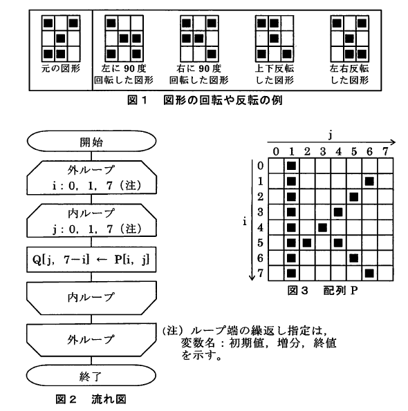

### 中文题意

8×8 数组 P→Q 流程图，Q 表示 P 的何种变换？

### 选项

- **a.** 配列Qは，配列Pで表されている図形を，右に90度回転した図形を表している。
- **b.** 配列Qは，配列Pで表されている図形を，上下反転した図形を表している。
- **c.** 配列Qは，配列Pで表されている図形を，左に90度回転した図形を表している。
- **d.** 配列Qは，配列Pで表されている図形を，左右反転した図形を表している。

### 正确答案

**配列Qは，配列Pで表されている図形を，右に90度回転した図形を表している。**

### 解析

**考点：** 二维数组坐标变换（见 `67_07.png`）。

对照图 1 四种变换：
- 右旋 90°：Q[c,d] 与 P 的对应关系为 **列变行、行镜像** 等（依流程图式子）

流程图执行结果 = **P 图形右旋 90°** → 选项 **d**。

**易错点：** 左/右旋与上下/左右翻转公式不同；务必对照流程图赋值式。

---

## 第 2 题

### 日文题干

表に示す三つのCPU(CPU-I. CPU-2, CPU-3) について， 1秒間に実行できる平均命令数が多い順に並べたものはどれか。
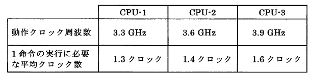

### 中文题意

三 CPU 每秒指令数从多到少排序。

### 选项

- **a.** CPU-2, CPU-1, CPU-3
- **b.** CPU-2, CPU-3, CPU-1
- **c.** CPU-3, CPU-2, CPU-1
- **d.** CPU-3, CPU-1, CPU-2

### 正确答案

**CPU-2, CPU-1, CPU-3**

### 解析

**考点：** IPS ≈ 时钟频率 / CPI（见 `67_09.png`）。

| CPU | f/CPI | 约 GIPS |
|-----|-------|---------|
| CPU-2 | 3.6/1.4 | **2.57**（最高） |
| CPU-1 | 3.3/1.3 | 2.54 |
| CPU-3 | 3.9/1.6 | 2.44 |

顺序：**CPU-2 > CPU-1 > CPU-3**

**易错点：** 频率最高≠最快，要看 **f÷CPI**。

---

## 第 3 题

### 日文题干

図で示されるアローダイアグラムで表されるプロジェクトについて,クリティカルパスはどれか。

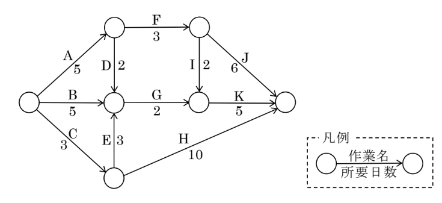

### 中文题意

箭线图关键路径？

### 选项

- **a.** A → D → G → K
- **b.** A → F → I → K
- **c.** B → G → K
- **d.** C → E → G → K

### 正确答案

**A → F → I → K**

### 解析

**考点：** CPM 关键路径（见 `67_35.png`）。

对各路径 **累加工期**，**最长** 且无浮动时间为关键路径。

计算得 **A→F→I→K** 为最长路径。

**易错点：** 关键路径决定最短完成工期；并行分支取大不取和时需看清汇合点。

---

## 第 4 题

### 日文题干

ページング方式の仮想記憶システムにおいて，ページ置換えアルゴリズムとしてLRU方式を採用した場合，ページフォールトが発生して主記憶に空きページ枠がなかったときに置換えの対象となるページはどれか。

### 中文题意

LRU 换页时，被替换的页是？

### 选项

- **a.** 最後に参照されてからの経過時間が最も長いページ
- **b.** 主記憶にページインされてからの経過時間が最も短いページ
- **c.** 主記憶にページインされてからの経過時間が最も長いページ
- **d.** 最後に参照されてからの経過時間が最も短いページ

### 正确答案

**最後に参照されてからの経過時間が最も長いページ**

### 解析

**考点：** LRU 页面置换。

**LRU：** 替换 **最后引用以来经过去时间最长** 的页。

**易错点：** FIFO=最早进入主存；LFU=使用频率最低；≠「页入时间最长」。

---

## 第 5 题

### 日文题干

組織の内部環境がもつ強みと弱み,及び,組織の外的環境に潜む機会と脅威を分析し,強みを活かして“機会を活用”及び“脅威に対抗”する方策,弱みによって“機会を逃さない”及び“脅威による最悪の事態を避ける”方策を検討するものはどれか。

### 中文题意

分析强弱项与机会威胁定策？

### 选项

- **a.** バリューチェーン分析
- **b.** ファイブフォース分析
- **c.** SWOT 分析
- **d.** 3C 分析

### 正确答案

**SWOT 分析**

### 解析

**考点：** 战略分析框架。

**SWOT：** **S/W**（内）+ **O/T**（外）→ 匹配策略。

**易错点：** 3C=客户/competitor/company；五力=行业结构；价值链=活动分解。

---

## 第 6 题

### 日文题干

電子メールなどで利用される暗号化の規格で,公開鍵暗号方式と共通鍵暗号方式を組み合わせたハイブリッド暗号方式を用いており,最初の規格は IETF によってRFC 2440 として公開されたものはどれか。

### 中文题意

IETF RFC 2440、混合加密的邮件加密规范？

### 选项

- **a.** OpenPGP
- **b.** DKIM
- **c.** EAP
- **d.** RADIUS

### 正确答案

**OpenPGP**

### 解析

**考点：** 邮件加密标准。

**OpenPGP：** 公钥+对称 **混合加密**，RFC 2440 等定义。

**易错点：** DKIM=域名签名验证邮件；RADIUS=认证协议。

---

## 第 7 题

### 日文题干

感染したコンピュータを正常に利用できない状態に改変して,正常に利用できる状態に戻すことと引換えに金品の支払いなどを要求する悪意のあるソフトウェアはどれか。

### 中文题意

加密勒索赎金才恢复使用的恶意软件？

### 选项

- **a.** アドウェア
- **b.** ユースウェア
- **c.** スパイウェア
- **d.** ランサムウェア

### 正确答案

**ランサムウェア**

### 解析

**考点：** 恶意软件分类。

**Ransomware：** 加密/锁定系统后 **勒索** 支付赎金。

**易错点：** 间谍=窃密；广告=弹广告。

---

## 第 8 题

### 日文题干

6進数の演算に関する記述中の【　　　】に入れる字句として，適切なものはどれか。
"16進数の【　　　　】’'と“16進数の0.2’'を乗算した結果は， “16進数のA.BF"になる。

### 中文题意

十六进制【　】× 0.2₁₆ = A.BF₁₆，求【　】。

### 选项

- **a.** 2A.FC
- **b.** 55.F8
- **c.** 2.AFC
- **d.** 1.57E

### 正确答案

**55.F8**

### 解析

**考点：** 十六进制小数乘除。

**推导：**
- A.BF₁₆ = 10 + 11/16 + 15/256 ≈ **10.746**
- 0.2₁₆ = 2/16 = **0.125**
- 被乘数 = 10.746 ÷ 0.125 ≈ **85.97**
- 55.F8₁₆ = 85 + 15/16 + 8/256 = **85.96875** ✓

**易错点：** 题面「6進数」为笔误，实际按 **16 进制幂次** 计算；小数按 16 负幂展开。

---

## 第 9 题

### 日文题干

汎化の説明として,適切なものはどれか。

### 中文题意

泛化（generalization）说明。

### 选项

- **a.** 複数のサブクラスに共通する性質をまとめ,共通のスーパークラスとして定義することである。
- **b.** クラスの定義に基づいて,メモリ領域を確保し,具体的なオブジェクトを生成することである。
- **c.** スーパークラスのもつ性質を,新しく産み出されたサブクラスに受け継ぐことである。
- **d.** データとメソッドを一体化して,オブジェクトに実装されている情報の詳細を隠蔽することである。

### 正确答案

**複数のサブクラスに共通する性質をまとめ,共通のスーパークラスとして定義することである。**

### 解析

**考点：** OOP 泛化 vs 继承。

**泛化：** 从 **多个子类共同性质** 抽象出 **超类**（自底向上建模）。

**易错点：** b 描述的是 **继承**（超类→子类）；d 是 **封装**。

---

## 第 10 题

### 日文题干

OSI 基本参照モデルのネットワーク層の説明として,適切なものはどれか。

### 中文题意

OSI 网络层说明。

### 选项

- **a.** 中継ノードを含む隣接するノード間でのデータ伝送を実現するために,誤り検出機能や再送制御機能などを提供する。
- **b.** 一対の機器間でビット単位の信号の送受信を可能にするため,伝送媒体の物理的な形状や仕様,信号形式などを提供する。
- **c.** エンドツーエンドの通信でのデータ伝送を実現するために,通信の経路選択機能や中継機能などを提供する。
- **d.** エンドツーエンドの通信での信頼性の高いトランスペアレントなデータ伝送を保証するために,誤り検出機能や回復機能などを提供する。

### 正确答案

**エンドツーエンドの通信でのデータ伝送を実現するために,通信の経路選択機能や中継機能などを提供する。**

### 解析

**考点：** OSI 各层职责。

**网络层：** **端到端** 路径选择、**中继**、逻辑寻址（IP 等）。

| 层 | 职责 |
|----|------|
| 物理 | 比特传输 |
| 数据链路 | 相邻节点帧 |
| 运输 | 端到端可靠/透明 |
| **网络** | **路由** ✓ |

---

## 第 11 题

### 日文题干

表は，レジスタ1~3に設定されている浮動小数点数を示している。浮動小数点数の演算に関する記述のうち，適切なものはどれか。ここで，浮動小数点数における有効桁数は，仮数部5桁に対して，演算は10桁で行われるものとする。
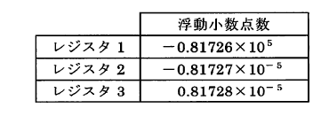

### 中文题意

三寄存器浮点值，哪条关于桁落ち/情報落ち描述正确？

### 选项

- **a.** レジスタ2とレジスタ3を加算すると桁落ちが発生する。また，レジスタ1とレジスタ2を加算すると情報落ちが発生する。
- **b.** レジスタ2とレジスタ3を加算すると桁落ちが発生する。また，レジスタ3からレジスタ2を減算すると情報落ちが発生する。
- **c.** レジスタ2からレジスタ3を減算すると桁落ちが発生する。また，レジスタ3からレジスタ2を減算すると情報落ちが発生する。
- **d.** レジスタ2からレジスタ3を減算すると桁落ちが発生する。また，レジスタ1とレジスタ2を加算すると情報落ちが発生する。

### 正确答案

**レジスタ2とレジスタ3を加算すると桁落ちが発生する。また，レジスタ1とレジスタ2を加算すると情報落ちが発生する。**

### 解析

**考点：** 浮点误差（见 `67_02.png`）。

| 寄存器 | 值 |
|--------|-----|
| R1 | -0.81726×10⁵ |
| R2 | -0.81727×10⁻⁵ |
| R3 | +0.81728×10⁻⁵ |

- **R2+R3**：同量级相近数相加/相消 → **桁落ち** ✓
- **R1+R2**：极大+极小 → 小数被吞没 → **情報落ち** ✓

**易错点：** R2−R3 才是相近相减；本题问的是 **加算**。

---

## 第 12 题

### 日文题干

通常のコンパイルの前処理において，仕様拡張したプログラム言語の命令をコン
パイルが可能な命令に変換する言語処理ツールはどれか。

### 中文题意

编译前将扩展语法转为可编译命令的工具？

### 选项

- **a.** コンパイラコンパイラ
- **b.** クロスコンパイラ
- **c.** ジェネレーター
- **d.** プリプロセッサ

### 正确答案

**プリプロセッサ**

### 解析

**考点：** 语言处理程序。

**预处理器：** #include、宏展开等 **编译前** 文本/语法变换。

**易错点：** 交叉编译=目标机不同；编译器编译器=生成编译器；生成器=部分工具链用语。

---

## 第 13 题

### 日文题干

表は，システムAの状態遷移表を示している。システムAの状態がs，であるときに，次の順序で信号を入力すると，最後の状態（最後の入力s で遷移した後の状態）として，適切なものはどれか。ここで，状態遷移表の中の空欄は状態が変化しないことを表す。

〔入力する信号と順序〕
r → s → p → q → r → p → s → q → S
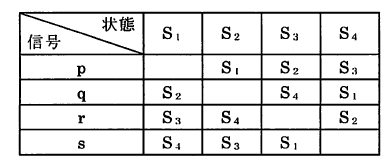

### 中文题意

状态机从 s 起按给定信号序列输入，最终状态？

### 选项

- **a.** S4
- **b.** S1
- **c.** S2
- **d.** S3

### 正确答案

**S3**

### 解析

**考点：** 有限状态机逐步迁移（见 `67_01.png`）。

从初始 **s**，按 r→s→p→q→r→p→s→q→S 依次查表；空栏表示 **保持当前状态**。

逐步追踪至最后一输入 S 后 → **S3**。

**易错点：** 勿漏「不变」格；每步用 **当前状态+输入** 查下一状态。

---

## 第 14 题

### 日文题干

WAF の説明として,適切なものはどれか。

### 中文题意

WAF 说明。

### 选项

- **a.** 無線 LAN におけるセキュリティ規格であり,パーソナルモードとエンタープライズモードの二つのモードを選択でき,パーソナルモードでは楕(だ)円曲線暗号によって認証を行う。
- **b.** インターネットなどのオープンな公衆ネットワークを,データの暗号化や利用者認証などのセキュリティ技術とトンネリング手法を用いて,あたかもプライベートな専用ネットワークとして利用できる。
- **c.** OSI 基本参照モデルのネットワーク層で暗号化を行うプロトコルであり,データ部分だけを暗号化するトランスポートモードとヘッダーを含めたパケット全体を暗号化するトンネルモードがある。
- **d.** Web サーバや Web アプリケーションに対する外部からの通信を常に監視し,時系列のログをとり,攻撃とみなされるアクセスパターンを検知すると,そのアクセスを遮断する。

### 正确答案

**Web サーバや Web アプリケーションに対する外部からの通信を常に監視し,時系列のログをとり,攻撃とみなされるアクセスパターンを検知すると,そのアクセスを遮断する。**

### 解析

**考点：** Web 应用防火墙。

**WAF：** 监控 Web 服务器/应用 **外部访问**，日志+规则 **检测并阻断** SQLi/XSS 等攻击。

**易错点：** a=IPsec；c=VPN；d=Wi-Fi 安全。

---

## 第 15 题

### 日文题干

部品 A と部品 B を使用して,製品 P と製品 Q を生産している。表は,各製品を 1個生産するために必要な部品数,各製品の 1 個当たりの販売利益,各部品の 1 日に使用可能な最大部品数を示している。1 日の販売利益が最大になるように製品 P と製品 Q を生産し,全てを販売したとき,1 日の販売利益は何円か。
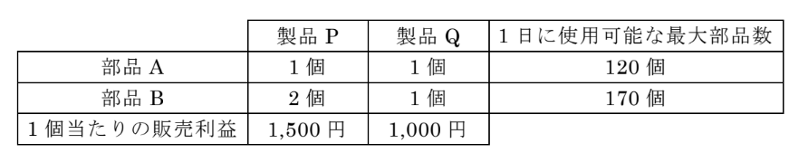

### 中文题意

两产品线性规划，最大日利润？

### 选项

- **a.** 145,000
- **b.** 127,500
- **c.** 120,000
- **d.** 155,000

### 正确答案

**145,000**

### 解析

**考点：** 线性规划（见 `67_47.png`）。

设 P=x，Q=y：
- max **1500x+1000y**
- x+y≤120，2x+y≤170，x,y≥0

交点 **(50,70)**：1500×50+1000×70 = **145,000 円**

**易错点：** (120,0)=180000 但违反 B 约束；验算 2×50+70=170。

---

## 第 16 题

### 日文题干

TCP/IP ネットワーク上でやり取りする電子メールにおいて,英数字などのテキストデータだけでなく,静止画,動画,音声などを扱えるようにした拡張仕様はどれか。

### 中文题意

邮件中处理图像/音视频等的扩展规范？

### 选项

- **a.** DNS
- **b.** IPoE
- **c.** MIME
- **d.** NAPT

### 正确答案

**MIME**

### 解析

**考点：** 电子邮件扩展。

**MIME：** Multipurpose Internet Mail Extensions，非 ASCII 附件与多部分正文。

**易错点：** DNS=域名；NAPT=地址转换；IPoE=接入方式。

---

## 第 17 题

### 日文题干

438×10^6ビット/秒の回線を使用して,1 件当たり 219×10^6バイトのデータを伝送すると,1 時間に最大で何件のデータを伝送できるか。ここで,回線利用率は 0.8とする。また,制御情報の伝送は考えないものとする。

### 中文题意

438Mbps 线路、219MB/件、利用率 0.8，1 小时最多传几件？

### 选项

- **a.** 12
- **b.** 720
- **c.** 900
- **d.** 5,760

### 正确答案

**720**

### 解析

**考点：** 传输时间与吞吐。

**每件时间** = 219×10⁶×8 bit ÷ (438×10⁶×0.8)  
= 1752/350.4 ≈ **5 秒/件**

**1 小时** = 3600/5 = **720 件**

**易错点：** 字节×8 转 bit；利用率 0.8 乘在带宽上。

---

## 第 18 题

### 日文题干

英単語imageを構成する全ての文字(i, m, a, g, e) を並べてできる順列のうち，両端（左から1文字目と5文字目の両方）に母音があるものは何個か。ここで，母音に該当する文字は， a, i, u, e, oである。

### 中文题意

image 五字母排列，两端均为母音的个数？

### 选项

- **a.** 12
- **b.** 36
- **c.** 120
- **d.** 72

### 正确答案

**36**

### 解析

**考点：** 排列组合。

字母 i,m,a,g,e；母音 a,i,e（3 个），辅音 m,g（2 个）。

1. 两端各 1 母音：P(3,2) = **6** 种
2. 中间 3 位排列剩余 3 字母：3! = **6**
3. 合计 6×6 = **36**

**易错点：** 120=5! 未限制两端；72 只算了一端。

---

## 第 19 题

### 日文题干

表は，アドレス指定を説明している。表中のA~Dは，それぞれ，間接アドレス指定，相対アドレス指定．即値アドレス指定，直接アドレス指定のどれかに該当する。Aに該当するものはどれか。
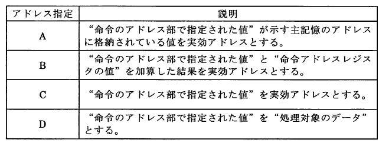

### 中文题意

寻址方式表：A 行是哪种寻址？

### 选项

- **a.** 即値アドレス指定
- **b.** 相対アドレス指定
- **c.** 間接アドレス指定
- **d.** 直接アドレス指定

### 正确答案

**間接アドレス指定**

### 解析

**考点：** 四种寻址（见 `67_08.png`）。

**间接寻址：** 指令给出 **地址的地址**，先读主存得有效地址，再访问操作数。

**易错点：** 直接=地址即操作数地址；立即=操作数在指令中；相对=PC+偏移。

---

## 第 20 题

### 日文题干

科目と教職員が次に示す条件のとき， UMLを用いて表したデータモデルとして，
適切なものはどれか。
〔条件〕
(1)　1人の教職員は，複数の科目を担当することができる。
(2)　一つの科目は，必ず1人以上の教職員が担当する。
(3)    どの科目も担当しない教職員が存在する。

### 中文题意

教职员-科目 UML 模型（1:N，科目至少1人，可有闲职员）

### 选项

- **a.** 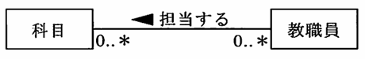
- **b.** 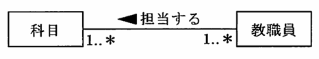
- **c.** 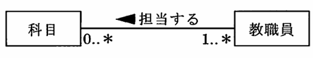
- **d.** 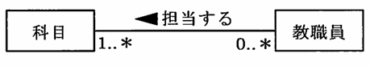

### 正确答案

****

### 解析

**考点：** UML 类图 cardinality。

(1) 1 职员 → 多科目  
(2) 1 科目 → **≥1** 职员（必须有人教）  
(3) 可有 **不任课** 职员  

**多对多 + 可选参与** → **イ** 图。

**易错点：** 勿选强制每职员必任课；科目侧不能 0..1。

---

## 第 21 题

### 日文题干

表は，データベースに関連する用語を説明している。表中の A~Dは．それぞれ
データクレンジング，データディクショナリ，データマート，データマイニングのど
れかに該当する。 Cに該当するものはどれか。
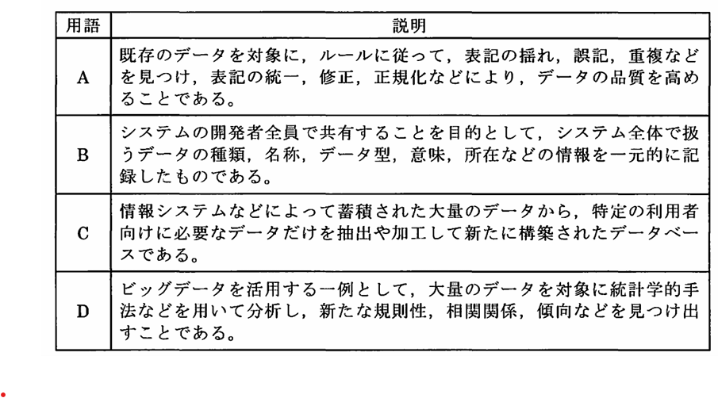

### 中文题意

DB 术语表：C 行是？

### 选项

- **a.** データマート
- **b.** データクレンジング
- **c.** データディクショナリ
- **d.** データマイニング

### 正确答案

**データマート**

### 解析

**考点：** 数据仓库术语（见 `67_21.png`）。

**数据集市（Data Mart）：** 面向 **特定部门/主题** 的 **小规模** 分析用数据集合。

**易错点：** 挖掘=发现模式；字典=元数据；清洗=质量修正。

---

## 第 22 题

### 日文题干

“定義された業務プロセスに沿って担当者がシステムに情報を入力すると,管理者へ回覧され,管理者が承認すると自動的に次の業務プロセスへ進む”システムは,どのシステムに該当するか。

### 中文题意

按流程输入→审批→自动流转的系统？

### 选项

- **a.** SFA システム
- **b.** トレーサビリティシステム
- **c.** CIM システム
- **d.** ワークフローシステム

### 正确答案

**ワークフローシステム**

### 解析

**考点：** 业务系统类型。

**工作流：** 定义流程， **回览/承认** 后 **自动** 进入下一工序。

**易错点：** SFA=营业支援；CIM=生产信息；追溯=追踪履历。

---

## 第 23 题

### 日文题干

表は，チェック方式におけるチェックの例を示している。表中のA~Dは，それぞれニューメリックチェック，バランスチェック，フォーマットチェック， リミット
チェックのどれかに該当する。 Dに該当するものはどれか。
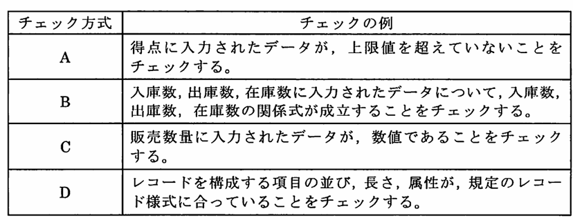

### 中文题意

校验表：D 行对应哪种 check？

### 选项

- **a.** リミットチェック
- **b.** バランスチェック
- **c.** フォーマットチェック
- **d.** ニューメリックチェック

### 正确答案

**フォーマットチェック**

### 解析

**考点：** 输入校验（见 `67_16.png`）。

四类：数值/平衡/格式/上下限。**D 行** → **フォーマットチェック**（位数、符号位置等格式）。

**易错点：** リミット=范围；バランス=借贷平衡。

---

## 第 24 题

### 日文题干

DDoS 攻撃の説明として,適切なものはどれか。

### 中文题意

DDoS 攻击说明。

### 选项

- **a.** 第三者の複数のコンピュータに不正プログラムを仕掛けて踏み台とし,一斉に特定のサーバに対して大量のパケットを送信することにより,企業などのネットワークを利用したサービスを妨害する攻撃である。
- **b.** 攻撃の対象者が日常的に利用していると推測される Web サイトに絞って不正処理を仕掛けておき,対象者がその Web サイトを利用すると,対象者の PC をマルウェアに感染させる攻撃である。
- **c.** PC にマルウェアを潜伏させ,PC の利用者には正規のサービスを利用しているように見せかけ,Web ブラウザの通信を監視して,不正に通信内容を改ざんしたり,利用者の操作を乗っ取ったりする攻撃である。
- **d.** ソフトウェアにセキュリティホールが発見されたとき,修正プログラムが公表されてダウンロードが可能になる前に,セキュリティホールを悪用して行われる攻撃である。

### 正确答案

**第三者の複数のコンピュータに不正プログラムを仕掛けて踏み台とし,一斉に特定のサーバに対して大量のパケットを送信することにより,企業などのネットワークを利用したサービスを妨害する攻撃である。**

### 解析

**考点：** 攻击类型。

**DDoS：** 控制 **多台** 计算机作 **踏台**，**同时** 向目标 **大量发包** 使服务瘫痪。

**易错点：** a=中间人/篡改；b=水坑；c=零日。

---

## 第 25 题

### 日文题干

キャッシュメモリのアクセス時間をTc, キャッシュメモリのヒット率をp,主記憶のアクセス時間をTmとすると表に示す四つのシステム(SA, SB, SC, SD)のうち，キャッシュメモリを介して主記憶にアクセスする場合の実効アクセス時間が最も短くなるものはどれか。
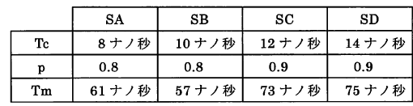

### 中文题意

四系统缓存，有效访问时间最短？

### 选项

- **a.** SB
- **b.** SC
- **c.** SA
- **d.** SD

### 正确答案

**SC**

### 解析

**考点：** Te = Tc×p + Tm×(1−p)（见 `67_10.png`）。

| 系统 | 计算 | Te (ns) |
|------|------|---------|
| SA | 8×0.8+61×0.2 | 18.6 |
| SB | 10×0.8+57×0.2 | 19.4 |
| **SC** | 12×0.9+73×0.1 | **18.1** ✓ |
| SD | 14×0.9+75×0.1 | 20.1 |

**易错点：** 命中率 p 用小数；未命中路径含 Tm。

---

## 第 26 题

### 日文题干

物品,空き部屋,駐車場などの“個人が保有している遊休資産”を対象として,主に個人同士での共有や貸借などがインターネットを活用することで容易になり,新たな経済活動が創出されることを表す用語として,適切なものはどれか。

### 中文题意

个人闲置资产经互联网共享借贷的经济？

### 选项

- **a.** ロングテール
- **b.** レコメンデーション
- **c.** クラウドソーシング
- **d.** シェアリングエコノミー

### 正确答案

**シェアリングエコノミー**

### 解析

**考点：** 新经济用语。

**Sharing Economy：** 个人 **闲置资产** 经 **互联网平台** 共享/租赁。

**易错点：** 众包=外包任务；长尾=小众商品聚合。

---

## 第 27 题

### 日文题干

ネットワークを介して，動画や音声などを受信して再生するときデータをある
程度受信した時点で再生を開始し，データを受信しながら同時に再生することに
より，利用者の視聴開始待ち時間を短縮する方式はどれか。

### 中文题意

边收边播以缩短等待的媒体方式？

### 选项

- **a.** オーサリング
- **b.** ストリーミング
- **c.** ディスパッチング
- **d.** スラッシング

### 正确答案

**ストリーミング**

### 解析

**考点：** 流媒体。

**Streaming：** 缓冲一定数据即开始播放，**边下载边播放**。

**易错点：** スラッシング=虚存抖动；ディスパッチング=调度。

---

## 第 28 题

### 日文题干

ロールフォワード処理の説明として，適切なものはどれか。

### 中文题意

Roll-forward 的正确说明。

### 选项

- **a.** ジャーナルファイル中のデータベースの更新前情報を用いて，データベースを
トランザクションの処理の開始前の状態に戻す。
- **b.** チェックポイント取得時の状態にデータベースを復元した後，ジャーナルファ
イル中のデータベースの更新前情報を用いて，データベースを復l日させる。
- **c.** ジャーナルファイル中のデータベースの更新後情報を用いて，データベースを
トランザクションの処理の開始前の状態に戻す。
- **d.** チェックポイント取得時の状態にデータベースを復元した後，ジャーナルファ
イル中のデータベースの更新後情報を用いて，データベースを復旧させる。

### 正确答案

**チェックポイント取得時の状態にデータベースを復元した後，ジャーナルファ
イル中のデータベースの更新後情報を用いて，データベースを復旧させる。**

### 解析

**考点：** DB 恢复。

**Roll-forward：** 先恢复到 **检查点**，再用日志 **更新后信息（after image）** **向前** 重做已提交更新。

**易错点：** Rollback=用 before image 撤销；不是回到事务开始前。

---

## 第 29 题

### 日文题干

A 店の店員 B さんは,A 店を訪れた顧客を対象として“対面販売と書類作成”を担当している。表は,B さんが担当する顧客が 1 日当たり 8 人の場合の“B さんの1 日の業務活動を分析した時間分析表”である。顧客から Web システムに情報を入力してもらうことによって書類作成時間が顧客 1 人当たり 0.1 時間短縮され,かつ,担当する顧客を 1 日当たり 10 人とした場合,“その他の業務時間”は最大で何時間確保できるか。ここで,総業務時間と顧客 1 人当たりの対面販売時間は変えないものとする。
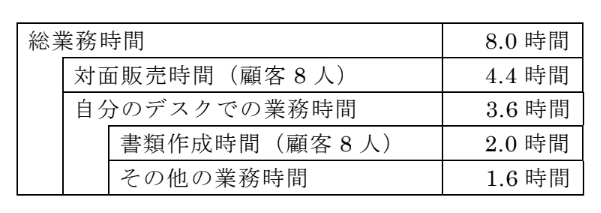

### 中文题意

Web 缩短文书 0.1h/人、客户 10 人/日，其他业务最多几小时？

### 选项

- **a.** 2.1
- **b.** 2.0
- **c.** 1.0
- **d.** 0.5

### 正确答案

**1.0**

### 解析

**考点：** 时间分析表（见 `67_39.png`）。

**约束：** 总业务 **8h** 不变；**每人** 对面销售 **0.55h** 不变。

| 项目 | 计算 |
|------|------|
| 对面 10 人 | 10×0.55 = **5.5h** |
| 文书 10 人 | 10×(0.25−0.1) = **1.5h** |
| その他 | 8−5.5−1.5 = **1.0h** |

**易错点：** 文书原 2.0h/8 人=0.25h/人；减 0.1 后 0.15h/人。

---

## 第 30 题

### 日文题干

空の2分探索木に，次の順序で9個のデータを与えたときにできる2分探索木はどれか。

16→ 14→ 18→ 20→ 17→ 15→ 13→ 11→ 10

### 中文题意

按给定顺序插入空 BST，正确树形？

### 选项

- **a.** 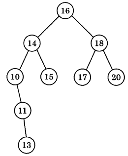
- **b.** 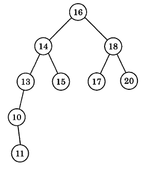
- **c.** 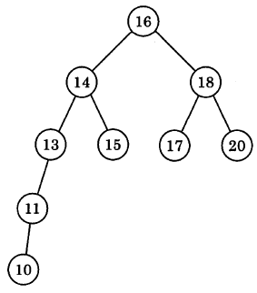
- **d.** 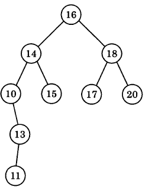

### 正确答案

****

### 解析

**考点：** 二叉搜索树插入规则。

顺序：16→14→18→20→17→15→13→11→10  
规则：小左大右，逐棵从根向下比较插入。

对照四棵候选树（`67_06_01`～`04.png`）→ **d** 与手工建树一致。

**易错点：** 20 在 18 右子树；10 在 11 左子树，勿与插入顺序混淆。

---

## 第 31 题

### 日文题干

表は,エンジニアリングシステムに関連する用語を説明している。表中の W~Zは,それぞれ CAD,CAE,CAM,MRP のどれかに該当する。X に該当するものはどれか。
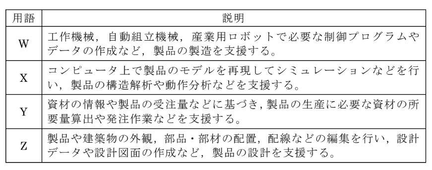

### 中文题意

工程系统术语表：X 行是？

### 选项

- **a.** CAE
- **b.** CAM
- **c.** MRP
- **d.** CAD

### 正确答案

**CAE**

### 解析

**考点：** CAD/CAE/CAM/MRP（见 `67_43.png`）。

**CAE（Computer Aided Engineering）：** **仿真分析**（强度、流体等）。

表中 **X** 行 → **CAE**。

**易错点：** CAD=设计；CAM=制造；MRP=物料计划。

---

## 第 32 题

### 日文题干

入力項目“科目コード”(整数値)の有効データの範囲が“11≦科目コード≦38”であるとき,限界値分析に用いるテストデータの組合せとして,適切なものはどれか。

### 中文题意

科目代码 11≤x≤38 的边界值测试数据？

### 选项

- **a.** 11,12,38,39
- **b.** 10,11,37,38
- **c.** 11,12,37,38
- **d.** 10,11,38,39

### 正确答案

**10,11,38,39**

### 解析

**考点：** 边界值分析。

有效范围 [11,38]，边界值取 **刚好无效/刚好有效** 各一侧：

- 下界外 **10**、下界 **11**
- 上界 **38**、上界外 **39**

→ **10,11,38,39**

**易错点：** 12/37 是健壮性扩展，标准四边界为 min−1,min,max,max+1。

---

## 第 33 题

### 日文题干

表は,産業財産権を説明している。表中の A~D は,それぞれ意匠権,実用新案権,商標権,特許権のどれかに該当する。C に該当するものはどれか。
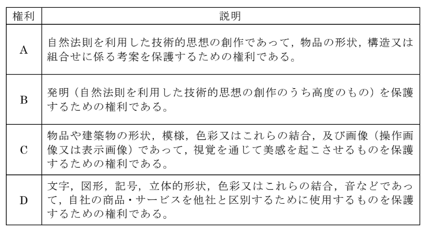

### 中文题意

产业财产权表：C 行是？

### 选项

- **a.** 特許権
- **b.** 意匠権
- **c.** 商標権
- **d.** 実用新案権

### 正确答案

**意匠権**

### 解析

**考点：** 四权对照（见 `67_50.png`）。

**意匠权：** 保护 **物品形状、图案、色彩** 等 **外观设计**。

**C 行** → **意匠権**（选项 a）。

**易错点：** 特許=发明；商標=标识；实用新案=小改进。

---

## 第 34 题

### 日文题干

表は,UML で定義されている図を説明している。表中の A~D は,それぞれアクティビティ図,シーケンス図,ステートチャート図,ユースケース図のどれかに該当する。A に該当するものはどれか。
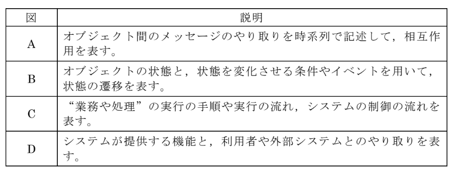

### 中文题意

UML 图说明表：A 行是？

### 选项

- **a.** ステートチャート図
- **b.** シーケンス図
- **c.** アクティビティ図
- **d.** ユースケース図

### 正确答案

**シーケンス図**

### 解析

**考点：** UML 图类型（见 `67_31.png`）。

官方反馈：**A=シーケンス図** B=状态图 C=活动图 D=用例图。

**易错点：** 序列图强调 **对象间消息时序**；活动图是流程/并行。

---

## 第 35 题

### 日文题干

図は,PPM(Product Portfolio Management)マトリックスを示している。図中の W~Z は,それぞれ金のなる木,花形,負け犬,問題児のどれかに該当する。W に該当するものはどれか。
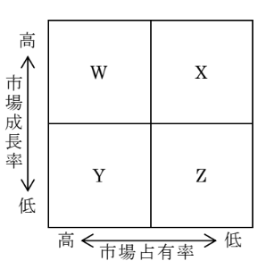

### 中文题意

PPM 矩阵：W 对应？

### 选项

- **a.** 問題児
- **b.** 金のなる木
- **c.** 花形
- **d.** 負け犬

### 正确答案

**花形**

### 解析

**考点：** PPM 四象限（见 `67_40.png`）。

**花形（Star）：** **高市场增长率 + 高相对份额**，需投资维持地位。

对照矩阵 **W** 位置 → **花形**。

**易错点：** 金牛=高份额低增长；问题儿=低份额高增长；败犬=双低。

---

## 第 36 题

### 日文题干

TCO の説明として,適切なものはどれか。

### 中文题意

TCO 说明。

### 选项

- **a.** ハードウェアやソフトウェアの導入費用,回線施設費用など,システムの導入のために必要な総費用
- **b.** システムのセキュリティ強化,機能修正,機能追加に必要となる総費用
- **c.** ネットワークの回線使用料など,システムを運用するために発生する総費用
- **d.** システムの導入費用に,導入後に必要な運用・保守費用,教育費用などを加えたシステムの総費用

### 正确答案

**システムの導入費用に,導入後に必要な運用・保守費用,教育費用などを加えたシステムの総費用**

### 解析

**考点：** Total Cost of Ownership。

**TCO** = 系统 **导入费** + **运行维护、教育** 等 **全生命周期** 总成本。

**易错点：** d 仅导入 CAPEX；c 仅运营 OPEX 一部分。

---

## 第 37 题

### 日文题干

表は,ABC 分析の対象となる商品(商品 1~商品 20)の売上高を示している。ABC分析に基づいて,重点管理を行うべき A 群の商品を決定すると,A 群の商品は何種類か。ここで,A 群とする基準は,累積構成比が“合計売上高の 70%以上”となった商品までとする。
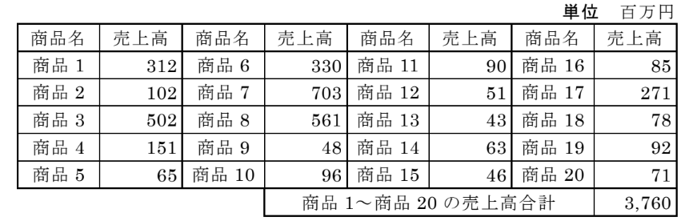

### 中文题意

ABC 分析：累计 70% 销售额的 A 群商品几种？

### 选项

- **a.** 8
- **b.** 5
- **c.** 7
- **d.** 6

### 正确答案

**6**

### 解析

**考点：** ABC（帕累托）分析（见 `67_46.png`）。

1. 按销售额 **降序** 排列商品 1～20  
2. 算 **累计构成比**  
3. 累计达 **≥70%** 为止归入 **A 群**

对照表 → **6 种** 商品。

**易错点：** 须按 **金额** 排序；不是按商品编号。

---

## 第 38 题

### 日文题干

ガントチャートの例として,適切なものはどれか。

### 中文题意

甘特图示例？

### 选项

- **a.** 三つの商品について,六つの項目を評価するためのアンケートを行った結果に基づき,商品ごとに各項目の平均評価点のバランスを蜘蛛の巣状に表現する。
- **b.** 円の中心の座標を(x,y),円の半径を r とし,10 品目の商品について,各商品の三つの特性を x,y,r に対応させて xy 平面上に 10 個の円を配置する。
- **c.** 新商品 B の開発の全作業を幾つかの項目に分け,各項目の作業期間について,予定と実績をそれぞれ帯(横棒)で表現して対比させる。
- **d.** 商品 A について,月別売上高,累計売上高,移動合計売上高の 3 本の折れ線グラフで表現する。

### 正确答案

**新商品 B の開発の全作業を幾つかの項目に分け,各項目の作業期間について,予定と実績をそれぞれ帯(横棒)で表現して対比させる。**

### 解析

**考点：** 项目日程 **甘特图**。

**甘特图：** 时间轴上 **横条** 表示各作业 **计划 vs 实际** 工期。

**易错点：** a=气泡图；b=折线；d=雷达图。

---

## 第 39 题

### 日文题干

図1は,特性 p と特性 q の相関関係を見るために作成した散布図1である。また,図2は,特性 s と特性 t の相関関係を見るために作成した散布図2である。特性 p と特性 q のデータから計算した相関係数を r1,特性 s と特性 t のデータから計算した相関係数を r2,特性 p から特性 q を推定するための回帰直線の傾きを k1,特性 s から特性 t を推定するための回帰直線の傾きを k2 とすると,成立する不等式に関する記述として,適切なものはどれか。
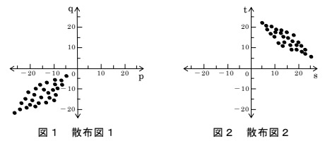

### 中文题意

两散布图相关系数 r1,r2 与回归斜率不等式。

### 选项

- **a.** k1 と k2 に関して,次の不等式が成り立つ。
0 < k2 < k1
- **b.** r1 と r2 に関して,次の不等式が成り立つ
-1 < r2 < 0 < r1 < 1
- **c.** k1 と k2 に関して,次の不等式が成り立つ。
k1 < 0 < k2
- **d.** r1 と r2 に関して,次の不等式が成り立つ。
-1 < r1 < 0 < r2 < 1

### 正确答案

**r1 と r2 に関して,次の不等式が成り立つ
-1 < r2 < 0 < r1 < 1**

### 解析

**考点：** 相关系数与散布形态（见 `67_48.png`）。

- 散布 1（p-q）：**正相关** → **0<r1<1**，斜率 k1>0  
- 散布 2（s-t）：**负相关** → **−1<r2<0**，斜率 k2<0  

→ **−1 < r2 < 0 < r1 < 1**（选项 d）

**易错点：** 正相关 r>0；负相关 r<0；勿与 k 的大小混选。

---

## 第 40 题

### 日文题干

図は，タスクの状態遷移を表している。図中の①（実行可能状態から実行状態への
遷移）に該当する事象として，適切なものはどれか。
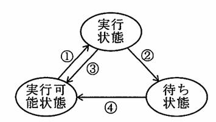

### 中文题意

就绪→执行 的迁移①对应何种事件？

### 选项

- **a.** CPUの使用権の割当て
- **b.** 入出力の要求
- **c.** CPUの使用権の割当て時間切れ
- **d.** 入出力の完了

### 正确答案

**CPUの使用権の割当て**

### 解析

**考点：** 任务状态迁移（见 `67_14.png`）。

**実行可能 → 実行中**：调度程序 **分配 CPU** → **CPUの使用権の割当て**

**易错点：** 时间片到=就绪←执行；I/O 请求=等待；I/O 完成=就绪。

---

## 第 41 题

### 日文题干

表に示す三つのシステム(Sl, S2, S3) について， MTTRの短い順に並べたものはどれか。
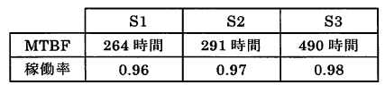

### 中文题意

三系统 MTTR 从短到长排序。

### 选项

- **a.** S1, S2, S3
- **b.** S1, S3, S2
- **c.** S2, S1, S3
- **d.** S2, S3, S1

### 正确答案

**S2, S3, S1**

### 解析

**考点：** 稼动率 = MTBF/(MTBF+MTTR) → MTTR = MTBF×(1−A)/A（见 `67_12.png`）。

| 系统 | MTBF | 稼动率 | MTTR |
|------|------|--------|------|
| S1 | 264h | 0.96 | **11h** |
| S2 | 291h | 0.97 | **9h**（最短） |
| S3 | 490h | 0.98 | **10h** |

顺序：**S2 < S3 < S1**

**易错点：** MTBF 长不等于 MTTR 短；本题问 **修复时间**。

---

## 第 42 题

### 日文题干

表は，配列に格納されているデータの整列法を説明している。表中のA~Dは，それぞれクイックソート，選択ソート，挿入ソート，バブルソートのどれかに該当する。Cに該当するものはどれか。
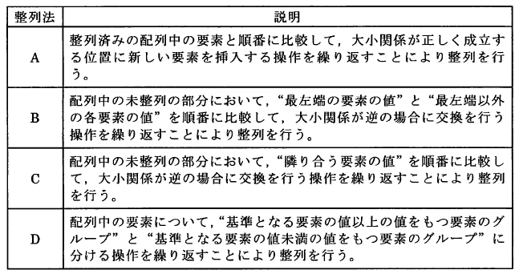

### 中文题意

排序算法说明表：C 行对应哪种排序？

### 选项

- **a.** 選択ソート
- **b.** 挿入ソート
- **c.** バブルソート
- **d.** クイックソート

### 正确答案

**バブルソート**

### 解析

**考点：** 四种排序特征对照（见 `67_05.png`）。

**冒泡排序：** 相邻元素比较交换，大（小）值逐步「冒泡」到端点。

表中 **C 行** 描述与此一致 → **バブルソート**。

**易错点：** 快排=分区递归；选择=每轮选最值；插入=已排序区插入。

---

## 第 43 题

### 日文题干

スループットや応答時間などを測定することによって,単位時間当たりの処理件数やトランザクション 1 件当たりの処理時間などが仕様書の要件を満たしているかどうかを検証する目的で行われるテストはどれか。

### 中文题意

测吞吐/响应时间验证规格是否达标？

### 选项

- **a.** 負荷テスト
- **b.** 機能テスト
- **c.** リグレッションテスト
- **d.** 性能テスト

### 正确答案

**性能テスト**

### 解析

**考点：** 测试类型。

**性能测试：** 测 **吞吐量、响应时间** 等是否满足 **性能需求**。

**易错点：** 负载=高负载下表现；回归=变更后再测；功能=正确性。

---

## 第 44 题

### 日文题干

ナレッジマネジメントの説明として,適切なものはどれか。

### 中文题意

企业内知识共享提升解决问题能力？

### 选项

- **a.** 顧客情報や個々の顧客との全てのやり取りなどを統合管理することによって,顧客に対するサービスを向上させて顧客満足度を高め,収益アップに結び付ける。
- **b.** 企業内の経営資源を一元化して統合的にリアルタイムで管理することにより,経営資源の有効利用や経営の効率化を図り,経営資源の全体最適化を実現する。
- **c.** 企業内に散在している個人や部門が所有する知識を企業全体で共有化し,有効に活用することにより,全体の問題解決力を高め,業績アップにつなげる。
- **d.** 資材・部品供給会社,製造会社,卸売業者,小売業者,顧客における供給プロセス全体の最適化を図り,調達期間の短縮やコストの削減などを実現する。

### 正确答案

**企業内に散在している個人や部門が所有する知識を企業全体で共有化し,有効に活用することにより,全体の問題解決力を高め,業績アップにつなげる。**

### 解析

**考点：** KM vs ERP/CRM/SCM。

**知识管理：** 散在 **个人/部门知识** **企业共享** 提升 **问题解决与业绩**。

**易错点：** b=ERP 资源计划；c=CRM 客户；d=SCM 供应链。

**官方反馈（日文）：**
A:ナレッジ
マネジメント
の説明
B:ERP（Enterprise Resource Planning）システムの説明
C:CRM（Customer Relationship Management）の説明
D:
サプライチェーン・
マネジメント
（SCM：Supply Chain Management）
の説明

---

## 第 45 题

### 日文题干

RAIDに関する記述として，適切なものはどれか。

### 中文题意

RAID 描述正确的一项。

### 选项

- **a.** ミラーリングは，一つのデータを複数のディスクに分散して書き込むことにより，アクセス速度を高速化させる技術であり， RAID0で規定されている。
- **b.** ミラーリングは，同一のデータを複数のディスクに重複して書き込むことにより，信頼性を向上させる技術であり， RAID1で規定されている。
- **c.** ストライピングは，同一のデータを複数のディスクに重複して書き込むことにより，信頼性を向上させる技術であり， RAID0で規定されている。
- **d.** ストライピングは，一つのデータを複数のディスクに分散して書き込むことにより，アクセス速度を高速化させる技術であり， RAID1で規定されている。

### 正确答案

**ミラーリングは，同一のデータを複数のディスクに重複して書き込むことにより，信頼性を向上させる技術であり， RAID1で規定されている。**

### 解析

**考点：** RAID 术语。

**正确：** **ミラーリング** = 同一数据 **重复写入多盘** 提高可靠性，规定于 **RAID1**。

**易错点：** ストライピング=分散写入提速（RAID0 等）；勿与镜像混淆。

---

## 第 46 题

### 日文题干

CGM(Consumer Generated Media)の説明として,適切なものはどれか。

### 中文题意

CGM 说明。

### 选项

- **a.** 金融業と IT を融合して生み出された従来にない革新的なサービスへの取組であり,AI による資金者の資産運用などを実現する。
- **b.** 不特定多数の大衆を対象として,同じ情報を一斉に伝達することができる“新聞,雑誌,テレビ,ラジオ”の四つの媒体のことである。
- **c.** 都市内に設置された監視カメラやスマートフォンなどで収集した様々なデータを分析することで,企業や生活者の利便性や快適性の向上を図ることである。
- **d.** 一般の消費者からの投稿や利用者から提供された情報を,収集・整理することで掲載内容が生成される Web サイトなどのことである。

### 正确答案

**一般の消費者からの投稿や利用者から提供された情報を,収集・整理することで掲載内容が生成される Web サイトなどのことである。**

### 解析

**考点：** Consumer Generated Media。

**CGM：** **消费者投稿/提供信息** 经整理 **生成** 网站内容（博客、点评等）。

**易错点：** b=FinTech；c=智慧城市；d=大众媒体。

---

## 第 47 题

### 日文题干

DFD の説明として,適切なものはどれか。

### 中文题意

DFD 说明。

### 选项

- **a.** オブジェクト指向設計のパターンを,生成に関するパターン,構造に関するパターン,振る舞いに関するパターンに分類して,再利用や応用に用いる。
- **b.** 業務で扱う情報を,実体(名詞として表すもの),関連(動詞として表すもの),属性(実体や関連のもつ複数の性質)を用いて表現する。
- **c.** 業務プロセスにおける要素間のデータの流れを,プロセス,データストア,外部(データの発生源と出力先),データフローを用いて表現する。
- **d.** “業務の手順”や“プログラムの内部で行われる処理の詳細な流れ”などを,主に JIS X 0121 で規格化されている部品や図記号などを用いて表現する。

### 正确答案

**業務プロセスにおける要素間のデータの流れを,プロセス,データストア,外部(データの発生源と出力先),データフローを用いて表現する。**

### 解析

**考点：** 结构化分析 DFD。

**DFD：** 用 **进程、数据存储、外部实体、数据流** 表示业务 **数据流动**。

**易错点：** b=ER 图；c=流程图(JIS)；a=设计模式。

---

## 第 48 题

### 日文题干

表は，三つのトランザクション (Tl. T2, T3) と三つの資源 (Rl, R2, R3) の
関係を表している。また，資源へのロックは，トランザクションの開始と同時にかけ
られ，トランザクションの終了と同時に解除される。資源待ち（ロックの解除による
資源の解放待ち）の発生の有無が次に示す運用テストの結果のとおりだったとする
と，表中の ［　　　　　］に入れる字句の組合せとして，適切なものはどれか。ここ
で，三つのトランザクションのうち，同時に処理できるトランザクションの数は二
つまでとする。
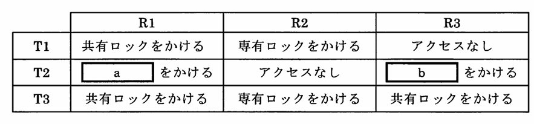
〔運用テストの結果〕
(1) T1を開始した後で，T1が終了する前にT2を開始したとき，T2で資源待ちは発生しない。
(2) T1を開始した後で，T1が終了する前にT3を開始したとき，T3で資源待ちが発生する。
(3)
T2を開始した後で，T2が終了する前にT3を開始したとき，T3で資源待ちが発生する。

### 中文题意

三事务锁类型填空 a,b（见测试场景）。

### 选项

- **a.** a:専有ロック　b:共有ロック
- **b.** a:共有ロック　b:専有ロック
- **c.** a:専有ロック　b:専有ロック
- **d.** a:共有ロック　b:共有ロック

### 正确答案

**a:共有ロック　b:専有ロック**

### 解析

**考点：** 共享/排他锁与并发（见 `67_20.png`）。

由测试结果反推：
- T1 持 R1 等，T2 同时跑 **不等待** → 读锁可共存
- T3 与 T1/T2 组合 **会等待** → 需 **排他** 冲突

→ **a:共有ロック b:専有ロック**

**易错点：** 同时运行上限 2 个；排他与共享/排他冲突会阻塞。

---

## 第 49 题

### 日文题干

送信者が,メッセージから“送信者の秘密鍵”を用いてデジタル署名を作成し,ネットワークを介してメッセージにデジタル署名を付けて送信したとき,“メッセージとデジタル署名”を受け取った受信者がデジタル署名を検証するときに使用する鍵として,適切なものはどれか。

### 中文题意

验证数字签名时使用哪把钥？

### 选项

- **a.** 受信者の秘密鍵
- **b.** 送信者の公開鍵
- **c.** 送信者の秘密鍵
- **d.** 受信者の公開鍵

### 正确答案

**送信者の公開鍵**

### 解析

**考点：** 数字签名。

签名 = 发送者用 **私钥** 加密摘要；验证 = 接收者用 **发送者公钥** 解密比对。

**易错点：** 加密保密才用接收者公钥；签名验证用 **发送者公钥**。

---

## 第 50 题

### 日文题干

期末の決算において,表の損益計算書が得られた。営業利益と経常利益の組合せとして,適切なものはどれか。
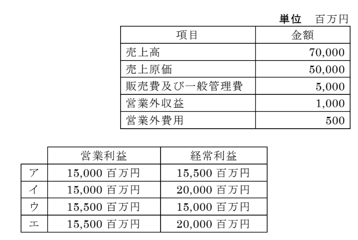

### 中文题意

损益表求营业利益与经常利益。

### 选项

- **a.** 営業利益：15,500 百万円 経常利益：20,000 百万円
- **b.** 営業利益：15,000 百万円 経常利益：15,500 百万円
- **c.** 営業利益：15,000 百万円 経常利益：20,000 百万円
- **d.** 営業利益：15,500 百万円 経常利益：15,000 百万円

### 正确答案

**営業利益：15,000 百万円 経常利益：15,500 百万円**

### 解析

**考点：** 日本损益计算（见 `67_49.png`）。

| 项目 | 金额 |
|------|------|
| 売上高 | 70,000 |
| 売上原価 | 50,000 |
| 売上総利益 | 20,000 |
| 販管費 | 5,000 |
| **営業利益** | **15,000** |
| +営業外収益 −営業外費用 | +1,000−500 |
| **経常利益** | **15,500** |

**易错点：** 经常利益含 **营业外** 收支；营业利润不含。

---

## 复习建议

1. ランダム卷题序每次不同，建议按 **考点**（数制/OS/DB/网络/经营）归类错题，而非记题号。
2. 同一题干可对照固定卷：`模擬問題1/2/5/6`、サンプル、開発技術 等。
3. 更新 HTML 后：`python kb/tools/gen_certify_random_analysis.py`。
