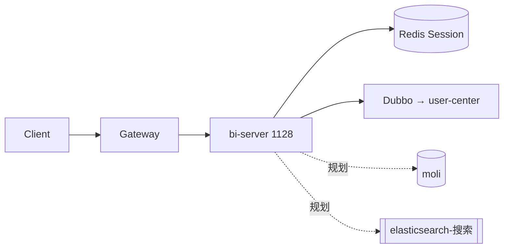

# BI 服务（bi-server）

BI / 报表微服务**预留槽位**，当前为可启动的**骨架工程**，尚无真实报表或 OLAP 能力。

| 项 | 值 |
|----|----|
| 服务名 | `bi-server` |
| HTTP 端口 | **1128** |
| Dubbo 端口 | **20883**（Consumer） |
| 网关路由 | `/BiServer/**` → `lb://bi-server`，StripPrefix=1 |

## 已具备能力

| 能力 | 状态 |
|------|------|
| Nacos 注册 | ✅ `namespace=dev` |
| Dubbo Consumer | ✅ 订阅 `user-center-server` |
| Shiro Starter | ✅ 跨服务 Session 校验 [[shiro-starter与跨服务校验]] |
| MySQL JDBC | ✅ 配置存在，**无 Mapper/业务 SQL** |
| Redis | ✅ `database: 1`（须与 user-center 一致） |
| Swagger | ⚠️ 未引 Springfox POM，无 UI（对比 [[用户中心]]） |

## 对外 API（现状）

| 方法 | 路径 | 说明 |
|------|------|------|
| GET | `/demo/test` | 返回 `"test success"`，无需业务逻辑 |

经网关：`GET http://localhost:21000/BiServer/demo/test`（需 `Authorization` token，除 anon 外）。

调试接口见 [[swagger接口调试指南]]（BI 暂无 Swagger，可用 curl）。

## 技术债（开发前需修）

1. **`@MapperScan("com.shushan.demo.server.mapper")`** — 遗留错误包名，工程内无 Mapper 接口
2. **无 MyBatis-Plus 依赖** — 仅有 `spring-boot-starter-jdbc`，与 [[mybatis-与-druid持久层]] 全家桶不一致
3. **无报表/数据集 API** — 无 Controller 除 demo
4. **Druid 配置块** — yml 有 `spring.druid` 但未引 Druid Starter（可能未生效）

## 在架构中的位置

与 [[订单服务]]、[[知识库服务]] 同级：HTTP 入口 + Shiro + Dubbo 鉴权，**不做登录**。

## 演进方向（与 wiki 设计对齐）

| 阶段 | 内容 | 参考 |
|------|------|------|
| P0 | 修正 MapperScan；引入 MyBatis-Plus + Druid | [[mybatis-与-druid持久层]] |
| P1 | 报表/指标只读 API；对接 moli 库只读账号 | [[mysql-索引]] |
| P2 | 字段级列权限 [[字段级数据权限设计]] | 未实现 |
| P3 | 全文/聚合检索 → ES [[elasticsearch-搜索]] | 未部署 |

压测 loadtest 路由含 BiServer，见 [[秒杀压测指南]]（profile 差异）。

## 启动

可选服务，顺序在 user-center 之后、gateway 之前，见 [[本地启动指南]]。

## 相关

- 鉴权：[[认证与会话机制]]、[[登录与鉴权指南]]
- 故障：[[茉莉登录与鉴权故障根因汇总]]（401 多为 Redis 不一致）
