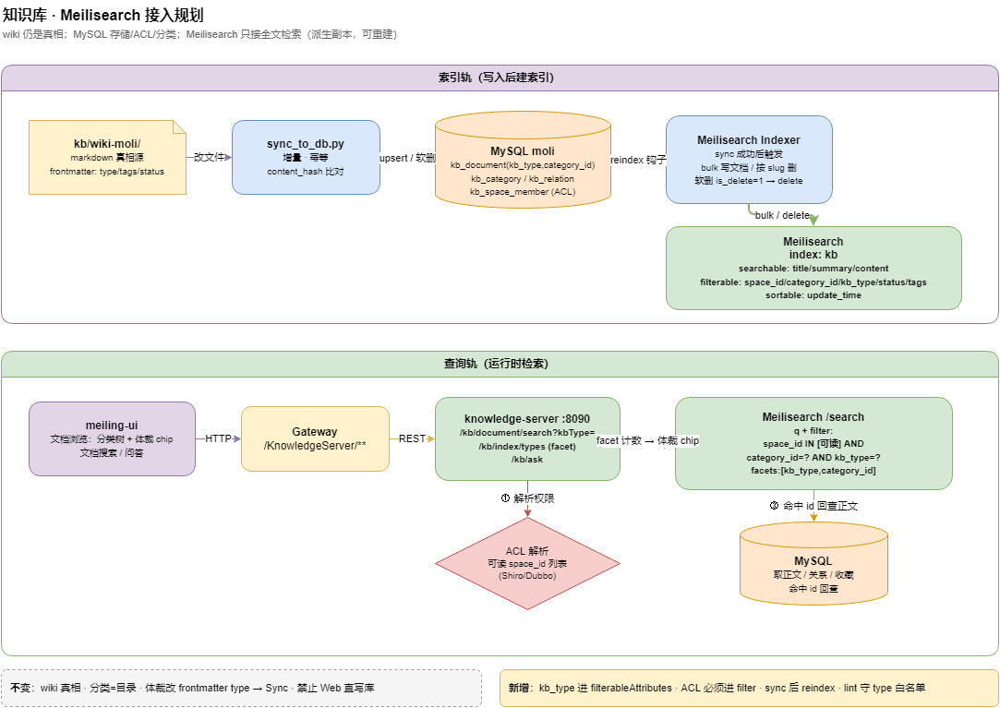

---


title: Wiki 到 ES 同步流水线
slug: kb-wiki到es同步流水线
type: article
status: active
tags: [知识库, Elasticsearch, ingest, 同步]
sources:
  - wiki/guides/wiki同步指南.md
related: [wiki同步指南, 知识库-meilisearch接入规划, 知识库设计哲学-docs-as-code, 知识库服务]
created: 2026-06-21
updated: 2026-07-09
---

# Wiki 到 ES 同步流水线

> MySQL 同步 [[wiki同步指南]]；Binlog `moli-knowledge/kb/wiki/database/mysql-binlog与canal同步.md`；检索规划 [[知识库-meilisearch接入规划]]。

当前 **双轨**：markdown wiki → MySQL（`sync_to_db.py`）；ES 全文为 **规划/增量** 能力。轻量优先方案见 [[知识库-meilisearch接入规划]]（体裁/分类 facet + ACL filter）。

## 1. 目标架构



> 可编辑源文件：[moli-kb-meilisearch.drawio](../../../../docs/diagrams/moli-kb-meilisearch.drawio)

<details>
<summary>ASCII 备查</summary>

```
wiki/*.md ──sync_to_db.py──▶ MySQL kb_document
         ──(规划) indexer──▶ Elasticsearch kb_index
                ▲
         Canal / 定时 job / ingest 钩子
```

</details>

## 2. 索引文档模型

| 字段 | 来源 | 分析 |
|------|------|------|
| slug | frontmatter | keyword |
| title | frontmatter | ik_search |
| body | markdown 正文 | ik_index |
| tags | frontmatter | keyword |
| type | guide/concept/... | keyword |
| updated | frontmatter | date |

## 3. 增量策略

| 方式 | 优点 | 缺点 |
|------|------|------|
| ingest 后 hook | 与 wiki 批次一致 | 需维护脚本 |
| Canal 监听 kb_* | 与 DB 一致 | 基础设施 |
| 全量 rebuild | 简单 | 大库慢 |

与 CI 门禁联动 [[wiki同步指南]]：sync DB 成功后再 trigger ES bulk。

## 4. 与 Query 关系

Agent **默认** index.md + 整页读（见 [[知识库三操作]]）；ES 用于 **关键词/混合检索** [[知识库-meilisearch接入规划]]，不替代 wiki 编译。

## 5. checklist

- [ ] mapping 与 analyzer 版本化
- [ ] 删除页对应 ES delete by slug
- [ ] 附件不进 ES 正文（MinIO [[minio-附件存储指南]]）

## 相关

[[增量ingest与raw投喂指南]] · [[services/知识库服务]]
