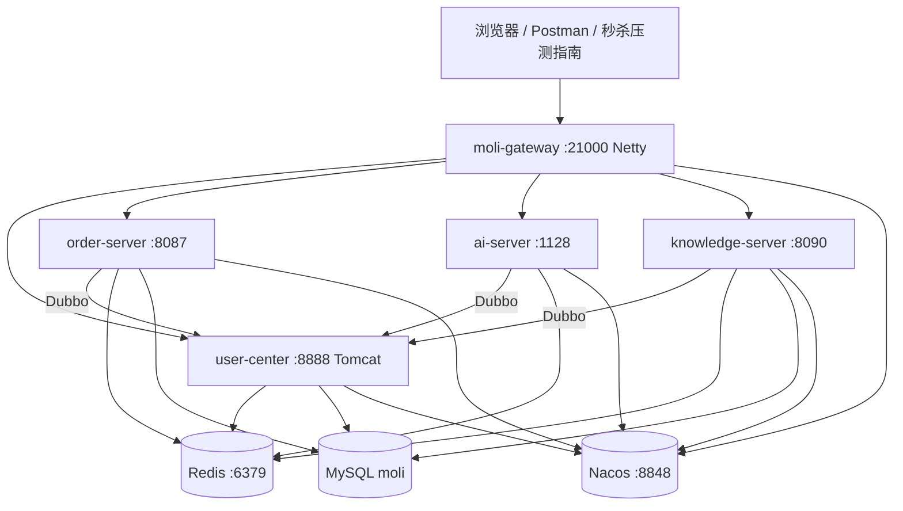

---

title: 茉莉微服务全链路一张图
slug: 茉莉微服务全链路一张图
type: output
status: active
tags: [架构, 全链路, 综合, P0]
query: 茉莉微服务从浏览器到数据库的完整调用链是什么？
source_pages: [服务调用与架构, 项目文档总览, 项目文档总览, 项目文档总览, 项目文档总览, spring-cloud-gateway, dubbo-与-nacos, 项目文档总览, 项目文档总览]
sources:
  - wiki-moli/concepts/服务调用与架构.md
  - wiki-moli/guides/本地启动指南.md
  - wiki-moli/guides/登录与鉴权指南.md
  - wiki-moli/concepts/认证与会话机制.md
  - wiki-moli/develop/网关.md
related: [服务调用与架构, 项目文档总览, 茉莉登录与鉴权故障根因汇总, 秒杀全链路与压测要点汇总]
created: 2026-06-22
updated: 2026-06-22
---

# 茉莉微服务全链路一张图

> **Query crystallize**：综合 [[服务调用与架构]]、[[项目文档总览]]、[[项目文档总览]]、[[项目文档总览]] 等。细节以各源页为准。

## 1. 逻辑架构

## 2. 一次登录 + 调订单（Happy Path）

| 步 | 动作 | 技术点 |
|----|------|--------|
| 1 | `POST /UserCenter/login` | 经 [[项目文档总览]] StripPrefix → [[项目文档总览]] |
| 2 | Shiro 校验密码 | SHA-256×15 [[项目文档总览]] |
| 3 | Session 写 Redis | `shiro:session:login_token_*` |
| 4 | 返回 token | Header `Authorization` [[项目文档总览]] |
| 5 | `GET /OrderServer/order/...` + token | Gateway → [[项目文档总览]] |
| 6 | Starter 读 Redis Session | 同 database [[茉莉登录与鉴权故障根因汇总]] |
| 7 | Dubbo `getUserById` | [[茉莉-dubbo-group版本]] |
| 8 | `@RequiresPermissions` | RBAC [[项目文档总览]] |

## 3. 秒杀热路径（简）

见 [[秒杀全链路与压测要点汇总]]：`/OrderServer/seckill/order` → Redis Lua → 队列 → MySQL。

## 4. 基础设施依赖

| 依赖 | 作用 | 未起症状 |
|------|------|----------|
| Nacos | 注册 + Dubbo | No provider [[项目文档总览]] |
| Redis | Session | 登录 500 / 401 |
| MySQL | 业务数据 | 连接失败 [[项目文档总览]] |

## 5. 启动顺序

[[项目文档总览]]：Nacos → MySQL → Redis → user-center → order/bi/knowledge → **gateway 最后**。

## 6. 鉴权边界

- Gateway：**不验 token**，只转发头 [[网关]]
- 各业务服务：**Shiro authc** + Dubbo 复核

## 7. 双轨知识库

| 轨 | 位置 | 说明 |
|----|------|------|
| markdown wiki | `kb/wiki-moli/` | Agent 维护 [[知识库三操作]] |
| Java API | [[项目文档总览]] :8090 | sync 后 Web 展示 |

## 8. 源页

[[服务调用与架构]] · [[项目文档总览]] · [[项目文档总览]] · [[项目文档总览]] · [[项目文档总览]] · [[项目文档总览]]
