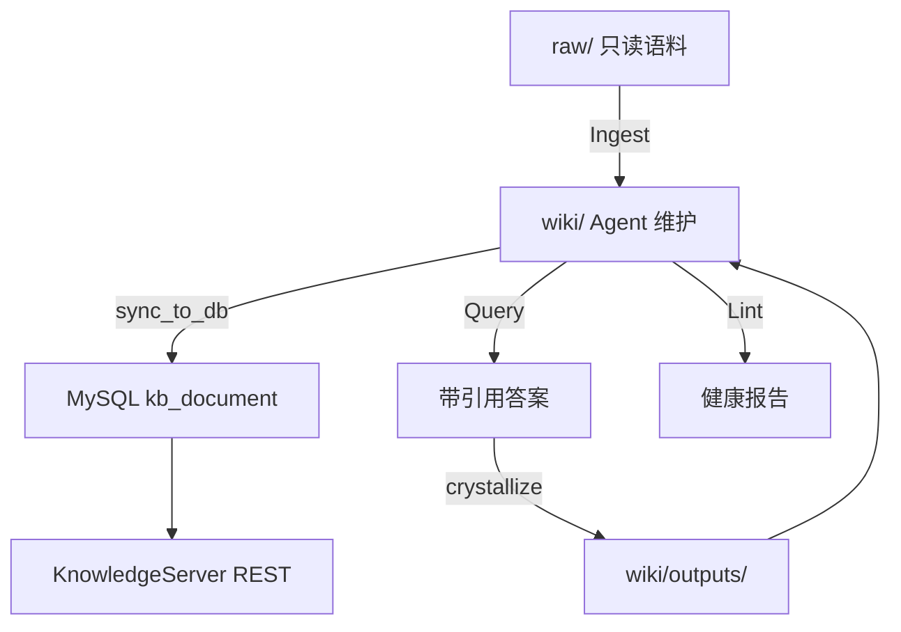

# 知识库三操作

> 操作细则：`moli-knowledge/kb/AGENTS.md`。Java 后端 [[知识库服务]]；人类入口 [[知识库使用指南]]。

茉莉企业知识库的核心契约：**markdown wiki 为权威源**，通过三种操作闭环维护。设计背景与业界对比见 [[知识库设计哲学-docs-as-code]]。

## 1. 架构一览

> 可编辑源文件：[moli-kb-functional-flows.drawio](../../../../docs/diagrams/moli-kb-functional-flows.drawio)

Mermaid 备查

| 目录 | 角色 |
|------|------|
| `kb/raw/` | 原始笔记，**只读** |
| `kb/wiki/` | 结构化知识页（**唯一可写内容区**） |
| `kb/wiki/graph/edges.jsonl` | 显式关系边（append-only） |
| `kb/tools/` | sync / serve 脚本 |

## 2. Ingest（提炼入库）

**目标**：把 `raw/` 或项目文档蒸馏为 5–10 页/批的互链 wiki。

流程摘要：

1. 读 `AGENTS.md` + `wiki/index.md`
2. 定主题簇，去重合并
3. 写 `guides/`、`services/`、`concepts/`、`articles/`、`interview/`（带 YAML frontmatter + `[[slug]]`）
4. 更新 `index.md`、append `log.md`、`edges.jsonl`
5. **只改 `wiki/**`**，不动 `raw/`

P0 优先：`guides/`（怎么操作）+ `services/`（微服务实体）。

详细 sync 见 [[wiki同步指南]]。

## 3. Query（向知识库提问）

**目标**：在作用域内检索，**带 `[[slug]]` 引用**作答，不编造。

关键步骤：

1. **定作用域**（type/tags 过滤）——见 [[查询与体检指南]]
2. 读 index，选 ≤15 页
3. 沿双链 / edges 扩展
4. 无据则明说缺口 + 建议 ingest 源

**Crystallize**：多页综合出新洞见时，建议写 `wiki/outputs/{slug}.md`，更新 index/log，加 `derived_from` 边。操作闭环见 [[AI自我进化与MD审校流程]] §2.2。

入口：

- 本地：`python kb/tools/serve.py`
- 生产：`POST /kb/ask`（[[知识库使用指南]]）

## 4. Lint（健康检查）

**目标**：发现矛盾、断链、孤儿、缺来源，**只报告**。

| 检查 | 说明 |
|------|------|
| 断链 | `[[slug]]` 无对应文件 |
| 孤儿页 | 无入链（meta 页除外） |
| 缺来源 | `sources:` 为空 |
| 矛盾/过时 | 人工 + `supersedes` 边 |

入口：Viewer `/api/lint` 或 `GET /kb/lint`。修复 wiki 需用户确认。

## 5. 页类型约定

| type | 目录 | 用途 |
|------|------|------|
| guide | guides/ | P0 操作指导 |
| service | services/ | 微服务实体 |
| concept | concepts/ | 主题枢纽 |
| article | articles/ | 技术沉淀 |
| interview | interview/ | 面试题 |
| output | outputs/ | Query 回写 |

同主题跨类型：**不同目录可同名 slug  stem**（如 `spring-事务` 在 interview），用 concept 枢纽 + `relates_to` 互链。

## 6. 与 DB / API 的关系

- wiki 是编辑权威；`sync_to_db.py` 单向灌入 `kb_document` / `kb_relation`
- 前端浏览、搜索、图谱走 [[知识库服务]] REST
- ACL / 空间：`enterprise-kb` 默认演示空间

## 7. 演进路线

| 条件 | 动作 |
|------|------|
| 页 > 数百 | 加 BM25+向量检索 |
| 多人隔离 | Query ACL |
| 对外 Web | sync + API（已具备基础） |
| 图谱可视化 | `edges.jsonl` + `/kb/graph` |

原则：**三操作跑扎实后再加重武器**。
