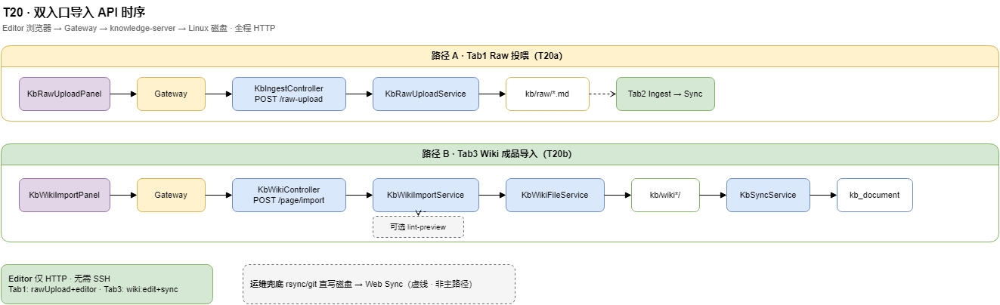

---


title: 知识库 · 双入口导入（T20 技术设计）
slug: 知识库双入口导入设计
type: concept
status: active
tags: [设计, 概要设计, 架构]
sources:
  - docs/design/kb-import-entry-design.md
related:
  - 知识库模块-概要设计
  - Ingest工作台产品方案
  - 技术方案与架构索引
created: 2026-07-06
updated: 2026-07-09
---

> **浏览镜像**：工程契约权威仍在 `docs/design/kb-import-entry-design.md`；改设计请先改契约再重新运行本脚本或 Tab3 导入。

> **状态**：design · 2026-07-06  
> **产品 PRD**：`docs/product/knowledge-import-entry-prd.md`  
> **流程图**：`docs/diagrams/moli-kb-import-entry.drawio` · `docs/diagrams/moli-kb-import-entry-api.drawio`  
> **API 契约（实现时补章）**：`docs/api/KNOWLEDGE_API.md` §8.5 / §9.10  
> **任务跟踪**：`moli-knowledge/TASKS.md` **T20**

---

## 1. 背景与目标

### 1.1 现状（2026-07-06）

| 能力 | 后端 | 前端 | 缺口 |
|------|------|------|------|
| raw 目录树（只读） | ✅ `GET /kb/ingest/raw-tree` | ✅ Ingest Tab2 | — |
| Ingest Plan / commit / Sync | ✅ T15+T18 | ✅ 部分 | — |
| Wiki 单篇编辑写盘 | ✅ `PUT /kb/wiki/page` | ✅ Wiki 编辑 | 无批量/向导 |
| **Web 上传 raw** | ❌ 待 T20a | ❌ | **目标**：Tab1 浏览器上传 → 服务写 Linux 磁盘 `kb/raw/` |
| **Web 成品 wiki 导入** | ❌ 待 T20b | ❌ | **目标**：Tab3 浏览器上传 → 直写 `kb/wiki*/` + Sync |
| 文档管理「新建」 | ✅ PUT（T14） | ⚠️ T14e 未全量部署 | 与 Tab3 复用落盘规则 |

用户心智与 PRD 一致：**两条正路**——待加工走 raw + Ingest；终稿 md 直写 wiki + Sync。

### 1.2 设计目标

1. 在 **Ingest 工作台** 扩展三 Tab，**不新增一级菜单**。
2. **Tab1（T20a）**：Web 把 md/txt 投喂到 `kb/raw/{prefix}/`，Tab2 可见、可 Ingest。
3. **Tab3（T20b）**：Web 把成品 md 写到 `kb/{wikiDir}/{dir_slug}/{slug}.md`，可选 lint + Sync。
4. **铁律不变**：禁止 Web 直写 `kb_document`；raw 只追加、不改 wiki 正文；MinIO 仍为页附件旁路。

### 1.3 非目标（与 PRD 对齐）

| 非目标 | 说明 |
|--------|------|
| pdf/docx → 正文 | Tab3 仅 `.md`；pdf 走 Sync 后 Wiki 编辑页 MinIO |
| 导入包内插图自动回迁 | MVP 只写 md 文本；含 `![](` 相对路径时 lint 告警，T22 `.assets` 批量复制放 P1 |
| 替代 Agent 厚 Ingest | CLI/Cursor 批量仍保留 |
| zip raw 投喂 | P1（T20c） |
| **SSH / SFTP / rsync 直写磁盘** | **运维域**（`docs/ops/`、`deploy/`）；**不属于 T20 用户功能**，Editor 操作手册不写 |

### 1.4 Editor 路径 vs 运维兜底（必读）

项目**已部署在 Linux 服务器**上时，业务 **Editor 全程浏览器**，**不需要、也不应要求 SSH**。

| 角色 | 常规路径（T20 上线后） | 是否需要 SSH |
|------|------------------------|--------------|
| **Editor** | Ingest 工作台 Tab1 上传 raw → Tab2 Ingest → Sync | **否** |
| **Editor** | Tab3 上传成品 md → 默认 Sync | **否** |
| **Editor** | Wiki 编辑页改单篇 → 保存并 Sync | **否** |
| **运维 / CI** | 批量迁移：`git pull` / `rsync` / SFTP 直写 `kb/raw` 或 `kb/wiki*` → Web 刷新 raw 树或 Sync | 可选（非 Editor 流程） |

**T20 实现前缺口**：Tab1/Tab3 未上线，Editor 暂时只能用 Wiki 编辑（单篇）或 Ingest Tab2（前提是 raw **已在服务器磁盘**——可能来自 Git 部署或运维一次性导入）。这不是「Linux 部署就要 SSH」，而是 **Web 上传功能尚未交付**。

**文档与海图约定**：主流程画 **Web 上传**；运维直写磁盘仅作**虚线兜底**，不得写进 Editor 操作手册正文。

---

## 2. 架构决策

### 2.1 模块归属

<details>
<summary>ASCII 备查</summary>

```
meiling-ui  知识库 → Ingest 工作台（三 Tab）
       │
       ├── Tab1  POST /kb/ingest/raw-upload
       ├── Tab2  现有 /kb/ingest/*（不变）
       └── Tab3  POST /kb/wiki/page/import
       ▼
moli-knowledge-server :8090
  KbRawUploadService          ← 新增（T20a）
  KbWikiImportService         ← 新增（T20b）
  KbWikiFileService           ← 复用 writePage（T14）
  KbSyncService               ← 复用 trigger（T3）
       │
       ├── 磁盘 kb/raw/        ← kb.ingest.raw-root
       └── 磁盘 kb/wiki*/      ← kb.wiki.root + space-dirs
       ▼
sync_to_db.py / POST /kb/sync/trigger → MySQL kb_document (source=kb)
```

</details>

**理由**：上传 raw 与 Ingest job 同域（`KbIngestController`）；成品导入与 wiki 写盘同域（`KbWikiController`）。不新开微服务、不新表（上传日志可选 P2 写 `kb_sync_log` 扩展）。

### 2.2 与 Docs-as-Code 契约

| 操作 | 真相源 | DB |
|------|--------|-----|
| Tab1 raw-upload | `kb/raw/` 新文件 | 无 |
| Tab2 Ingest commit | `kb/wiki*/` + index/log/edges | commit 后可选 Sync |
| Tab3 wiki import | `kb/wiki*/` 直接写 md | import 后可选 Sync |
| 直写 `POST /kb/document` | **禁止**（已实现 reject） | — |

Sync 方向仍为 **wiki → DB 单向**；导入成功后必须 Sync（或默认勾选）方可在文档管理/搜索可见。

### 2.3 流程总览（已有）


> 可编辑源文件：[moli-kb-import-entry.drawio](../../../../docs/diagrams/moli-kb-import-entry.drawio)

### 2.4 API 时序（实现参考）



> 可编辑源文件：[moli-kb-import-entry-api.drawio](../../../../docs/diagrams/moli-kb-import-entry-api.drawio)

---

## 3. T20a · Raw 投喂（Tab1）

### 3.1 接口

| 方法 | 路径 | 说明 | 阶段 |
|------|------|------|------|
| POST | `/kb/ingest/raw-upload` | multipart：`prefix` + 一个或多个 `file` | **P0** |
| POST | `/kb/ingest/raw-upload/zip` | multipart：`prefix` + `file`(.zip)，服务端解压 | P1 |
| GET | `/kb/ingest/raw-tree` | 已有；上传后前端刷新 | 已有 |
| GET | `/kb/ingest/raw-prefixes` | **可选** 列出 raw 下已有一级 prefix，供下拉 | P1 |

#### `POST /kb/ingest/raw-upload`

**Form 字段**

| 字段 | 必填 | 说明 |
|------|------|------|
| `prefix` | 是 | 相对 raw 根的子路径，如 `test-walkthrough`、`design/foo` |
| `file` | 是 | 可重复字段名上传多文件 |
| `onConflict` | 否 | `SKIP`（默认）/ `OVERWRITE` / `RENAME` |

**响应** `RawUploadResultVo`

```json
{
  "uploaded": [
    { "path": "test-walkthrough/demo.md", "size": 1024, "overwritten": false }
  ],
  "skipped": [
    { "path": "test-walkthrough/exists.md", "reason": "ALREADY_EXISTS" }
  ],
  "renamed": [
    { "path": "test-walkthrough/demo-1.md", "originalName": "demo.md" }
  ]
}
```

`path` 均为 **相对 `kb/raw/` 的路径**（不含 `raw/` 前缀），与 Ingest `rawPaths` 一致。

### 3.2 服务设计 · `KbRawUploadService`

| 职责 | 说明 |
|------|------|
| 根路径解析 | `Paths.get(rawRoot).normalize()`；相对路径基于 `user.dir`（与 `KbIngestServiceImpl.rawTree` 一致） |
| prefix 规范化 | trim、`/`→统一、去首尾 `/`、禁止 `..`、禁止绝对路径、禁止 `:`（Windows） |
| 文件名白名单 | 扩展名 `.md` `.markdown` `.txt`；`.note.md` 视为 `.md` |
| 大小限制 | 单文件 ≤ `kb.ingest.raw-upload-max-bytes`（默认 5MB，可配置） |
| 写入 | `Files.createDirectories(parent)` + `Files.write` / `COPY` |
| RENAME | `{stem}-{n}{ext}` 递增直到不存在 |
| 审计 | `log.info("[raw-upload] user={} path={} size={}", …)` |

**禁止**

- 目标路径落在 `rawRoot` 外（`file.normalize().startsWith(rawRoot)`）
- 目标路径落在任一 **wiki 目录** 下（防误配 prefix=`../wiki`）
- 空文件、零字节 zip（P1）

### 3.3 配置 · `KbIngestProperties` 扩展

```yaml
kb:
  ingest:
    raw-root: ${KB_RAW_ROOT:...}   # 已有语义；生产指向 .../kb/raw
    raw-upload-max-bytes: 5242880  # 5MB
    raw-upload-max-files: 20       # 单次请求最多文件数
```

### 3.4 权限

| 断言 | 条件 |
|------|------|
| `kbAclService.assertCanEdit(spaceId)` | 请求体带 `spaceId`（与 Ingest 批次一致；raw 全局目录但 ACL 按空间） |
| Shiro `@RequiresPermissions("kb:ingest:rawUpload")` | 新动作，挂菜单 906 |

> **说明**：raw 目录物理上两空间共享；ACL 仍绑定「当前 Ingest 工作台所选空间」的 editor，与 Tab2 一致。平台超管 bypass。

### 3.5 与 Ingest 的关系

- Tab1 **不**创建 `kb_ingest_job`、**不**触发 LLM、**不**触发 raw 覆盖门禁（门禁仅在 **commit** 时检查 wiki `sources`）。
- 上传成功后前端：**切 Tab2** + `raw-tree` 展开 `prefix` + 勾选刚上传的 `rawPaths`（query/state 传递）。

---

## 4. T20b · Wiki 成品导入（Tab3）

### 4.1 接口

| 方法 | 路径 | 说明 | 阶段 |
|------|------|------|------|
| POST | `/kb/wiki/page/import` | multipart 单文件导入 | **P0** |
| POST | `/kb/wiki/page/import/batch` | 多文件 + 统一或逐条 meta | P1 |
| PUT | `/kb/wiki/page` | 已有；MVP 前端也可读文本后 PUT | 已有 |
| POST | `/kb/wiki/page/lint-preview` | 已有；import 可选调用 | 已有 |
| POST | `/kb/sync/trigger` | 已有；`sync=true` 时调用 | 已有 |

#### `POST /kb/wiki/page/import`

**Form 字段**

| 字段 | 必填 | 说明 |
|------|------|------|
| `spaceId` | 是 | 目标空间 |
| `categoryId` | 是 | 对应 `kb_category.id`；落盘 `{dir_slug}/{slug}.md` |
| `file` | 是 | 单个 `.md` |
| `slug` | 否 | 裸 slug（无分类前缀）；默认文件名 stem |
| `title` | 否 | 覆盖 frontmatter title；默认从 fm 或 H1 |
| `onConflict` | 否 | `FAIL`（默认）/ `OVERWRITE` |
| `lintPreview` | 否 | `true` 时返回 warn 列表，不阻塞 |
| `sync` | 否 | `true`（**默认 true**）时 import 后 trigger Sync |

**响应** `WikiImportResultVo`

```json
{
  "slug": "ops/运维手册",
  "spaceId": 900000000000000003,
  "relativePath": "wiki-moli/ops/运维手册.md",
  "created": true,
  "contentHash": "abc…",
  "lintWarnings": [],
  "sync": {
    "triggered": true,
    "success": true,
    "documentId": 900123
  },
  "nextSteps": [
    { "code": "wiki_govern_lint", "label": "建议运行 Wiki 治理 Lint" }
  ]
}
```

### 4.2 服务设计 · `KbWikiImportService`

**处理流水线**

```
1. assertCanEdit(spaceId)
2. 读 multipart → UTF-8 文本；校验扩展名 .md
3. categoryId → KbCategory.dir_slug（必填非空）
4. bareSlug = normalizeSlug(request.slug ?? filenameStem)
5. fullSlug = dir_slug + "/" + bareSlug
6. onConflict=FAIL 且 wiki 文件已存在 → 409
7. frontmatter 解析 / 补全（见 §4.3）
8. kbWikiFileService.writePage(WikiSaveRequest)
9. lintPreview? → kbWikiAiReviseService.previewLint（可选）
10. sync? → kbSyncService.trigger(spaceId) → 查 documentId by (spaceId, slug)
11. 组装 nextSteps（复用 Ingest publish 同款枚举）
```

**落盘路径**（与 T17 / sync 一致）

| space_code | wikiDir | 示例 fullSlug | 磁盘路径 |
|------------|---------|---------------|----------|
| `enterprise-kb` | `wiki` | `bigdata/hbase-入门` | `kb/wiki/bigdata/hbase-入门.md` |
| `moli-ops-manual` | `wiki-moli` | `ops/运维手册` | `kb/wiki-moli/ops/运维手册.md` |
| `moli-ops-manual` | `wiki-moli` | `develop/用户中心` | `kb/wiki-moli/develop/用户中心.md` |

配置：`kb.wiki.root` + `kb.wiki.space-dirs`（生产 `KB_WIKI_ROOT=/opt/.../kb`）。

### 4.3 Frontmatter 补全规则

复用 `sync_to_db.parse_frontmatter` 语义（Java 侧实现或调 Python 子集）：

| 字段 | 规则 |
|------|------|
| `title` | 请求 > 已有 fm > 首个 `# H1` > slug |
| `slug` | **bareSlug**（fm 内 slug 若含 `/` 则警告并覆盖为 bare） |
| `type` | category.default_type > 已有 fm > `guide` |
| `status` | `active` |
| `tags` | 保留 fm；无则 `[]` |
| `sources` | 成品导入写 `[web-import:{originalFileName}]` 或空数组 |
| `created` / `updated` | 新建用今天；覆盖保留 created、更新 updated |
| `related` | 保留 fm |

正文：保留用户 md body（去重 fm 块后写回完整文件）。

### 4.4 插图与 T22 边界（MVP）

| 情况 | MVP 行为 | 后续 P1 |
|------|----------|---------|
| md 内 `` | 允许；Web 浏览依赖 T22 F1 | — |
| md 内 `` 相对路径 | lint-preview **WARN**；不自动复制 | zip 附带 `.assets/` 一并 import |
| md 内 `/kb/raw/asset?path=…` | 允许（D 档）；需 EC2 raw 图包 | 与 T22 运维一致 |

Tab3 UI 需提示：**含本地相对插图时，Sync 后图可能空白，请用 Wiki 编辑上传或 T22 资产包**。

### 4.5 批量导入（P1 · T20c）

`POST /kb/wiki/page/import/batch`：

- multipart：`spaceId` + 多 `file` + 可选 JSON `items[]`（每文件 `categoryId`/`slug`/`title`）
- 事务：**逐文件写盘**；任一 FAIL 不 rollback 已写（返回 partial `imported` + `failed`）
- Sync：**整批完成后一次** `trigger`（避免 N 次全量 sync）

### 4.6 权限

| 动作 | perm |
|------|------|
| import / batch | `kb:wiki:edit` + 空间 editor |
| sync | `kb:sync:trigger`（import 内嵌调用时一并校验） |

---

## 5. 前端设计（meiling-ui · T20f）

### 5.1 页面结构

扩展 `KnowledgeIngestWorkbenchView.vue`：

```text
┌─ Ingest 工作台 ─────────────────────────────────────────┐
│ [决策树折叠说明 §PRD 3.2]                                │
│ Tab: [投喂 Raw] [选源入库] [成品导入]                     │
├─────────────────────────────────────────────────────────┤
│ Tab1: KbRawUploadPanel                                   │
│ Tab2: 现有 Ingest UI（不变）                              │
│ Tab3: KbWikiImportPanel                                  │
└─────────────────────────────────────────────────────────┘
```

### 5.2 Tab1 · `KbRawUploadPanel`

| 元素 | 行为 |
|------|------|
| 空间选择 | 与 Tab2 共享 state |
| prefix | 下拉（已有 prefix 列表）+ 输入新建 |
| 文件 | drag-drop / 多选；仅 md/txt |
| 冲突策略 | 单选 SKIP/OVERWRITE/RENAME |
| 上传 | `POST raw-upload` → 结果表 |
| CTA | 「去选源入库」→ `$emit('switch-tab', 'ingest', { highlightRawPaths })` |

### 5.3 Tab3 · `KbWikiImportPanel`

| 步 | UI |
|----|-----|
| 1 | 空间 + 分类（`GET /kb/category/tree?spaceId=`） |
| 2 | 选文件（单 md P0） |
| 3 | 表格：文件名 / slug / title（可编辑） |
| 4 | 预览路径 `{dir_slug}/{slug}.md` |
| 5 | 勾选「导入后 Sync」（默认开）、「lint 预检」 |
| 6 | 确认 → import → Toast + nextSteps 卡片 |

与 **文档管理 T14e 新建** 共用：`categoryId` 选择组件、`frontmatter` 模板常量（`src/constants/kbWikiTemplate.ts` 建议）。

### 5.4 API 封装

| 文件 | 新增 |
|------|------|
| `src/api/knowledge/kbIngest.ts` | `uploadRaw(prefix, files, onConflict)` |
| `src/api/knowledge/kbWiki.ts` | `importWikiPage(formData)`、`importWikiBatch` |

### 5.5 i18n

`knowledge.ingest.tabRawUpload` / `tabWikiImport` / `import.*`（zh/en/ja），与 `knowledge.ingest.*` 并列。

---

## 6. 权限与 SQL

### 6.1 新权限动作

| perm_code | 名称 | 挂菜单 |
|-----------|------|--------|
| `kb:ingest:rawUpload` | Raw 投喂上传 | 906 Ingest 工作台 |

DDL 草案：`docs/sql/16_kb_import_entry_menu.sql`（`15` 已被 category 脚本占用）

```sql
INSERT INTO sys_action (perm_code, module, action_code, action_name, menu_id, sort, status) VALUES
('kb:ingest:rawUpload', 'kb', 'ingestRawUpload', 'Raw投喂上传', 906, 3, 1);
-- 角色 2/3 editor 授权；平台超管已有 *
```

`kb:wiki:edit`、`kb:sync:trigger` **不新增**（Tab3 复用）。

### 6.2 菜单文案（可选）

Ingest 工作台菜单 description 增加「投喂 · 入库 · 成品导入」；路由仍 `knowledge/ingest/index`。

---

## 7. 安全与运维

### 7.1 路径安全（两入口共用原则）

| 检查 | raw-upload | wiki-import |
|------|------------|-------------|
| `..` 拒绝 | prefix + 文件名 | slug + dir_slug |
| 越权目录 | 必须在 `rawRoot` 下 | 必须在 `wikiDir` 下 |
| 符号链接 | 写入前 `toRealPath` 再校验前缀（P0 可选；P1 强制） | 同左 |
| 扩展名 | 白名单 | 仅 `.md` |

### 7.2 生产环境（Linux 已部署）

| 变量 | 用途 |
|------|------|
| `KB_WIKI_ROOT` | `kb.wiki.root`（如 `/opt/.../moli-knowledge/kb`） |
| `kb.ingest.raw-root` | raw 投喂目标（建议 `.../kb/raw`） |
| 磁盘配额 | 运维监控 `kb/raw`、`kb/wiki*` |

**Editor 上传链路**：浏览器 → 网关 `KnowledgeServer` → `knowledge-server` **进程内写同机磁盘**（与 SSH 无关）。

Web 上传 **不自动 commit Git**；运维若用 `git pull` 部署，需约定：线上 Editor 导入的内容纳入备份或定期回灌仓库。

### 7.3 运维兜底（非 Editor 常规）

| 场景 | 做法 |
|------|------|
| 首批 bulk 语料进库 | 运维 `rsync`/发布脚本写入 `kb/raw` 或 `kb/wiki*` → Editor 用 Tab2/ Sync |
| CI 从 Git 带出 raw/wiki | 部署后 Editor 直接 Ingest / Sync，无需 SSH |
| T20 未上线临时应急 | 运维直写磁盘（**不**写进 Editor SOP） |

### 7.4 失败与幂等

| 场景 | 行为 |
|------|------|
| 上传一半失败 | 返回 partial；已成功文件保留 |
| import + sync 失败 | md 已写盘；响应 `sync.success=false`；用户可手动 Sync |
| 重复 import 同 slug | 默认 409；可选 OVERWRITE |

---

## 8. 分期与验收

### 8.1 分期

| 阶段 | 后端 | 前端 | 验收 |
|------|------|------|------|
| **T20a P0** | `raw-upload` + 单测 | Tab1 + 跳 Tab2 | 上传 md → Tab2 可见 → 模板 Ingest → Sync → 浏览 |
| **T20b P0** | `page/import` + frontmatter | Tab3 单文件 | 成品 md 进 wiki、不进 raw → Sync → 搜索可见 |
| **T20c P1** | zip raw、import/batch | Tab1 zip、Tab3 多文件 | 10 篇 ≤1 次 Sync |
| **T20d P1** | SQL 权限、nextSteps 对齐 | 决策树文案、权限隐藏 | editor 无 rawUpload 时 Tab1 只读提示 |
| **T20e P2** | import 附带 `assetsZip` | Tab3 资产包 | ✅ 后端 · 🔵 UI |

### 8.2 测试要点

| 用例 | 预期 |
|------|------|
| raw-upload `prefix=../../wiki` | 400 |
| Tab3 上传 `.pdf` | 400 + 文案指向 Tab1/附件 |
| import 后不 Sync | 磁盘有文件；search 可能无/旧 |
| enterprise-kb + category bigdata | 文件在 `kb/wiki/bigdata/{slug}.md` |
| 权限：无 rawUpload | 403 |

自动化：`KbRawUploadServiceTest`、`KbWikiImportServiceTest`（Mock 磁盘 temp dir）；Controller 集成测各 1 条 happy path。

---

## 9. 实现清单（开发拆单）

### 9.1 后端（moli-knowledge-server）

| 序号 | 任务 |
|------|------|
| B1 | `KbRawUploadService` + `RawUploadResultVo` + 路径工具 `KbPathSafety`（可抽 util） |
| B2 | `KbIngestController` 增加 `POST /raw-upload` |
| B3 | `KbWikiImportService` + `WikiImportResultVo` + frontmatter 补全 |
| B4 | `KbWikiController` 增加 `POST /page/import` |
| B5 | `KbIngestProperties` 扩展 + `application-dev.yml` 样例 |
| B6 | 单测 + Swagger 注解 |
| B7 | P1：`/raw-upload/zip`、`/page/import/batch` |

### 9.2 前端（meiling-ui）

| 序号 | 任务 |
|------|------|
| F1 | 三 Tab 容器 + 决策树说明 |
| F2 | `KbRawUploadPanel` + Tab2 高亮联动 |
| F3 | `KbWikiImportPanel` + nextSteps |
| F4 | API + i18n + 权限 v-if |
| F5 | 文档管理「新建文档」与 Tab3 组件复用（T14e 补齐） |

### 9.3 文档（实现 PR 一并）

| 交付 | 路径 |
|------|------|
| API §8.8 / §9.10 | `docs/api/KNOWLEDGE_API.md` |
| 前端对接 §T20 | `docs/api/kb-import-entry-frontend.md` · `docs/api/ingest-workbench-frontend.md` §0 |
| 操作手册 §2.6–2.7 | `docs/ops/knowledge-workbench-operations.md` |
| 菜单 SQL | `docs/sql/16_kb_import_entry_menu.sql` |
| TASKS.md | T20 子任务勾选 |

---

## 10. 相关文档

| 文档 | 关系 |
|------|------|
| `docs/product/knowledge-import-entry-prd.md` | 产品需求来源 |
| `moli-knowledge/kb/wiki-moli/develop/知识库设计哲学-docs-as-code.md` | 双轨铁律 |
| `moli-knowledge/kb/wiki-moli/develop/Ingest工作台产品方案.md` | Tab2 不变 |
| `moli-knowledge/kb/wiki-moli/develop/Wiki在线编辑与AI协助改稿.md` | PUT / Sync / T14e |
| `docs/product/wujinsen-wiki-image-remediation-prd.md` | T20e 插图 |
| `docs/ops/knowledge-workbench-operations.md` | 运维替代路径（至 T20 上线前仍有效） |

---

## 11. 变更记录

| 日期 | 说明 |
|------|------|
| 2026-07-06 | §1.4 Editor 全程浏览器、SSH 仅运维兜底；海图去掉 Editor 主路径上的 Git/SFTP |
| 2026-07-06 | 初稿：T20a/b API、服务拆分、前后端、权限、分期与实现清单 |