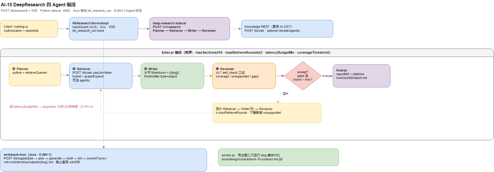

# DeepResearch 调研指南

> **AI-10 · M4 收官能力**：基于知识库的多 Agent 调研报告（Planner → Retriever → Writer → Reviewer），结论带 `[[slug]]`，可选经 Ingest 回写 `develop/outputs/`。  
> 基础问答仍用 [[知识库使用指南]] 的 `/kb/ask`；DeepResearch **不替代**单轮问答。

## 1. 架构与边界



> 可编辑源文件：`docs/diagrams/moli-kb-deep-research.drawio`

| 组件 | 职责 |
|------|------|
| **Java 薄壳** | `POST /kb/research` · SSE `GET /kb/research/{runId}/stream` · ACL 透传 |
| **Python sidecar** | `moli-knowledge/deep-research/`（默认 `:8095`）· 四 Agent 编排 |
| **检索** | 复用 `POST /kb/ask`（`useLlm=false`）· 可选 Agentic / GraphRAG |
| **产物** | Markdown 报告 + citations；`writeback=true` 时走 Ingest → `wiki-moli/develop/outputs/{slug}.md` |

**铁律（D-INV-1）**：报告**只经 Ingest commit 落盘**，禁止直写 `kb_document` 或手工改 DB。

**默认关（D-INV-5）**：`kb.research.enabled=false`；未开启时不影响 `/kb/ask` 与 `/kb/ask/agentic`。

## 2. 本地启动

前置：[[本地启动指南]] 中 user-center + knowledge-server + MySQL/Redis；Hybrid 检索需 kb-retrieval sidecar（`:8091`）。

```powershell
# Terminal 1 · sidecar
cd moli-knowledge/deep-research
pip install -r requirements.txt
uvicorn deep_research.main:app --host 127.0.0.1 --port 8095

# Terminal 2 · 开启 DeepResearch（application-dev.yml 或环境变量）
# kb.research.enabled: true
# kb.research.sidecar-base-url: http://127.0.0.1:8095
cd moli-knowledge/moli-knowledge-server
mvn spring-boot:run -Dspring-boot.run.profiles=dev
```

SQL：`docs/sql/36_kb_research_run.sql`（trace 表 `kb_research_run`）。

## 3. 调用方式

鉴权同 [[知识库使用指南]]：`Authorization: <login token>`。

### 3.1 启动 + SSE 进度

```powershell
$login = Invoke-RestMethod -Method POST -Uri "http://127.0.0.1:8888/login" `
  -ContentType "application/json" -Body '{"username":"admin","password":"123456"}'
$h = @{ Authorization = $login.data.token }

$body = '{"topic":"茉莉微服务架构","spaceId":900000000000000003,"writeback":false}'
$start = Invoke-RestMethod -Method POST -Uri "http://127.0.0.1:8090/kb/research/start" `
  -Headers $h -ContentType "application/json" -Body $body

curl -N -H "Authorization: $($login.data.token)" `
  "http://127.0.0.1:8090/kb/research/$($start.data.runId)/stream"
```

经网关将 `8090` 换为 `21000/KnowledgeServer`。

SSE 事件：`progress`（planner / retriever / writer / reviewer）→ `complete`（含 `reportMd`、`citations`、`coverage`）或 `error`。

### 3.2 轮询结果

`GET /kb/research/{runId}` — 字段语义见工程契约 `docs/api/KNOWLEDGE_API.md` §3 DeepResearch。

### 3.3 回写 wiki（Ingest）

请求体 `"writeback": true`：

1. Java 侧创建 Ingest job → 生成 draft（`type=output`，frontmatter 含 `query` / `source_pages`）
2. lint blocking=0 后 commit
3. 产物路径：`wiki-moli/develop/outputs/{slug}.md`
4. 可选 `kb.research.writeback-auto-sync=true` 触发 Sync

人工审校后再 [[wiki同步指南]]；复杂报告建议走 [[增量ingest与raw投喂指南]] 人工 enrich。

## 4. 配置要点（`kb.research.*`）

| 键 | 默认 | 说明 |
|----|------|------|
| `enabled` | `false` | 总开关 |
| `sidecar-base-url` | `http://127.0.0.1:8095` | Python 服务 |
| `max-sections` | `6` | Planner 节数上限（硬顶 10） |
| `max-retrieve-rounds` | `2` | Reviewer 回补轮（硬顶 3） |
| `latency-budget-ms` | `90000` | 超预算 → `degraded=true`，仍返回大纲+引用摘要 |
| `guardrails` | `true` | 壳侧挂 AI-9 InputGuard（需 `kb.guardrails.enabled=true` 才生效） |
| `writeback-space-id` | moli-ops-manual | Ingest 目标空间 |

## 5. 与相邻能力

| 能力 | 入口 | 何时用 |
|------|------|--------|
| 单轮问答 | `POST /kb/ask` | 快问快答 |
| Agentic RAG | `POST /kb/ask/agentic` | 多跳复杂问（AI-7） |
| DeepResearch | `POST /kb/research` | 多节调研报告 + 可选回写 kb |
| Guardrails | `kb.guardrails.*` | 注入/PII/grounding（AI-9，默认关） |
| MCP | `moli-knowledge/mcp/` | Cursor 内 `kb_ask` / `kb_search`（AI-6） |

## 6. 冒烟与回归

| 场景 | 命令 / 文档 |
|------|-------------|
| Sidecar 单测 | `cd moli-knowledge/deep-research && pytest tests/ -q` |
| CLI 对比 slug 稳定性 | `python smoke.py --topic "茉莉微服务架构"` |
| 手测清单 | `docs/test/knowledge-deep-research-smoke.md` |
| **D-INV-5**（未破坏 `/kb/ask`） | `docs/design/contracts/AI-10-contract.md` §6.1 · `eval_ask.py --strategy ngram --gate-from-baselines` |

## 7. 故障排查

| 现象 | 查 |
|------|-----|
| `503` / sidecar 不可用 | sidecar 是否 `:8095` · `kb.research.enabled` |
| 报告无 `[[slug]]` | 检索 ACL / 空间无内容 · hybrid sidecar 是否起 |
| writeback 失败 | Ingest lint blocking · `kb:ingest:commit` 权限 |
| 超慢 / `degraded=BUDGET` | 调大 `latency-budget-ms` 或减少 `max-sections` |
| Guard 误拦 | `kb.guardrails.enabled` 与 inject 规则 · 见 AI-9 契约 |

工程契约：`docs/design/contracts/AI-10-contract.md` · Sidecar README：`moli-knowledge/deep-research/README.md`
