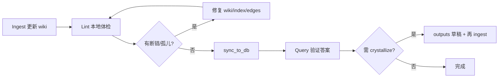

# 查询与体检指南

> 契约总览 [[知识库三操作]]；生产 API 见 [[知识库使用指南]]；wiki→DB 见 [[wiki同步指南]]。

面向「怎么向知识库提问、怎么查健康度」——覆盖 **wiki 文件 Lint（lint.py）**、**Web 健康体检（扫 MySQL）** 与 **本地 Viewer（serve.py）** 三套入口。

> **一句话**：改内容以 **wiki `.md` 为权威**；**`lint.py` 扫磁盘 wiki**（Sync 前门禁）；**Web「健康体检」扫已 Sync 进库的 `kb_document`**（Sync 后工单）。二者互补，不能互相替代。

## 1. 三操作中的 Query / Lint

| 操作 | 目的 | 典型产出 |
|------|------|----------|
| **Query** | 按问题检索 wiki，**带引用**作答 | 回答 + `[[slug]]` 来源 |
| **Lint** | 扫描 wiki 健康度 | 断链 / 孤儿 / 缺来源清单 |

Ingest 负责「raw → wiki」；Query/Lint 负责「wiki → 可用答案 / 质量反馈」。

## 2. 本地 Viewer（开发/编辑首选）

```bash
cd D:\work\moli_project\moli-project-distribute
python moli-knowledge/kb/tools/serve.py
# 默认 http://127.0.0.1:8765
```

五个页签：

| 页签 | 能力 |
|------|------|
| **Query 问答** | 定作用域 → 选页 → LLM 生成式或检索式答案（`/api/ask`） |
| **浏览** | 渲染 wiki + 反向链接（`/api/tree`, `/api/page`） |
| **关系图谱** | 力导向图（`/api/graph`，读 `edges.jsonl`） |
| **体检** | 断链 / 孤儿页 / 缺 `sources`（`/api/lint`） |
| **提炼** | 按 tag 聚类生成枢纽页草稿（需 LLM key） |

### 2.1 启用 LLM（可选）

复制 `kb/tools/llm_config.example.json` → `llm_config.json` 填 key，或设环境变量（如 `DEEPSEEK_API_KEY`）。无 key 时 Query 回退为**检索式高亮**，仍可用。

### 2.2 Query 作用域（与 AGENTS 一致）

提问前先定「搜哪些 type」——等价于元数据预过滤：

| 用户意图 | 优先 type |
|----------|-----------|
| 怎么操作 / 怎么启动 | `guide` + `service` |
| 方案 / 最佳实践 | `article` + `concept` |
| 面试 / 怎么答 | `interview` |
| 显式「不要面试题」 | 跳过 `interview/` |

类型由 frontmatter `type` 决定；可叠加 `tags`（如 `mysql` + `性能优化`）。

### 2.3 Query 作答规范

1. 读 `wiki/index.md`，在作用域内选 **≤15 页**
2. 整页阅读，必要时沿 `[[]]` 与 `edges.jsonl` 扩展
3. **每个关键结论**后跟 `[[slug]]`
4. wiki 无据 → 明说「知识库暂无」，建议 ingest 哪些 raw
5. 若答案综合多页形成新洞见 → 建议 crystallize 到 `wiki/outputs/`（需人工确认）

### 2.4 Lint 检查项

| 级别 | 检查 |
|------|------|
| 断链 | `[[slug]]` 指向不存在的页 |
| 孤儿页 | 无任何入链（index/log 除外） |
| 缺来源 | frontmatter `sources` 为空 |
| 矛盾 / 过时 | 需人工读内容 + `supersedes` 边（Viewer 仅部分自动提示） |

Lint **只报告 + 修复建议**；重写 wiki 需用户确认（见 [[知识库三操作]]）。

### 2.5 命令行体检 `lint.py`（知识治理自动化 · 推荐）

`kb/tools/lint.py` 是**零依赖**的治理 CLI，覆盖 AGENTS §6 全部检查项，且与
`sync_to_db.py` 共用解析口径（体检结论 == 实际入库口径），可本地跑、可进 CI 门禁。

```bash
# 控制台分级报告（全库）
python moli-knowledge/kb/tools/lint.py

# 写 markdown 报告 + 追加一行 log.md（治理留痕）
python moli-knowledge/kb/tools/lint.py --report --log

# 机器可读 JSON
python moli-knowledge/kb/tools/lint.py --json moli-knowledge/kb/lint-report.json

# 近似重复 / related 不对称（较吵，opt-in）
python moli-knowledge/kb/tools/lint.py --dups --related

# CI 门禁：有 ERROR 退出码=1；--strict 时 WARN 也算失败
python moli-knowledge/kb/tools/lint.py --strict
```

检查项按**三级**分类，退出码默认仅被 ERROR 拦截：

| 级别 | kind | 含义 |
|------|------|------|
| ✗ 错误 | `broken_link` | 断链；若目标仅大小写/写法不符会直接给出正确 `[[slug]]` |
| ✗ 错误 | `bad_type` / `missing_title` / `dup_slug` | type 非法 / 缺标题 / 裸名 slug 撞 |
| △ 告警 | `orphan` | 孤儿页（`index*` 目录引用也算入链） |
| △ 告警 | `missing_source` / `missing_dates` | 缺 `sources` / 缺 `created`,`updated` |
| △ 告警 | `missing_concept` | 断链目标被 ≥3 页引用 → 建议建概念页 |
| △ 告警 | `outdated` | 被 `supersedes` 边取代却仍 `status: active` |
| · 参考 | `dup_content` / `near_dup` / `asym_related` | 重复/近似/单向 related（仅 `--dups`/`--related`） |

> 与 Viewer 体检页签的差异：CLI 会**忽略代码块/行内代码里的 `[[..]]` 示例**
> （消除文档页语法示例的误报），并能区分「真缺页」与「大小写写错」。

CI 接入（见 `kb/tools/ci/run_sync.sh`）：

```bash
bash moli-knowledge/kb/tools/ci/run_sync.sh lint          # report-only
bash moli-knowledge/kb/tools/ci/run_sync.sh lint-strict   # 门禁（ERROR 失败）
```

GitHub Actions 的 dry-run job 已挂 `lint`（`continue-on-error`，先观察不拦截）；
待 wiki 断链/孤儿清零后，把该步改为 `lint-strict` 即可升级为硬门禁。

## 3. Web「健康体检」与 wiki / CLI 的区别（必读）

茉莉后台菜单 **知识库 → 健康体检**（`knowledge/lint/index`）**不是**直接读 `kb/wiki*` 目录，而是对 **MySQL 里已 Sync 的文档**做质量扫描。同页 **Wiki 同步** Tab 负责把 wiki 变更写进库。

### 3.1 三种 Lint 入口对照

| 维度 | **`lint.py`（CLI · 推荐门禁）** | **Web 健康体检** | **Viewer `serve.py` 体检页签** |
|------|--------------------------------|------------------|--------------------------------|
| **扫什么** | 磁盘 **`kb/wiki*` 的 `.md`** | **MySQL** `kb_document` 等 | 磁盘 wiki（开发用） |
| **是否读 `.md` 文件** | ✅ 是 | ❌ 否（读库里的 `content` 快照） | ✅ 是 |
| **典型时机** | 改 wiki 后、**Sync 之前** | **Sync 之后** | 本地编辑时 |
| **入口** | `python kb/tools/lint.py` | `GET/POST /kb/lint*` | `http://127.0.0.1:8765` 体检页 |
| **落库** | 可选 `--report` / `--json`；**不写** `kb_lint_issue` | **扫描并落库** → `kb_lint_issue` 工单 | 不落库 |
| **权限** | 本机 / CI | `kb:lint:scan`；Sync 需 `kb:sync:trigger` | 无 |
| **修复闭环** | 改 md → 再 lint | 问题列表 **「修复」** → [[Wiki在线编辑与AI协助改稿]] → 保存 → Sync | 改 md |

### 3.2 Web 健康体检页面做什么

页面两个 Tab（见 `docs/api/KNOWLEDGE_API.md` §4、§7）：

| Tab | 作用 | 主要接口 |
|-----|------|----------|
| **质量体检** | 按空间扫描 **DB** 文档：断链、孤儿页、缺摘要；可 **扫描并落库** 为待处理工单 | `GET /kb/lint`、`POST /kb/lint/scan`、`GET /kb/lint/issues` |
| **Wiki 同步** | 触发 `sync_to_db.py`，把 wiki 目录变更写入 `kb_document` / `kb_relation` | `POST /kb/sync/trigger` |

后端实现：`KbInsightServiceImpl` — `loadDocs()` 查 **`kb_document`**（`is_delete=0`），用库内 `title` / `content` / `summary` 解析 `[[wikilink]]`，**不访问**部署机上的 wiki 文件路径。

### 3.3 Web 体检当前检查项（DB 侧）

| 结果字段 | 含义 | 与 `lint.py` 对比 |
|----------|------|-------------------|
| `broken` | 正文 `[[目标]]` 在库内找不到对应文档（按**标题**索引） | CLI 按 **slug/stem** 解析，规则更细（含大小写纠正） |
| `orphans` | 无任何入链的文档 | CLI 类似，且把 `index.md` 引用算作入链 |
| `noSummary` | `summary` 为空 | CLI **不**单独报此项；会查 frontmatter `sources` 等 |

Web 体检 **暂不**覆盖：`missing_source`、`bad_type`、`dup_slug`、`outdated` 等 —— 这些以 **`lint.py --strict`** 为准。

### 3.4 和 wiki 权威源的关系

```
改 wiki .md（权威）
    → lint.py（可选，Sync 前门禁）
    → Sync（Web「Wiki 同步」或 sync_to_db.py）
    → Web「质量体检」（扫 DB 快照 + 工单）
    → 点「修复」改 wiki → 再 Sync
```

**若只改了 wiki、尚未 Sync**：Web 健康体检仍按**旧库内容**扫描，结果可能与磁盘不一致。  
**若只改了 DB、未改 wiki**：违反 Markdown-first，当前产品**不支持** Web 直写 `kb_document`。

### 3.5 推荐顺序（与 [[AI自我进化与MD审校流程]] 一致）

1. 改 `wiki/**/*.md`
2. **`python kb/tools/lint.py --strict`**（wiki 文件级门禁）
3. 人工 diff / commit
4. **Sync**（Web 或 CLI）
5. **Web 健康体检 → 扫描并落库**（DB 级验收 + `kb_lint_issue` 跟踪）
6. 对工单点 **修复** → Wiki 编辑 / AI 改稿 → 保存 → 再 Sync → 标记问题 **已修复**

> Web 体检 **不能代替** 步骤 2；步骤 2 **不能代替** 步骤 5（未入库的 wiki 变更 DB 体检看不到）。

## 4. Java 后端（经网关）

需 [[登录与鉴权指南]] token + [[知识库服务]] 已启动且 wiki 已 [[wiki同步指南]]。

| 场景 | 方法 | 路径 |
|------|------|------|
| 智能问答 | POST | `/kb/ask` |
| 体检（**扫 DB**，见 §3） | GET | `/kb/lint` |
| 体检落库 | POST | `/kb/lint/scan` |
| 体检工单 | GET | `/kb/lint/issues` |
| 单页 | GET | `/kb/page?slug=` |
| 图谱 | GET | `/kb/graph?mode=&maxNodes=&minDeg=`（大库按度数裁剪+meta） |
| 图谱邻域 | GET | `/kb/graph/ego?docId=&depth=`（点击节点展开） |

`/kb/ask` 请求体示例：

```json
{ "question": "Redis 在茉莉项目里干什么？", "spaceId": null, "topK": 8 }
```

响应 `mode`：`generative` 或 `retrieval`；`citations[]` 的 slug 与 wiki `[[slug]]` 对齐。

## 5. 推荐工作流



1. 批次 Ingest 后跑 **`lint.py --strict`**（§2.5，扫 wiki 文件）
2. 修断链、补 `sources`、更新 index
3. **sync_to_db**（§3.4）
4. **Web 健康体检 · 扫描并落库**（§3，扫 DB 验收）
5. **Query** 验证答案；复杂结果可写 `wiki/outputs/` 并在 `log.md` 记 `query | crystallize`

> **AI 审校单篇 MD 再 Sync** 的逐步说明（Cursor Agent 模板 + `lint.py --strict` 门禁）见 wiki [[AI自我进化与MD审校流程]]（`moli-knowledge/kb/wiki/guides/AI自我进化与MD审校流程.md`）。

## 6. log.md 记录

append-only 一行：

```
## [2026-06-22] lint | 断链 2 处：guides/foo → concepts/bar
## [2026-06-22] query | Spring 事务失效？→ 引用 spring-事务, spring-声明式事务
```

速查：`grep "^## \[" wiki/log.md | tail -5`

## 7. 演进

| 触发 | 升级 |
|------|------|
| 页数百、index 选页不准 | 本地 BM25+向量混合检索 |
| 多人/部门隔离 | Query 时 ACL 过滤（接 Shiro） |
| 需 Web 展示 | wiki sync + [[知识库使用指南]] API |

原则：**先把 markdown + 三操作跑扎实**，再加重武器。

## 8. 批次 #20 Lint 快照（2026-06-22）

对 99 页跑本地扫描（`kb/tools/serve.py` → 体检页签 或 自研脚本）：

| 项 | 结果 | 说明 |
|----|------|------|
| **断链** | 11（误报 11） | 文档中 meta 示例 `[[slug]]`、`[[双链]]`、`[[..]]` 非真实链接，可忽略 |
| **孤儿页** | 2 → **已修** | `swagger接口调试指南`、`shiro-面试题` 已从 [[本地启动指南]]、[[shiro-鉴权体系]] 入链 |
| **缺 sources** | 0 | 全部页有 `sources:` |

修复原则：孤儿页加 `[[]]` 入链；真断链建页或改 slug；meta 示例不参与 sync 关系解析。

