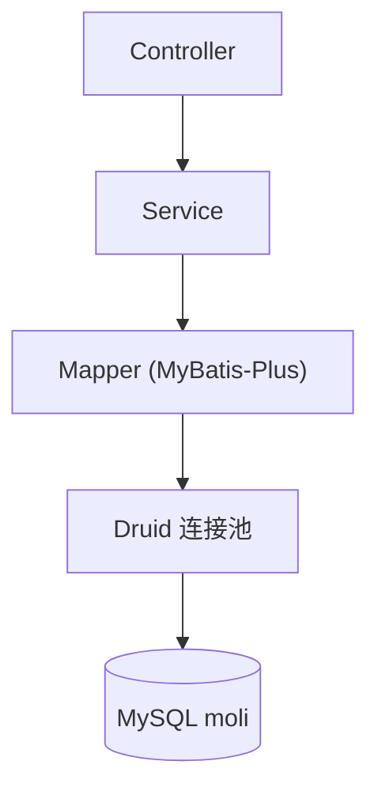

# MyBatis 与 Druid 持久层

> SQL 写法与 `#{}` [[database/mybatis-plus-用法与注入防护]]；池监控 [[database/druid连接池与监控]]；事务 [[spring/spring-声明式事务]] + [[database/mysql-事务与锁]]。

全家桶持久层：**MySQL 8.0 + MyBatis-Plus 3.4.2 + Druid 1.1.14**（见 ）。用户中心、订单、BI、知识库等服务均走 `DruidDataSource` + Mapper。

## 1. 分层职责

| 层 | 职责 |
|----|------|
| **Service** | 业务 + `@Transactional` |
| **Mapper** | SQL 映射；Plus 提供 CRUD、Wrapper |
| **Druid** | 连接池、慢 SQL、防泄漏 |
| **MySQL** | 索引/锁/MVCC（[[database/mysql-索引]]） |

## 3. Druid 统一配置模式

典型 `application-dev.yml`（用户中心）：

| 参数 | 示例值 | 含义 |
|------|--------|------|
| initial-size | 10 | 初始连接 |
| min-idle | 10 | 最小空闲 |
| max-active | 100 | 最大活跃 |
| max-wait | 10000 ms | 取连接最长等待 |
| validation-query | SELECT 1 | 空闲检测 |
| remove-abandoned | true | 泄漏连接回收 |

压测 profile 可能调大 `max-active`（见 `application-loadtest.yml`）。

## 4. 性能与排查触点

| 现象 | 先看 |
|------|------|
| 获取连接超时 | Druid active/waiting；是否慢 SQL 占满池 |
| 慢接口 | Druid SQL 统计 / [[database/mysql-深分页与慢sql优化]] |
| 连接泄漏 | `remove-abandoned` 日志；未关 Connection |
| 事务不回滚 | [[spring/spring-声明式事务]] 传播/自调用 |

loadtest 已暴露 **Prometheus Druid 指标**（`druid.pool.*`），见 [[database/druid连接池与监控]]、[[middleware/压测监控与prometheus]]。

## 5. 与分布式组件

- **Redis**：Session/缓存，减轻 DB 读（[[cache/redis-缓存]]）
- **秒杀**：热点在 Redis；订单落库仍靠 Mapper + 合理索引
- **分布式锁 DB 方案**：长事务占连接 → 易打满池（[[cache/分布式锁]]）

## 6. 编码规范（项目级）

- 动态 SQL 值用 `#{}`，禁止随意 `${}`（[[database/mybatis-plus-用法与注入防护]]）
- 避免 `WHERE 1=1` 堆砌，用 `<where>` / Wrapper
- 写操作放在 Service 事务边界内
