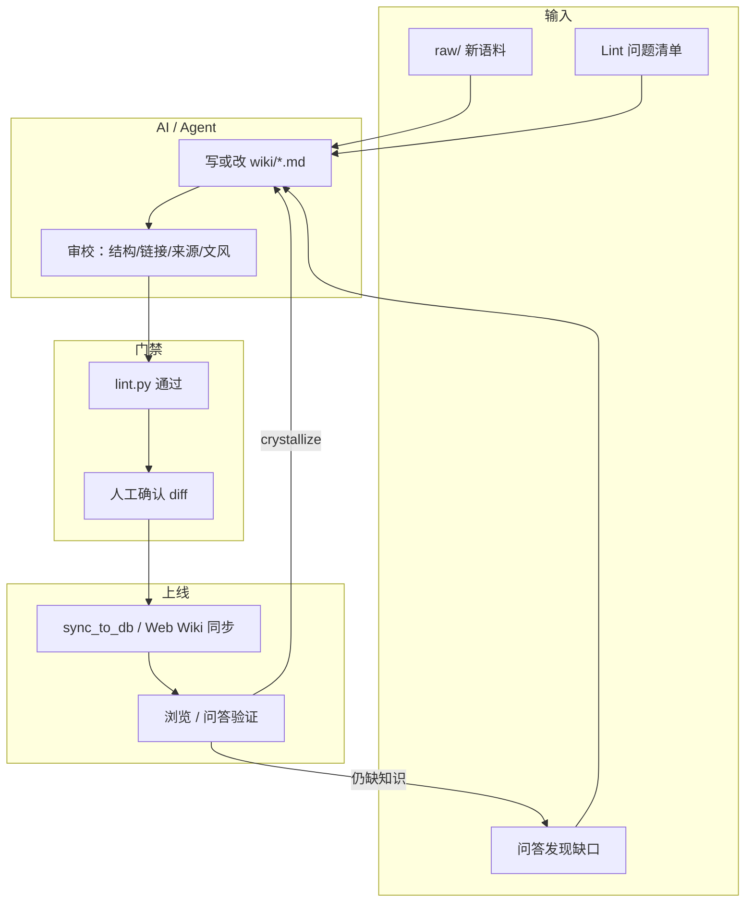

# AI 自我进化与 MD 审校流程

> 契约总览 [[知识库三操作]]。本文是 **「自我进化」操作手册**：范式说明、Ingest/Lint/Sync 分工、Crystallize、Web 与 CLI 对照，以及 **AI 审校 MD → lint 门禁 → Sync** 逐步流程。
>
> **原则**：wiki 是唯一权威源；AI **可以改** `wiki/**`，**不改** `raw/`；Lint **只报告**（CLI 不自动写库）；Sync 把 wiki 灌进 MySQL。

### 与 [[Wiki在线编辑与AI协助改稿]] 的分工（避免重复读两份）

| 文档 | 写什么 | 谁用 |
|------|--------|------|
| **本文** | 自我进化**范式**、Ingest/Query/Lint/Sync 闭环；**§4 场景 B** = AI 审校单篇 MD 的**规则与 Cursor 模板**；lint → git diff → Sync 步骤 | 开发者 / Cursor Agent / 运维 CLI |
| **[[Wiki在线编辑与AI协助改稿]]** | 把 **§4 场景 B** 产品化到 **Web**：编辑页、AI 协助、**改前/后 diff**、手改、保存 wiki、API（T14） | 前端 / 后端实现、editor 在浏览器修稿 |

**同一件事、两种入口**：审校约束（frontmatter、`[[slug]]`、sources、只改 wiki）在本文 §4 **场景 B** 定义；Web 的 `ai-revise` prompt 应**复用同一套规则**，界面补上 diff 与保存，不另起一套标准。

## 0. 范式：编译一次，持续保鲜（LLM-Wiki）

朴素 RAG = 每次提问临时拼原始文档。**本库** = Agent 维护的、互链的 markdown wiki：

| 对比 | 朴素 RAG | LLM-Wiki（本库） |
|------|----------|------------------|
| 知识形态 | 散落 raw/PDF | 结构化 `wiki/*.md` + `[[slug]]` |
| 新增原料 | 只进向量库 | **Ingest** 融进已有页、补交叉引用 |
| 提问 | 检索片段 | **Query** 带引用；缺口 → 建议 ingest |
| 质量 | 难治理 | **Lint** 断链/孤儿/缺 sources |
| 对外服务 | — | **Sync** → MySQL → 浏览/问答 API |

**自我进化** = 上述闭环反复转动，而不是无人值守乱改库：

- **人**：投喂 raw、提问、确认 AI diff、触发 Sync
- **Agent**：Ingest、Query、crystallize、审校 MD、修断链
- **脚本**：`lint.py` 门禁、`sync_to_db.py` 灌库

详见 [[知识库三操作]]、`kb/AGENTS.md` §0。

## 1. 三层架构（先建立地图）

```
┌─────────────┐   Ingest      ┌─────────────┐   Sync        ┌─────────────┐
│  kb/raw/    │ ───────────►  │  kb/wiki/   │ ───────────►  │   MySQL     │
│  原始投喂    │   提炼写页     │  权威 wiki   │  sync_to_db   │ kb_document │
└─────────────┘               └─────────────┘               └─────────────┘
      │                             │                              │
   人/Agent 只读              Agent/人可写                    浏览/问答/图谱
                                                                    │
                                                              DB Lint（Web）
```

| 层 | 路径/表 | 进化动作 | Web 是否直接操作 |
|----|---------|----------|------------------|
| 源 | `raw/` | 投喂新语料 | ❌ |
| 知识页 | `wiki/` | Ingest、crystallize、AI 审校 MD | 🔜 **T14** 单篇编辑+AI（见 [[Wiki在线编辑与AI协助改稿]]）；现网仍靠 Agent/git |
| 运行时 | `kb_document`、`kb_lint_issue` | Sync、DB 体检 | ✅ 同步 / 扫描并落库 |

**加入知识库（可问答）** 的充分条件：内容在 `wiki/` 且已 **Sync** 进 `kb_document`。仅改 raw 或仅 Ingest 未 Sync，线上仍看不到。

### 1.1 易混淆：附件 / Ingest / Sync

| 操作 | 是什么 | 进问答吗 |
|------|--------|----------|
| Web 文档底「附件上传」 | 挂 PDF 等到 MinIO | ❌ |
| **Ingest** | raw → wiki 页 | Sync 后才 ✅ |
| **Sync** | wiki → `kb_document` | ✅ |
| **Crystallize** | 多页综合 → `wiki/outputs/` | Sync 后才 ✅ |

---

## 2. 三操作 + Sync + Crystallize（进化动作表）

| 操作 | 输入 | 输出 | 谁执行 | 是否改 MySQL |
|------|------|------|--------|--------------|
| **Ingest** | raw/、URL、项目文档 | 新建/更新 `wiki/**`、index、log、edges | Cursor Agent（`AGENTS.md` §4） | ❌（需再 Sync） |
| **Query** | 自然语言问题 | 带 `[[slug]]` 的答案；暴露缺口 | Web `/kb/ask`、serve.py | 只读 |
| **Crystallize** | Query 多页综合 | `wiki/outputs/{slug}.md` + `derived_from` 边 | Agent（需人确认） | ❌（需再 Sync） |
| **Lint（wiki）** | `wiki/` 文件 | 断链/孤儿/缺 sources 报告；可选 `kb_lint_issue` | `lint.py`、serve.py | ❌ |
| **Sync** | `wiki/` | `kb_document`、`kb_relation`、标签 | `sync_to_db.py`、Web Wiki 同步 | ✅ |
| **Lint（DB）** | 已入库文档 | `kb_lint_issue` 工单 | Web 扫描并落库 | 只写问题表 |

### 2.1 Ingest 标准流程（Agent）

见 `AGENTS.md` §4、[[增量ingest与raw投喂指南]]。摘要：

1. 读源 → 查 `index.md` 去重
2. 写/补 `guides/`、`services/`、`concepts/`、`articles/`、`interview/`
3. 补 `[[slug]]`、更新 index、append log、append edges
4. **只改 wiki/**，不动 raw/
5. → **lint.py** → **sync**

**不采用** raw 直写 DB 或批量 LLM 脚本绕过 wiki；与 [[增量ingest与raw投喂指南]]、`raw/README.md` 一致。

### 2.2 Query → Crystallize（问答驱动进化）

当答案需综合多页、或 onboarding/故障汇总类场景：

```
智能问答 / serve.py Query
  → wiki 不够或值得沉淀
  → Agent crystallize → wiki/outputs/茉莉xxx汇总.md
  → frontmatter: type=output, source_pages, query
  → edges.jsonl: derived_from
  → index + log（query | crystallize | 批次#N）
  → lint.py → sync → 再问验证
```

仓库已有范例：`outputs/茉莉新人上手checklist`、`outputs/茉莉登录与鉴权故障根因汇总` 等（见 `wiki/log.md` 中 `query | crystallize` 行）。

**Web 问答点赞/点踩** 写入 `kb_qa_log`，**目前不会**自动触发 crystallize。

### 2.3 Lint 两套入口（不要混）

| 入口 | 扫什么 | 「落库」落什么 | 何时用 |
|------|--------|----------------|--------|
| **`lint.py`** | `wiki/` 文件 | 可选报告；**不写** `kb_document` | **Sync 前**门禁 |
| **Web 重新体检** | MySQL `kb_document` | 不落库，只刷新页面数字 | 快速看 |
| **Web 扫描并落库** | MySQL | **`kb_lint_issue` 问题工单** | Sync **之后**查线上质量 |

Web **扫描并落库 ≠ Sync**，也 **≠** Ingest。顺序永远是：**改 wiki → wiki lint → Sync →（可选）DB 扫描并落库**。

#### `kb_lint_issue` 落库后怎么办

1. 在 **质量体检** 页看汇总卡片 + 下方 **问题列表**（可按待处理/已忽略/已修复筛选）
2. 根据 `issueType` 回 wiki 改 md：`broken_link` / `orphan` / `no_summary`
3. **Wiki 同步** 灌库
4. 再 **扫描并落库**；问题减少后在列表点 **标记修复** 或 **忽略**

| status | 含义 |
|--------|------|
| 0 待处理 | 本次扫描新写入 |
| 1 已忽略 | 确认可不管 |
| 2 已修复 | 人工确认已处理 |

再次「扫描并落库」会**删除待处理(0)旧项并重建**；已忽略/已修复保留。

### 2.4 Sync 幂等说明

- **成功** = 脚本 exit 0，**不等于**每次都有新内容
- 内容 hash 未变 → 动作 `skip`，仍显示「同步任务已完成」
- 看 **动作统计** / 日志：`insert`、`update` 才有变更；全 `skip` 表示 wiki 相对库无变化

---

## 3. 「自我进化」闭环总图

不是无人值守全自动改库，而是**可重复的闭环**：



| 角色 | 做什么 |
|------|--------|
| **人** | 投喂 raw、定主题、**确认 AI diff**、点 Sync |
| **AI（Cursor Agent）** | Ingest、crystallize、**单篇 MD 审校改写**、修断链 |
| **lint.py** | 机械门禁（断链/孤儿/缺 sources 等） |
| **Sync** | wiki → `kb_document`，对外浏览/问答 |

当前 **Web** 已支持单篇「AI 审校 + diff + 保存 wiki + Sync」（**T14**，见 [[Wiki在线编辑与AI协助改稿]]）；**文档管理 · 新建** 亦走 wiki 编辑，首存后可触发场景 B 治理提示。

### 3.1 四条进化路径（对照）

| 路径 | 触发 | AI 主要动作 | 门禁 | 上线 |
|------|------|-------------|------|------|
| **原料进化** | raw 新文件 | Ingest 多页/单页 | lint.py | sync |
| **单篇修润** | 指定 md | 审校改写一篇 | lint.py | sync |
| **问答进化** | Query 缺口/汇总 | crystallize → outputs/ | lint.py | sync |
| **质量进化** | Lint 问题 | 修断链、补 sources | 再 lint | sync |

### 3.2 推荐总流程（新资料 → 可问答）

```
① raw/ 投喂 或 人工写 wiki
② Agent Ingest / crystallize / AI 审校 MD
③ lint.py --strict（wiki 门禁，先于 Sync）
④ git diff 人工确认
⑤ sync_to_db 或 Web「Wiki 同步」
⑥ （可选）Web「扫描并落库」+ 智能问答验证
⑦ 仍有缺口 → 回到 ② 或 Query
```

---

## 4. 实操：AI 改一篇 MD → Lint → Sync

适用于：新建页、改单篇、修 Lint 指出的某一页。

### 步骤 0：先读契约（Agent 必做）

```
moli-knowledge/kb/AGENTS.md
moli-knowledge/kb/wiki/index.md
```

确认 slug 不重复、type 目录正确（`guides/`、`concepts/`…）。

### 步骤 1：让 AI 写或改 MD

**场景 A — 从 raw 提炼新页（Ingest 单篇）**

```
请对 kb/raw/{路径} 做 ingest，产出 1 篇 wiki：
- 路径：wiki/articles/{slug}.md
- 必读 AGENTS.md；只改 wiki/**；补 frontmatter（title/slug/type/sources/related/created/updated）
- 正文用 [[slug]] 互链；sources 写 raw 相对路径
- 更新 index.md、log.md 一行、edges.jsonl（如需）
- 不要动 raw/
```

**场景 B — AI 审校并修改已有 MD（单篇修润 · 核心流程）**

> **Web 产品化**：同一流程 → [[Wiki在线编辑与AI协助改稿]]（T14）：浏览/体检「编辑/修复」→ AI 协助 → **baseline 与编辑区 diff** → 保存 `wiki/` → Sync。  
> **Agent/CLI**：仍用下面模板 + §步骤 2–5（lint.py、git diff、sync）。

```
请审校并修改 wiki/{类型}/{slug}.md：
1. 对照 AGENTS.md §2：frontmatter 完整、type 合法、sources 非空
2. 断链：正文与 related 里 [[..]] 必须能解析到已有页或本批新建页
3. 内容：事实与仓库代码/docs 一致；过时表述标注或改 status
4. 风格：可读的 Markdown，关键结论保留 [[引用]]
5. 只改这一篇及必要的 index/log/edges；不要动 raw/
6. 改完列出：改了什么、还剩什么需人工决定
```

**场景 C — 问答驱动 crystallize（多页合成）**

```
基于 wiki 现有页，crystallize 一篇 outputs/{主题}.md：
- source_pages 列出引用 slug；related/derived_from 写 edges.jsonl
- 更新 index + log（query | crystallize | ...）
```

### 步骤 2：本地 Lint 门禁（必须通过再 Sync）

在仓库根或 `moli-knowledge` 下：

```bash
# 全库扫描（推荐改完单篇也跑全库，避免连带断链）
python moli-knowledge/kb/tools/lint.py

# 严格模式：WARN 也算失败（准备上 CI 时用）
python moli-knowledge/kb/tools/lint.py --strict

# 留痕：报告 + log.md 一行
python moli-knowledge/kb/tools/lint.py --report --log
```

| 结果 | 动作 |
|------|------|
| **ERROR = 0** | 可进入 Sync（建议 `--strict` 也通过） |
| 有 **broken_link / dup_slug** | 回到步骤 1 让 AI 或人工修 `[[链接]]` / 文件名 |
| 有 **orphan / missing_source** | 补入链或 sources，或确认可忽略 |

> Lint 扫的是 **wiki 文件**，与 `sync_to_db.py` 解析口径一致；**先于 Sync** 跑。

可选：浏览器快速看渲染与链接

```bash
python moli-knowledge/kb/tools/serve.py
# http://127.0.0.1:8765 → 体检页签
```

### 步骤 3：人工确认（强烈建议）

AI 改完 + Lint 通过后：

1. `git diff moli-knowledge/kb/wiki/` 看变更
2. 重点看：frontmatter、`[[链接]]`、是否误删 sources、是否与现有页矛盾
3. 确认后 **commit**（可选装 git hook，commit wiki 后提醒/自动 sync）

### 步骤 4：Sync 进 MySQL

```bash
bash moli-knowledge/kb/tools/ci/run_sync.sh dry-run-all   # 三空间预览
bash moli-knowledge/kb/tools/ci/run_sync.sh sync-all      # 写库（推荐）
```

仅改 `kb/wiki/` 时也可：`sync_to_db.py --dry-run` / 默认 sync → `enterprise-kb`。  
三空间 `--wiki-dir` ↔ `space_code` 对照见 [[系统操作手册入口]] §三空间 Sync 映射；完整 FAQ 见 ops 空间 `guides/wiki同步指南`。

或 **茉莉后台 → 健康体检 → Wiki 同步 → 触发同步**（需 `kb:sync:trigger`；按空间触发）。

看同步日志：`insert` / `update` 才有新内容；全是 `skip` 表示 hash 未变（可能改错目录或未保存）。

### 步骤 5：线上验证（可选 Lint）

1. **文档浏览**：打开刚改的 slug
2. **智能问答**：问与本文相关的问题，看引用是否命中
3. **健康体检 → 扫描并落库**：扫 **DB** 里断链/孤儿（与步骤 2 的 wiki Lint 互补）

---

## 5. 与 Web 菜单的对应

| Web | 在本流程中的位置 |
|-----|------------------|
| 智能问答 | 步骤 5 验证；发现缺口 → 回到步骤 1 crystallize/ingest |
| 健康体检 · 质量体检 | 步骤 5 **DB** 体检（`kb_lint_issue`）；**不能代替**步骤 2 wiki lint |
| 健康体检 · Wiki 同步 | 步骤 4 Sync |
| 文档浏览 | 步骤 5 验证 |
| 文档管理 · 新建 | 步骤 1 写 wiki 首稿 → 步骤 2–4 lint/Sync；首存可选 **§4 场景 B** AI 治理（T14） |
| 空间管理 | 与内容进化无关（ACL） |

### 5.1 自动化程度（现状）

| 环节 | 是否自动 | 说明 |
|------|----------|------|
| wiki commit 后 Sync | 可选 | `install_git_hook.ps1` |
| 定时 Sync | 可选 | `kb.sync.schedule-enabled`，默认关 |
| CI merge 后 sync | ✅ | GitHub Actions |
| Web 问答 + 反馈 | 半自动 | 点赞/点踩存库，**不**触发 crystallize |
| raw → Ingest | ❌ | Cursor Agent（厚 Ingest，见 `AGENTS.md`） |
| AI 审校 MD | Cursor ✅ / Web ✅ T14 | Agent 用 §6 模板；Web 见 [[Wiki在线编辑与AI协助改稿]]（含文档管理新建 → 单篇治理） |
| lint 通过 → 自动 Sync | ❌ | 需人工或 CI |
| Web 一键自我进化 | T14 ✅ / **T15 / M6** 🔜 | 单篇见 [[Wiki在线编辑与AI协助改稿]]；批次 Ingest 见 [[Ingest工作台产品方案]] |

**顺序记忆**：改 md → **wiki lint.py** → 人审 diff → **Sync** → （可选）Web 扫描并落库。

---

## 6. 一键模板（复制给 Cursor Agent）

**单篇 MD：AI 审校 + 准备 Sync**

```
任务：AI 自我进化 · 单篇 MD 审校
文件：wiki/{路径}/{slug}.md
约束：只改 wiki/**；遵守 moli-knowledge/kb/AGENTS.md
步骤：
1. 读 index.md 与相邻相关页，避免重复 slug
2. 审校该 md：frontmatter、`[[链接]]`、sources、事实、互链
3. 直接修改文件；必要时更新 index.md、log.md、edges.jsonl
4. 在终端执行：python moli-knowledge/kb/tools/lint.py --strict
5. 若 lint 失败，继续修直到 ERROR=0
6. 输出：变更摘要 + 建议的 sync 命令（dry-run 与正式）
不要：改 raw/、不要跳过 lint 直接 sync
```

**批次 Ingest + 闭环**

```
任务：ingest 批次#{N} · {主题}
raw：kb/raw/{路径}
产出：5–8 页 wiki（guides/concepts/articles 等），互链 + index + log + edges
完成后：lint.py --strict → sync_to_db.py --dry-run → 汇报 insert/update 数量
```

**Crystallize（问答驱动）**

```
任务：crystallize · {主题}
基于 wiki 现有页综合写一篇 outputs/{slug}.md：
- type=output；frontmatter 含 query、source_pages
- edges.jsonl 追加 derived_from
- 更新 index + log（query | crystallize | ...）
完成后：lint.py --strict → sync dry-run → 汇报
```

---

## 7. 尚未产品化（规划）

| 能力 | 现状 | 与本文关系 |
|------|------|------------|
| Web 单篇「AI 审校 + diff + 保存 wiki + Sync」 | 🔜 T14 / M5 | = **§4 场景 B** 的 Web 入口，详设见 [[Wiki在线编辑与AI协助改稿]] |
| Web **批次厚 Ingest** 工作台 | 🔜 T15 / M6 | = **§4 场景 A + 批次 ingest** 的 Web 入口，详设见 [[Ingest工作台产品方案]] |
| Web「上传 md → AI 审校 → Sync」 | 🔜 T14 可选 | 非 P0；T14 先做已有 slug 编辑 |
| 问答点踩 → 自动 crystallize | 未做（仅 `kb_qa_log.useful`） | 见 §2.2 |
| lint 通过 → 自动 Sync | 未做（需 CI 或 hook 半自动） | 见 §5.1 |
| 单篇 md 只 lint 变更文件 | 可手跑全库；可按路径扩展 lint.py | CLI |

演进建议：CI 中 `lint-strict` + merge 后 `run_sync.sh sync-all`；Web 增加「Sync 结果展示 insert/update/skip」。

---

## 8. log.md 怎么记

append-only 示例：

```
## [2026-06-24] ai-review | wiki/guides/foo.md：AI 审校+修断链2处 → lint strict 通过 → sync
## [2026-06-24] ingest | 批次#N raw/bar → articles/baz.md (+2 enrich)
## [2026-06-24] query | crystallize → outputs/某主题汇总.md
```

---

## 相关

[[知识库三操作]] · [[Wiki在线编辑与AI协助改稿]] · [[Ingest工作台产品方案]] · [[增量ingest与raw投喂指南]] · [[系统操作手册入口]]
