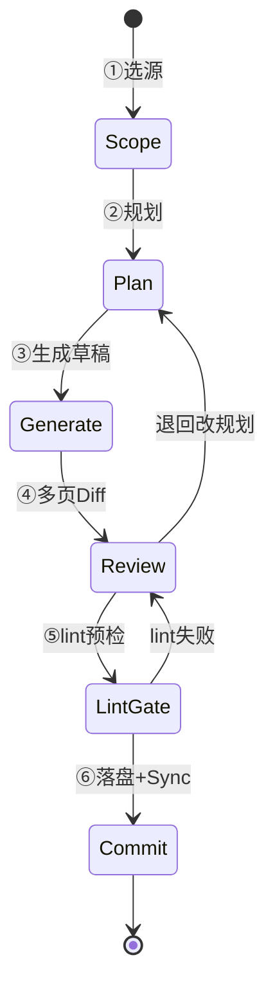

# Ingest 工作台（产品方案）

> **状态：draft / 待开发（T15 · 里程碑 M6）**  
> 目标：在 **Web 界面** 完成 **Agent 厚 Ingest** 等价流程——raw 选源 → **规划去重** → 多页 LLM 草稿 → **逐页 diff 审阅** → lint 门禁 → **原子写 wiki**（含 index/log/edges）→ Sync。

### 与 [[Wiki在线编辑与AI协助改稿]] / [[AI自我进化与MD审校流程]] 的关系

| | **T14 / M5 单篇编辑** | **T15 / M6 本方案** | **Cursor Agent** |
|---|----------------------|----------------------|------------------|
| 输入 | 已有 slug 单页 | raw 多文件 / 主题簇 | raw / URL / 仓库路径 |
| 输出 | 1 页 diff | **5–15 页** + index/log/edges | 同左（AGENTS §4） |
| 规划 | 无 | **Plan JSON**（去重/enrich/新建） | 读 index 人工+Agent |
| 审阅 | 单页 baseline ↔ 编辑区 | **多页 PR Review 式** diff | git diff |
| 适用 | 修稿、修断链、润色 | 运维/editor **批次 ingest** | 大批量、复杂 enrich |
| 门禁 | lint 摘要（T14d） | **lint ERROR 阻塞 commit** | `lint.py --strict` |

**不重复写 Ingest 契约**：frontmatter、`[[slug]]`、sources、只改 `wiki/**`、append log/edges 等以 `AGENTS.md` §4 与 [[增量ingest与raw投喂指南]] 为准；本文只写 **工作台界面、状态机、API、表结构、分阶段交付**。

**已废弃、不得复现**：L1 raw 直写 DB、L2 单篇 `l2-*.md` 批量蒸馏（绕过 index/edges/enrich）。

---

## 1. 用户故事

| 角色 | 场景 |
|------|------|
| editor | 在 raw 树勾选「Redis 哨兵」相关笔记 → 填主题 → **生成规划** → 改 plan → **生成 6 页草稿** → 逐页 diff 批准 → commit → Sync |
| 平台管理员 | 同上 + 查看批次 log、触发 Sync、导出 Cursor 提示词给 Agent 续跑 |
| 运维（只读） | 只看 raw 树与历史批次状态，不能 commit |

**不做**：

- Web 里改 `raw/`（只读浏览）
- 无 plan 一键「全库蒸馏」
- 无 diff 审阅自动落盘
- 默认只写 `kb_document` 不回 wiki（与 ROADMAP 铁律冲突）

---

## 2. 六步状态机



| 步骤 | 用户 | 系统 | 质量门禁 |
|------|------|------|----------|
| **① 选源** | 勾选 raw 文件/目录；填批次#、主题、期望类型 | `GET /kb/ingest/raw-tree` 只读树 | — |
| **② 规划** | 审/改 plan 表（新建 / enrich / 跳过） | LLM 读 raw 摘要 + **index 片段** → JSON plan | **无 plan 禁止生成** |
| **③ 生成** | 等待进度；可单页重试 | 按 plan **分页**调 LLM；enrich 出 patch | 每页独立 prompt + AGENTS §2 |
| **④ 审阅** | 逐页 diff、手改、单页重生成 | baseline ↔ 草稿并排 | **全页勾选批准** 才下一步 |
| **⑤ lint** | 看报告 | 调 `lint.py` 子集（含将新建 slug） | **ERROR 阻塞 commit** |
| **⑥ 提交** | 确认 commit；可选 Sync | 原子写 wiki + log + index + edges | append `log.md` 一行 |

---

## 3. 界面交互（建议）

**入口**：知识库 → **Ingest 工作台**（与「编辑 wiki」并列，不从 T14 编辑页做批次 ingest）

**布局**：

```
┌──────────────────────────────────────────────────────────────────┐
│ 批次#1292 · Redis 哨兵    空间: enterprise-kb    [导出Agent提示词] │
├─────────────┬────────────────────────────┬───────────────────────┤
│ ① raw 树    │  ② Plan 表 / ③ 草稿列表     │  ④ Diff + Markdown 编辑 │
│ (勾选)      │  新建|enrich|跳过|冲突提示   │  baseline | 当前稿     │
├─────────────┴────────────────────────────┴───────────────────────┤
│ ⑤ Lint 报告（ERROR 红 / WARN 黄）  [重新生成] [批准本页] [提交批次] │
└──────────────────────────────────────────────────────────────────┘
```

### 3.1 Plan 表（②）

LLM **只输出 JSON**，示例：

```json
{
  "batchNo": 1292,
  "topic": "Redis 哨兵",
  "create": [
    {"type": "article", "slug": "redis-哨兵部署", "title": "...", "sources": ["raw/.../sentinel.note.md"]}
  ],
  "enrich": [
    {"slug": "redis-缓存", "action": "append_section", "reason": "已有枢纽，补哨兵节"}
  ],
  "skip": [{"raw": "raw/.../duplicate.md", "reason": "与 articles/xxx 重复"}],
  "edges": [
    {"from": "redis-缓存", "to": "redis-哨兵部署", "type": "relates_to", "evidence": "..."}
  ],
  "conflicts": ["与 articles/xxx 端口描述不一致"]
}
```

UI：表格可编辑；**疑似重复**（index + 全文检索 top 相似）高亮；用户确认后锁定 plan 版本。

### 3.2 多页 Diff（④）

- 左侧批次树：每页状态 `draft | approved | rejected`
- 新建页：baseline 为空；enrich 页：baseline = 当前 wiki 全文，草稿 = patch 合并预览
- **禁止**「一键全部批准」

### 3.3 Commit（⑥）

原子写入（同一事务语义 / 同一 git commit 前操作）：

1. 写/更新 `wiki/**` 各页  
2. append `wiki/log.md`（`ingest | 批次#N ...`）  
3. append `wiki/graph/edges.jsonl`  
4. 更新 `wiki/index.md` 相关条目  
5. 可选：`POST /kb/sync/trigger` 或提示 `sync_to_db.py`  
6. 展示 insert/update/skip 统计

---

## 4. API 设计（待实现 · T15）

| 方法 | 路径 | 说明 |
|------|------|------|
| GET | `/kb/ingest/raw-tree?prefix=` | raw 目录树（只读，`kb.raw.root`） |
| POST | `/kb/ingest/jobs` | 创建任务 `{spaceId, topic, batchNo?, rawPaths[]}` |
| GET | `/kb/ingest/jobs/{id}` | 状态 + 进度 |
| POST | `/kb/ingest/jobs/{id}/plan` | 生成/刷新 plan（LLM） |
| PUT | `/kb/ingest/jobs/{id}/plan` | 人工改 plan |
| POST | `/kb/ingest/jobs/{id}/generate` | 按 plan 生成草稿（async，SSE 进度） |
| GET | `/kb/ingest/jobs/{id}/drafts` | 草稿列表 |
| GET | `/kb/ingest/jobs/{id}/drafts/{slug}` | 单页 baseline + 草稿 |
| PUT | `/kb/ingest/jobs/{id}/drafts/{slug}` | 人工改草稿 |
| POST | `/kb/ingest/jobs/{id}/drafts/{slug}/regenerate` | 单页重生成 |
| POST | `/kb/ingest/jobs/{id}/lint` | 预检（子进程 `lint.py` 或 Java 等价） |
| POST | `/kb/ingest/jobs/{id}/commit` | 原子写 wiki |
| POST | `/kb/ingest/jobs/{id}/sync` | 触发 Sync |
| GET | `/kb/ingest/jobs/{id}/export-agent-prompt` | 导出 Cursor ingest 提示词 |

### 4.1 任务表（新建，非正文）

| 表 | 用途 |
|----|------|
| `kb_ingest_job` | 批次状态、操作人、主题、raw 范围 JSON、`space_id` |
| `kb_ingest_plan` | plan JSON 版本（v1/v2…） |
| `kb_ingest_draft` | 每页 baseline、草稿、approval 状态 |
| `kb_ingest_commit` | 落盘时间、写入文件列表、sync batch |

草稿在 **commit 前只存 DB**（或对象存储），不写 wiki 文件。

### 4.2 配置项

| 配置 | 说明 |
|------|------|
| `kb.wiki.root` | enterprise-kb 的 wiki 根（与 T14 共用） |
| `kb.raw.root` | 只读 raw 根，默认 `kb/raw` |
| `kb.ingest.max-pages-per-batch` | 默认 15 |
| `kb.llm.*` | 与 `/kb/ask`、T14 共用 |

### 4.3 LLM Prompt 分工（保证「厚」）

| 阶段 | System 角色 | 约束 |
|------|-------------|------|
| **Planner** | 只做规划 | 输出 JSON；必须引用 index 片段 + 相似页 slug；禁止写正文 |
| **PageWriter** | 单页完整 md | frontmatter 齐全；`[[slug]]` 仅来自 plan 已知 slug |
| **EnrichWriter** | patch | 只输出追加段落或 unified diff；禁止整页覆盖（需 UI 二次确认） |

温度 0.2–0.3；context = raw 分块 + 相关已有页摘要。

### 4.4 权限

| 操作 | ACL |
|------|-----|
| raw 树只读 | 空间 viewer |
| 创建/规划/生成/commit | 空间 **editor** + `kb:ingest:*` |
| Sync | 现有 `kb:sync:trigger` 或 editor |

菜单建议：知识库 → Ingest 工作台；动作权限 `kb:ingest:job`、`kb:ingest:commit`（可合并）。

---

## 5. 质量红线（产品 + 后端强制）

1. **禁止** raw 直写 `kb_document`  
2. **禁止** 无 plan 调用 generate  
3. **禁止** 存在未批准页时 commit  
4. **禁止** commit 时 lint 有 ERROR  
5. **禁止** 只写 articles 不更新 index/log/edges（commit 前校验清单）  
6. enrich 默认 patch；整页覆盖需 UI 二次确认  

与 Phase 0 一致：CI 已 `lint-strict` 门禁；工作台 commit 前应跑同等口径。

---

## 6. 与 serve.py「提炼」Tab 的分工

| | serve.py 提炼 | 本工作台 |
|---|---------------|----------|
| 输入 | 已有 wiki（按 tag） | raw + index |
| 输出 | 单页 hub 草稿 | 多页 + 治理文件 |
| 落盘 | `save_draft`（不覆盖、不更 index） | 完整 AGENTS §4 交付物 |
| 定位 | **本地辅助** | **Web 产品主线（批次 ingest）** |

---

## 7. 分阶段交付（T15）

| 子任务 | 范围 | 验收 |
|--------|------|------|
| **T15a** | raw 树 + job CRUD + **Plan 生成/编辑** + export-agent-prompt | 规划质量可对标 Agent 第一步 |
| **T15b** | 按 plan **多页 generate** + diff UI | 5 页簇可审、不落盘 |
| **T15c** | lint 预检 + **原子 commit**（wiki/log/index/edges） | 交付物 checklist = AGENTS §4 |
| **T15d** | commit 后 **一键 Sync** + 批次报告 | 线上可问答、图谱有边 |
| **T15e** | enrich patch、断点续跑、批次模板 | 大批量可恢复 |

**依赖**：

- ✅ Phase 0 治理（375 页、`lint-strict` 通过）  
- 🔜 **T14a**（`KbWikiFileService` 读写 wiki + diff 组件，M5 底座）  
- T9 ACL（editor）、T2 LLM（`kb.llm.*`）

**推荐顺序**：Phase 0 ✅ → T14a/b → **T15a → T15b → T15c → T15d** → T15e

---

## 8. 相关文档

- 开发任务：`moli-knowledge/TASKS.md` **T15**
- 规划：`moli-knowledge/kb/ROADMAP.md` **M6**
- 契约：`moli-knowledge/kb/AGENTS.md` §4、§8
- **架构图（draw.io）**：
  - 六步流程 + 与 T14/Agent 分工：`docs/diagrams/moli-kb-ingest-workbench.drawio`
  - 写入轨总览（含 M6 路径 B）：`docs/diagrams/moli-kb-raw-pipeline.drawio`
  - 功能流程 ⑥：`docs/diagrams/moli-kb-functional-flows.drawio`
- 单篇 Web 编辑：[[Wiki在线编辑与AI协助改稿]]（T14）
- 闭环手册：[[AI自我进化与MD审校流程]]
- API 契约（实现后）：`docs/KNOWLEDGE_API.md` §Ingest 工作台

---

## 相关

[[AI自我进化与MD审校流程]] · [[Wiki在线编辑与AI协助改稿]] · [[增量ingest与raw投喂指南]] · [[知识库三操作]]
