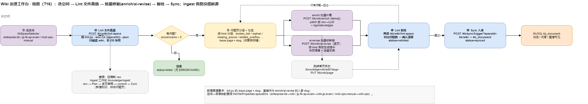

# Wiki 治理工作台（产品方案）

> **状态：draft（T16 规划中 · 里程碑 M7）**
> 目标：在 **Web 界面** 把 **Lint → 批量修复 → 复检 → Sync** 串成一条可视化治理链路：选空间 → 对该空间**全部 wiki 文件真值** lint → 问题页按 kind 分组 → 批量 **enrich / ai-revise** 修复 → 复检确认清零 → Sync 入库。
> **HTTP 契约权威**：[`docs/api/KNOWLEDGE_API.md`](../../../docs/api/KNOWLEDGE_API.md) §4.6（lint-space）+ §8（wiki 编辑/enrich）+ §6（sync）。

## 链路总览



> 源文件：[`docs/diagrams/moli-kb-wiki-govern.drawio`](../../../../docs/diagrams/moli-kb-wiki-govern.drawio)

## 0. 两条决策（已锁定）

| 决策 | 选定 | 理由 |
|------|------|------|
| Lint 数据源 | **文件真值**（`lint.py --wiki-dir`） | 治理是"改完还没 Sync 就要检"，DB 快照（`GET /kb/lint`）是旧的，必须扫磁盘 wiki |
| 批量处理 | **enrich + ai-revise**（修已有页） | 问题页是已存在的页；ingest 输入只能是 `raw/`，不认识"某个有问题的 wiki 页" |
| ingest | **旁路**：链接到现有 [[Ingest工作台产品方案]] | ingest 是"投喂新源产生新页"，与"修问题页"是两条不同的流程 |

### 与 [[Wiki在线编辑与AI协助改稿]] / [[Ingest工作台产品方案]] 的关系

| | T14 单篇编辑 | **T16 本方案** | T15 Ingest 工作台 |
|---|-------------|----------------|-------------------|
| 入口 | 单页 slug | **空间级批量** | raw 批次 |
| Lint | 保存前单页 lint-preview | **空间全量文件 lint** | 批次草稿 lint |
| 修复 | 单页 AI/手改 | **批量 enrich/ai-revise** | 多页草稿生成 |
| 适用 | 改一页 | **空间治理体检 + 批量修** | 投喂新知识 |

**不重复写契约**：frontmatter、`[[slug]]`、sources、只改 `wiki/**` 等以 `AGENTS.md` §2/§6 为准；enrich 语义见 [[Wiki在线编辑与AI协助改稿]] §2.2；本文只写 **工作台界面、状态机、新增接口、分阶段交付**。

## 1. 数据贯通的关键

`lint.py` 的每条 issue 里 **`page` 字段就是 slug**（如 `guides/本地启动指南`），而 `enrich` / `ai-revise` 的入参也是 `slug` —— 所以 **lint → 修复 → sync 全链路数据天然贯通**，不需要额外 ID 映射。

空间 → wiki 目录映射**已存在**于 `KbWikiProperties.spaceDirs`：

| space_code | wiki 子目录 |
|------------|-------------|
| `enterprise-kb` | `wiki` |
| `jp-fe-ap-exam` | `wiki-jp-exam` |
| `moli-ops-manual` | `wiki-ops` |

文件级 lint 接口据此把 `spaceCode` 解析成 `lint.py --wiki-dir {子目录}`。

## 2. 状态机

```
idle → linted → fixing → relinted → synced
                  ↑__________|（仍有问题回到 fixing）
```

| 状态 | 触发 |
|------|------|
| `idle` | 进入页面，已选空间未 lint |
| `linted` | `POST /kb/wiki/lint-space` 返回问题清单 |
| `fixing` | 勾选问题页执行 enrich / ai-revise / 跳转手改 |
| `relinted` | 复检再次 lint，问题数下降/清零 |
| `synced` | `POST /kb/sync/trigger` 完成，DB 可见 |

## 3. 界面交互

入口：知识库侧栏新增 **「Wiki 治理」**（或健康体检页加第三 Tab）。建议**独立页** `knowledge/wiki-govern/index`，现有 DB 快照体检页（`KnowledgeLintView`）保留不动。

```
┌ 选空间 [enterprise-kb ▾]                         [① 开始 Lint] ┐
├ ① Lint 结果（文件真值，stats: pages/errors/warns）             │
│   ▸ broken_link (2)   ▸ orphan (3)   ▸ missing_source (4) ...  │
│     ☑ guides/本地启动指南  → [[不存在的页]]                       │
│     ☐ concepts/xxx        缺 sources                            │
├ ② 批量修复（已勾选 N 页）   方式：(·) ai-revise  ( ) enrich      │
│     [开始修复]  进度 ▓▓▓▓░░ 3/5   ✓2 ✗0 跳过1                   │
├ ③ 复检 Lint  [复检]   问题数 9 → 2                              │
├ ④ Sync 入库  [触发同步]（需复检通过）                            │
└ 旁路：投喂新 raw → [打开 Ingest 工作台]                          ┘
```

### 3.1 批量修复编排（核心 UX）

- 按 issue.kind 给**默认修复方式**：
  - `broken_link` / `missing_source` / `missing_dates` → 默认 **ai-revise**，自动生成指令（如「修复断链 {detail}，补全 frontmatter sources」）。
  - 内容缺口 / `missing_concept` → **enrich**（填 patch 或 raw）。
  - `dup_slug` / `slug_mismatch` → 提示**跳转手改**（结构性问题不宜自动改）。
- 逐条**串行**调用（参考 [[Ingest工作台产品方案]] 逐页隔离），单条失败不中断，最后汇总成功/失败/跳过。
- LLM 调用慢 → 进度条 + 可取消剩余。

## 4. 后端改动

### 4.1 新增：文件级空间 Lint（唯一核心缺口）

照搬 `KbSyncServiceImpl.executeSync` 的 `ProcessBuilder` 封装，新建 `KbWikiLintService`：

| 方法 | 路径 | 说明 | 权限 |
|------|------|------|------|
| POST | `/kb/wiki/lint-space` | 跑 `lint.py --wiki-dir {spaceDir} --json {tmp}`，解析回 JSON | 空间 **editor** |

请求 `{ spaceId?, spaceCode?, strict? }`；响应：

```json
{
  "spaceCode": "enterprise-kb",
  "wikiDir": "wiki",
  "stats": { "pages": 375, "errors": 2, "warnings": 9 },
  "issues": [
    { "level": "error", "kind": "broken_link", "page": "guides/本地启动指南",
      "detail": "→ [[不存在的页]]", "suggest": "建该页或改链" }
  ],
  "exitCode": 1,
  "outputTail": "..."
}
```

要点：复用 `kb.sync.python` / `timeout-seconds`；新增 `kb.wiki.lint-script-path`（默认 `moli-knowledge/kb/tools/lint.py`）；纯文件扫描、无 LLM、快。

### 4.2 复用（无需改后端）

- **enrich**：`POST /kb/wiki/enrich` 已支持 `items[]` 批次。
- **ai-revise**：`POST /kb/wiki/ai-revise` 单页，前端循环 + 进度/失败隔离；服务端聚合 `ai-revise/batch` 列为 T16d 可选。
- **sync**：`POST /kb/sync/trigger?spaceId=`。

## 5. 前端改动（meiling-ui）

```
KnowledgeWikiGovernView.vue          # 编排 + 状态机
├─ KbSpaceSelector                   # 复用
├─ GovernLintPanel                   # ① lint-space，按 kind 分组 + 勾选
├─ GovernFixPanel                    # ② enrich / ai-revise / 跳转 + 进度汇总
├─ GovernRelintBar                   # ③ 复检 diff 问题数
└─ KbSyncPanel                       # ④ 复用
```

- API 新增：`lintWikiSpaceApi`；types：`KbWikiSpaceLintResult` / `KbWikiLintIssue`。
- i18n：zh / en / ja `knowledge.wikiGovern.*`。

## 6. 权限

| 操作 | ACL |
|------|-----|
| lint-space | 空间 **editor** |
| enrich / ai-revise | 空间 **editor** + LLM 可用 |
| sync | `kb:sync:trigger` 或空间 admin |

## 7. 分阶段交付（T16a–d）

| 阶段 | 范围 | 验收 |
|------|------|------|
| **T16a** | 后端 `POST /kb/wiki/lint-space` + `KbWikiLintService`；前端 lint 真值展示 + 按 kind 分组 | 选空间扫文件真值出问题清单 |
| **T16b** | 批量 **enrich** 修复编排（复用 items[]）+ 进度/汇总 | 勾选问题页批量补章落盘 |
| **T16c** | 批量 **ai-revise**（按 kind 自动指令）+ 复检 + Sync 收尾 | lint→修→复检→sync 闭环 |
| **T16d**（可选） | `ai-revise/batch` 服务端聚合；Ingest 旁路入口卡片；治理报告导出 | 体验增强 |

## 8. 风险与约束

| 风险 | 缓解 |
|------|------|
| `lint.py` 依赖部署机 Python + kb 目录 | 复用 `kb.sync.python`/路径；无环境时报错降级（同 sync 现状） |
| 批量 LLM 调用慢 | 串行 + 进度 + 失败隔离 + 可取消；不并发轰炸 LLM |
| 改完未 Sync → DB 旧 | 强制链路③④：复检通过才 Sync；UI 提示「已改未同步」 |
| 文件 lint 与 DB 体检口径不同 | 文档明确：治理用文件真值，DB 体检页另算，并存不互斥 |
| Web 与 Cursor Agent 并改同文件 | enrich 读 baseline；以 git 为准，必要时 contentHash 校验 |

## 9. 工作量

| 模块 | 估算 |
|------|------|
| 后端 lint-space 接口 + service + 配置 | 0.5–1 天 |
| 前端治理页 + 4 子组件 + 编排 | 2–3 天 |
| i18n + 联调 + 文档 | 0.5–1 天 |
| **合计** | **约 3.5–5 人日**（enrich/sync/ai-revise 全复用） |

## 相关

[[Wiki在线编辑与AI协助改稿]] · [[Ingest工作台产品方案]] · [[AI自我进化与MD审校流程]] · [[增量ingest与raw投喂指南]]
