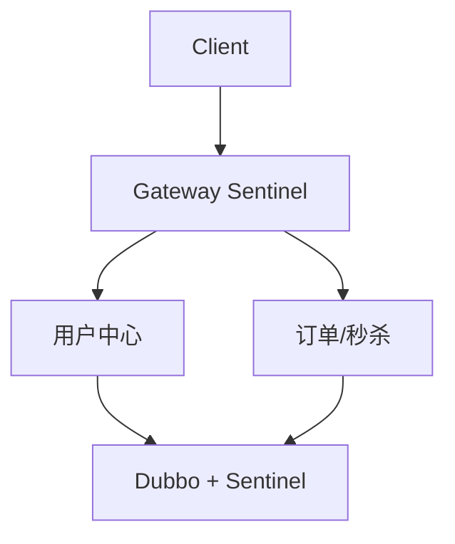

# Sentinel 限流与熔断

> 算法基础 [[middleware/限流算法与令牌桶]]；接入步骤 [[middleware/sentinel-接入与规则配置]]；Gateway [[spring/spring-cloud-gateway]]；面试 [[middleware/sentinel-面试题]]。

高并发系统三件套：**缓存、降级、限流**。Alibaba **Sentinel** 是 Spring Cloud Alibaba 生态下的**流量控制 + 熔断降级**组件，对标已停维的 Hystrix，并与 Dubbo、Gateway 集成。

## 1. 核心能力

| 能力 | 作用 |
|------|------|
| **流量控制** | QPS/并发线程数、热点参数、集群限流 |
| **熔断降级** | 慢调用比例、异常比例、异常数 |
| **系统保护** | CPU/Load/RT/线程数等自适应限流 |
| **热点防护** | 对参数值（如商品 id）细粒度限流 |

统计基于 **滑动窗口**（`StatisticSlot` + `LeapArray`），见 [[middleware/sentinel-接入与规则配置]] 原理摘要。

## 2. 限流 vs 降级 vs 熔断

| 手段 | 目的 | 典型场景 |
|------|------|----------|
| **限流** | 控制进入系统的请求速率/并发 | 秒杀、登录防刷、保护 DB |
| **降级** | 非核心能力暂时关闭或返回兜底 | 推荐位超时、BI 报表 |
| **熔断** | 依赖故障时快速失败，避免拖垮调用方 | Dubbo 下游不可用 |

限流是「防备调用方/流量过大」；熔断是「怀疑被调用方有问题」。二者常配合：限流阀值触发后可排队、拒绝或降级返回。

## 4. 推荐接入层次

| 层次 | 建议规则 |
|------|----------|
| **Gateway** | `/UserCenter/login` QPS；`/OrderServer/seckill/**` QPS+热点参数 |
| **Provider** | Dubbo 服务 QPS、慢调用熔断 |
| **依赖** | 对 MySQL 慢调用间接保护：Druid 池 + 限流（见 [[database/druid连接池与监控]]） |

## 5. 与 Redis 限流的关系

秒杀已用 **Redis+Lua** 做库存原子扣减（）。Sentinel 解决的是 **HTTP/RPC 入口** 与 **依赖链** 保护，二者互补：

- Redis Lua：业务级「能不能买」
- Sentinel：「能不能进系统/调这个接口」

分布式限流也可用 Redis+Lua 实现计数（见 [[middleware/限流算法与令牌桶]]），Sentinel 提供控制台、规则持久化与熔断一体化。

## 6. 排查提示

- 「网关没限流」→ **预期**，未接入 Sentinel
- 压测 502/超时 → 先 （Redis/Nacos/池），再考虑加 Sentinel
- Dubbo 降级 → 也可配 Sentinel 规则，见 [[middleware/dubbo-与-nacos]]
## 批次#1310 增补（wujinsen P0）

合并 Hystrix 限流/降级/队列术与 Sentinel 滑动窗口 raw，作历史对照。
## Sentinel 动态规则（raw）

- 规则可推送到 **Nacos/Apollo** 等数据源，OAP 热更新
- `SentinelRuleManager.loadRules` 与控制台联动
- 与 Hystrix 对比：Sentinel 滑动窗口更轻、控制台统一 [[middleware/sentinel-接入与规则配置]]

## 批次#1313 增补（wujinsen P2）

补充 Sentinel 动态规则源 raw。
