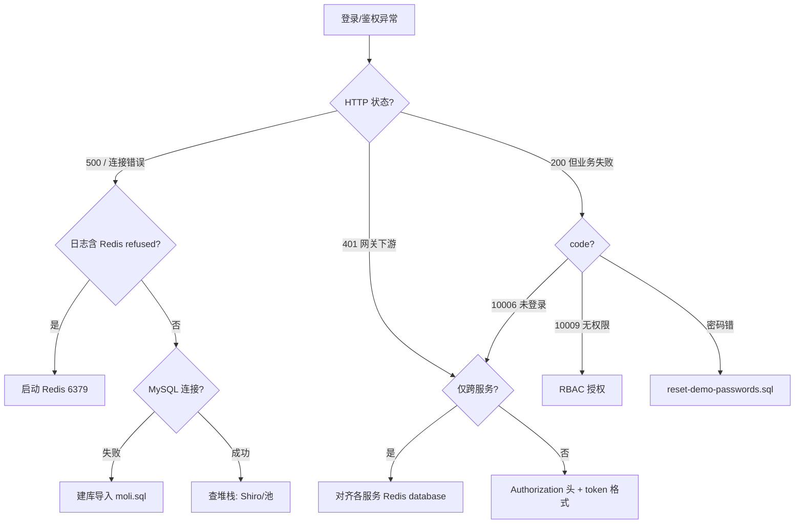

# 茉莉登录与鉴权故障根因汇总

> **Query crystallize 页**：综合 [[故障排查指南]]、[[登录与鉴权指南]]、[[认证与会话机制]] 等，给出「现象 → 根因 → 动作」一张表。机制细节仍以各源页为准。

面向本地联调最常见问题：**登录失败、500、跨服务 401/403**。

## 1. 一句话结论

| 层级 | 最高频根因 |
|------|------------|
| **登录 500** | **Redis 未启动** 或连不上（6379） [[redis-缓存]] |
| **密码错误** | DB 哈希非演示值 `123456`（未跑 [[数据库初始化指南]] / reset） |
| **跨服务 401** | 各服务 **Redis 不一致**（host/port/password/**database**） [[认证与会话机制]] |
| **403 / 10009** | RBAC 缺 perms，非 Session 问题 [[权限管理操作指南]] |
| **Gateway 404** | 路径前缀或启动顺序 [[本地启动指南]] |

> 经验：**先查 Redis，再查 DB 密码，再查 Redis 配置是否各服务一致**——多数「登录相关」坑在此，而非 Druid 或代码 bug。

## 2. 决策树



## 3. 现象对照表

| 现象 | 根因（按概率） | 立即动作 | 依据 |
|------|----------------|----------|------|
| `POST /login` 500，日志 `Connection refused: 6379` | Redis 未起 | 启动 Redis | [[故障排查指南]] §1 |
| 登录报用户不存在 | 未导入 `moli.sql` | `.\scripts\init-db.ps1` | [[数据库初始化指南]] |
| 密码明明 123456 仍失败 | `password` 列哈希错误/旧值 | `reset-demo-passwords.sql` | [[数据库初始化指南]] §4 |
| user-center 登录 OK，Order 401 | order 与用户中心 **Redis database 不同** | 对齐 `application-dev.yml` `spring.redis.database` | [[认证与会话机制]] |
| Header 带了 token 仍 10006 | 头名非 `Authorization` 或 token 过期 | 重新 login，复制完整 `login_token_*` | [[登录与鉴权指南]] |
| 10009 | 缺 `@RequiresPermissions` 对应 perm | 角色绑菜单/权限 | [[rbac-权限模型]] |
| Dubbo 校验用户失败 | user-center 未起 / Nacos 无实例 | 先起 [[用户中心]]，查 Nacos dev | [[故障排查指南]] §2 |
| loadtest 登录 OK、正常 login 慢 | 正常 login 查菜单权限 | 压测用 `/loadtest/login` | [[loadtest-profile与压测登录]] |
| 启动即 `BeanCurrentlyInCreationException`，循环指向 `securityManager` | `SecurityManager` 接口 extends `SessionManager` → 自动装配歧义自循环；Shiro AOP Advisor 依赖 securityManager | 按具体类 `ShiroSessionManager` 注入 + Advisor 用 `SmartInitializingSingleton` 回填 | [[shiro-starter与跨服务校验]] §启动期循环依赖 |

## 4. Redis 对齐 checklist

所有走 Shiro Starter 的服务（order/bi/knowledge 等）必须与 **user-center** 一致：

```yaml
spring:
  redis:
    host: localhost      # 一致
    port: 6379           # 一致
    password: 123456     # 一致（无密码则都空）
    database: 1          # ⚠️ 最易忽略，必须相同
```

Session key 形态：`shiro:session:login_token_*`（[[shiro-鉴权体系]]）。database 不同 = 读不到 Session = 401。

## 5. 密码与 Shiro 校验链

1. 明文 → SHA-256 + 盐 `moli` × 15 轮 → 64 位 hex 存库 [[认证与会话机制]]
2. `HashedCredentialsMatcher` 在用户中心校验
3. Navicat 肉眼「一样」可能差一位 → 登录失败

统一演示密码见 [[数据库初始化指南]]。

## 6. 跨服务校验链（401 时理解用）

```
请求带 Authorization
  → 业务服务 AuthenticationFilter
  → Redis 读 Session（失败则 10006）
  → Dubbo getUserById（用户停用则失效）
  → @RequiresPermissions → Dubbo getPermissionsByUserId
```

详见 [[shiro-starter与跨服务校验]]。

## 7. 推荐排查顺序（压缩版）

1. Nacos + MySQL + **Redis** 三件套 [[本地启动指南]]
2. `init-db.ps1` + 必要时 reset 密码
3. user-center 8888 登录拿 token
4. 同一 token 调 OrderServer；失败则 diff Redis 配置
5. 仍异常 → 看 user-center / 业务服务日志与 [[故障排查指南]]

## 8. 知识库暂无

- 生产环境 Redis 哨兵/集群下的 Session 迁移方案（raw 有 Redis HA，wiki 未 ingest 专页）
- 统一可观测（traceId 串联登录链）— 规划项 [[技术栈与版本]]

## 9. 源页索引

| 主题 | 页 |
|------|-----|
| 操作步骤 | [[登录与鉴权指南]] |
| 决策树扩展 | [[故障排查指南]] |
| 原理 | [[认证与会话机制]]、[[shiro-鉴权体系]] |
| 数据 | [[数据库初始化指南]] |
