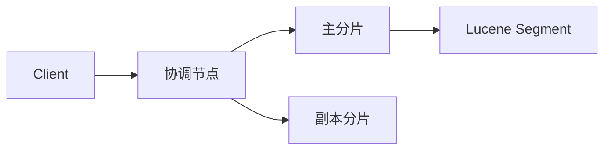

# Elasticsearch 搜索

> 写入 [[search/es-索引与写入流程]]；搜索 [[search/es-搜索与分片路由]]；DSL [[search/es-match与bool查询]]；面试 [[search/elasticsearch-面试题]]。

**Elasticsearch（ES）** 是基于 **Lucene** 的分布式搜索与分析引擎，典型用于全文检索、日志分析、电商搜索。目标系统当前 **未部署 ES**；知识库检索为 MySQL `LIKE`（），BI 为骨架。ES 是 **P1 扩展方向**（模糊搜、日志、与 MySQL 同步）。

## 1. 核心概念

| 概念 | 说明 |
|------|------|
| **Index** | 逻辑索引（类似库） |
| **Document** | JSON 文档（类似行） |
| **Field / Mapping** | 字段类型与分析器 |
| **Shard** | 分片，读写并行单元 |
| **Replica** | 副本，高可用与读扩展 |
| **Node** | 集群节点：master / data / coordinating |

7.x+ 已弱化 Type；`_index + _id` 唯一标识文档。

## 2. 与 MySQL 分工

| 场景 | MySQL（典型现状） | ES |
|------|-------------------|-----|
| 事务、强一致 | ✅ 主库 | ❌ 近实时、最终一致 |
| 精确 CRUD | ✅ | 可但非主场景 |
| 模糊/分词/相关性 | `LIKE` 弱 | ✅ 倒排索引 |
| 深分页 | 需优化 [[database/mysql-深分页与慢sql优化]] | scroll/search_after |
| 聚合统计 | SQL GROUP BY | aggregations |

`LIKE '%keyword%'` 无法走 B+Tree 索引（[[database/mysql-索引失效场景]]），高频搜索应考虑 ES 或 Meilisearch。

## 3. 架构要点

- **写**：路由到主分片 → Memory Buffer → refresh → translog → flush
- **读**：Query Then Fetch（见 [[search/es-搜索与分片路由]]）
- **选主**：ZenDiscovery，master 候选 `n/2+1` 票

## 5. 与消息队列

大批量导入 ES 时常配合 **Kafka** 做日志/变更流（[[middleware/消息队列]]、[[middleware/kafka-与-mq选型]]）。秒杀异步落库当前为 Redis 队列（），生产建议 RocketMQ/Kafka。

## 6. 学习路径

1. 概念与写入 refresh/flush → [[search/es-索引与写入流程]]
2. 搜索两阶段与分片路由 → [[search/es-搜索与分片路由]]
3. match/bool/boost → [[search/es-match与bool查询]]
4. 面试速记 → [[search/elasticsearch-面试题]]
